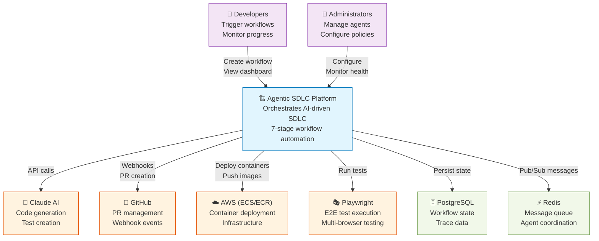
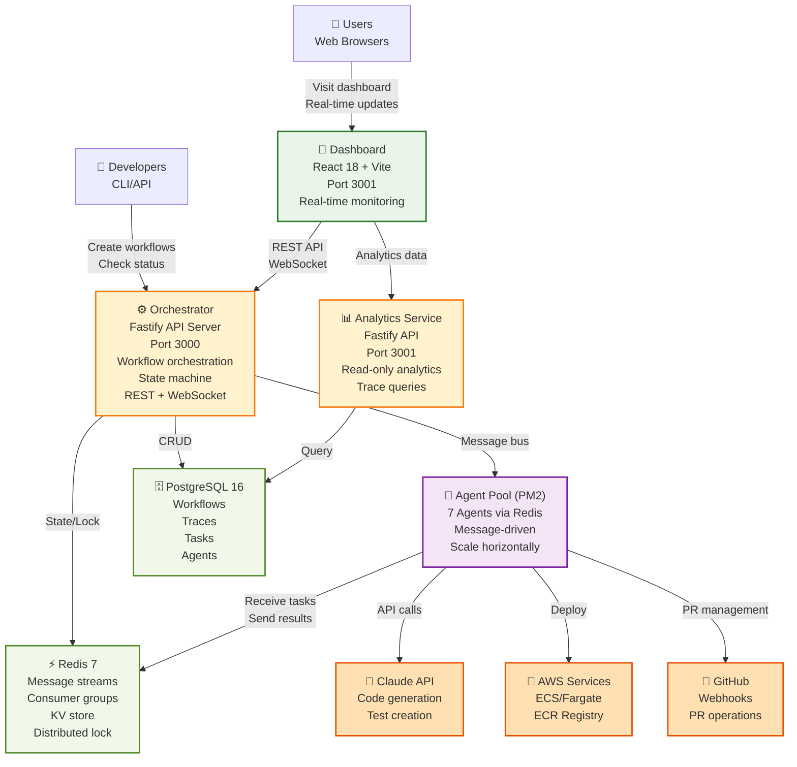
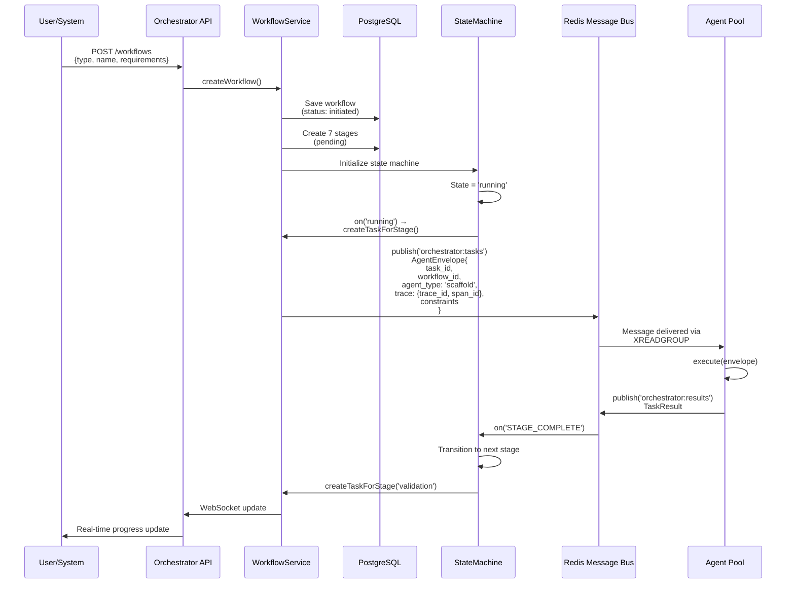
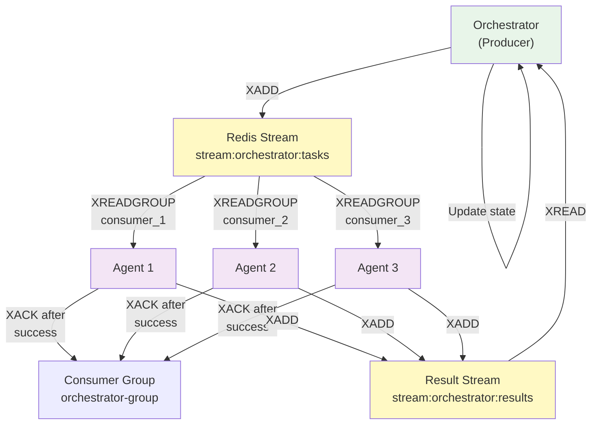
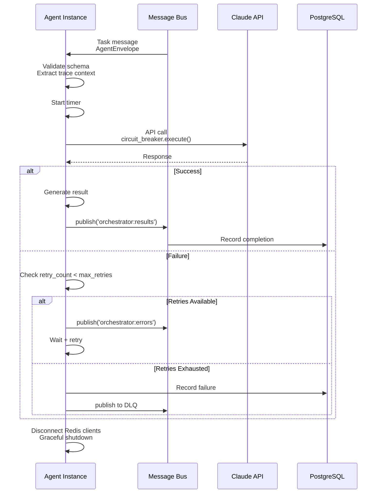

# AGENTIC SDLC - Architecture Documentation

**Version:** 1.0.0 | **Status:** 99% Production Ready | **Last Updated:** 2025-11-16

---

## 📋 Table of Contents

1. [System Context](#system-context)
2. [Architecture Overview](#architecture-overview)
3. [Component Iteration Design](#component-iteration-design)
4. [Hexagonal Architecture](#hexagonal-architecture)
5. [Agent Registry System](#agent-registry-system)
6. [Process Flows](#process-flows)
7. [Component Boundaries](#component-boundaries)
8. [Key Design Decisions](#key-design-decisions)
9. [Integrations](#integrations)
10. [Database Schema](#database-schema)

---

## System Context

### What This System Does

Agentic SDLC is an autonomous AI-driven Software Development Lifecycle platform that automates the complete end-to-end software development pipeline. It orchestrates a standardized 7-stage workflow where AI agents powered by Claude automatically generate code, validate quality, test functionality, integrate changes, deploy to production, and monitor health.

### Who Uses It

- **Primary Users**: Development teams automating code generation and testing
- **Administrators**: Platform operators managing agents and workflows
- **External Systems**: GitHub (webhooks), AWS (deployment), Claude API (code generation), Playwright (testing)

### System Context Diagram



---

## Architecture Overview

### Container Diagram - System Components



---

## Component Iteration Design

### Complete Workflow Progression with All Connections

This diagram shows how all components interact as a workflow progresses through each of the 7 stages. Each iteration represents one stage completion and transition to the next stage.

```mermaid
graph TB
    subgraph "Orchestrator Core"
        API["🌐 Fastify API Server<br/>Port 3000"]
        SM["🎛️ State Machine<br/>(xstate)"]
        WorkflowSvc["📋 WorkflowService"]
        TaskCreator["📝 TaskCreator<br/>AgentEnvelope"]
    end

    subgraph "Ports & Adapters Layer"
        Port_Bus["🔌 IMessageBus<br/>(Port)"]
        Port_KV["🔌 IKVStore<br/>(Port)"]
        Adapter_Bus["📡 RedisMessageBusAdapter<br/>(Adapter)"]
        Adapter_KV["💾 RedisKVAdapter<br/>(Adapter)"]
    end

    subgraph "Message Infrastructure"
        TaskStream["📊 Redis Stream<br/>stream:orchestrator:tasks<br/>(XADD/XREADGROUP)"]
        ResultStream["📊 Redis Stream<br/>stream:orchestrator:results<br/>(XADD/XREADGROUP)"]
        KVStore["🗝️ Redis KV Store<br/>(Workflow state snapshots)"]
    end

    subgraph "Agent Pool (PM2 Processes)"
        ScaffoldAgent["🏗️ Scaffold Agent<br/>Stages: init→scaffolding<br/>(15-30% progress)"]
        ValidationAgent["✅ Validation Agent<br/>Stage: validation<br/>(30-45% progress)"]
        E2EAgent["🎭 E2E Agent<br/>Stage: e2e_testing<br/>(45-60% progress)"]
        IntegrationAgent["🔗 Integration Agent<br/>Stage: integration<br/>(60-75% progress)"]
        DeploymentAgent["🚀 Deployment Agent<br/>Stage: deployment<br/>(75-90% progress)"]
    end

    subgraph "External Services"
        Claude["🤖 Claude API<br/>(Code generation,<br/>Test creation)"]
        GitHub["🔗 GitHub API<br/>(PR management,<br/>Branch operations)"]
        AWS["☁️ AWS ECS/ECR<br/>(Container deployment)"]
        Playwright["🎭 Playwright<br/>(E2E test execution)"]
    end

    subgraph "Data Layer"
        DB["🗄️ PostgreSQL<br/>Workflows<br/>Tasks<br/>Traces<br/>Agents"]
        Redis["⚡ Redis<br/>(Streams + KV)"]
    end

    subgraph "Frontend"
        Dashboard["📱 React Dashboard<br/>Port 3001<br/>(Real-time updates)"]
    end

    %% Orchestrator Internal Flow
    API -->|"1. Trigger"| SM
    SM -->|"2. Next Stage?"| WorkflowSvc
    WorkflowSvc -->|"3. Create Task"| TaskCreator

    %% Ports & Adapters
    TaskCreator -->|"Implements"| Port_Bus
    Port_Bus -->|"Use"| Adapter_Bus
    TaskCreator -->|"Implements"| Port_KV
    Port_KV -->|"Use"| Adapter_KV

    %% Message Bus Communication
    Adapter_Bus -->|"XADD task"| TaskStream
    Adapter_Bus -->|"XREAD results"| ResultStream

    %% State Persistence
    Adapter_KV -->|"Store state snapshot"| KVStore

    %% Agents Subscribe to Tasks
    TaskStream -->|"XREADGROUP<br/>Consumer 1"| ScaffoldAgent
    TaskStream -->|"XREADGROUP<br/>Consumer 2"| ValidationAgent
    TaskStream -->|"XREADGROUP<br/>Consumer 3"| E2EAgent
    TaskStream -->|"XREADGROUP<br/>Consumer 4"| IntegrationAgent
    TaskStream -->|"XREADGROUP<br/>Consumer 5"| DeploymentAgent

    %% Agents Execute & Publish Results
    ScaffoldAgent -->|"XACK + XADD result"| ResultStream
    ValidationAgent -->|"XACK + XADD result"| ResultStream
    E2EAgent -->|"XACK + XADD result"| ResultStream
    IntegrationAgent -->|"XACK + XADD result"| ResultStream
    DeploymentAgent -->|"XACK + XADD result"| ResultStream

    %% Agents Call External Services
    ScaffoldAgent -->|"API calls"| Claude
    E2EAgent -->|"API calls"| Claude
    IntegrationAgent -->|"API calls"| GitHub
    DeploymentAgent -->|"API calls"| AWS
    E2EAgent -->|"Execute tests"| Playwright

    %% Results Back to Orchestrator
    ResultStream -->|"Process result"| SM
    SM -->|"Next stage?"| WorkflowSvc

    %% Database Persistence
    WorkflowSvc -->|"Save workflow,<br/>tasks, trace"| DB
    ScaffoldAgent -->|"Save task result"| DB
    ValidationAgent -->|"Save task result"| DB
    E2EAgent -->|"Save task result"| DB
    IntegrationAgent -->|"Save task result"| DB
    DeploymentAgent -->|"Save task result"| DB

    %% Dashboard Real-time Updates
    WorkflowSvc -->|"WebSocket updates<br/>Progress %"| Dashboard
    Dashboard -->|"Query workflows,<br/>traces, stats"| DB

    %% State Recovery
    KVStore -->|"Recover on restart"| SM

    %% Styling
    classDef orchestrator fill:#e3f2fd,stroke:#1976d2,stroke-width:2px
    classDef port fill:#f3e5f5,stroke:#7b1fa2,stroke-width:2px
    classDef adapter fill:#e8f5e9,stroke:#2e7d32,stroke-width:2px
    classDef stream fill:#fff9c4,stroke:#f57f17,stroke-width:2px
    classDef agent fill:#fce4ec,stroke:#c2185b,stroke-width:2px
    classDef external fill:#ffe0b2,stroke:#e65100,stroke-width:2px
    classDef data fill:#f1f8e9,stroke:#558b2f,stroke-width:2px
    classDef frontend fill:#e0f2f1,stroke:#00796b,stroke-width:2px

    class API,SM,WorkflowSvc,TaskCreator orchestrator
    class Port_Bus,Port_KV port
    class Adapter_Bus,Adapter_KV adapter
    class TaskStream,ResultStream,KVStore stream
    class ScaffoldAgent,ValidationAgent,E2EAgent,IntegrationAgent,DeploymentAgent agent
    class Claude,GitHub,AWS,Playwright external
    class DB,Redis data
    class Dashboard frontend
```



### Stage-by-Stage Iteration Details

#### **Iteration 1: Init → Scaffolding (15-30% Progress)**

```
┌─────────────────────────────────────────────────────────────┐
│ ORCHESTRATOR                                                 │
│  ├─ State: running                                          │
│  ├─ Current Stage: scaffolding                              │
│  └─ Progress: 15% (Init complete)                           │
└─────────────────────────────────────────────────────────────┘
              ↓
┌─────────────────────────────────────────────────────────────┐
│ STATE MACHINE                                                │
│  ├─ Event: STAGE_COMPLETE (init)                            │
│  ├─ Compute: getNextStage(scaffolding) → 'scaffolding'      │
│  └─ Action: createTaskForStage('scaffolding')               │
└─────────────────────────────────────────────────────────────┘
              ↓
┌─────────────────────────────────────────────────────────────┐
│ MESSAGE BUS (Redis Streams)                                 │
│  ├─ Envelope → stream:orchestrator:tasks                    │
│  │   ├─ task_id: uuid-1                                     │
│  │   ├─ agent_type: 'scaffold'                              │
│  │   ├─ payload: {requirements, dependencies}               │
│  │   └─ trace: {trace_id, span_id}                          │
│  │                                                           │
│  └─ XREADGROUP "orchestrator-group" → Scaffold Agent        │
└─────────────────────────────────────────────────────────────┘
              ↓
┌─────────────────────────────────────────────────────────────┐
│ SCAFFOLD AGENT (PM2 Process)                                │
│  ├─ Receive: AgentEnvelope (task)                           │
│  ├─ Execute: Claude API call                                │
│  │   ├─ prompt: "Generate React project"                    │
│  │   └─ response: {files[], dependencies[], config}         │
│  ├─ Generate: 10+ source files                              │
│  └─ Publish: stream:orchestrator:results                    │
│     ├─ task_result: {generated_files, success}              │
│     ├─ trace_id: same as envelope                           │
│     └─ XACK: acknowledge message to broker                  │
└─────────────────────────────────────────────────────────────┘
              ↓
┌─────────────────────────────────────────────────────────────┐
│ STATE MACHINE receives result                               │
│  ├─ Event: STAGE_COMPLETE (scaffolding)                     │
│  ├─ Next Stage: validation (45% progress target)            │
│  ├─ Update WorkflowService                                  │
│  ├─ Save to PostgreSQL:                                     │
│  │  ├─ workflow.stage_outputs.scaffolding = {files}         │
│  │  ├─ workflow.current_stage = 'validation'                │
│  │  ├─ workflow.progress = 30                               │
│  │  └─ workflow.updated_at = now()                          │
│  └─ Create next task → ValidationAgent                      │
└─────────────────────────────────────────────────────────────┘
              ↓
┌─────────────────────────────────────────────────────────────┐
│ DASHBOARD receives WebSocket update                         │
│  ├─ Progress: 30% (Scaffolding ✓)                           │
│  ├─ Current Stage: validation                               │
│  └─ Visual: Progress bar animated to 30%                    │
└─────────────────────────────────────────────────────────────┘
```

#### **Iteration 3: Validation (30-45% Progress)**

```
┌─────────────────────────────────────────────────────────────┐
│ VALIDATION AGENT (PM2 Process)                              │
│  ├─ Receive: AgentEnvelope                                  │
│  │   ├─ payload: {generated_files from scaffolding}         │
│  │   ├─ trace_id: maintained from orchestrator               │
│  │   └─ span_id: child span                                 │
│  │                                                           │
│  ├─ Execute Quality Gates:                                  │
│  │   ├─ TypeScript: tsc --noEmit                            │
│  │   ├─ Linting: eslint src/**/*.ts                         │
│  │   ├─ Coverage: vitest --coverage                         │
│  │   ├─ Security: npm audit                                 │
│  │   └─ Policy: YAML-based thresholds                       │
│  │                                                           │
│  ├─ Results:                                                │
│  │   ├─ status: 'pass' | 'fail'                             │
│  │   ├─ errors: [...violations]                             │
│  │   └─ metrics: {coverage: 85%, warnings: 2}               │
│  │                                                           │
│  └─ Publish: TaskResult                                     │
│     ├─ stream:orchestrator:results                          │
│     ├─ trace_id: same                                       │
│     └─ XACK: message delivery confirmed                     │
└─────────────────────────────────────────────────────────────┘
```

#### **Iteration 4: E2E Testing (45-60% Progress)**

```
┌─────────────────────────────────────────────────────────────┐
│ E2E AGENT (PM2 Process)                                     │
│  ├─ Receive: AgentEnvelope                                  │
│  │   ├─ payload: {requirements, validated_code}             │
│  │   └─ trace_id: propagated                                │
│  │                                                           │
│  ├─ Claude generates tests:                                 │
│  │   ├─ Prompt: "Create Playwright tests for..."            │
│  │   └─ Response: test code + POM                           │
│  │                                                           │
│  ├─ Execute tests:                                          │
│  │   ├─ Browser: Chromium                                   │
│  │   ├─ Browser: Firefox                                    │
│  │   ├─ Browser: WebKit                                     │
│  │   └─ Collect: screenshots, videos, traces                │
│  │                                                           │
│  └─ Publish: TaskResult                                     │
│     ├─ test_results: {passed: 8, failed: 0}                 │
│     └─ artifacts_url: "s3://... or ./artifacts/"            │
└─────────────────────────────────────────────────────────────┘
```

#### **Iteration 5: Integration (60-75% Progress)**

```
┌─────────────────────────────────────────────────────────────┐
│ INTEGRATION AGENT (PM2 Process)                             │
│  ├─ Receive: AgentEnvelope                                  │
│  │   ├─ payload: {validated_code, test_results}             │
│  │   └─ trace_id: maintained                                │
│  │                                                           │
│  ├─ Git Operations:                                         │
│  │   ├─ Create feature branch                               │
│  │   ├─ Commit generated code                               │
│  │   ├─ Detect conflicts                                    │
│  │   ├─ Merge main into feature                             │
│  │   └─ Resolve conflicts (Claude-assisted)                 │
│  │                                                           │
│  ├─ GitHub Operations:                                      │
│  │   ├─ Create Pull Request                                 │
│  │   ├─ Add description + links                             │
│  │   └─ Wait for CI/CD checks                               │
│  │                                                           │
│  └─ Publish: TaskResult                                     │
│     ├─ pr_number: 42                                        │
│     ├─ merge_status: 'pending_review'                       │
│     └─ conflicts_resolved: boolean                          │
└─────────────────────────────────────────────────────────────┘
```

#### **Iteration 6: Deployment (75-90% Progress)**

```
┌─────────────────────────────────────────────────────────────┐
│ DEPLOYMENT AGENT (PM2 Process)                              │
│  ├─ Receive: AgentEnvelope                                  │
│  │   ├─ payload: {code, tests_passed, pr_merged}            │
│  │   └─ trace_id: carried through                           │
│  │                                                           │
│  ├─ Docker Build:                                           │
│  │   ├─ COPY generated files                                │
│  │   ├─ RUN npm install                                     │
│  │   ├─ RUN npm build                                       │
│  │   └─ Tag: commit-sha                                     │
│  │                                                           │
│  ├─ Push to AWS ECR:                                        │
│  │   ├─ aws ecr get-login                                   │
│  │   ├─ docker push 123456.dkr.ecr.us-west-2.amazonaws     │
│  │   └─ image_uri: "123456.dkr.ecr.us-west-2.amazonaws..." │
│  │                                                           │
│  ├─ AWS ECS Deploy:                                         │
│  │   ├─ Update service definition                           │
│  │   ├─ Trigger rolling deployment                          │
│  │   ├─ Monitor task health                                 │
│  │   ├─ Verify ALB health checks                            │
│  │   └─ Rollback if failed                                  │
│  │                                                           │
│  └─ Publish: TaskResult                                     │
│     ├─ deployment_status: 'success'                         │
│     ├─ service_url: "https://app.example.com"               │
│     └─ deployed_at: timestamp                               │
└─────────────────────────────────────────────────────────────┘
```

### Data Flow Through Component Layers

```
┌──────────────────────────────────────────────────────────────────┐
│ STAGE N EXECUTION                                                │
└──────────────────────────────────────────────────────────────────┘

[1] State Machine Decision
    ┌─────────────────────┐
    │ Current: stage_A    │
    │ Outcome: success    │
    │ Next: stage_B       │
    └─────────────────────┘
           ↓

[2] AgentEnvelope Creation (Orchestrator Core)
    ┌──────────────────────────────────┐
    │ {                                │
    │   task_id: UUID,                 │
    │   workflow_id: UUID,             │
    │   agent_type: 'stage_B_agent',   │
    │   payload: {stage_outputs},      │
    │   trace: {trace_id, span_id},    │
    │   constraints: {...}             │
    │ }                                │
    └──────────────────────────────────┘
           ↓

[3] Port Interface Called
    ┌──────────────────────────────────┐
    │ IMessageBus.publish(              │
    │   'orchestrator:tasks',           │
    │   envelope                        │
    │ )                                │
    └──────────────────────────────────┘
           ↓

[4] Adapter Implementation (Hexagonal)
    ┌──────────────────────────────────┐
    │ RedisMessageBusAdapter            │
    │   → XADD stream:orchestrator:...  │
    │   → Store durably                 │
    │   → Create consumer group         │
    └──────────────────────────────────┘
           ↓

[5] Redis Stream Delivery
    ┌──────────────────────────────────┐
    │ Redis Streams                    │
    │ stream:orchestrator:tasks        │
    │ ├─ ID: 1234567890-0              │
    │ ├─ Message: {envelope}           │
    │ └─ Consumer Group ready          │
    └──────────────────────────────────┘
           ↓

[6] Agent Consumes Message
    ┌──────────────────────────────────┐
    │ XREADGROUP                       │
    │   GROUP orchestrator-group       │
    │   CONSUMER agent-process-5       │
    │   STREAMS ...:tasks > 0          │
    │                                  │
    │ Message delivered to agent       │
    └──────────────────────────────────┘
           ↓

[7] Agent Executes Task
    ┌──────────────────────────────────┐
    │ BaseAgent.processTask(envelope)   │
    │   ├─ Validate schema             │
    │   ├─ Extract trace context       │
    │   ├─ Call external services      │
    │   ├─ Generate results            │
    │   └─ Create TaskResult           │
    └──────────────────────────────────┘
           ↓

[8] Agent Publishes Result
    ┌──────────────────────────────────┐
    │ XADD stream:orchestrator:results │
    │ {task_result}                    │
    │ XACK orchestrator-group          │
    │   task-id                        │
    └──────────────────────────────────┘
           ↓

[9] Orchestrator Receives Result
    ┌──────────────────────────────────┐
    │ ResultService.processResult()     │
    │   ├─ Validate result             │
    │   ├─ Update workflow state       │
    │   ├─ Store in PostgreSQL         │
    │   └─ Trigger state machine       │
    └──────────────────────────────────┘
           ↓

[10] Database Persistence
    ┌──────────────────────────────────┐
    │ PostgreSQL                       │
    │ ├─ workflow.stage_outputs        │
    │ ├─ workflow.current_stage        │
    │ ├─ workflow.progress = +15%      │
    │ ├─ agent_task.result             │
    │ ├─ agent_task.trace_id           │
    │ └─ agent_task.completed_at       │
    └──────────────────────────────────┘
           ↓

[11] Dashboard Update
    ┌──────────────────────────────────┐
    │ WebSocket broadcast              │
    │ {                                │
    │   workflow_id,                   │
    │   current_stage: 'stage_B',      │
    │   progress: N%                   │
    │ }                                │
    └──────────────────────────────────┘
           ↓

[12] Loop: Next Stage (or Complete)
    ┌──────────────────────────────────┐
    │ Compute getNextStage(stage_B)    │
    │ → stage_C (if exists)            │
    │ → 'completed' (if terminal)      │
    │                                  │
    │ Repeat from [1]                  │
    └──────────────────────────────────┘
```

---

## Hexagonal Architecture

### Core Pattern

The Agentic SDLC platform implements **Hexagonal (Ports & Adapters) Architecture** to separate business logic from infrastructure concerns.

```
┌────────────────────────────────────────────────┐
│         API Routes / External Interfaces        │
├────────────────────────────────────────────────┤
│   Service Layer (Business Logic)                │
│  ├── WorkflowService                           │
│  ├── WorkflowStateMachineService               │
│  ├── PipelineExecutorService                   │
│  └── TraceService                              │
├────────────────────────────────────────────────┤
│   Ports (Interfaces / Abstractions)             │
│  ├── IMessageBus (pub/sub abstraction)         │
│  └── IKVStore (key-value store abstraction)    │
├────────────────────────────────────────────────┤
│   Adapters (Concrete Implementations)           │
│  ├── RedisMessageBusAdapter                    │
│  ├── RedisKVStoreAdapter                       │
│  └── PostgresqlRepository                      │
├────────────────────────────────────────────────┤
│   Core Domain Logic                             │
│  ├── Event Envelope (message format)           │
│  ├── Retry & Idempotency Primitives            │
│  ├── Workflow State Machine (xstate)           │
│  └── Circuit Breaker Pattern                   │
└────────────────────────────────────────────────┘
```

### Hexagonal Folder Structure

**Location:** `/packages/orchestrator/src/hexagonal/`

```
hexagonal/
├── ports/                           # Interfaces (technology-agnostic)
│   ├── message-bus.port.ts         # Pub/sub abstraction
│   │   ├── publish(topic, message)
│   │   ├── subscribe(topic, handler)
│   │   └── unsubscribe(topic, handler)
│   └── kv-store.port.ts            # Key-value store abstraction
│       ├── get(key)
│       ├── set(key, value, ttl?)
│       └── delete(key)
│
├── adapters/                        # Concrete Implementations
│   ├── redis-bus.adapter.ts        # Redis Streams implementation
│   │   ├── Uses XADD for durability
│   │   ├── XREADGROUP for consumer groups
│   │   └── XACK for acknowledgment
│   ├── redis-kv.adapter.ts         # Redis KV store
│   └── redis-suite.ts              # Redis client factory
│
├── core/                            # Domain Logic
│   ├── event-envelope.ts           # Message structure
│   │   ├── message_id: UUID
│   │   ├── task_id: UUID
│   │   ├── workflow_id: UUID
│   │   ├── agent_type: string
│   │   ├── payload: object
│   │   ├── trace: {trace_id, span_id, parent_span_id}
│   │   └── constraints: {timeout_ms, max_retries}
│   ├── logger.ts                   # Structured logging
│   ├── retry.ts                    # Exponential backoff
│   ├── idempotency.ts              # Deduplication
│   └── envelope-schema.ts          # Zod validation
│
├── orchestration/                   # Coordination Pattern
│   ├── base-orchestrator.ts        # Abstract phase coordinator
│   └── phase-coordinators/         # Specific implementations
│       ├── init-phase.ts
│       ├── scaffolding-phase.ts
│       ├── validation-phase.ts
│       ├── e2e-phase.ts
│       ├── integration-phase.ts
│       ├── deployment-phase.ts
│       └── monitoring-phase.ts
│
├── persistence/                     # State Management
│   └── workflow-state-manager.ts   # State snapshots & recovery
│
└── bootstrap.ts                     # Dependency Injection Container
    └── OrchestratorContainer
        ├── Creates message bus
        ├── Creates KV store
        ├── Creates all services
        └── Coordinates graceful shutdown
```

### Key Principle: No Technology Lock-in

**Before (Tightly Coupled):**
```typescript
// ❌ Direct Redis dependency
class WorkflowService {
  constructor(private redis: Redis) {}
  async publish(msg) { return this.redis.xadd(...) }
}
```

**After (Hexagonal):**
```typescript
// ✅ Interface dependency
interface IMessageBus {
  publish(topic: string, msg: any): Promise<void>
}

class WorkflowService {
  constructor(private messageBus: IMessageBus) {}
  async publish(msg) { return this.messageBus.publish('topic', msg) }
}

// Can swap implementations without changing service
// - RedisMessageBusAdapter (current)
// - KafkaMessageBusAdapter (future)
// - InMemoryMessageBusAdapter (testing)
```

---

## Agent Registry System

### What It Does

The Agent Registry provides dynamic agent discovery, registration, and instantiation without requiring code changes. New agent types can be added to the platform by simply implementing the agent interface and registering metadata.

### Registry Architecture

**Location:** `/packages/shared/agent-registry/src/`

```mermaid
graph LR
    Agent["Agent Implementation<br/>(scaffold-agent.ts)"]
    Metadata["Agent Metadata<br/>(capabilities, version)"]
    Registry["Agent Registry<br/>(registration & lookup)"]
    Factory["Agent Factory<br/>(instantiation)"]
    ServiceLocator["Service Locator<br/>(DI container)"]

    Agent -->|"Register with"| Metadata
    Metadata -->|"Store in"| Registry
    Registry -->|"Query"| Factory
    Factory -->|"Create instance| Agent
    Factory -->|"Inject services"| ServiceLocator

    classDef component fill:#e3f2fd,stroke:#1976d2
    class Agent,Metadata,Registry,Factory,ServiceLocator component
```

### Agent Metadata Structure

```typescript
interface AgentMetadata {
  // Identity
  name: string                    // "scaffold-agent"
  type: string                    // Routing key for stage
  version: string                 // Semantic versioning

  // Capabilities
  description?: string            // Human-readable description
  capabilities: string[]          // ["code-generation", "template-engine"]

  // Configuration
  configSchema?: ZodSchema       // Validate agent config
  timeout_ms?: number            // Default task timeout
  max_retries?: number           // Default retry count

  // Dependencies
  services?: ServiceDefinition[]  // Required services
}
```

### Agent Types in Platform

| Agent | Stage | Purpose | Capabilities |
|-------|-------|---------|--------------|
| **Scaffold Agent** | Init → Scaffolding | Code generation | React, Node.js, Python projects |
| **Validation Agent** | Validation | Quality gates | TypeScript, ESLint, coverage, security |
| **E2E Agent** | E2E Testing | Test automation | Playwright, multi-browser, POM |
| **Integration Agent** | Integration | Git operations | Branch merge, PR management |
| **Deployment Agent** | Deployment | AWS deployment | Docker, ECR, ECS/Fargate |

### Stage-to-Agent Routing

```typescript
function getAgentTypeForStage(stage: string): string {
  const stageToAgent: Record<string, string> = {
    'init': 'scaffold',              // 0-15% progress
    'scaffolding': 'scaffold',       // 15-30%
    'validation': 'validation',      // 30-45%
    'e2e_testing': 'e2e',           // 45-60%
    'integration': 'integration',    // 60-75%
    'deployment': 'deployment',      // 75-90%
    'monitoring': 'monitoring',      // 90-100%
  }
  return stageToAgent[stage] || 'unknown'
}
```

---

## Process Flows

### Flow 1: Workflow Initialization

**Trigger:** User creates workflow via POST /workflows



### Flow 2: Stage Progression (7-Stage Pipeline)

```
Workflow Progression:
────────────────────

[1] INIT (15%)
    └─→ Scaffold Agent creates project structure

[2] SCAFFOLDING (30%)
    └─→ Generate code files from templates

[3] VALIDATION (45%)
    ├─→ TypeScript compilation check
    ├─→ ESLint style validation
    ├─→ Test coverage analysis
    └─→ Security scanning (npm audit)

[4] E2E TESTING (60%)
    ├─→ Generate Playwright tests from requirements
    ├─→ Execute on Chromium, Firefox, WebKit
    └─→ Collect screenshots/videos on failure

[5] INTEGRATION (75%)
    ├─→ Merge to main branch
    ├─→ Resolve conflicts
    └─→ Create PR if needed

[6] DEPLOYMENT (90%)
    ├─→ Build Docker image
    ├─→ Push to ECR registry
    └─→ Deploy to AWS ECS/Fargate

[7] MONITORING (100%)
    ├─→ Health checks
    ├─→ Collect telemetry
    └─→ Complete workflow
```

### Flow 3: Message Bus Communication

**Pattern:** Redis Streams with Consumer Groups



**Key Design Decisions (Session #67 Fix):**
- Consumer groups created with `$` (start from END, not beginning)
- Messages read with `>` (only new messages, not historical)
- ACK only AFTER handler completes successfully (at-least-once semantics)
- Prevents reprocessing on agent restart

### Flow 4: Distributed Tracing

**Correlation:** Trace ID flows through entire system

```
Orchestrator creates workflow
├── trace_id = "550e8400-e29b-41d4-a716-446655440000"
├── span_id = "a1b2c3d4e5f6"
└── parent_span_id = null (root)

Creates AgentEnvelope:
{
  task_id: "task-001",
  workflow_id: "workflow-001",
  trace: {
    trace_id: "550e8400...",
    span_id: "a1b2c3d4e5f6",
    parent_span_id: null
  }
}
        ↓
Agent receives task
├── Extracts trace context
├── Creates child span_id = "f7g8h9i0"
├── Sets parent_span_id = "a1b2c3d4e5f6"
└── Logs with correlation
        ↓
Returns result with same trace_id
        ↓
Repository records:
├── WorkflowTrace { workflow_id, trace_id }
├── AgentTask { trace_id, span_id, parent_span_id }
└── Spans linked by parent_span_id
        ↓
TraceService queries by trace_id:
└── Returns complete request flow across all services
```

**Logging Markers:**
- `🔍 [WORKFLOW-TRACE]` - Workflow state transitions
- `🔍 [AGENT-TRACE]` - Agent task execution
- `[PHASE-N]` - Feature phase indicators
- `[SESSION #N]` - Session-specific fixes

### Flow 5: Agent Task Execution



---

## Component Boundaries

### Orchestrator Core Responsibilities

**Location:** `/packages/orchestrator/src/server.ts`

**Initialization Chain:**
1. Create Fastify server with CORS, Swagger
2. Initialize hexagonal bootstrap (OrchestratorContainer)
   - Create Redis clients (base, pub, sub)
   - Create message bus adapter
   - Create KV store adapter
3. Initialize services:
   - WorkflowRepository (Prisma + PostgreSQL)
   - WorkflowService (orchestration logic)
   - WorkflowStateMachineService (state machine + task creation)
   - PipelineExecutorService (pipeline management)
   - TraceService (distributed tracing)
4. Register API routes:
   - POST/GET /workflows
   - GET /stats, /traces, /agents
5. Register WebSocket handler for real-time updates
6. Setup graceful shutdown (SIGTERM/SIGINT)

**Never Does:**
- ❌ Direct agent code execution
- ❌ File system operations (agents do this)
- ❌ External API calls (agents/adapters do this)
- ❌ Long-running computations (should timeout or delegate)

### Workflow State Machine

**Location:** `/packages/orchestrator/src/state-machine/workflow-state-machine.ts`

**Responsibilities:**
- Maintain workflow state (initiated → running → completed)
- Compute next stage based on current stage + outcome
- Create agent tasks for next stage
- Handle deduplication (SESSION #23)
- Trigger event callbacks

**State Transitions:**
```
initiated
    ↓
running ↔ paused
    ↓
evaluating (compute next stage)
    ↓ [nextStage exists]
running ← (create task)
    ↓ [no nextStage]
completed

Error states:
├─ awaiting_decision (decision_required)
├─ awaiting_clarification
└─ failed

From any state: → cancelled (if requested)
```

### Base Agent Responsibilities

**Location:** `/packages/agents/base-agent/src/base-agent.ts`

**Provides:**
- Message bus integration
- Claude circuit breaker
- Distributed trace context extraction
- Task validation (AgentEnvelopeSchema)
- Graceful shutdown

**Never Does:**
- ❌ Direct database writes (repository does this)
- ❌ State machine logic (orchestrator does this)
- ❌ Message bus adaptation (redis-bus adapter does this)

### Dashboard Scope

**Location:** `/packages/dashboard/src/`

**Responsibilities:**
- Display workflow list with filtering
- Show real-time progress (5-10s refresh)
- Display agent metrics and analytics
- Visualize distributed traces

**API Dependencies:**
- GET /api/v1/workflows
- GET /api/v1/workflows/{id}
- GET /api/v1/stats/timeseries (gracefully handles 500)
- GET /api/v1/traces (gracefully handles 404)

**Progress Calculation (Session #69):**
```typescript
Stage-based: Each stage = 15%
├─ init: 15%
├─ scaffolding: 30%
├─ validation: 45%
├─ e2e_testing: 60%
├─ integration: 75%
├─ deployment: 90%
└─ monitoring: 100%

Fallback: Use calculated progress if API returns null
```

---

## Key Design Decisions

### ADR-001: Hexagonal Architecture

**Status:** Accepted

**Context:**
Our platform needs to integrate with multiple technologies (Redis, PostgreSQL, Claude API, AWS) without creating tight coupling. We want the ability to swap implementations (Redis → Kafka, PostgreSQL → DynamoDB) without rewriting core logic.

**Decision:**
Implement Hexagonal (Ports & Adapters) architecture with clear separation:
- **Ports:** Technology-agnostic interfaces (IMessageBus, IKVStore)
- **Adapters:** Concrete implementations (RedisMessageBusAdapter, PostgresRepository)
- **Core:** Domain logic independent of infrastructure

**Consequences:**
- ✅ Can swap Redis for Kafka without touching service layer
- ✅ Easy to test with in-memory adapters
- ✅ Clear separation of concerns
- ⚠️ More abstraction layers = slightly more code
- ⚠️ New team members need to understand port/adapter pattern

---

### ADR-002: Agent Registry for Dynamic Agent Management

**Status:** Accepted

**Context:**
We need to support multiple agent types (scaffold, validation, e2e, integration, deployment) and enable adding new agents without modifying orchestrator code. Agents run in separate processes and should be independently deployable.

**Decision:**
Implement agent registry with:
- Metadata registration (name, capabilities, config schema)
- Factory pattern for instantiation
- Service locator for dependency injection
- Stage-to-agent routing

**Consequences:**
- ✅ New agents added without orchestrator changes
- ✅ Agents independently deployable via PM2
- ✅ Clear capability contracts
- ⚠️ Requires understanding of service locator pattern
- ⚠️ Metadata must stay in sync with implementation

---

### ADR-003: Redis Streams for Message Bus

**Status:** Accepted

**Context:**
Agents run in separate processes and need reliable message delivery. We need at-least-once semantics and horizontal scaling across multiple agent instances.

**Decision:**
Use Redis Streams with consumer groups:
- XADD for message durability
- XREADGROUP for load-balanced consumption
- XACK for acknowledgment after processing
- Consumer groups for automatic rebalancing

**Consequences:**
- ✅ Durable message delivery (not lost on restart)
- ✅ Automatic load balancing across agents
- ✅ At-least-once semantics with ACK
- ⚠️ Need to understand consumer group creation (`$` vs `>`)
- ⚠️ Deduplication required on orchestrator side (idempotency)

---

### ADR-004: State Machine for Workflow Coordination

**Status:** Accepted

**Context:**
Workflows must progress through 7 stages in order. Each stage has prerequisites and can fail. We need to handle deduplication, retries, and error recovery.

**Decision:**
Use xstate library for state machine with:
- Explicit state definitions
- Event-driven transitions
- Guards and actions for side effects
- Context for deduplication tracking (_seenEventIds)

**Consequences:**
- ✅ State transitions explicitly defined and validated
- ✅ Deduplication handled at state machine level
- ✅ Error recovery and retry logic clear
- ⚠️ xstate adds dependency
- ⚠️ Learning curve for team unfamiliar with state machines

---

### ADR-005: Distributed Tracing with Correlation IDs

**Status:** Accepted

**Context:**
Requests span multiple services (orchestrator → message bus → agent → Claude API). When debugging production issues, we need to trace a request through the entire system.

**Decision:**
Implement correlation IDs (trace_id) that flow through all services:
- Orchestrator generates trace_id
- Passed in AgentEnvelope to agents
- Agents include in Claude API calls and logs
- Database indexes on trace_id for queries

**Consequences:**
- ✅ Can query entire request flow by trace_id
- ✅ Debugging production issues much easier
- ✅ Foundation for observability
- ⚠️ Requires discipline to propagate trace_id everywhere
- ⚠️ Adds fields to database schema and API payloads

---

## Integrations

### Claude AI Integration

**Pattern:** Circuit breaker protection

```typescript
Agent Uses Claude:
1. instantiate: Anthropic({ apiKey: process.env.ANTHROPIC_API_KEY })
2. protect: claudeCircuitBreaker.execute(async () => {
     return anthropic.messages.create({
       model: "claude-haiku-4-5",
       messages: [...],
       system: "..."
     })
   })
3. on failure: circuit opens after 5 failures in 60s window
4. recovery: half-open after 60s, 2 successes → closed
```

**Fallback:** If circuit open, publish to DLQ, don't retry immediately

---

### GitHub Integration

**Pattern:** Webhook-triggered workflows

```
GitHub Event (push, PR, workflow_dispatch)
    ↓
Webhook to Orchestrator POST /github/webhook
    ↓
Validate signature (HMAC SHA256)
    ↓
Extract metadata (branch, commit, PR number, author)
    ↓
Create workflow with type=(app|feature|bugfix)
    ↓
Trigger 7-stage pipeline
```

---

### AWS Deployment Integration

**Pattern:** Deployment Agent orchestrates

```
Deployment Stage
    ↓
1. Docker Agent builds image from generated Dockerfile
2. Push to ECR registry (tag: commit-sha)
3. Update ECS service definition
4. Trigger rolling deployment
5. Health check polling (ALB, container health)
6. On failure: rollback to previous version
```

---

### Playwright Integration

**Pattern:** E2E Agent orchestrates

```
E2E Testing Stage
    ↓
1. Claude generates Playwright test from requirements
2. Execute on Chromium + Firefox + WebKit
3. Collect screenshots/videos on failure
4. Generate JSON + HTML test reports
5. Store artifacts (local or S3)
```

---

## Database Schema

### Core Models

**File:** `/packages/orchestrator/prisma/schema.prisma`

```prisma
model Workflow {
  id String @id
  type WorkflowType    // app | feature | bugfix
  name String
  status WorkflowStatus // initiated|running|paused|completed|failed
  progress Int         // 0-100
  current_stage String?

  priority Priority    // low|medium|high|critical

  stage_outputs Json   // {scaffolding: {...}, validation: {...}}
  trace_id String @indexed  // Distributed tracing

  workflow_stages WorkflowStage[]
  agent_tasks AgentTask[]

  created_at DateTime
  created_by String?
  updated_at DateTime
  completed_at DateTime?

  @@unique([id])
  @@index([status])
  @@index([type])
  @@index([trace_id])
}

model WorkflowStage {
  id String @id
  workflow_id String
  name String        // init, scaffolding, validation, e2e_testing, integration, deployment, monitoring
  status StageStatus // pending|running|completed|failed|skipped

  started_at DateTime?
  completed_at DateTime?

  agent_id String?
  retry_count Int @default(0)

  @@unique([workflow_id, name])
  @@index([workflow_id])
}

model AgentTask {
  id String @id
  task_id String @unique
  workflow_id String @indexed
  agent_type String @indexed  // scaffold|validation|e2e|integration|deployment

  status TaskStatus  // pending|assigned|running|completed|failed
  priority Priority

  payload Json       // Agent-specific input data
  result Json?       // Agent-specific output data

  // Distributed tracing
  trace_id String @indexed
  span_id String
  parent_span_id String?

  // Timing
  assigned_at DateTime?
  started_at DateTime?
  completed_at DateTime?

  // Retry
  retry_count Int @default(0)
  max_retries Int
  timeout_ms Int

  @@index([workflow_id])
  @@index([agent_type])
  @@index([trace_id])
}

model Agent {
  id String @id
  agent_id String @unique
  type String @indexed  // agent type
  status AgentStatus    // online|busy|offline|error
  version String
  capabilities String[] // ["code-generation", "template-engine"]

  last_heartbeat DateTime
  registered_at DateTime
  metadata Json?
}
```

---

## Summary: Key Architectural Principles

| Principle | Implementation | Benefit |
|-----------|---|---|
| **Hexagonal** | Ports + Adapters | Technology flexibility, easy testing |
| **Agent Registry** | Metadata + Factory | Dynamic agent discovery, independent deployment |
| **Message Bus** | Redis Streams | Reliable delivery, horizontal scaling |
| **State Machine** | xstate | Explicit state transitions, deduplication |
| **Distributed Tracing** | Correlation IDs | Full request visibility, debugging |
| **Circuit Breaker** | Claude API protection | Cascading failure prevention |
| **Separation of Concerns** | Clear component boundaries | Maintainability, scalability |

---

## Next Steps

For architecture questions, refer to:
- **AGENTIC_SDLC_RUNBOOK.md** - Debugging guide
- **SCHEMA_USAGE_DEEP_DIVE.md** - Message format details
- **CLAUDE.md** - Development environment setup
- **PRODUCT-LINE-DESC.md** - Product overview
