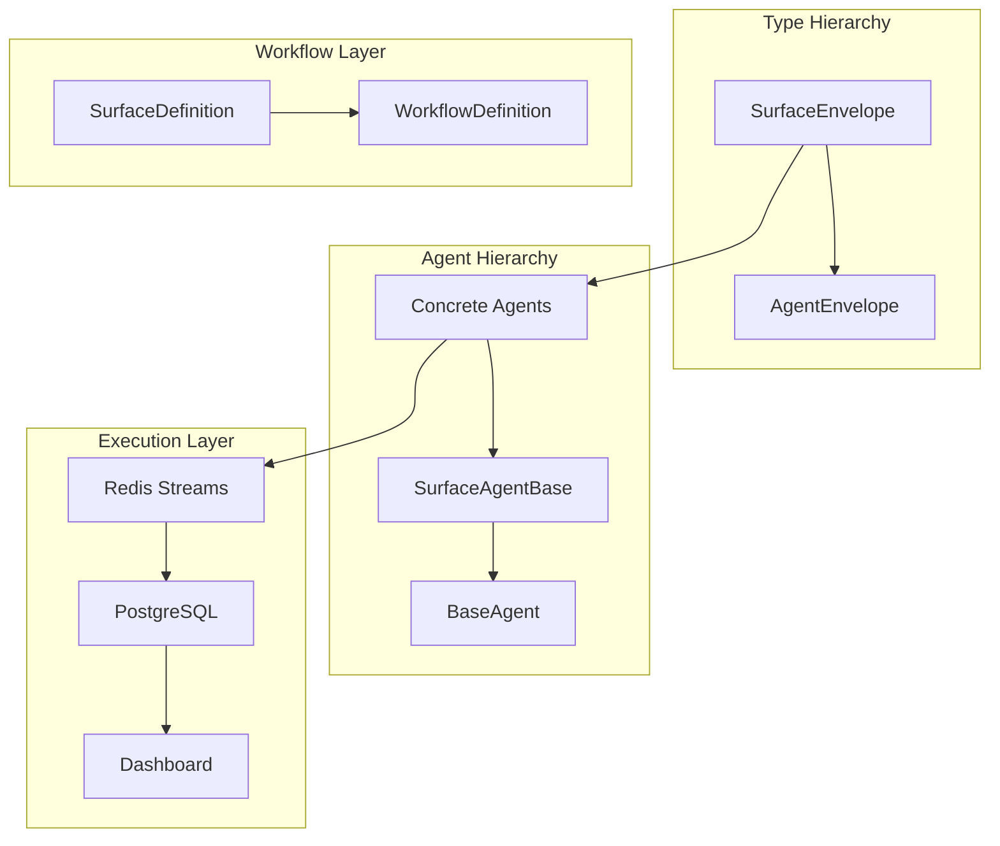
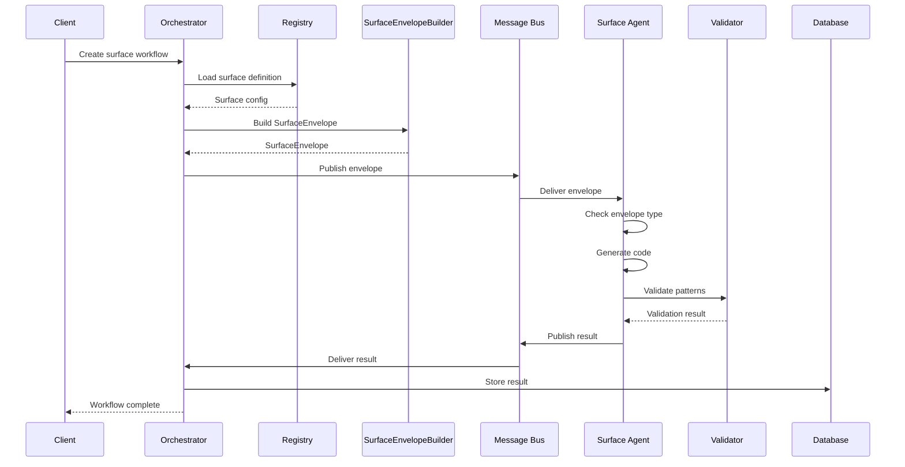
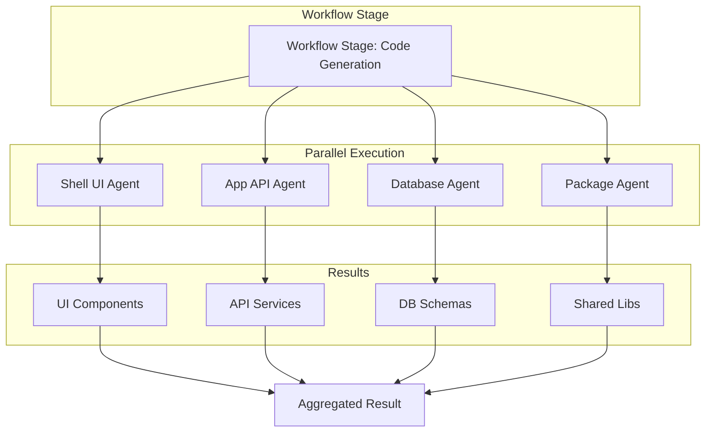

# Unified Surface Agent Architecture V2

## Executive Summary

This document presents a unified architecture that consolidates Platform-Surfaces code generation capabilities with Agent-SDLC's orchestration infrastructure through a comprehensive agent hierarchy, surface-specific abstractions, and type-safe envelope system. The architecture treats surfaces as first-class workflow definitions while maintaining full backward compatibility.

---

## Table of Contents

1. [Architecture Overview](#1-architecture-overview)
2. [Agent Hierarchy & Classification](#2-agent-hierarchy--classification)
3. [Surface Agent Design](#3-surface-agent-design)
4. [Envelope System](#4-envelope-system)
5. [Workflow & Orchestration](#5-workflow--orchestration)
6. [Implementation Architecture](#6-implementation-architecture)
7. [Runtime Execution Model](#7-runtime-execution-model)
8. [Integration Strategy](#8-integration-strategy)
9. [Deployment Architecture](#9-deployment-architecture)
10. [Success Metrics](#10-success-metrics)

---

## 1. Architecture Overview

### Core Design Principles

1. **Surfaces as Workflows** - Each surface is a workflow definition with specific stages
2. **Type-Safe Hierarchy** - BaseAgent → SurfaceAgentBase → Concrete Surface Agents
3. **Envelope Extension** - SurfaceEnvelope extends AgentEnvelope with surface context
4. **Unified Registry** - Single agent registry for all agent types
5. **Full Observability** - Redis Streams provide complete tracing
6. **Backward Compatible** - Works with existing Agent-SDLC infrastructure

### Architectural Layers



---

## 2. Agent Hierarchy & Classification

### 2.1 Complete Agent Taxonomy

```mermaid
graph TB
    subgraph "Foundation Layer"
        BA[BaseAgent<br/>Core Infrastructure]
        SAB[SurfaceAgentBase<br/>Surface Operations]
        MA[MetaAgent<br/>Agent Management]
    end

    subgraph "Surface Agents"
        subgraph "UI Generation"
            SUA[ShellUIAgent]
            AUA[AppUIAgent]
            CGA[ComponentGenAgent]
        end

        subgraph "API Generation"
            SAA[ShellAPIAgent]
            AAA[AppAPIAgent]
            GQA[GraphQLAgent]
        end

        subgraph "Data Generation"
            DBA[DatabaseAgent]
            SGA[SchemaGenAgent]
            MGA[MigrationAgent]
        end

        subgraph "Infrastructure"
            TFA[TerraformAgent]
            DKA[DockerAgent]
            K8A[KubernetesAgent]
        end
    end

    subgraph "SDLC Agents"
        SCA[ScaffoldAgent]
        VA[ValidationAgent]
        DEA[DeploymentAgent]
        TA[TestAgent]
    end

    subgraph "EPCC Phase Agents"
        EA[ExploreAgent]
        PA[PlanAgent]
        COA[CodeAgent]
        CEA[CertifyAgent]
    end

    subgraph "Specialist Agents"
        SecA[SecurityAgent]
        PerfA[PerformanceAgent]
        MLA[MLAgent]
        OptA[OptimizationAgent]
    end

    BA --> SAB
    BA --> MA
    SAB --> SUA
    SAB --> SAA
    SAB --> DBA
    SAB --> TFA
    BA --> SCA
    BA --> EA
    BA --> SecA

    style BA fill:#e3f2fd
    style SAB fill:#e8f5e9
    style MA fill:#f3e5f5
```



### 2.2 Agent Capability Matrix

| Agent Type | Base Class | Category | Key Capabilities | Platform Support |
|-----------|------------|----------|------------------|------------------|
| **ShellUIAgent** | SurfaceAgentBase | UI Generation | React, Next.js 14, TypeScript | Web |
| **AppAPIAgent** | SurfaceAgentBase | API Generation | Fastify, Prisma, Zod | Web |
| **DatabaseAgent** | SurfaceAgentBase | Data Generation | Prisma schemas, Migrations | All |
| **ExploreAgent** | BaseAgent | EPCC Phase | Requirements analysis | All |
| **PlanAgent** | BaseAgent | EPCC Phase | Architecture design | All |
| **ValidationAgent** | BaseAgent | SDLC | Pattern validation, Policy enforcement | All |
| **SecurityAgent** | BaseAgent | Specialist | SAST, DAST, Vulnerability scanning | All |

---

## 3. Surface Agent Design

### 3.1 SurfaceAgentBase Implementation

```typescript
// packages/agents/surface-agent-base/src/surface-agent-base.ts

import { BaseAgent } from '@agentic-sdlc/base-agent'
import { AgentEnvelope, TaskResult } from '@agentic-sdlc/shared-types'
import { SurfaceEnvelope } from '@agentic-sdlc/shared-types/surface'
import { RegistryLoader } from '@zyp/registry-loader'
import { SurfaceContext } from '@zyp/surface-context'
import { PatternValidator } from '@zyp/pattern-checker'
import { PolicyEngine } from '@agentic-sdlc/policy-engine'

export abstract class SurfaceAgentBase extends BaseAgent {
  protected registryLoader: RegistryLoader
  protected surfaceContext: SurfaceContext
  protected policyEngine: PolicyEngine
  protected patternValidator: PatternValidator

  constructor(deps: AgentDependencies) {
    super(deps)
    this.registryLoader = new RegistryLoader()
    this.surfaceContext = new SurfaceContext()
    this.policyEngine = new PolicyEngine()
    this.patternValidator = new PatternValidator()
  }

  /**
   * Override execute to handle both envelope types
   */
  async execute(envelope: AgentEnvelope): Promise<TaskResult> {
    // Check if this is a SurfaceEnvelope
    if (this.isSurfaceEnvelope(envelope)) {
      return this.executeSurface(envelope as SurfaceEnvelope)
    }

    // Convert regular envelope to surface envelope
    const surfaceEnvelope = await this.convertToSurfaceEnvelope(envelope)
    return this.executeSurface(surfaceEnvelope)
  }

  /**
   * Type guard for SurfaceEnvelope
   */
  protected isSurfaceEnvelope(envelope: AgentEnvelope): envelope is SurfaceEnvelope {
    return 'surface_context' in envelope && 'surface_metadata' in envelope
  }

  /**
   * Convert AgentEnvelope to SurfaceEnvelope
   */
  protected async convertToSurfaceEnvelope(envelope: AgentEnvelope): Promise<SurfaceEnvelope> {
    const { surface_id, platform_id } = envelope.payload

    const surface = await this.surfaceContext.load(surface_id)
    const platform = await this.registryLoader.loadPlatformRegistry()

    return {
      ...envelope,
      payload: {
        surface_id,
        platform_id: platform_id || platform.platformId,
        input: envelope.payload.input || {},
        config: {
          patterns: surface.patterns.required,
          policies: await this.loadPolicies(surface_id),
          validation_gates: surface.validationGates,
          dependencies: surface.dependencies
        },
        options: envelope.payload.options || {}
      },
      surface_context: {
        surface_definition: surface,
        platform_config: platform,
        frozen_versions: platform.frozenVersions,
        policy_hierarchy: await this.loadPolicyHierarchy(surface_id, platform_id),
        patterns: {
          required: surface.patterns.required.map(p => this.loadPattern(p)),
          optional: surface.patterns.optional?.map(p => this.loadPattern(p)) || []
        }
      },
      surface_metadata: {
        surface_type: this.determineSurfaceType(surface),
        layer: surface.layer,
        technology: surface.technology,
        generation_strategy: 'claude',
        estimated_duration_ms: 30000,
        validation_strategy: 'strict',
        quality_gates: surface.validationGates
      }
    } as SurfaceEnvelope
  }

  /**
   * Execute with surface context
   */
  protected async executeSurface(envelope: SurfaceEnvelope): Promise<TaskResult> {
    const startTime = Date.now()

    try {
      // 1. Validate prerequisites
      await this.validateSurfacePrerequisites(envelope)

      // 2. Generate code (implemented by subclass)
      const generationResult = await this.generateCode(
        envelope.payload.input,
        envelope.surface_context,
        envelope.surface_metadata
      )

      // 3. Validate patterns
      if (envelope.payload.options?.validate_patterns !== false) {
        await this.validatePatterns(generationResult, envelope.surface_context.patterns)
      }

      // 4. Enforce policies
      if (envelope.payload.options?.enforce_policies !== false) {
        await this.enforcePolicies(generationResult, envelope.surface_context.policy_hierarchy)
      }

      // 5. Generate tests if requested
      if (envelope.payload.options?.generate_tests) {
        generationResult.files.push(...await this.generateTests(generationResult))
      }

      // 6. Create artifacts
      const artifacts = await this.createArtifacts(generationResult, envelope.surface_context)

      // 7. Build result
      return this.buildSurfaceResult(generationResult, artifacts, Date.now() - startTime)
    } catch (error) {
      this.logger.error('Surface generation failed', {
        error: error.message,
        surface: envelope.payload.surface_id
      })
      throw error
    }
  }

  /**
   * Abstract method for code generation
   */
  protected abstract generateCode(
    input: any,
    context: SurfaceContext,
    metadata: SurfaceMetadata
  ): Promise<SurfaceGenerationResult>

  /**
   * Validate surface prerequisites
   */
  protected async validateSurfacePrerequisites(envelope: SurfaceEnvelope): Promise<void> {
    const { surface_context, surface_metadata } = envelope

    if (!surface_context.surface_definition) {
      throw new Error('Surface definition not found')
    }

    if (!surface_context.platform_config) {
      throw new Error('Platform configuration not found')
    }

    // Validate frozen versions
    await this.validateFrozenVersions(
      surface_metadata.technology,
      surface_context.frozen_versions
    )
  }

  /**
   * Pattern validation
   */
  protected async validatePatterns(
    result: SurfaceGenerationResult,
    patterns: { required: Pattern[], optional: Pattern[] }
  ): Promise<ValidationResult> {
    const validation = await this.patternValidator.validate(
      result.files,
      patterns.required
    )

    if (!validation.valid) {
      throw new Error(`Pattern validation failed: ${validation.errors.join(', ')}`)
    }

    return validation
  }

  /**
   * Policy enforcement
   */
  protected async enforcePolicies(
    result: SurfaceGenerationResult,
    policyHierarchy: PolicyHierarchy
  ): Promise<PolicyValidation> {
    const allPolicies = [
      ...policyHierarchy.global,
      ...policyHierarchy.platform,
      ...policyHierarchy.surface
    ]

    const validation = await this.policyEngine.enforce(result, allPolicies)

    const blockingViolations = validation.violations.filter(v => v.enforcement === 'blocking')
    if (blockingViolations.length > 0) {
      throw new Error(`Policy violations: ${blockingViolations.map(v => v.message).join(', ')}`)
    }

    return validation
  }

  /**
   * Build standardized result
   */
  protected buildSurfaceResult(
    generation: SurfaceGenerationResult,
    artifacts: Artifact[],
    duration_ms: number
  ): TaskResult {
    return {
      status: 'completed',
      output: {
        generated_files: generation.files.length,
        total_lines: this.countLines(generation.files),
        artifacts: artifacts.map(a => ({
          name: a.name,
          type: a.type,
          size: a.content.length
        }))
      },
      metrics: {
        duration_ms,
        files_generated: generation.files.length,
        patterns_applied: generation.patterns_used.length,
        policies_enforced: generation.policies_enforced.length
      },
      artifacts
    }
  }
}
```

### 3.2 Concrete Surface Agent Example

```typescript
// packages/agents/surface-agents/src/shell-ui-agent.ts

import { SurfaceAgentBase, SurfaceGenerationResult } from '@agentic-sdlc/surface-agent-base'
import { ClaudeAPI } from '@anthropic/claude-sdk'

export class ShellUIAgent extends SurfaceAgentBase {
  private claude: ClaudeAPI

  async initialize(): Promise<void> {
    await super.initialize()
    this.claude = new ClaudeAPI({
      apiKey: this.config.anthropicApiKey
    })
  }

  protected async generateCode(
    input: any,
    context: SurfaceContext,
    metadata: SurfaceMetadata
  ): Promise<SurfaceGenerationResult> {
    const { componentName, componentType, props } = input

    // Generate React component
    const componentCode = await this.generateReactComponent(
      componentName,
      componentType,
      props,
      context
    )

    // Generate tests
    const testCode = await this.generateComponentTests(componentName, componentCode)

    // Generate Storybook stories
    const storyCode = await this.generateStories(componentName, props)

    // Apply Next.js patterns
    const files = await this.applyNextJSPatterns(
      componentCode,
      testCode,
      storyCode,
      context
    )

    return {
      code: componentCode,
      files,
      artifacts: [],
      patterns_used: ['react_component', 'nextjs_page', 'typescript'],
      policies_enforced: ['no-any-type', 'component-naming', 'test-coverage'],
      validation_results: []
    }
  }

  private async generateReactComponent(
    name: string,
    type: string,
    props: any,
    context: SurfaceContext
  ): Promise<string> {
    const prompt = `
Generate a React component for Next.js 14 with:
- Name: ${name}
- Type: ${type}
- Props: ${JSON.stringify(props)}
- Use TypeScript strict mode
- Apply Tailwind CSS
- Include proper error boundaries
- Follow React 19 best practices
    `

    const response = await this.claude.complete({
      prompt,
      max_tokens: 2000,
      temperature: 0.3
    })

    return this.extractCodeFromResponse(response)
  }

  protected getCapabilities(): string[] {
    return [
      'react-component-generation',
      'nextjs-page-generation',
      'typescript-support',
      'tailwind-styling',
      'test-generation'
    ]
  }
}
```

---

## 4. Envelope System

### 4.1 SurfaceEnvelope Definition

```typescript
// packages/shared/types/src/messages/surface-envelope.ts

import { AgentEnvelope } from './agent-envelope'

/**
 * SurfaceEnvelope extends AgentEnvelope with surface-specific context
 */
export interface SurfaceEnvelope extends AgentEnvelope {
  payload: SurfacePayload
  surface_context: SurfaceContext
  surface_metadata: SurfaceMetadata
}

export interface SurfacePayload {
  surface_id: string                    // e.g., "shells:ui:nextjs"
  platform_id: string                   // e.g., "nextjs-web"

  input: {
    requirements?: string
    component_name?: string
    endpoint_path?: string
    schema_definition?: any
    [key: string]: any
  }

  config: {
    patterns: string[]
    policies: string[]
    validation_gates: string[]
    dependencies?: SurfaceDependency[]
  }

  options?: {
    validate_patterns?: boolean
    enforce_policies?: boolean
    generate_tests?: boolean
    generate_docs?: boolean
    dry_run?: boolean
  }
}

export interface SurfaceContext {
  surface_definition: Surface
  platform_config: Platform
  frozen_versions: Record<string, string>

  policy_hierarchy: {
    global: Policy[]
    platform: Policy[]
    surface: Policy[]
  }

  patterns: {
    required: Pattern[]
    optional: Pattern[]
  }

  resolved_dependencies?: {
    surface_id: string
    output_path: string
    artifacts: string[]
  }[]
}

export interface SurfaceMetadata {
  surface_type: 'ui' | 'api' | 'database' | 'package' | 'infrastructure'
  layer: 'shells' | 'apps' | 'packages' | 'infrastructure'
  technology: string
  generation_strategy: 'claude' | 'template' | 'hybrid'
  estimated_duration_ms: number
  validation_strategy: 'strict' | 'lenient'
  quality_gates: QualityGate[]
}
```

### 4.2 Envelope Builder & Validation

```typescript
// packages/shared/utils/src/surface-envelope-builder.ts

import { z } from 'zod'
import { v4 as uuidv4 } from 'uuid'

export const SurfaceEnvelopeSchema = z.object({
  // Extends AgentEnvelope fields
  message_id: z.string().uuid(),
  task_id: z.string().uuid(),
  workflow_id: z.string().uuid(),
  agent_type: z.string().regex(/^[a-z-]+-agent$/),

  // Surface-specific payload
  payload: z.object({
    surface_id: z.string().regex(/^[a-z]+:[a-z]+:[a-z0-9-]+$/),
    platform_id: z.string(),
    input: z.record(z.any()),
    config: z.object({
      patterns: z.array(z.string()),
      policies: z.array(z.string()),
      validation_gates: z.array(z.string()),
      dependencies: z.array(z.any()).optional()
    }),
    options: z.object({
      validate_patterns: z.boolean().default(true),
      enforce_policies: z.boolean().default(true),
      generate_tests: z.boolean().default(true),
      generate_docs: z.boolean().default(false),
      dry_run: z.boolean().default(false)
    }).optional()
  }),

  // Surface context and metadata
  surface_context: z.any(), // Complex nested type
  surface_metadata: z.any()
})

export class SurfaceEnvelopeBuilder {
  static async build(params: {
    workflow_id: string
    surface_id: string
    platform_id: string
    input: any
    options?: any
  }): Promise<SurfaceEnvelope> {
    const surface = await this.loadSurface(params.surface_id)
    const platform = await this.loadPlatform(params.platform_id)

    const envelope: SurfaceEnvelope = {
      message_id: uuidv4(),
      task_id: uuidv4(),
      workflow_id: params.workflow_id,
      agent_type: surface.agent,
      priority: 'medium',
      status: 'pending',
      execution_constraints: {
        timeout_ms: 30000,
        max_retries: 2,
        confidence: 0.95
      },
      metadata: {
        version: '2.0.0',
        created_at: new Date().toISOString(),
        created_by: 'surface-orchestrator'
      },
      trace_context: {
        trace_id: uuidv4(),
        span_id: uuidv4(),
        parent_span_id: params.workflow_id
      },
      workflow_context: {
        type: 'surface',
        name: surface.name,
        current_stage: 'generation',
        stage_outputs: {}
      },
      payload: {
        surface_id: params.surface_id,
        platform_id: params.platform_id,
        input: params.input,
        config: {
          patterns: surface.patterns.required,
          policies: await this.loadPolicies(params.surface_id),
          validation_gates: surface.validationGates,
          dependencies: surface.dependencies
        },
        options: params.options
      },
      surface_context: {
        surface_definition: surface,
        platform_config: platform,
        frozen_versions: platform.frozenVersions,
        policy_hierarchy: await this.loadPolicyHierarchy(params.surface_id, params.platform_id),
        patterns: await this.loadPatterns(surface)
      },
      surface_metadata: {
        surface_type: this.determineSurfaceType(surface),
        layer: surface.layer,
        technology: surface.technology,
        generation_strategy: 'claude',
        estimated_duration_ms: 30000,
        validation_strategy: 'strict',
        quality_gates: surface.validationGates
      }
    }

    // Validate envelope
    return SurfaceEnvelopeSchema.parse(envelope)
  }
}
```

---

## 5. Workflow & Orchestration

### 5.1 Surface Workflow Templates

```typescript
// packages/shared/workflow-templates/src/surface-workflows.ts

export const SURFACE_WORKFLOW_TEMPLATES = {
  // Individual surface workflow
  'shell-ui-surface': {
    name: 'Shell UI Surface Generation',
    type: 'surface',
    platform_id: 'nextjs-web',
    stages: [
      {
        name: 'generate-components',
        agent_type: 'shell-ui-agent',
        config: {
          surface_id: 'shells:ui:nextjs',
          validate_patterns: true
        }
      },
      {
        name: 'validate-patterns',
        agent_type: 'pattern-validator',
        config: {
          rules_path: 'knowledge-base/shells/policies.json'
        }
      },
      {
        name: 'run-tests',
        agent_type: 'test-runner',
        config: {
          coverage_target: 80,
          test_framework: 'vitest'
        }
      }
    ]
  },

  // EPCC complete workflow
  'epcc-complete': {
    name: 'EPCC Complete Feature Generation',
    type: 'epcc',
    platform_id: 'nextjs-web',
    stages: [
      // EXPLORE PHASE
      {
        name: 'explore',
        agent_type: 'explore-agent',
        config: { phase: 'explore' }
      },

      // PLAN PHASE
      {
        name: 'plan',
        agent_type: 'plan-agent',
        config: { phase: 'plan' },
        depends_on: ['explore']
      },

      // CODE PHASE - Parallel surface generation
      {
        name: 'generate-shell-ui',
        agent_type: 'shell-ui-agent',
        config: { surface_id: 'shells:ui:nextjs' },
        depends_on: ['plan']
      },
      {
        name: 'generate-app-api',
        agent_type: 'app-api-agent',
        config: { surface_id: 'apps:api:fastify' },
        depends_on: ['plan']
      },
      {
        name: 'generate-database',
        agent_type: 'database-agent',
        config: { surface_id: 'database:schema:prisma' },
        depends_on: ['plan']
      },

      // CERTIFY PHASE
      {
        name: 'certify',
        agent_type: 'certify-agent',
        config: { phase: 'certify' },
        depends_on: [
          'generate-shell-ui',
          'generate-app-api',
          'generate-database'
        ]
      }
    ]
  }
}
```

### 5.2 Dynamic Workflow Composition

```typescript
// packages/shared/workflow-composer/src/surface-workflow-composer.ts

export class SurfaceWorkflowComposer {
  private surfaceRegistry: SurfaceRegistry
  private policyEngine: PolicyEngine

  async composeFromRequirements(
    requirements: string,
    options: CompositionOptions = {}
  ): Promise<WorkflowDefinition> {
    // Analyze requirements
    const analysis = await this.analyzeRequirements(requirements)

    // Identify required surfaces
    const surfaces = await this.identifyRequiredSurfaces(analysis)

    // Order surfaces by dependencies
    const orderedSurfaces = this.orderByDependencies(surfaces)

    // Generate workflow stages
    const stages = await this.generateStages(orderedSurfaces, options)

    // Add validation stages
    if (options.includeValidation) {
      stages.push(...this.createValidationStages(surfaces))
    }

    // Add test stages
    if (options.includeTesting) {
      stages.push(...this.createTestStages(surfaces))
    }

    return {
      name: analysis.suggested_name || 'Generated Surface Workflow',
      type: 'surface-composition',
      platform_id: options.platform_id || analysis.recommended_platform,
      metadata: {
        generated_from: 'requirements',
        surfaces_used: surfaces.map(s => s.id)
      },
      stages
    }
  }
}
```

---

## 6. Implementation Architecture

### 6.1 Package Structure

```
packages/
├── agents/
│   ├── base-agent/                  # Foundation
│   ├── surface-agent-base/          # Surface abstraction
│   ├── surface-agents/              # Concrete surface agents
│   │   ├── shell-ui-agent/
│   │   ├── app-api-agent/
│   │   ├── database-agent/
│   │   └── ...
│   ├── epcc-agents/                 # EPCC phase agents
│   │   ├── explore-agent/
│   │   ├── plan-agent/
│   │   ├── code-agent/
│   │   └── certify-agent/
│   └── sdlc-agents/                 # Existing SDLC agents
│
├── shared/
│   ├── types/
│   │   ├── messages/
│   │   │   ├── agent-envelope.ts
│   │   │   └── surface-envelope.ts
│   │   └── schemas/
│   │       └── surface-envelope.schema.ts
│   ├── workflow-templates/
│   ├── workflow-composer/
│   └── surface-registry/
│
├── orchestrator/
│   ├── src/
│   │   ├── routes/
│   │   │   └── surface.routes.ts
│   │   └── services/
│   │       └── surface-workflow.service.ts
│
└── dashboard/
    └── src/
        └── components/
            └── Surfaces/
                ├── SurfaceWorkflowBuilder.tsx
                └── SurfaceExecutionView.tsx
```

### 6.2 Agent Registration

```typescript
// packages/orchestrator/src/startup/register-surface-agents.ts

export async function registerSurfaceAgents(
  registry: AgentRegistry,
  messageBus: IMessageBus
): Promise<void> {
  // Register surface agents
  await registry.registerAgent({
    name: 'shell-ui-agent',
    type: 'shell-ui-agent',
    version: '1.0.0',
    description: 'Generates Next.js UI components',
    capabilities: ['code-generation', 'react', 'nextjs'],
    timeout_ms: 30000,
    max_retries: 2
  }, (deps) => new ShellUIAgent(deps))

  await registry.registerAgent({
    name: 'app-api-agent',
    type: 'app-api-agent',
    version: '1.0.0',
    description: 'Generates Fastify API services',
    capabilities: ['code-generation', 'fastify', 'prisma'],
    timeout_ms: 30000,
    max_retries: 2
  }, (deps) => new AppAPIAgent(deps))

  // Register EPCC phase agents
  await registry.registerAgent({
    name: 'explore-agent',
    type: 'explore-agent',
    version: '1.0.0',
    description: 'Analyzes requirements',
    capabilities: ['requirements-analysis'],
    timeout_ms: 15000
  }, (deps) => new ExploreAgent(deps))

  // ... register all other agents
}
```

---

## 7. Runtime Execution Model

### 7.1 Execution Flow



### 7.2 Parallel Surface Execution



---

## 8. Integration Strategy

### 8.1 Migration Path

#### Phase 1: Foundation (Week 1)
- [ ] Implement SurfaceAgentBase
- [ ] Define SurfaceEnvelope types
- [ ] Create envelope builder
- [ ] Test type compatibility

#### Phase 2: Agent Migration (Week 2)
- [ ] Migrate ShellUIAgent
- [ ] Migrate AppAPIAgent
- [ ] Migrate DatabaseAgent
- [ ] Test with existing workflows

#### Phase 3: Integration (Week 3)
- [ ] Register surface agents
- [ ] Create workflow templates
- [ ] Add API endpoints
- [ ] Update dashboard

#### Phase 4: Testing (Week 4)
- [ ] End-to-end testing
- [ ] Performance optimization
- [ ] Documentation
- [ ] Production deployment

### 8.2 Backward Compatibility

```typescript
// Compatibility layer ensures existing code continues working

// Old way (still works)
const envelope: AgentEnvelope = {
  agent_type: 'scaffold-agent',
  payload: { /* ... */ }
}

// New way (enhanced)
const surfaceEnvelope: SurfaceEnvelope = {
  agent_type: 'shell-ui-agent',
  payload: { /* surface payload */ },
  surface_context: { /* ... */ },
  surface_metadata: { /* ... */ }
}

// Both work with same infrastructure
await messageBus.publish(envelope)        // ✓
await messageBus.publish(surfaceEnvelope) // ✓
```

---

## 9. Deployment Architecture

### 9.1 Container Architecture

```yaml
# docker-compose.surfaces.yml
services:
  # Surface agents as containers
  shell-ui-agent:
    image: agentic-sdlc/shell-ui-agent:latest
    environment:
      - REDIS_HOST=redis
      - ANTHROPIC_API_KEY=${ANTHROPIC_API_KEY}
    deploy:
      replicas: 3
      resources:
        limits:
          memory: 2G
          cpus: '2.0'

  app-api-agent:
    image: agentic-sdlc/app-api-agent:latest
    deploy:
      replicas: 5
      resources:
        limits:
          memory: 2G
          cpus: '2.0'

  database-agent:
    image: agentic-sdlc/database-agent:latest
    deploy:
      replicas: 2
      resources:
        limits:
          memory: 1G
          cpus: '1.0'

  # EPCC phase agents
  explore-agent:
    image: agentic-sdlc/explore-agent:latest
    deploy:
      replicas: 2

  plan-agent:
    image: agentic-sdlc/plan-agent:latest
    deploy:
      replicas: 2

  certify-agent:
    image: agentic-sdlc/certify-agent:latest
    deploy:
      replicas: 2
```

### 9.2 Kubernetes Deployment

```yaml
# k8s/surface-agents-deployment.yaml
apiVersion: apps/v1
kind: Deployment
metadata:
  name: shell-ui-agent
spec:
  replicas: 3
  selector:
    matchLabels:
      app: shell-ui-agent
  template:
    metadata:
      labels:
        app: shell-ui-agent
        type: surface-agent
    spec:
      containers:
      - name: agent
        image: agentic-sdlc/shell-ui-agent:latest
        env:
        - name: REDIS_HOST
          value: redis-service
        - name: CONSUMER_GROUP
          value: surface-agents
        resources:
          requests:
            memory: "1Gi"
            cpu: "1000m"
          limits:
            memory: "2Gi"
            cpu: "2000m"
        livenessProbe:
          httpGet:
            path: /health
            port: 8080
          periodSeconds: 10
---
apiVersion: autoscaling/v2
kind: HorizontalPodAutoscaler
metadata:
  name: shell-ui-agent-hpa
spec:
  scaleTargetRef:
    apiVersion: apps/v1
    kind: Deployment
    name: shell-ui-agent
  minReplicas: 2
  maxReplicas: 10
  metrics:
  - type: Resource
    resource:
      name: cpu
      target:
        type: Utilization
        averageUtilization: 70
```

---

## 10. Data Models & Services Architecture

### 10.1 Core Data Models

#### Platform Model (Extended)
```typescript
// packages/shared/types/src/models/platform.model.ts

export interface Platform {
  id: string
  name: string                         // Unique identifier
  layer: PlatformLayer
  description?: string
  config: PlatformConfig
  enabled: boolean

  // Surface associations
  surfaces: PlatformSurface[]          // Surfaces enabled for this platform
  surface_mappings: SurfaceMapping[]   // Maps surfaces to agents

  // Workflow associations
  workflow_definitions: WorkflowDefinition[]
  workflow_templates: WorkflowTemplate[]

  // Agent associations
  agents: AgentRegistration[]          // Platform-specific agents
  agent_overrides: AgentOverride[]     // Platform-specific configurations

  // Policy associations
  policies: PlatformPolicy[]           // Platform-specific policies
  policy_overrides: PolicyOverride[]   // Override global policies

  // Metadata
  created_at: Date
  updated_at: Date
  created_by: string
  version: number
}

export interface PlatformConfig {
  // Technology stack
  technology: {
    frontend?: string                   // e.g., "nextjs@14.2.13"
    backend?: string                    // e.g., "fastify@5.6.1"
    database?: string                   // e.g., "postgresql@14"
    infrastructure?: string             // e.g., "aws", "gcp", "azure"
  }

  // Frozen versions
  frozen_versions: Record<string, string>

  // Build configuration
  build: {
    node_version: string
    package_manager: 'npm' | 'yarn' | 'pnpm'
    build_command?: string
    test_command?: string
  }

  // Deployment configuration
  deployment: {
    target: 'docker' | 'serverless' | 'kubernetes' | 'vm'
    region?: string
    environment?: Record<string, string>
  }

  // Feature flags
  features: {
    auto_scaling?: boolean
    monitoring?: boolean
    tracing?: boolean
    caching?: boolean
  }
}

export enum PlatformLayer {
  APPLICATION = 'APPLICATION',         // User-facing applications
  DATA = 'DATA',                       // Data processing platforms
  INFRASTRUCTURE = 'INFRASTRUCTURE',   // Infrastructure platforms
  ENTERPRISE = 'ENTERPRISE',          // Enterprise integration platforms
  ML = 'ML',                          // Machine learning platforms
  IOT = 'IOT'                         // IoT platforms
}
```

#### Surface Model (Comprehensive)
```typescript
// packages/shared/types/src/models/surface.model.ts

export interface Surface {
  id: string                           // e.g., "shells:ui:nextjs"
  name: string                        // Human-readable name
  type: SurfaceType
  layer: SurfaceLayer
  technology: string                   // e.g., "nextjs@14.2.13"
  description: string

  // Agent configuration
  agent: string                       // Default agent type
  agent_config?: AgentConfig         // Agent-specific configuration

  // Code generation
  patterns: {
    required: string[]                // Required patterns
    optional?: string[]               // Optional patterns
    definitionFile: string            // Path to pattern definitions
  }

  // Policies
  policies: {
    critical: string[]                // Critical policies
    recommended?: string[]            // Recommended policies
    coverage?: string                 // Test coverage requirement
  }

  // Dependencies
  dependencies: {
    internal: string[]                // Internal package dependencies
    external?: string[]               // External dependencies
    cannotUse: string[]              // Forbidden dependencies
    surfaces?: string[]              // Other surface dependencies
  }

  // Validation
  validationGates: ValidationGate[]
  qualityGates?: QualityGate[]

  // EPCC phases
  epccPhases: EPCCPhase[]

  // Repository mappings
  repositories?: string[]             // Source code locations

  // Metadata
  version: string
  enabled: boolean
  created_at: Date
  updated_at: Date
}

export enum SurfaceType {
  FRONTEND = 'frontend',
  API = 'api',
  DATABASE = 'database',
  PACKAGE = 'package',
  INFRASTRUCTURE = 'infrastructure',
  PIPELINE = 'pipeline',
  DOCUMENTATION = 'documentation'
}

export enum SurfaceLayer {
  SHELLS = 'shells',
  APPS = 'apps',
  PACKAGES = 'packages',
  INFRASTRUCTURE = 'infrastructure',
  PIPELINES = 'pipelines',
  DATABASE = 'database',
  DOCUMENTATION = 'documentation'
}

export type EPCCPhase = 'EXPLORE' | 'PLAN' | 'CODE' | 'CERTIFY'

export interface ValidationGate {
  name: string
  type: 'type-check' | 'lint' | 'test' | 'build' | 'security' | 'coverage'
  required: boolean
  threshold?: number                   // For coverage, performance, etc.
  config?: Record<string, any>
}
```

#### Workflow Model (Enhanced)
```typescript
// packages/shared/types/src/models/workflow.model.ts

export interface Workflow {
  id: string
  type: WorkflowType
  name: string
  description?: string
  requirements?: string
  status: WorkflowStatus
  current_stage: string
  priority: Priority
  progress: number                     // 0-100

  // Platform & Surface context
  platform_id?: string
  surface_id?: string                 // Primary surface if surface workflow
  surface_ids?: string[]              // All surfaces involved

  // Definition & Template
  workflow_definition_id?: string
  workflow_template_id?: string

  // Execution context
  input_data?: any
  stage_outputs: Record<string, any>
  context: WorkflowContext

  // Tracing
  trace_id?: string
  current_span_id?: string

  // Relationships
  stages: WorkflowStage[]
  tasks: AgentTask[]
  events: WorkflowEvent[]

  // Metadata
  created_at: Date
  updated_at: Date
  completed_at?: Date
  created_by: string
  version: number                     // For optimistic locking
}

export interface WorkflowContext {
  platform?: Platform
  surfaces?: Surface[]
  policies?: Policy[]
  frozen_versions?: Record<string, string>
  environment?: 'development' | 'staging' | 'production'
  dry_run?: boolean
  validation_mode?: 'strict' | 'lenient'
}

export interface WorkflowStage {
  id: string
  workflow_id: string
  name: string
  agent_type: string                  // Can be any string (unbounded)
  status: StageStatus

  // Configuration
  config?: any                        // Stage-specific configuration
  surface_id?: string                 // Associated surface

  // Dependencies
  depends_on?: string[]               // Other stage names

  // Execution
  started_at?: Date
  completed_at?: Date
  retry_count: number
  max_retries: number
  timeout_ms: number

  // Results
  output?: any
  artifacts?: Artifact[]
  errors?: WorkflowError[]
}
```

#### Surface-Platform Mapping
```typescript
// packages/shared/types/src/models/surface-mapping.model.ts

export interface SurfaceMapping {
  id: string
  platform_id: string
  surface_id: string

  // Agent override for this platform-surface combination
  agent_type?: string                 // Override default agent
  agent_config?: any                  // Platform-specific agent config

  // Pattern overrides
  pattern_overrides?: {
    add?: string[]                    // Additional patterns
    remove?: string[]                 // Remove patterns
  }

  // Policy overrides
  policy_overrides?: {
    add?: string[]                    // Additional policies
    remove?: string[]                 // Remove policies
    modify?: Record<string, any>      // Modify policy parameters
  }

  // Validation overrides
  validation_overrides?: {
    gates?: ValidationGate[]          // Override validation gates
    skip?: string[]                   // Skip certain gates
  }

  enabled: boolean
  priority: number                    // For conflict resolution

  created_at: Date
  updated_at: Date
}
```

### 10.2 Service Architecture

#### Platform Service
```typescript
// packages/orchestrator/src/services/platform.service.ts

export class PlatformService {
  constructor(
    private db: PrismaClient,
    private cache: CacheService,
    private eventBus: EventBus,
    private policyEngine: PolicyEngine
  ) {}

  /**
   * Platform CRUD Operations
   */
  async createPlatform(input: CreatePlatformInput): Promise<Platform> {
    // Validate platform configuration
    await this.validatePlatformConfig(input.config)

    // Create platform with surfaces
    const platform = await this.db.platform.create({
      data: {
        ...input,
        surfaces: {
          create: input.surfaces?.map(s => ({
            surface_id: s.surface_id,
            config: s.config,
            enabled: s.enabled ?? true
          }))
        }
      },
      include: {
        surfaces: true,
        agents: true,
        policies: true
      }
    })

    // Invalidate cache
    await this.cache.invalidate(`platform:${platform.id}`)

    // Emit event
    await this.eventBus.emit('platform.created', platform)

    return platform
  }

  async updatePlatform(id: string, input: UpdatePlatformInput): Promise<Platform> {
    // Get existing platform
    const existing = await this.getPlatform(id)

    // Validate changes
    await this.validatePlatformUpdate(existing, input)

    // Update with version check (optimistic locking)
    const updated = await this.db.platform.update({
      where: {
        id,
        version: existing.version // Ensure no concurrent updates
      },
      data: {
        ...input,
        version: { increment: 1 }
      }
    })

    // Update cache
    await this.cache.set(`platform:${id}`, updated)

    // Emit event
    await this.eventBus.emit('platform.updated', { before: existing, after: updated })

    return updated
  }

  /**
   * Surface Management
   */
  async enableSurfaceForPlatform(
    platformId: string,
    surfaceId: string,
    config?: SurfaceMappingConfig
  ): Promise<SurfaceMapping> {
    // Validate surface compatibility
    await this.validateSurfaceCompatibility(platformId, surfaceId)

    // Create or update mapping
    const mapping = await this.db.surfaceMapping.upsert({
      where: {
        platform_id_surface_id: {
          platform_id: platformId,
          surface_id: surfaceId
        }
      },
      update: {
        ...config,
        updated_at: new Date()
      },
      create: {
        platform_id: platformId,
        surface_id: surfaceId,
        ...config
      }
    })

    // Register platform-specific agent if configured
    if (config?.agent_type) {
      await this.registerPlatformAgent(platformId, surfaceId, config.agent_type)
    }

    return mapping
  }

  async getSurfacesForPlatform(platformId: string): Promise<Surface[]> {
    // Get from cache first
    const cached = await this.cache.get(`platform:${platformId}:surfaces`)
    if (cached) return cached

    // Load surface mappings
    const mappings = await this.db.surfaceMapping.findMany({
      where: {
        platform_id: platformId,
        enabled: true
      }
    })

    // Load surface definitions
    const surfaces = await Promise.all(
      mappings.map(m => this.loadSurface(m.surface_id))
    )

    // Apply platform-specific overrides
    const overriddenSurfaces = surfaces.map((surface, i) => {
      return this.applyPlatformOverrides(surface, mappings[i])
    })

    // Cache result
    await this.cache.set(
      `platform:${platformId}:surfaces`,
      overriddenSurfaces,
      { ttl: 300 } // 5 minutes
    )

    return overriddenSurfaces
  }

  /**
   * Policy Management
   */
  async getPlatformPolicies(platformId: string): Promise<Policy[]> {
    const platform = await this.getPlatform(platformId)

    // Get global policies
    const globalPolicies = await this.policyEngine.getGlobalPolicies()

    // Get platform-specific policies
    const platformPolicies = await this.db.platformPolicy.findMany({
      where: { platform_id: platformId }
    })

    // Merge with overrides
    return this.mergePolicies(globalPolicies, platformPolicies, platform.policy_overrides)
  }

  /**
   * Workflow Integration
   */
  async createSurfaceWorkflow(
    platformId: string,
    surfaceId: string,
    input: CreateWorkflowInput
  ): Promise<Workflow> {
    // Get platform and surface
    const platform = await this.getPlatform(platformId)
    const surface = await this.loadSurface(surfaceId)

    // Get surface mapping for overrides
    const mapping = await this.db.surfaceMapping.findUnique({
      where: {
        platform_id_surface_id: {
          platform_id: platformId,
          surface_id: surfaceId
        }
      }
    })

    // Build workflow definition
    const definition = await this.buildSurfaceWorkflowDefinition(
      platform,
      surface,
      mapping,
      input
    )

    // Create workflow
    return await this.workflowService.createWorkflow({
      ...definition,
      platform_id: platformId,
      surface_id: surfaceId,
      context: {
        platform,
        surfaces: [surface],
        policies: await this.getPlatformPolicies(platformId),
        frozen_versions: platform.config.frozen_versions
      }
    })
  }

  /**
   * Analytics
   */
  async getPlatformAnalytics(platformId: string): Promise<PlatformAnalytics> {
    const [workflows, tasks, successRate] = await Promise.all([
      this.db.workflow.count({
        where: { platform_id: platformId }
      }),
      this.db.agentTask.count({
        where: {
          workflow: { platform_id: platformId }
        }
      }),
      this.calculateSuccessRate(platformId)
    ])

    return {
      total_workflows: workflows,
      total_tasks: tasks,
      success_rate: successRate,
      active_surfaces: await this.getActiveSurfaceCount(platformId),
      avg_execution_time: await this.getAvgExecutionTime(platformId)
    }
  }
}
```

#### Surface Service
```typescript
// packages/orchestrator/src/services/surface.service.ts

export class SurfaceService {
  constructor(
    private registryLoader: RegistryLoader,
    private cache: CacheService,
    private validator: SurfaceValidator,
    private composer: WorkflowComposer
  ) {}

  /**
   * Surface Registry Management
   */
  async loadSurfaceRegistry(): Promise<SurfaceRegistry> {
    // Load from cache
    const cached = await this.cache.get('surface:registry')
    if (cached) return cached

    // Load from file system
    const registry = await this.registryLoader.loadSurfaceRegistry()

    // Validate all surfaces
    for (const surface of registry.surfaces) {
      await this.validator.validateSurface(surface)
    }

    // Cache registry
    await this.cache.set('surface:registry', registry, { ttl: 600 })

    return registry
  }

  async getSurface(surfaceId: string): Promise<Surface> {
    const registry = await this.loadSurfaceRegistry()
    const surface = registry.surfaces.find(s => s.id === surfaceId)

    if (!surface) {
      throw new Error(`Surface ${surfaceId} not found`)
    }

    return surface
  }

  async querySurfaces(query: SurfaceQuery): Promise<Surface[]> {
    const registry = await this.loadSurfaceRegistry()

    return registry.surfaces.filter(surface => {
      if (query.type && surface.type !== query.type) return false
      if (query.layer && surface.layer !== query.layer) return false
      if (query.technology && !surface.technology.includes(query.technology)) return false
      if (query.agent && surface.agent !== query.agent) return false
      if (query.enabled !== undefined && surface.enabled !== query.enabled) return false

      return true
    })
  }

  /**
   * Surface Composition
   */
  async composeSurfaceWorkflow(
    requirements: string,
    options: CompositionOptions
  ): Promise<WorkflowDefinition> {
    // Analyze requirements to identify surfaces
    const analysis = await this.analyzeRequirements(requirements)

    // Find matching surfaces
    const surfaces = await this.findMatchingSurfaces(analysis)

    // Check surface compatibility
    await this.validateSurfaceCompatibility(surfaces)

    // Order by dependencies
    const ordered = this.orderByDependencies(surfaces)

    // Build workflow stages
    const stages = await this.buildWorkflowStages(ordered, options)

    return {
      name: `Generated from: ${requirements.substring(0, 50)}...`,
      type: 'surface-composition',
      platform_id: options.platform_id,
      stages,
      metadata: {
        surfaces: surfaces.map(s => s.id),
        generated_at: new Date().toISOString(),
        requirements_hash: this.hashRequirements(requirements)
      }
    }
  }

  /**
   * Surface Validation
   */
  async validateSurfaceConfiguration(
    surfaceId: string,
    config: any
  ): Promise<ValidationResult> {
    const surface = await this.getSurface(surfaceId)

    // Validate against surface schema
    const schemaValidation = await this.validator.validateAgainstSchema(
      config,
      surface.agent_config?.schema
    )

    // Check required patterns
    const patternValidation = await this.validator.validatePatterns(
      config,
      surface.patterns.required
    )

    // Check policies
    const policyValidation = await this.validator.validatePolicies(
      config,
      surface.policies.critical
    )

    return {
      valid: schemaValidation.valid && patternValidation.valid && policyValidation.valid,
      errors: [
        ...schemaValidation.errors,
        ...patternValidation.errors,
        ...policyValidation.errors
      ]
    }
  }

  /**
   * Surface Dependencies
   */
  async resolveSurfaceDependencies(surfaceId: string): Promise<Surface[]> {
    const surface = await this.getSurface(surfaceId)
    const dependencies: Surface[] = []

    if (surface.dependencies.surfaces) {
      for (const depId of surface.dependencies.surfaces) {
        const dep = await this.getSurface(depId)
        dependencies.push(dep)

        // Recursive resolution
        const transitive = await this.resolveSurfaceDependencies(depId)
        dependencies.push(...transitive)
      }
    }

    // Remove duplicates
    return Array.from(new Map(dependencies.map(d => [d.id, d])).values())
  }

  /**
   * EPCC Phase Management
   */
  async getEPCCWorkflow(
    surfaceIds: string[],
    platformId: string
  ): Promise<WorkflowDefinition> {
    const surfaces = await Promise.all(surfaceIds.map(id => this.getSurface(id)))

    const stages: WorkflowStage[] = []

    // EXPLORE phase
    if (surfaces.some(s => s.epccPhases.includes('EXPLORE'))) {
      stages.push({
        name: 'explore',
        agent_type: 'explore-agent',
        config: {
          surfaces: surfaceIds,
          platform_id: platformId
        }
      })
    }

    // PLAN phase
    if (surfaces.some(s => s.epccPhases.includes('PLAN'))) {
      stages.push({
        name: 'plan',
        agent_type: 'plan-agent',
        config: {
          surfaces: surfaceIds,
          platform_id: platformId
        },
        depends_on: stages.length > 0 ? ['explore'] : []
      })
    }

    // CODE phase - parallel surface generation
    const codeStages = surfaces
      .filter(s => s.epccPhases.includes('CODE'))
      .map(surface => ({
        name: `code-${surface.id}`,
        agent_type: surface.agent,
        config: {
          surface_id: surface.id,
          platform_id: platformId
        },
        depends_on: stages.some(s => s.name === 'plan') ? ['plan'] : []
      }))

    stages.push(...codeStages)

    // CERTIFY phase
    if (surfaces.some(s => s.epccPhases.includes('CERTIFY'))) {
      stages.push({
        name: 'certify',
        agent_type: 'certify-agent',
        config: {
          surfaces: surfaceIds,
          platform_id: platformId
        },
        depends_on: codeStages.map(s => s.name)
      })
    }

    return {
      name: 'EPCC Workflow',
      type: 'epcc',
      platform_id: platformId,
      stages
    }
  }
}
```

#### Workflow Service (Enhanced)
```typescript
// packages/orchestrator/src/services/workflow.service.ts

export class WorkflowService {
  constructor(
    private db: PrismaClient,
    private messageBus: IMessageBus,
    private platformService: PlatformService,
    private surfaceService: SurfaceService,
    private envelopeBuilder: SurfaceEnvelopeBuilder
  ) {}

  /**
   * Create workflow with surface awareness
   */
  async createWorkflow(input: CreateWorkflowInput): Promise<Workflow> {
    // Load platform if specified
    const platform = input.platform_id
      ? await this.platformService.getPlatform(input.platform_id)
      : undefined

    // Load surfaces if specified
    const surfaces = input.surface_ids
      ? await Promise.all(input.surface_ids.map(id => this.surfaceService.getSurface(id)))
      : []

    // Build context
    const context: WorkflowContext = {
      platform,
      surfaces,
      policies: platform
        ? await this.platformService.getPlatformPolicies(platform.id)
        : [],
      frozen_versions: platform?.config.frozen_versions,
      environment: input.environment || 'development',
      dry_run: input.dry_run || false,
      validation_mode: input.validation_mode || 'strict'
    }

    // Create workflow
    const workflow = await this.db.workflow.create({
      data: {
        type: input.type,
        name: input.name,
        description: input.description,
        requirements: input.requirements,
        status: 'initiated',
        current_stage: 'initialization',
        priority: input.priority || 'medium',
        progress: 0,
        platform_id: input.platform_id,
        surface_id: surfaces[0]?.id, // Primary surface
        input_data: input.input_data,
        context,
        created_by: input.created_by,
        trace_id: this.generateTraceId()
      }
    })

    // Create stages
    for (const stageDef of input.stages) {
      await this.createWorkflowStage(workflow.id, stageDef, context)
    }

    // Start execution
    await this.startWorkflowExecution(workflow)

    return workflow
  }

  /**
   * Create workflow stage with surface envelope
   */
  private async createWorkflowStage(
    workflowId: string,
    stageDef: StageDefinition,
    context: WorkflowContext
  ): Promise<WorkflowStage> {
    const stage = await this.db.workflowStage.create({
      data: {
        workflow_id: workflowId,
        name: stageDef.name,
        agent_type: stageDef.agent_type,
        status: 'pending',
        config: stageDef.config,
        surface_id: stageDef.surface_id,
        depends_on: stageDef.depends_on,
        max_retries: stageDef.max_retries || 3,
        timeout_ms: stageDef.timeout_ms || 30000
      }
    })

    // If this is a surface agent, create surface envelope
    if (stageDef.surface_id) {
      const envelope = await this.envelopeBuilder.build({
        workflow_id: workflowId,
        surface_id: stageDef.surface_id,
        platform_id: context.platform?.id,
        input: stageDef.config?.input || {},
        options: {
          validate_patterns: context.validation_mode === 'strict',
          enforce_policies: !context.dry_run,
          generate_tests: stageDef.config?.generate_tests !== false
        }
      })

      // Store envelope for later execution
      await this.cache.set(`stage:${stage.id}:envelope`, envelope)
    }

    return stage
  }

  /**
   * Execute surface workflow
   */
  async executeSurfaceWorkflow(
    platformId: string,
    surfaceId: string,
    input: any
  ): Promise<WorkflowExecution> {
    // Get surface configuration for platform
    const mapping = await this.db.surfaceMapping.findUnique({
      where: {
        platform_id_surface_id: {
          platform_id: platformId,
          surface_id: surfaceId
        }
      }
    })

    if (!mapping || !mapping.enabled) {
      throw new Error(`Surface ${surfaceId} not enabled for platform ${platformId}`)
    }

    // Create workflow
    const workflow = await this.createWorkflow({
      name: `Surface execution: ${surfaceId}`,
      type: 'surface',
      platform_id: platformId,
      surface_ids: [surfaceId],
      stages: [{
        name: 'generate',
        agent_type: mapping.agent_type || (await this.surfaceService.getSurface(surfaceId)).agent,
        surface_id: surfaceId,
        config: {
          ...mapping.agent_config,
          input
        }
      }],
      created_by: 'system'
    })

    // Monitor execution
    return await this.monitorExecution(workflow.id)
  }
}
```

### 10.3 Database Schema (Prisma)

```prisma
// packages/orchestrator/prisma/schema.prisma

model Platform {
  id              String           @id @default(uuid())
  name            String           @unique
  layer           PlatformLayer
  description     String?
  config          Json             @default("{}")
  enabled         Boolean          @default(true)
  version         Int              @default(1) // For optimistic locking

  created_at      DateTime         @default(now())
  updated_at      DateTime         @updatedAt
  created_by      String

  // Relationships
  surfaces        SurfaceMapping[]
  workflows       Workflow[]
  agents          AgentRegistration[]
  policies        PlatformPolicy[]
  templates       WorkflowTemplate[]
  definitions     WorkflowDefinition[]

  @@index([layer])
  @@index([enabled])
}

model SurfaceMapping {
  id              String           @id @default(uuid())
  platform_id     String
  surface_id      String           // Reference to surface definition

  // Overrides
  agent_type      String?          // Override default agent
  agent_config    Json?
  pattern_overrides Json?
  policy_overrides Json?
  validation_overrides Json?

  enabled         Boolean          @default(true)
  priority        Int              @default(0)

  created_at      DateTime         @default(now())
  updated_at      DateTime         @updatedAt

  platform        Platform         @relation(fields: [platform_id], references: [id])

  @@unique([platform_id, surface_id])
  @@index([platform_id])
  @@index([surface_id])
  @@index([enabled])
}

model Surface {
  id              String           @id @default(uuid())
  surface_id      String           @unique // e.g., "shells:ui:nextjs"
  name            String
  type            String
  layer           String
  technology      String
  description     String?

  // Configuration stored as JSON
  agent           String
  patterns        Json
  policies        Json
  dependencies    Json
  validation_gates Json
  epcc_phases     String[]

  version         String           @default("1.0.0")
  enabled         Boolean          @default(true)

  created_at      DateTime         @default(now())
  updated_at      DateTime         @updatedAt

  @@index([type])
  @@index([layer])
  @@index([enabled])
}

model WorkflowTemplate {
  id              String           @id @default(uuid())
  platform_id     String?
  name            String
  description     String?
  type            WorkflowType

  // Template definition
  stages          Json             // Stage templates
  default_config  Json?            // Default configuration
  required_inputs Json?            // Required input schema

  // Surface associations
  surface_ids     String[]         // Associated surfaces

  enabled         Boolean          @default(true)
  version         String           @default("1.0.0")

  created_at      DateTime         @default(now())
  updated_at      DateTime         @updatedAt
  created_by      String

  platform        Platform?        @relation(fields: [platform_id], references: [id])

  @@index([platform_id])
  @@index([type])
  @@index([enabled])
}

model AgentRegistration {
  id              String           @id @default(uuid())
  agent_type      String
  platform_id     String?          // Null for global agents
  surface_id      String?          // Associated surface

  // Agent configuration
  version         String
  capabilities    String[]
  config          Json?
  timeout_ms      Int              @default(30000)
  max_retries     Int              @default(3)

  // Status
  status          String           @default("active")
  last_heartbeat  DateTime?

  created_at      DateTime         @default(now())
  updated_at      DateTime         @updatedAt

  platform        Platform?        @relation(fields: [platform_id], references: [id])

  @@unique([agent_type, platform_id])
  @@index([platform_id])
  @@index([surface_id])
  @@index([status])
}

model PlatformPolicy {
  id              String           @id @default(uuid())
  platform_id     String
  policy_id       String           // Reference to global policy

  // Policy configuration
  level           String           // global, platform, surface, agent, workflow
  severity        String           // info, warning, error, critical
  enforcement     String           // audit, warning, blocking

  // Override configuration
  override_config Json?

  enabled         Boolean          @default(true)
  priority        Int              @default(0)

  created_at      DateTime         @default(now())
  updated_at      DateTime         @updatedAt

  platform        Platform         @relation(fields: [platform_id], references: [id])

  @@unique([platform_id, policy_id])
  @@index([platform_id])
  @@index([enabled])
}
```

### 10.4 API Endpoints

```typescript
// packages/orchestrator/src/routes/platform-surface.routes.ts

export function createPlatformSurfaceRoutes(
  platformService: PlatformService,
  surfaceService: SurfaceService,
  workflowService: WorkflowService
): Router {
  const router = Router()

  // Platform endpoints
  router.post('/api/v1/platforms', async (req, res) => {
    const platform = await platformService.createPlatform(req.body)
    res.status(201).json(platform)
  })

  router.get('/api/v1/platforms/:id', async (req, res) => {
    const platform = await platformService.getPlatform(req.params.id)
    res.json(platform)
  })

  router.put('/api/v1/platforms/:id', async (req, res) => {
    const platform = await platformService.updatePlatform(req.params.id, req.body)
    res.json(platform)
  })

  // Surface endpoints
  router.get('/api/v1/surfaces', async (req, res) => {
    const surfaces = await surfaceService.querySurfaces(req.query)
    res.json({ surfaces })
  })

  router.get('/api/v1/surfaces/:id', async (req, res) => {
    const surface = await surfaceService.getSurface(req.params.id)
    res.json(surface)
  })

  // Platform-Surface mapping
  router.post('/api/v1/platforms/:platformId/surfaces/:surfaceId', async (req, res) => {
    const mapping = await platformService.enableSurfaceForPlatform(
      req.params.platformId,
      req.params.surfaceId,
      req.body
    )
    res.status(201).json(mapping)
  })

  router.get('/api/v1/platforms/:platformId/surfaces', async (req, res) => {
    const surfaces = await platformService.getSurfacesForPlatform(req.params.platformId)
    res.json({ surfaces })
  })

  // Surface workflow execution
  router.post('/api/v1/platforms/:platformId/surfaces/:surfaceId/execute', async (req, res) => {
    const execution = await workflowService.executeSurfaceWorkflow(
      req.params.platformId,
      req.params.surfaceId,
      req.body
    )
    res.status(201).json(execution)
  })

  // Surface composition
  router.post('/api/v1/surfaces/compose', async (req, res) => {
    const workflow = await surfaceService.composeSurfaceWorkflow(
      req.body.requirements,
      req.body.options
    )
    res.status(201).json(workflow)
  })

  // EPCC workflow
  router.post('/api/v1/surfaces/epcc', async (req, res) => {
    const workflow = await surfaceService.getEPCCWorkflow(
      req.body.surface_ids,
      req.body.platform_id
    )
    res.status(201).json(workflow)
  })

  return router
}
```

---

## 11. Success Metrics

### 10.1 Technical Metrics

| Metric | Target | Measurement |
|--------|--------|-------------|
| **Agent Response Time** | < 500ms p95 | Prometheus metrics |
| **Surface Generation Time** | < 30s | End-to-end timing |
| **Pattern Validation Rate** | > 95% | Validation success % |
| **Policy Compliance** | > 99% | Policy engine metrics |
| **Code Quality Score** | > 85% | SonarQube analysis |
| **Test Coverage** | > 80% | Coverage reports |

### 10.2 Business Metrics

| Metric | Target | Impact |
|--------|--------|--------|
| **Development Velocity** | +40% | Story points/sprint |
| **Bug Reduction** | -30% | Defect density |
| **Time to Market** | -50% | Feature delivery time |
| **Developer Satisfaction** | +35% | Survey scores |
| **Code Reusability** | +60% | Component usage |

### 10.3 Operational Metrics

| Metric | Target | Monitoring |
|--------|--------|----------|
| **System Uptime** | 99.9% | Availability monitoring |
| **Agent Scaling Time** | < 30s | Auto-scaling metrics |
| **Resource Utilization** | < 70% | Container metrics |
| **Error Recovery Rate** | > 90% | Error handling stats |
| **Monitoring Coverage** | 100% | Observability tools |

---

## Conclusion

This unified architecture successfully consolidates Platform-Surfaces code generation with Agent-SDLC orchestration through:

1. **Type-Safe Hierarchy**: BaseAgent → SurfaceAgentBase → Concrete Agents
2. **Enhanced Envelopes**: SurfaceEnvelope extends AgentEnvelope with full context
3. **Unified Registry**: All agents in single registry with capability discovery
4. **Surface as Workflows**: Surfaces are workflow definitions with stages
5. **Full Observability**: Redis Streams provide complete tracing
6. **Backward Compatible**: Works with existing infrastructure
7. **Scalable Deployment**: Container and Kubernetes ready
8. **Comprehensive Testing**: Pattern validation, policy enforcement, quality gates

The architecture enables:
- **Immediate Benefits**: Full visibility, tracing, unified platform
- **Long-term Value**: Dynamic composition, cross-platform support, intelligent orchestration
- **Zero New Infrastructure**: Leverages existing Agent-SDLC system

Implementation can proceed incrementally while maintaining full backward compatibility, with surface agents appearing immediately in the dashboard and benefiting from all existing orchestration capabilities.