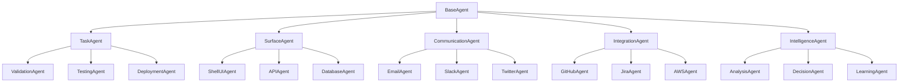

# Agent Taxonomy & Architecture Design

## Executive Summary

This document presents a comprehensive agent categorization system that supports multiple agent types with distinct responsibilities and execution patterns. The design provides a clean hierarchy that accommodates current needs (Task Agents, Surface Agents) and future extensions (Messaging Agents, Social Media Agents, AI Agents, etc.).

**Core Categories:**
- **Task Agents**: Traditional workflow/task execution
- **Surface Agents**: Code generation for architectural surfaces
- **Communication Agents**: Messaging, social media, notifications
- **Integration Agents**: External system integrations
- **Intelligence Agents**: AI/ML, analysis, decision-making

---

## 1. Agent Taxonomy

### 1.1 Agent Category Hierarchy



### 1.2 Agent Categories

```typescript
// packages/core/types/agent-categories.ts

export enum AgentCategory {
    TASK = 'task',                    // Traditional task execution
    SURFACE = 'surface',              // Code generation
    COMMUNICATION = 'communication',  // Messaging & notifications
    INTEGRATION = 'integration',      // External systems
    INTELLIGENCE = 'intelligence'     // AI/ML capabilities
}

export interface AgentMetadata {
    category: AgentCategory
    type: string                      // Specific agent type
    capabilities: string[]
    constraints: AgentConstraint[]
    resources: ResourceRequirements
}

export interface AgentConstraint {
    type: 'rate-limit' | 'concurrency' | 'dependency' | 'authorization'
    value: any
}

export interface ResourceRequirements {
    cpu?: string
    memory?: string
    gpu?: boolean
    network?: 'internal' | 'external' | 'both'
    secrets?: string[]                // Required secrets/credentials
}
```

---

## 2. Unified Envelope System

### 2.1 Base Envelope (Common to All)

```typescript
// packages/core/types/envelope.ts

export interface Envelope {
    // Identity
    id: string
    workflow_id: string
    stage_id: string

    // Agent routing
    agent_category: AgentCategory
    agent_type: string

    // Execution
    priority: Priority
    timeout_ms: number
    max_retries: number

    // Payload - different per category
    payload: any

    // Context - different per category
    context: any

    // Metadata
    metadata: EnvelopeMetadata

    // Tracing
    trace: TraceContext

    // Timestamps
    created_at: Date
    updated_at: Date
}

export interface EnvelopeMetadata {
    source: string
    correlation_id: string
    idempotency_key?: string
    tags: string[]
}
```

### 2.2 Category-Specific Envelopes

```typescript
// Task Envelope - for traditional task execution
export interface TaskEnvelope extends Envelope {
    agent_category: AgentCategory.TASK

    payload: {
        task: {
            name: string
            parameters: Record<string, any>
            dependencies?: string[]
        }
    }

    context: {
        environment: string
        configuration: Record<string, any>
    }
}

// Surface Envelope - for code generation
export interface SurfaceEnvelope extends Envelope {
    agent_category: AgentCategory.SURFACE

    payload: {
        surface_id: string
        platform_id: string
        input: {
            requirements: string
            specifications?: Record<string, any>
        }
        config: {
            patterns: string[]
            policies: string[]
            quality_gates: QualityGate[]
        }
    }

    context: {
        surface: SurfaceDefinition
        platform: PlatformConfiguration
        policies: Policy[]
        patterns: Pattern[]
    }
}

// Communication Envelope - for messaging
export interface CommunicationEnvelope extends Envelope {
    agent_category: AgentCategory.COMMUNICATION

    payload: {
        channel: 'email' | 'slack' | 'twitter' | 'discord' | 'teams'
        recipients: Recipient[]
        message: {
            subject?: string
            body: string
            attachments?: Attachment[]
            template?: string
        }
        options: {
            schedule?: Date
            priority?: 'low' | 'normal' | 'high' | 'urgent'
            track?: boolean
        }
    }

    context: {
        credentials: CredentialReference
        rate_limits: RateLimit[]
        templates: MessageTemplate[]
    }
}

// Integration Envelope - for external systems
export interface IntegrationEnvelope extends Envelope {
    agent_category: AgentCategory.INTEGRATION

    payload: {
        system: 'github' | 'jira' | 'aws' | 'azure' | 'gcp'
        operation: string
        parameters: Record<string, any>
        options: {
            async?: boolean
            callback_url?: string
        }
    }

    context: {
        credentials: CredentialReference
        api_endpoint: string
        api_version: string
        rate_limits: RateLimit[]
    }
}

// Intelligence Envelope - for AI/ML operations
export interface IntelligenceEnvelope extends Envelope {
    agent_category: AgentCategory.INTELLIGENCE

    payload: {
        operation: 'analyze' | 'predict' | 'classify' | 'generate'
        data: any
        model?: string
        parameters?: {
            temperature?: number
            max_tokens?: number
            confidence_threshold?: number
        }
    }

    context: {
        model_config: ModelConfiguration
        constraints: InferenceConstraint[]
        cache?: CacheConfig
    }
}
```

---

## 3. Agent Base Classes

### 3.1 BaseAgent (Root)

```typescript
// packages/agents/base/base-agent.ts

export abstract class BaseAgent {
    protected logger: Logger
    protected tracer: Tracer
    protected metrics: Metrics

    constructor(
        protected readonly metadata: AgentMetadata,
        protected readonly config: AgentConfig
    ) {
        this.logger = new Logger(metadata.type)
        this.tracer = new Tracer(metadata.type)
        this.metrics = new Metrics(metadata.type)
    }

    /**
     * Main execution method - implemented by category base classes
     */
    abstract execute(envelope: Envelope): Promise<AgentResult>

    /**
     * Get agent category
     */
    getCategory(): AgentCategory {
        return this.metadata.category
    }

    /**
     * Get agent type
     */
    getType(): string {
        return this.metadata.type
    }

    /**
     * Get capabilities
     */
    getCapabilities(): string[] {
        return this.metadata.capabilities
    }

    /**
     * Validate envelope for this agent
     */
    protected validateEnvelope(envelope: Envelope): void {
        if (envelope.agent_category !== this.metadata.category) {
            throw new Error(
                `Invalid envelope category: expected ${this.metadata.category}, got ${envelope.agent_category}`
            )
        }

        if (envelope.agent_type !== this.metadata.type) {
            throw new Error(
                `Invalid agent type: expected ${this.metadata.type}, got ${envelope.agent_type}`
            )
        }
    }

    /**
     * Check resource availability
     */
    protected async checkResources(): Promise<boolean> {
        // Check CPU, memory, GPU, etc.
        return true
    }
}
```

### 3.2 Category Base Classes

```typescript
// packages/agents/base/task-agent-base.ts

export abstract class TaskAgentBase extends BaseAgent {
    constructor(type: string, config: AgentConfig) {
        super(
            {
                category: AgentCategory.TASK,
                type,
                capabilities: [],
                constraints: [],
                resources: {}
            },
            config
        )
    }

    async execute(envelope: Envelope): Promise<AgentResult> {
        const taskEnvelope = envelope as TaskEnvelope
        this.validateEnvelope(taskEnvelope)

        const span = this.tracer.startSpan('task.execute')

        try {
            const result = await this.executeTask(
                taskEnvelope.payload.task,
                taskEnvelope.context
            )

            return {
                status: 'success',
                data: result,
                metrics: this.collectMetrics()
            }
        } catch (error) {
            span.recordException(error)
            return {
                status: 'failure',
                error,
                metrics: this.collectMetrics()
            }
        } finally {
            span.end()
        }
    }

    protected abstract executeTask(
        task: TaskEnvelope['payload']['task'],
        context: TaskEnvelope['context']
    ): Promise<any>
}

// packages/agents/base/surface-agent-base.ts

export abstract class SurfaceAgentBase extends BaseAgent {
    protected registryLoader: RegistryLoader
    protected policyEngine: PolicyEngine
    protected patternValidator: PatternValidator

    constructor(type: string, config: AgentConfig) {
        super(
            {
                category: AgentCategory.SURFACE,
                type,
                capabilities: ['code-generation'],
                constraints: [],
                resources: { memory: '2GB' }
            },
            config
        )

        this.registryLoader = new RegistryLoader(config)
        this.policyEngine = new PolicyEngine(config)
        this.patternValidator = new PatternValidator(config)
    }

    async execute(envelope: Envelope): Promise<AgentResult> {
        const surfaceEnvelope = envelope as SurfaceEnvelope
        this.validateEnvelope(surfaceEnvelope)

        // Surface-specific execution flow
        const generation = await this.generateCode(
            surfaceEnvelope.payload,
            surfaceEnvelope.context
        )

        if (surfaceEnvelope.payload.config.patterns.length > 0) {
            await this.validatePatterns(generation, surfaceEnvelope.context.patterns)
        }

        if (surfaceEnvelope.payload.config.policies.length > 0) {
            await this.enforcePolicies(generation, surfaceEnvelope.context.policies)
        }

        return {
            status: 'success',
            data: generation,
            metrics: this.collectMetrics()
        }
    }

    protected abstract generateCode(
        payload: SurfaceEnvelope['payload'],
        context: SurfaceEnvelope['context']
    ): Promise<GenerationResult>
}

// packages/agents/base/communication-agent-base.ts

export abstract class CommunicationAgentBase extends BaseAgent {
    protected rateLimiter: RateLimiter
    protected templateEngine: TemplateEngine

    constructor(type: string, config: AgentConfig) {
        super(
            {
                category: AgentCategory.COMMUNICATION,
                type,
                capabilities: ['messaging'],
                constraints: [
                    { type: 'rate-limit', value: '100/hour' }
                ],
                resources: { network: 'external' }
            },
            config
        )

        this.rateLimiter = new RateLimiter(config)
        this.templateEngine = new TemplateEngine(config)
    }

    async execute(envelope: Envelope): Promise<AgentResult> {
        const commEnvelope = envelope as CommunicationEnvelope
        this.validateEnvelope(commEnvelope)

        // Check rate limits
        await this.rateLimiter.check(commEnvelope.payload.channel)

        // Render message from template if needed
        const message = commEnvelope.payload.message.template
            ? await this.templateEngine.render(
                commEnvelope.payload.message.template,
                commEnvelope.payload.message
            )
            : commEnvelope.payload.message

        // Send message
        const result = await this.sendMessage(
            commEnvelope.payload.channel,
            commEnvelope.payload.recipients,
            message,
            commEnvelope.context
        )

        return {
            status: 'success',
            data: result,
            metrics: this.collectMetrics()
        }
    }

    protected abstract sendMessage(
        channel: string,
        recipients: Recipient[],
        message: any,
        context: CommunicationEnvelope['context']
    ): Promise<any>
}
```

---

## 4. Concrete Agent Examples

### 4.1 Task Agent Example

```typescript
// packages/agents/validation-agent/index.ts

export class ValidationAgent extends TaskAgentBase {
    constructor(config: AgentConfig) {
        super('validation-agent', config)

        this.metadata.capabilities = [
            'code-validation',
            'schema-validation',
            'lint-checking'
        ]
    }

    protected async executeTask(
        task: TaskEnvelope['payload']['task'],
        context: TaskEnvelope['context']
    ): Promise<ValidationResult> {
        const { name, parameters } = task

        switch (name) {
            case 'validate-code':
                return this.validateCode(parameters.files)
            case 'validate-schema':
                return this.validateSchema(parameters.schema, parameters.data)
            case 'lint':
                return this.runLinter(parameters.files, parameters.rules)
            default:
                throw new Error(`Unknown task: ${name}`)
        }
    }

    private async validateCode(files: File[]): Promise<ValidationResult> {
        // Validation logic
        return { valid: true, errors: [] }
    }
}
```

### 4.2 Surface Agent Example

```typescript
// packages/agents/shell-ui-agent/index.ts

export class ShellUIAgent extends SurfaceAgentBase {
    private claude: ClaudeAPI

    constructor(config: AgentConfig) {
        super('shell-ui-agent', config)

        this.metadata.capabilities = [
            'react-component-generation',
            'nextjs-page-generation',
            'typescript-support'
        ]

        this.claude = new ClaudeAPI(config.claude)
    }

    protected async generateCode(
        payload: SurfaceEnvelope['payload'],
        context: SurfaceEnvelope['context']
    ): Promise<GenerationResult> {
        const { requirements, specifications } = payload.input

        // Generate React component
        const component = await this.generateReactComponent(
            specifications?.component_name,
            requirements,
            context
        )

        return {
            files: [component],
            patterns_used: ['react-component'],
            policies_enforced: ['no-any-type']
        }
    }
}
```

### 4.3 Communication Agent Example

```typescript
// packages/agents/slack-agent/index.ts

export class SlackAgent extends CommunicationAgentBase {
    private slackClient: SlackClient

    constructor(config: AgentConfig) {
        super('slack-agent', config)

        this.metadata.capabilities = [
            'direct-message',
            'channel-message',
            'file-upload',
            'reactions'
        ]

        this.slackClient = new SlackClient(config.slack)
    }

    protected async sendMessage(
        channel: string,
        recipients: Recipient[],
        message: any,
        context: CommunicationEnvelope['context']
    ): Promise<SlackMessageResult> {
        // Slack-specific logic
        const slackChannel = this.resolveChannel(recipients)

        return await this.slackClient.postMessage({
            channel: slackChannel,
            text: message.body,
            attachments: message.attachments
        })
    }
}
```

### 4.4 Integration Agent Example

```typescript
// packages/agents/github-agent/index.ts

export class GitHubAgent extends IntegrationAgentBase {
    private octokit: Octokit

    constructor(config: AgentConfig) {
        super('github-agent', config)

        this.metadata.capabilities = [
            'create-issue',
            'create-pr',
            'merge-pr',
            'create-release',
            'manage-workflows'
        ]

        this.octokit = new Octokit({
            auth: config.github.token
        })
    }

    protected async executeIntegration(
        operation: string,
        parameters: any,
        context: IntegrationEnvelope['context']
    ): Promise<any> {
        switch (operation) {
            case 'create-pr':
                return this.createPullRequest(parameters)
            case 'create-issue':
                return this.createIssue(parameters)
            case 'merge-pr':
                return this.mergePullRequest(parameters)
            default:
                throw new Error(`Unknown operation: ${operation}`)
        }
    }
}
```

---

## 5. Agent Registry & Discovery

### 5.1 Agent Registry

```typescript
// packages/core/agent-registry.ts

export class AgentRegistry {
    private agents: Map<string, AgentRegistration> = new Map()

    /**
     * Register an agent
     */
    register(agent: BaseAgent): void {
        const key = `${agent.getCategory()}:${agent.getType()}`

        this.agents.set(key, {
            category: agent.getCategory(),
            type: agent.getType(),
            capabilities: agent.getCapabilities(),
            instance: agent
        })
    }

    /**
     * Get agent by category and type
     */
    getAgent(category: AgentCategory, type: string): BaseAgent | undefined {
        return this.agents.get(`${category}:${type}`)?.instance
    }

    /**
     * Get all agents in a category
     */
    getAgentsByCategory(category: AgentCategory): BaseAgent[] {
        return Array.from(this.agents.values())
            .filter(reg => reg.category === category)
            .map(reg => reg.instance)
    }

    /**
     * Find agents by capability
     */
    findAgentsByCapability(capability: string): BaseAgent[] {
        return Array.from(this.agents.values())
            .filter(reg => reg.capabilities.includes(capability))
            .map(reg => reg.instance)
    }

    /**
     * Get agent for envelope
     */
    getAgentForEnvelope(envelope: Envelope): BaseAgent | undefined {
        return this.getAgent(envelope.agent_category, envelope.agent_type)
    }
}

interface AgentRegistration {
    category: AgentCategory
    type: string
    capabilities: string[]
    instance: BaseAgent
}
```

### 5.2 Agent Discovery

```typescript
// packages/core/agent-discovery.ts

export class AgentDiscovery {
    constructor(private registry: AgentRegistry) {}

    /**
     * Discover agents that can handle a requirement
     */
    async discoverAgents(requirement: Requirement): Promise<AgentMatch[]> {
        const matches: AgentMatch[] = []

        // Check by capability
        for (const capability of requirement.capabilities) {
            const agents = this.registry.findAgentsByCapability(capability)

            for (const agent of agents) {
                const score = this.calculateMatchScore(agent, requirement)
                matches.push({ agent, score })
            }
        }

        // Sort by match score
        return matches.sort((a, b) => b.score - a.score)
    }

    /**
     * Calculate how well an agent matches a requirement
     */
    private calculateMatchScore(agent: BaseAgent, requirement: Requirement): number {
        let score = 0

        // Check capability match
        const agentCaps = new Set(agent.getCapabilities())
        for (const cap of requirement.capabilities) {
            if (agentCaps.has(cap)) score += 10
        }

        // Check category preference
        if (requirement.preferredCategory === agent.getCategory()) {
            score += 5
        }

        return score
    }
}

interface Requirement {
    capabilities: string[]
    preferredCategory?: AgentCategory
    constraints?: any[]
}

interface AgentMatch {
    agent: BaseAgent
    score: number
}
```

---

## 6. Mixed Workflow Orchestration

### 6.1 Workflow with Mixed Agent Types

```yaml
# Example workflow combining different agent categories
name: full-feature-deployment
stages:
  # Intelligence Agent - Analyze requirements
  - id: analyze
    category: intelligence
    agent_type: analysis-agent
    payload:
      operation: analyze
      data: "${requirements}"

  # Surface Agent - Generate code
  - id: generate-ui
    category: surface
    agent_type: shell-ui-agent
    payload:
      surface_id: shells:ui:nextjs
      input:
        requirements: "${analyze.output.ui_requirements}"
    depends_on: [analyze]

  # Task Agent - Validate code
  - id: validate
    category: task
    agent_type: validation-agent
    payload:
      task:
        name: validate-code
        parameters:
          files: "${generate-ui.output.files}"
    depends_on: [generate-ui]

  # Task Agent - Run tests
  - id: test
    category: task
    agent_type: testing-agent
    payload:
      task:
        name: run-tests
        parameters:
          test_suite: unit
    depends_on: [validate]

  # Integration Agent - Create PR
  - id: create-pr
    category: integration
    agent_type: github-agent
    payload:
      system: github
      operation: create-pr
      parameters:
        title: "Feature: ${requirements.feature_name}"
        files: "${generate-ui.output.files}"
    depends_on: [test]

  # Communication Agent - Notify team
  - id: notify
    category: communication
    agent_type: slack-agent
    payload:
      channel: slack
      recipients:
        - channel: engineering
      message:
        body: "PR created for ${requirements.feature_name}"
    depends_on: [create-pr]
```

### 6.2 Orchestrator for Mixed Agents

```typescript
// packages/orchestrator/unified-orchestrator.ts

export class UnifiedOrchestrator {
    private registry: AgentRegistry
    private executor: AgentExecutor

    constructor(config: OrchestratorConfig) {
        this.registry = new AgentRegistry()
        this.executor = new AgentExecutor(config)

        this.registerAllAgents()
    }

    /**
     * Execute workflow with mixed agent types
     */
    async executeWorkflow(workflow: Workflow): Promise<WorkflowResult> {
        const execution = new WorkflowExecution(workflow)

        for (const stage of workflow.stages) {
            // Get appropriate agent based on category and type
            const agent = this.registry.getAgent(
                stage.category,
                stage.agent_type
            )

            if (!agent) {
                throw new Error(
                    `No agent found for ${stage.category}:${stage.agent_type}`
                )
            }

            // Create envelope based on category
            const envelope = this.createEnvelope(stage, execution)

            // Execute through agent
            const result = await this.executor.execute(agent, envelope)

            execution.addResult(stage.id, result)

            if (result.status === 'failure' && !stage.continueOnError) {
                break
            }
        }

        return execution.getResult()
    }

    /**
     * Create appropriate envelope type based on category
     */
    private createEnvelope(
        stage: WorkflowStage,
        execution: WorkflowExecution
    ): Envelope {
        const base = {
            id: uuidv4(),
            workflow_id: execution.id,
            stage_id: stage.id,
            agent_category: stage.category,
            agent_type: stage.agent_type,
            priority: stage.priority || 'medium',
            timeout_ms: stage.timeout || 30000,
            max_retries: stage.retries || 3,
            metadata: {
                source: 'orchestrator',
                correlation_id: execution.correlation_id,
                tags: stage.tags || []
            },
            trace: execution.trace,
            created_at: new Date(),
            updated_at: new Date()
        }

        // Return appropriate envelope type
        switch (stage.category) {
            case AgentCategory.TASK:
                return { ...base, payload: stage.payload, context: stage.context } as TaskEnvelope

            case AgentCategory.SURFACE:
                return { ...base, payload: stage.payload, context: stage.context } as SurfaceEnvelope

            case AgentCategory.COMMUNICATION:
                return { ...base, payload: stage.payload, context: stage.context } as CommunicationEnvelope

            case AgentCategory.INTEGRATION:
                return { ...base, payload: stage.payload, context: stage.context } as IntegrationEnvelope

            case AgentCategory.INTELLIGENCE:
                return { ...base, payload: stage.payload, context: stage.context } as IntelligenceEnvelope

            default:
                throw new Error(`Unknown agent category: ${stage.category}`)
        }
    }
}
```

---

## 7. Benefits of Agent Categorization

### 7.1 Clear Separation of Concerns

Each agent category has:
- Specific responsibilities
- Appropriate base class
- Category-specific envelope
- Relevant constraints and resources

### 7.2 Extensibility

Easy to add new categories:
```typescript
// Future categories
export enum AgentCategory {
    // ... existing ...
    MONITORING = 'monitoring',     // Observability agents
    SECURITY = 'security',         // Security scanning agents
    DATA = 'data',                 // ETL/data processing agents
    BLOCKCHAIN = 'blockchain',     // Web3/blockchain agents
    IOT = 'iot'                   // IoT device agents
}
```

### 7.3 Resource Management

Different categories have different resource needs:
- **Surface Agents**: High memory for code generation
- **Communication Agents**: Network access for external APIs
- **Intelligence Agents**: GPU for ML inference
- **Task Agents**: Balanced CPU/memory

### 7.4 Policy & Governance

Category-specific policies:
```typescript
// Category-specific rate limits
const rateLimits = {
    [AgentCategory.COMMUNICATION]: '100/hour',    // Prevent spam
    [AgentCategory.INTEGRATION]: '1000/hour',     // API limits
    [AgentCategory.SURFACE]: '10/minute',         // Resource intensive
    [AgentCategory.INTELLIGENCE]: '50/minute'     // GPU constrained
}
```

---

## 8. Implementation Plan

### Phase 1: Core Types & Base Classes
- [ ] Define AgentCategory enum
- [ ] Create base Envelope type
- [ ] Create category-specific envelopes
- [ ] Implement BaseAgent
- [ ] Implement category base classes

### Phase 2: Agent Migration
- [ ] Migrate existing task agents
- [ ] Implement surface agents
- [ ] Add communication agents
- [ ] Add integration agents

### Phase 3: Registry & Discovery
- [ ] Implement AgentRegistry
- [ ] Create AgentDiscovery service
- [ ] Add capability matching

### Phase 4: Orchestration
- [ ] Update orchestrator for categories
- [ ] Support mixed workflows
- [ ] Add category-specific routing

---

## 9. Conclusion

This agent categorization system provides:

1. **Clear Structure**: Well-defined agent categories with specific purposes
2. **Type Safety**: Category-specific envelopes and base classes
3. **Extensibility**: Easy to add new agent categories
4. **Resource Optimization**: Category-appropriate resource allocation
5. **Mixed Workflows**: Seamless integration of different agent types

The design supports current needs (Task and Surface agents) while providing a clear path for future agent types (Communication, Integration, Intelligence, etc.).