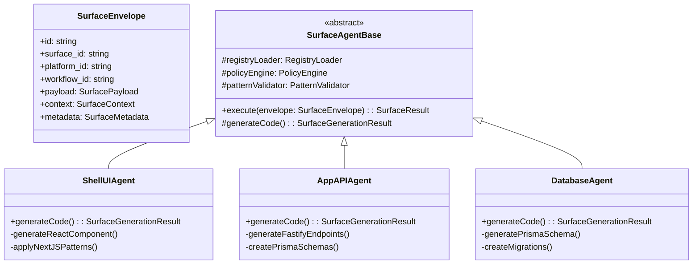

# Surface Agents Clean Design (Target State)

## Executive Summary

This document presents a clean, target-state architecture for Surface Agents without any backward compatibility requirements. By designing from first principles, we create a simpler, more maintainable system that fully leverages surface-specific patterns and type safety.

**Key Simplifications:**
- **Single Envelope Type**: SurfaceEnvelope is THE envelope (no AgentEnvelope)
- **Direct Implementation**: Surface agents implement directly (no adapters)
- **Clean Abstractions**: SurfaceAgentBase without compatibility code
- **Native Surface Support**: Orchestrator built for surfaces from the ground up

---

## 1. Clean Architecture Overview

### 1.1 Simplified Type Hierarchy



### 1.2 Core Design Principles

1. **Surface-Native**: Everything designed specifically for surfaces
2. **Type Safety**: Full TypeScript types throughout
3. **No Legacy**: No backward compatibility code
4. **Direct Implementation**: No adapters or bridges
5. **Clean Abstractions**: Single responsibility, clear boundaries

---

## 2. SurfaceEnvelope (The Only Envelope)

### 2.1 Clean Type Definition

```typescript
// packages/core/types/surface-envelope.ts

export interface SurfaceEnvelope {
    // Identity
    id: string                           // Unique envelope ID
    workflow_id: string                  // Parent workflow
    stage_id: string                     // Current stage in workflow

    // Surface specification
    surface_id: string                   // e.g., "shells:ui:nextjs"
    platform_id: string                  // e.g., "nextjs-web"
    agent_type: string                   // e.g., "shell-ui-agent"

    // Execution payload
    payload: SurfacePayload

    // Execution context
    context: SurfaceContext

    // Metadata
    metadata: SurfaceMetadata

    // Tracing
    trace: TraceContext

    // Timestamps
    created_at: Date
    updated_at: Date
}

export interface SurfacePayload {
    // Input data for generation
    input: {
        requirements: string              // What to generate
        specifications?: {
            component_name?: string       // UI components
            endpoint_path?: string        // API endpoints
            schema?: any                  // Database schemas
            [key: string]: any
        }
    }

    // Generation configuration
    config: {
        patterns: string[]                // Required code patterns
        policies: string[]                // Policies to enforce
        quality_gates: QualityGate[]      // Quality checks
    }

    // Generation options
    options: {
        strategy: 'claude' | 'template' | 'hybrid'
        validate: boolean                 // Run validation (default: true)
        test: boolean                    // Generate tests (default: true)
        document: boolean                // Generate docs (default: false)
        parallel: boolean                // Allow parallel execution
    }
}

export interface SurfaceContext {
    // Surface definition from registry
    surface: {
        id: string
        name: string
        layer: 'shells' | 'apps' | 'packages' | 'infrastructure'
        technology: string
        capabilities: string[]
        constraints: Constraint[]
    }

    // Platform configuration
    platform: {
        id: string
        name: string
        stack: TechnologyStack
        versions: Record<string, string>  // Frozen versions
        conventions: Convention[]
    }

    // Policy and pattern definitions
    policies: Policy[]
    patterns: Pattern[]

    // Dependencies if any
    dependencies?: {
        surface_id: string
        artifacts: Artifact[]
    }[]
}

export interface SurfaceMetadata {
    // Execution metadata
    priority: 'low' | 'medium' | 'high' | 'critical'
    timeout_ms: number
    max_retries: number

    // Resource requirements
    resources: {
        cpu?: string
        memory?: string
        gpu?: boolean
    }

    // Scheduling
    schedule?: {
        start_after?: Date
        complete_by?: Date
    }
}

export interface SurfaceResult {
    // Result identity
    envelope_id: string
    status: 'success' | 'failure' | 'partial'

    // Generated artifacts
    artifacts: {
        files: GeneratedFile[]
        packages: Package[]
        configs: Configuration[]
    }

    // Validation results
    validation: {
        patterns: ValidationResult
        policies: ValidationResult
        quality: QualityResult
    }

    // Metrics
    metrics: {
        duration_ms: number
        files_generated: number
        lines_of_code: number
        test_coverage?: number
    }

    // Errors if any
    errors?: Error[]
}
```

### 2.2 Schema Validation

```typescript
// packages/core/schemas/surface-envelope.schema.ts

import { z } from 'zod'

export const SurfaceEnvelopeSchema = z.object({
    id: z.string().uuid(),
    workflow_id: z.string().uuid(),
    stage_id: z.string(),

    surface_id: z.string().regex(/^[a-z]+:[a-z]+:[a-z0-9-]+$/),
    platform_id: z.string(),
    agent_type: z.string().regex(/^[a-z-]+-agent$/),

    payload: z.object({
        input: z.object({
            requirements: z.string().min(1),
            specifications: z.record(z.any()).optional()
        }),

        config: z.object({
            patterns: z.array(z.string()),
            policies: z.array(z.string()),
            quality_gates: z.array(QualityGateSchema)
        }),

        options: z.object({
            strategy: z.enum(['claude', 'template', 'hybrid']),
            validate: z.boolean().default(true),
            test: z.boolean().default(true),
            document: z.boolean().default(false),
            parallel: z.boolean().default(false)
        })
    }),

    context: SurfaceContextSchema,
    metadata: SurfaceMetadataSchema,
    trace: TraceContextSchema,

    created_at: z.date(),
    updated_at: z.date()
})

export type ValidatedSurfaceEnvelope = z.infer<typeof SurfaceEnvelopeSchema>
```

---

## 3. Clean SurfaceAgentBase

### 3.1 Simplified Base Class

```typescript
// packages/agents/base/surface-agent-base.ts

export abstract class SurfaceAgentBase {
    protected registryLoader: RegistryLoader
    protected policyEngine: PolicyEngine
    protected patternValidator: PatternValidator
    protected logger: Logger
    protected tracer: Tracer

    constructor(config: AgentConfig) {
        this.registryLoader = new RegistryLoader(config)
        this.policyEngine = new PolicyEngine(config)
        this.patternValidator = new PatternValidator(config)
        this.logger = new Logger(this.getAgentType())
        this.tracer = new Tracer(this.getAgentType())
    }

    /**
     * Main execution flow - clean and simple
     */
    async execute(envelope: SurfaceEnvelope): Promise<SurfaceResult> {
        const span = this.tracer.startSpan('surface.execute', {
            surface_id: envelope.surface_id,
            workflow_id: envelope.workflow_id
        })

        try {
            // 1. Validate envelope
            this.validateEnvelope(envelope)

            // 2. Generate code
            const generation = await this.generateCode(
                envelope.payload.input,
                envelope.context
            )

            // 3. Validate if required
            if (envelope.payload.options.validate) {
                await this.validate(generation, envelope)
            }

            // 4. Generate tests if required
            if (envelope.payload.options.test) {
                const tests = await this.generateTests(generation)
                generation.files.push(...tests)
            }

            // 5. Generate documentation if required
            if (envelope.payload.options.document) {
                const docs = await this.generateDocumentation(generation)
                generation.files.push(...docs)
            }

            // 6. Create result
            return this.createResult(envelope, generation)

        } catch (error) {
            span.recordException(error)
            return this.createErrorResult(envelope, error)
        } finally {
            span.end()
        }
    }

    /**
     * Validation - patterns and policies
     */
    private async validate(
        generation: SurfaceGenerationResult,
        envelope: SurfaceEnvelope
    ): Promise<void> {
        // Validate patterns
        const patternResult = await this.patternValidator.validate(
            generation.files,
            envelope.context.patterns
        )

        if (!patternResult.valid) {
            throw new PatternValidationError(patternResult.errors)
        }

        // Enforce policies
        const policyResult = await this.policyEngine.enforce(
            generation.files,
            envelope.context.policies
        )

        if (policyResult.violations.length > 0) {
            throw new PolicyViolationError(policyResult.violations)
        }
    }

    /**
     * Create success result
     */
    private createResult(
        envelope: SurfaceEnvelope,
        generation: SurfaceGenerationResult
    ): SurfaceResult {
        return {
            envelope_id: envelope.id,
            status: 'success',
            artifacts: {
                files: generation.files,
                packages: generation.packages || [],
                configs: generation.configs || []
            },
            validation: {
                patterns: generation.pattern_validation,
                policies: generation.policy_validation,
                quality: generation.quality_results
            },
            metrics: {
                duration_ms: Date.now() - envelope.created_at.getTime(),
                files_generated: generation.files.length,
                lines_of_code: this.countLines(generation.files),
                test_coverage: generation.test_coverage
            }
        }
    }

    /**
     * Create error result
     */
    private createErrorResult(
        envelope: SurfaceEnvelope,
        error: Error
    ): SurfaceResult {
        return {
            envelope_id: envelope.id,
            status: 'failure',
            artifacts: {
                files: [],
                packages: [],
                configs: []
            },
            validation: {
                patterns: { valid: false, errors: [] },
                policies: { valid: false, violations: [] },
                quality: { passed: false, issues: [] }
            },
            metrics: {
                duration_ms: Date.now() - envelope.created_at.getTime(),
                files_generated: 0,
                lines_of_code: 0
            },
            errors: [error]
        }
    }

    /**
     * Abstract methods - implement in concrete agents
     */
    protected abstract generateCode(
        input: SurfacePayload['input'],
        context: SurfaceContext
    ): Promise<SurfaceGenerationResult>

    protected abstract getAgentType(): string

    /**
     * Optional methods with defaults
     */
    protected async generateTests(generation: SurfaceGenerationResult): Promise<GeneratedFile[]> {
        return []
    }

    protected async generateDocumentation(generation: SurfaceGenerationResult): Promise<GeneratedFile[]> {
        return []
    }

    /**
     * Helpers
     */
    private validateEnvelope(envelope: SurfaceEnvelope): void {
        const result = SurfaceEnvelopeSchema.safeParse(envelope)
        if (!result.success) {
            throw new ValidationError('Invalid envelope', result.error)
        }
    }

    private countLines(files: GeneratedFile[]): number {
        return files.reduce((total, file) => {
            return total + file.content.split('\n').length
        }, 0)
    }
}
```

### 3.2 Generation Result Type

```typescript
// packages/agents/base/types.ts

export interface SurfaceGenerationResult {
    files: GeneratedFile[]
    packages?: Package[]
    configs?: Configuration[]

    pattern_validation?: ValidationResult
    policy_validation?: ValidationResult
    quality_results?: QualityResult

    test_coverage?: number

    metadata: {
        generator: string
        version: string
        timestamp: Date
        duration_ms: number
    }
}

export interface GeneratedFile {
    path: string
    content: string
    type: FileType
    language: string
    size: number
    hash: string
}

export type FileType =
    | 'component'
    | 'page'
    | 'api'
    | 'schema'
    | 'migration'
    | 'test'
    | 'story'
    | 'config'
    | 'documentation'
```

---

## 4. Concrete Surface Agents

### 4.1 ShellUIAgent (Clean Implementation)

```typescript
// packages/agents/shell-ui-agent/index.ts

import { SurfaceAgentBase } from '@surface/agents-base'
import { ClaudeAPI } from '@anthropic/claude-sdk'

export class ShellUIAgent extends SurfaceAgentBase {
    private claude: ClaudeAPI

    constructor(config: AgentConfig) {
        super(config)
        this.claude = new ClaudeAPI(config.claude)
    }

    protected async generateCode(
        input: SurfacePayload['input'],
        context: SurfaceContext
    ): Promise<SurfaceGenerationResult> {
        const { requirements, specifications } = input
        const { component_name, props, features } = specifications || {}

        // Generate React component
        const component = await this.generateReactComponent(
            component_name,
            props,
            requirements,
            context
        )

        // Generate TypeScript types
        const types = await this.generateTypes(component_name, props)

        // Apply Next.js patterns
        const files = this.applyNextJSPatterns(component, types, context)

        return {
            files,
            pattern_validation: { valid: true, errors: [] },
            policy_validation: { valid: true, violations: [] },
            quality_results: { passed: true, issues: [] },
            test_coverage: 0,
            metadata: {
                generator: 'shell-ui-agent',
                version: '1.0.0',
                timestamp: new Date(),
                duration_ms: Date.now()
            }
        }
    }

    private async generateReactComponent(
        name: string,
        props: any,
        requirements: string,
        context: SurfaceContext
    ): Promise<GeneratedFile> {
        const prompt = `
            Generate a Next.js React component with the following requirements:
            - Name: ${name}
            - Props: ${JSON.stringify(props)}
            - Requirements: ${requirements}
            - Use ${context.platform.stack} stack
            - Apply these patterns: ${context.patterns.map(p => p.name).join(', ')}
        `

        const response = await this.claude.complete({
            prompt,
            max_tokens: 2000,
            temperature: 0.3
        })

        return {
            path: `src/components/${name}.tsx`,
            content: response.content,
            type: 'component',
            language: 'typescript',
            size: response.content.length,
            hash: this.hash(response.content)
        }
    }

    private async generateTypes(name: string, props: any): Promise<GeneratedFile> {
        const content = `
            export interface ${name}Props {
                ${Object.entries(props || {}).map(([key, type]) =>
                    `${key}: ${type};`
                ).join('\n  ')}
            }
        `

        return {
            path: `src/types/${name}.types.ts`,
            content,
            type: 'component',
            language: 'typescript',
            size: content.length,
            hash: this.hash(content)
        }
    }

    private applyNextJSPatterns(
        component: GeneratedFile,
        types: GeneratedFile,
        context: SurfaceContext
    ): GeneratedFile[] {
        const files = [component, types]

        // Add Next.js specific files if needed
        if (context.patterns.some(p => p.name === 'nextjs-page')) {
            files.push(this.createNextJSPage(component))
        }

        if (context.patterns.some(p => p.name === 'api-route')) {
            files.push(this.createAPIRoute(component))
        }

        return files
    }

    protected async generateTests(
        generation: SurfaceGenerationResult
    ): Promise<GeneratedFile[]> {
        const tests: GeneratedFile[] = []

        for (const file of generation.files) {
            if (file.type === 'component') {
                const test = await this.generateComponentTest(file)
                tests.push(test)
            }
        }

        return tests
    }

    private async generateComponentTest(component: GeneratedFile): Promise<GeneratedFile> {
        const testContent = `
            import { render, screen } from '@testing-library/react'
            import { ${this.extractComponentName(component)} } from '${component.path}'

            describe('${this.extractComponentName(component)}', () => {
                it('renders without crashing', () => {
                    render(<${this.extractComponentName(component)} />)
                })
            })
        `

        return {
            path: component.path.replace('.tsx', '.test.tsx'),
            content: testContent,
            type: 'test',
            language: 'typescript',
            size: testContent.length,
            hash: this.hash(testContent)
        }
    }

    protected getAgentType(): string {
        return 'shell-ui-agent'
    }

    private hash(content: string): string {
        return require('crypto').createHash('sha256').update(content).digest('hex')
    }

    private extractComponentName(file: GeneratedFile): string {
        const match = file.path.match(/\/([^/]+)\.(tsx|jsx)$/)
        return match ? match[1] : 'Component'
    }

    private createNextJSPage(component: GeneratedFile): GeneratedFile {
        // Create Next.js page wrapper
        const pageName = this.extractComponentName(component)
        const content = `
            import { ${pageName} } from '@/components/${pageName}'

            export default function ${pageName}Page() {
                return <${pageName} />
            }
        `

        return {
            path: `src/app/${pageName.toLowerCase()}/page.tsx`,
            content,
            type: 'page',
            language: 'typescript',
            size: content.length,
            hash: this.hash(content)
        }
    }

    private createAPIRoute(component: GeneratedFile): GeneratedFile {
        const name = this.extractComponentName(component)
        const content = `
            import { NextRequest, NextResponse } from 'next/server'

            export async function GET(request: NextRequest) {
                return NextResponse.json({ component: '${name}' })
            }
        `

        return {
            path: `src/app/api/${name.toLowerCase()}/route.ts`,
            content,
            type: 'api',
            language: 'typescript',
            size: content.length,
            hash: this.hash(content)
        }
    }
}
```

### 4.2 DatabaseAgent (Clean Implementation)

```typescript
// packages/agents/database-agent/index.ts

import { SurfaceAgentBase } from '@surface/agents-base'

export class DatabaseAgent extends SurfaceAgentBase {
    protected async generateCode(
        input: SurfacePayload['input'],
        context: SurfaceContext
    ): Promise<SurfaceGenerationResult> {
        const { requirements, specifications } = input
        const { schema } = specifications || {}

        // Generate Prisma schema
        const prismaSchema = await this.generatePrismaSchema(schema, requirements)

        // Generate migrations
        const migration = this.generateMigration(prismaSchema)

        // Generate seed data
        const seedData = this.generateSeedData(schema)

        return {
            files: [prismaSchema, migration, seedData],
            metadata: {
                generator: 'database-agent',
                version: '1.0.0',
                timestamp: new Date(),
                duration_ms: Date.now()
            }
        }
    }

    private async generatePrismaSchema(
        schema: any,
        requirements: string
    ): Promise<GeneratedFile> {
        const content = `
            generator client {
              provider = "prisma-client-js"
            }

            datasource db {
              provider = "postgresql"
              url      = env("DATABASE_URL")
            }

            ${this.generateModels(schema)}
        `

        return {
            path: 'prisma/schema.prisma',
            content,
            type: 'schema',
            language: 'prisma',
            size: content.length,
            hash: this.hash(content)
        }
    }

    private generateModels(schema: any): string {
        // Generate Prisma models from schema
        return Object.entries(schema || {}).map(([name, fields]) => `
            model ${name} {
                id        String   @id @default(cuid())
                createdAt DateTime @default(now())
                updatedAt DateTime @updatedAt

                ${this.generateFields(fields as any)}
            }
        `).join('\n')
    }

    private generateFields(fields: Record<string, any>): string {
        return Object.entries(fields).map(([name, type]) =>
            `${name} ${this.mapToPrismaType(type)}`
        ).join('\n  ')
    }

    private mapToPrismaType(type: string): string {
        const typeMap: Record<string, string> = {
            'string': 'String',
            'number': 'Int',
            'boolean': 'Boolean',
            'date': 'DateTime',
            'json': 'Json'
        }
        return typeMap[type] || 'String'
    }

    private generateMigration(schema: GeneratedFile): GeneratedFile {
        const timestamp = new Date().toISOString().replace(/[:.]/g, '')
        const content = `
            -- CreateTable
            ${this.extractCreateStatements(schema.content)}
        `

        return {
            path: `prisma/migrations/${timestamp}_init/migration.sql`,
            content,
            type: 'migration',
            language: 'sql',
            size: content.length,
            hash: this.hash(content)
        }
    }

    private generateSeedData(schema: any): GeneratedFile {
        const content = `
            import { PrismaClient } from '@prisma/client'

            const prisma = new PrismaClient()

            async function main() {
                // Seed data here
            }

            main()
                .catch(console.error)
                .finally(() => prisma.$disconnect())
        `

        return {
            path: 'prisma/seed.ts',
            content,
            type: 'config',
            language: 'typescript',
            size: content.length,
            hash: this.hash(content)
        }
    }

    protected getAgentType(): string {
        return 'database-agent'
    }

    private hash(content: string): string {
        return require('crypto').createHash('sha256').update(content).digest('hex')
    }

    private extractCreateStatements(prismaSchema: string): string {
        // Extract and convert Prisma schema to SQL CREATE statements
        // This is a simplified version
        return '-- SQL CREATE statements generated from Prisma schema'
    }
}
```

---

## 5. Clean Orchestration

### 5.1 Surface Orchestrator

```typescript
// packages/orchestrator/surface-orchestrator.ts

export class SurfaceOrchestrator {
    private agents: Map<string, SurfaceAgentBase>
    private queue: Queue<SurfaceEnvelope>
    private executor: Executor

    constructor(config: OrchestratorConfig) {
        this.agents = new Map()
        this.queue = new Queue(config.redis)
        this.executor = new Executor(config)

        this.registerAgents()
    }

    /**
     * Register all surface agents
     */
    private registerAgents(): void {
        this.agents.set('shell-ui-agent', new ShellUIAgent(this.config))
        this.agents.set('shell-api-agent', new ShellAPIAgent(this.config))
        this.agents.set('app-ui-agent', new AppUIAgent(this.config))
        this.agents.set('app-api-agent', new AppAPIAgent(this.config))
        this.agents.set('database-agent', new DatabaseAgent(this.config))
        this.agents.set('package-agent', new PackageAgent(this.config))
        this.agents.set('infrastructure-agent', new InfrastructureAgent(this.config))
    }

    /**
     * Process surface envelope
     */
    async process(envelope: SurfaceEnvelope): Promise<SurfaceResult> {
        // Get the appropriate agent
        const agent = this.agents.get(envelope.agent_type)

        if (!agent) {
            throw new Error(`Unknown agent type: ${envelope.agent_type}`)
        }

        // Execute through queue for observability
        await this.queue.enqueue(envelope)

        // Execute agent
        const result = await this.executor.execute(agent, envelope)

        // Store result
        await this.storeResult(result)

        return result
    }

    /**
     * Create workflow from surfaces
     */
    async createWorkflow(definition: WorkflowDefinition): Promise<WorkflowExecution> {
        const execution = new WorkflowExecution(definition)

        for (const stage of definition.stages) {
            const envelope = await this.createEnvelope(stage, execution)
            const result = await this.process(envelope)

            execution.addResult(stage.id, result)

            if (result.status === 'failure' && !stage.continueOnError) {
                break
            }
        }

        return execution
    }

    /**
     * Create envelope for stage
     */
    private async createEnvelope(
        stage: WorkflowStage,
        execution: WorkflowExecution
    ): Promise<SurfaceEnvelope> {
        return {
            id: uuidv4(),
            workflow_id: execution.id,
            stage_id: stage.id,
            surface_id: stage.surface_id,
            platform_id: stage.platform_id,
            agent_type: stage.agent_type,
            payload: stage.payload,
            context: await this.loadContext(stage),
            metadata: stage.metadata,
            trace: execution.trace,
            created_at: new Date(),
            updated_at: new Date()
        }
    }
}
```

### 5.2 Workflow Definition

```typescript
// packages/orchestrator/workflow-definition.ts

export interface WorkflowDefinition {
    id: string
    name: string
    description: string

    stages: WorkflowStage[]

    options: {
        parallel: boolean
        continueOnError: boolean
        timeout_ms: number
    }
}

export interface WorkflowStage {
    id: string
    name: string

    surface_id: string
    platform_id: string
    agent_type: string

    payload: SurfacePayload
    metadata: SurfaceMetadata

    dependencies?: string[]  // Other stage IDs
    continueOnError?: boolean
}
```

---

## 6. Migration Implementation

### 6.1 Direct Agent Migration

Since we're not maintaining backward compatibility, we directly implement new agents:

```typescript
// packages/agents/index.ts

export { ShellUIAgent } from './shell-ui-agent'
export { ShellAPIAgent } from './shell-api-agent'
export { AppUIAgent } from './app-ui-agent'
export { AppAPIAgent } from './app-api-agent'
export { DatabaseAgent } from './database-agent'
export { PackageAgent } from './package-agent'
export { InfrastructureAgent } from './infrastructure-agent'

// EPCC Phase Agents
export { ExploreAgent } from './explore-agent'
export { PlanAgent } from './plan-agent'
export { CertifyAgent } from './certify-agent'
```

### 6.2 Migration Steps

1. **Create New Package Structure**
```bash
packages/
├── core/
│   ├── types/          # SurfaceEnvelope, SurfaceResult
│   └── schemas/        # Validation schemas
├── agents/
│   ├── base/           # SurfaceAgentBase
│   ├── shell-ui-agent/
│   ├── shell-api-agent/
│   ├── app-ui-agent/
│   ├── app-api-agent/
│   ├── database-agent/
│   ├── package-agent/
│   └── infrastructure-agent/
└── orchestrator/
    ├── surface-orchestrator.ts
    └── workflow-executor.ts
```

2. **Implement Each Agent Directly**
- No adapters needed
- Each agent extends SurfaceAgentBase
- Implements generateCode() method
- Clean, focused implementation

3. **No Data Migration**
- Fresh start with new system
- No legacy data to migrate
- Clean database schema

---

## 7. Benefits of Clean Design

### 7.1 Simplicity Comparison

| Aspect | With Backward Compatibility | Clean Design |
|--------|----------------------------|--------------|
| **Envelope Types** | 2 (AgentEnvelope + SurfaceEnvelope) | 1 (SurfaceEnvelope only) |
| **Base Classes** | Complex with compatibility code | Simple, focused |
| **Agent Implementation** | Adapters + Original agents | Direct implementation |
| **Type Conversions** | Required | None |
| **Error Handling** | Multiple paths | Single, clean path |
| **Testing** | Complex scenarios | Straightforward |
| **Documentation** | Must explain legacy | Clean, simple |
| **Maintenance** | Higher complexity | Lower complexity |

### 7.2 Code Reduction

```typescript
// Before (with compatibility)
class SurfaceAgentBase extends BaseAgent {
    // ~300 lines of compatibility code
    private isSurfaceEnvelope() { }
    private asSurfaceEnvelope() { }
    private executeGeneric() { }
    private executeSurface() { }
    // ... more compatibility methods
}

// After (clean)
class SurfaceAgentBase {
    // ~100 lines of focused code
    async execute(envelope: SurfaceEnvelope): Promise<SurfaceResult> {
        // Direct, clean implementation
    }
}
```

---

## 8. Implementation Checklist

### Phase 1: Core Types (Week 1)
- [ ] Define SurfaceEnvelope type
- [ ] Define SurfaceResult type
- [ ] Create validation schemas
- [ ] Implement SurfaceAgentBase
- [ ] Set up package structure

### Phase 2: Agent Implementation (Week 2)
- [ ] Implement ShellUIAgent
- [ ] Implement AppAPIAgent
- [ ] Implement DatabaseAgent
- [ ] Implement PackageAgent
- [ ] Implement InfrastructureAgent

### Phase 3: Orchestration (Week 3)
- [ ] Create SurfaceOrchestrator
- [ ] Implement WorkflowExecutor
- [ ] Set up Redis queues
- [ ] Add monitoring/tracing

### Phase 4: Testing & Deployment (Week 4)
- [ ] Unit tests for all agents
- [ ] Integration tests
- [ ] Performance testing
- [ ] Production deployment

---

## 9. Conclusion

This clean design without backward compatibility provides:

1. **Simplicity**: Single envelope type, direct implementations
2. **Clarity**: No adapter layers or compatibility code
3. **Performance**: No type conversions or compatibility checks
4. **Maintainability**: Clean, focused code
5. **Type Safety**: Full TypeScript types throughout

The migration approach is straightforward:
- Build new agents directly
- No adapters or bridges needed
- Fresh start with clean architecture
- 4-week implementation timeline

This is the ideal target state for Surface Agents - clean, simple, and powerful.