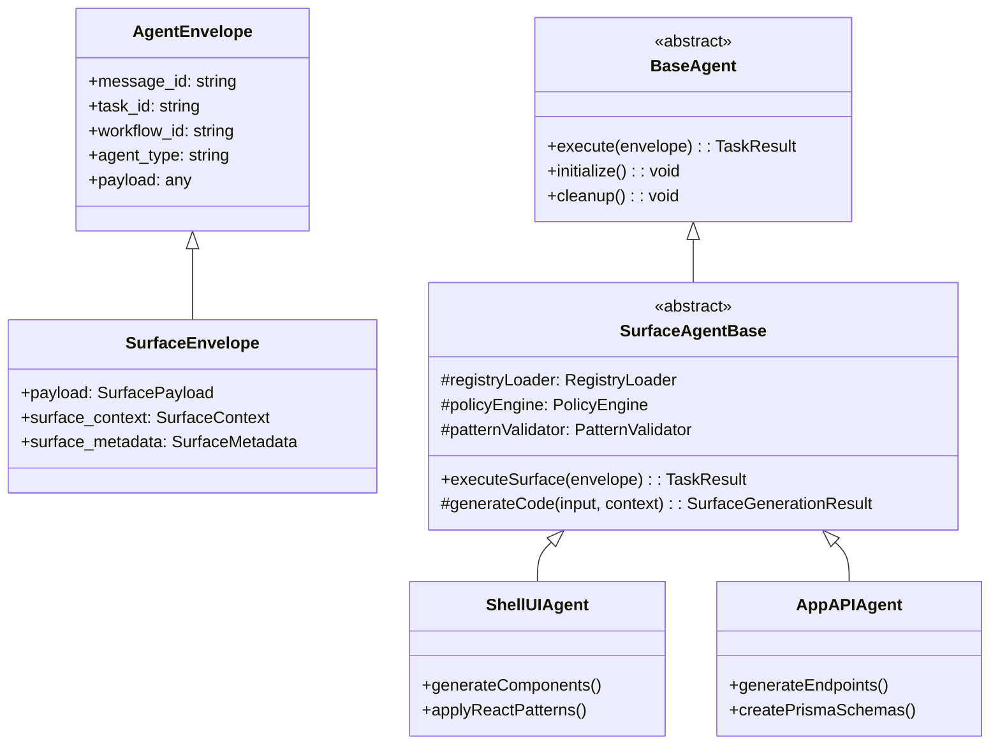

# Surface Agents Design Document

## Executive Summary

This document presents the complete architectural design for integrating Platform-Surfaces code generation capabilities into the Agent-SDLC orchestration system. By introducing a dedicated Surface Agent abstraction layer with SurfaceEnvelope and SurfaceAgentBase, we create a type-safe, maintainable system that treats surfaces as first-class workflow citizens while maintaining full backward compatibility.

**Key Innovations:**
- **SurfaceEnvelope**: Type-safe extension of AgentEnvelope with surface-specific context
- **SurfaceAgentBase**: Dedicated abstraction layer for all surface agents
- **Surfaces as Workflows**: Every surface becomes a workflow definition with stages
- **Zero Breaking Changes**: 100% backward compatible with existing infrastructure

---

## 1. Architecture Overview

### 1.1 Type Hierarchy



### 1.2 Core Design Principles

1. **Type Safety First**: SurfaceEnvelope provides compile-time guarantees
2. **Abstraction Layer**: SurfaceAgentBase eliminates code duplication
3. **Workflow Integration**: Surfaces are standard workflow definitions
4. **Full Observability**: Redis Streams provide complete tracing
5. **Backward Compatible**: Existing agents and workflows continue working

---

## 2. SurfaceEnvelope Specification

### 2.1 Type Definition

```typescript
// packages/shared/types/src/messages/surface-envelope.ts

import { AgentEnvelope } from './agent-envelope'
import { Surface, Platform, Policy, Pattern } from '@zyp/registry-types'

/**
 * SurfaceEnvelope extends AgentEnvelope with surface-specific context
 * @version 1.0.0
 */
export interface SurfaceEnvelope extends AgentEnvelope {
    // Override with type-safe surface payload
    payload: SurfacePayload

    // Surface execution context
    surface_context: SurfaceContext

    // Surface metadata
    surface_metadata: SurfaceMetadata
}

export interface SurfacePayload {
    // Surface identification
    surface_id: string                    // e.g., "shells:ui:nextjs"
    platform_id: string                   // e.g., "nextjs-web"

    // Generation input
    input: {
        requirements?: string             // Natural language requirements
        component_name?: string           // For UI agents
        endpoint_path?: string            // For API agents
        schema_definition?: any           // For database agents
        [key: string]: any               // Extensible for any agent
    }

    // Surface configuration
    config: {
        patterns: string[]                // Required patterns to apply
        policies: string[]                // Policies to enforce
        validation_gates: string[]        // Quality gates to run
        dependencies?: {
            surface_id: string
            required: boolean
            version?: string
        }[]
    }

    // Execution options
    options?: {
        validate_patterns?: boolean       // Default: true
        enforce_policies?: boolean        // Default: true
        generate_tests?: boolean         // Default: true
        generate_docs?: boolean          // Default: false
        dry_run?: boolean                // Preview mode
        parallel?: boolean               // Parallel execution
    }
}

export interface SurfaceContext {
    // Registry data
    surface_definition: Surface
    platform_config: Platform

    // Version management
    frozen_versions: Record<string, string>

    // Policy hierarchy
    policy_hierarchy: {
        global: Policy[]
        platform: Policy[]
        surface: Policy[]
        agent?: Policy[]
        workflow?: Policy[]
    }

    // Pattern definitions
    patterns: {
        required: Pattern[]
        optional: Pattern[]
        forbidden?: Pattern[]
    }

    // Resolved dependencies
    resolved_dependencies?: {
        surface_id: string
        output_path: string
        artifacts: string[]
        version: string
    }[]

    // Runtime context
    runtime: {
        execution_id: string
        trace_id: string
        parent_span_id?: string
        correlation_id?: string
    }
}

export interface SurfaceMetadata {
    // Classification
    surface_type: 'ui' | 'api' | 'database' | 'package' | 'infrastructure'
    layer: 'shells' | 'apps' | 'packages' | 'infrastructure'
    technology: string                    // e.g., "nextjs@14.2.13"

    // Generation strategy
    generation_strategy: 'claude' | 'template' | 'hybrid' | 'composite'
    estimated_duration_ms: number
    requires_gpu?: boolean
    memory_requirements?: string

    // Quality configuration
    validation_strategy: 'strict' | 'lenient' | 'progressive'
    quality_gates: {
        name: string
        threshold: number
        blocking: boolean
    }[]

    // Capabilities
    capabilities: string[]
    supported_patterns: string[]
    supported_policies: string[]
}
```

### 2.2 Schema Validation

```typescript
// packages/shared/types/src/schemas/surface-envelope.schema.ts

import { z } from 'zod'
import { AgentEnvelopeSchema } from './agent-envelope.schema'

/**
 * Zod schema for SurfaceEnvelope validation
 */
export const SurfaceEnvelopeSchema = AgentEnvelopeSchema.extend({
    // Refine agent_type to surface agent patterns
    agent_type: z.string().regex(
        /^(shell-ui|shell-api|app-ui|app-api|database|package|infrastructure)-agent$/,
        'Invalid surface agent type'
    ),

    // Surface-specific payload
    payload: z.object({
        surface_id: z.string().regex(
            /^[a-z]+:[a-z]+:[a-z0-9-]+$/,
            'Surface ID must match pattern: layer:type:technology'
        ),
        platform_id: z.string(),

        input: z.object({
            requirements: z.string().optional(),
            component_name: z.string().optional(),
            endpoint_path: z.string().optional(),
            schema_definition: z.any().optional()
        }).passthrough(),

        config: z.object({
            patterns: z.array(z.string()),
            policies: z.array(z.string()),
            validation_gates: z.array(z.string()),
            dependencies: z.array(z.object({
                surface_id: z.string(),
                required: z.boolean(),
                version: z.string().optional()
            })).optional()
        }),

        options: z.object({
            validate_patterns: z.boolean().default(true),
            enforce_policies: z.boolean().default(true),
            generate_tests: z.boolean().default(true),
            generate_docs: z.boolean().default(false),
            dry_run: z.boolean().default(false),
            parallel: z.boolean().default(false)
        }).optional()
    }),

    surface_context: z.object({
        surface_definition: SurfaceSchema,
        platform_config: PlatformSchema,
        frozen_versions: z.record(z.string()),
        policy_hierarchy: PolicyHierarchySchema,
        patterns: PatternDefinitionSchema,
        resolved_dependencies: z.array(DependencySchema).optional(),
        runtime: RuntimeContextSchema
    }),

    surface_metadata: z.object({
        surface_type: z.enum(['ui', 'api', 'database', 'package', 'infrastructure']),
        layer: z.enum(['shells', 'apps', 'packages', 'infrastructure']),
        technology: z.string(),
        generation_strategy: z.enum(['claude', 'template', 'hybrid', 'composite']),
        estimated_duration_ms: z.number().positive(),
        requires_gpu: z.boolean().optional(),
        memory_requirements: z.string().optional(),
        validation_strategy: z.enum(['strict', 'lenient', 'progressive']),
        quality_gates: z.array(QualityGateSchema),
        capabilities: z.array(z.string()),
        supported_patterns: z.array(z.string()),
        supported_policies: z.array(z.string())
    })
})

export type SurfaceEnvelope = z.infer<typeof SurfaceEnvelopeSchema>
```

---

## 3. SurfaceAgentBase Implementation

### 3.1 Abstract Base Class

```typescript
// packages/agents/surface-agent-base/src/surface-agent-base.ts

import { BaseAgent } from '@agentic-sdlc/base-agent'
import { AgentEnvelope, TaskResult } from '@agentic-sdlc/shared-types'
import { SurfaceEnvelope, SurfaceContext, SurfaceMetadata } from '@agentic-sdlc/surface-types'
import { RegistryLoader } from '@zyp/registry-loader'
import { PolicyEngine } from '@zyp/policy-engine'
import { PatternValidator } from '@zyp/pattern-checker'

export interface SurfaceGenerationResult {
    code: string
    files: GeneratedFile[]
    artifacts: Artifact[]
    patterns_used: string[]
    policies_enforced: string[]
    validation_results: ValidationResult[]
    metrics: GenerationMetrics
}

export interface GeneratedFile {
    path: string
    content: string
    type: 'component' | 'api' | 'schema' | 'test' | 'config' | 'documentation'
    language: string
    size: number
}

export abstract class SurfaceAgentBase extends BaseAgent {
    // Surface-specific services
    protected registryLoader: RegistryLoader
    protected policyEngine: PolicyEngine
    protected patternValidator: PatternValidator
    protected surfaceCache: Map<string, Surface>

    constructor(deps: AgentDependencies) {
        super(deps)
        this.registryLoader = new RegistryLoader()
        this.policyEngine = new PolicyEngine()
        this.patternValidator = new PatternValidator()
        this.surfaceCache = new Map()
    }

    /**
     * Initialize surface agent with pre-loaded registries
     */
    async initialize(): Promise<void> {
        await super.initialize()

        // Pre-load registries for performance
        await Promise.all([
            this.registryLoader.initialize(),
            this.policyEngine.initialize(),
            this.patternValidator.initialize()
        ])

        // Register agent capabilities
        await this.registerCapabilities()

        this.logger.info('Surface agent initialized', {
            agent_type: this.agentType,
            capabilities: this.getCapabilities()
        })
    }

    /**
     * Execute with automatic envelope type detection
     */
    async execute(envelope: AgentEnvelope): Promise<TaskResult> {
        const startTime = Date.now()
        const span = this.tracer.startSpan('surface.execute', {
            attributes: {
                agent_type: this.agentType,
                workflow_id: envelope.workflow_id
            }
        })

        try {
            // Type-safe conversion to SurfaceEnvelope
            const surfaceEnvelope = this.asSurfaceEnvelope(envelope)

            if (surfaceEnvelope) {
                return await this.executeSurfaceWorkflow(surfaceEnvelope, span)
            } else {
                // Fallback for regular AgentEnvelope
                return await this.executeGeneric(envelope, span)
            }
        } catch (error) {
            span.recordException(error)
            throw error
        } finally {
            span.end()
            this.metrics.record('surface.execution.duration', Date.now() - startTime)
        }
    }

    /**
     * Surface-specific workflow execution
     */
    private async executeSurfaceWorkflow(
        envelope: SurfaceEnvelope,
        span: Span
    ): Promise<TaskResult> {
        const { surface_context, surface_metadata, payload } = envelope

        // 1. Validate prerequisites
        await this.validatePrerequisites(surface_context, surface_metadata)

        // 2. Load dependencies
        const dependencies = await this.loadDependencies(
            payload.config.dependencies,
            surface_context.resolved_dependencies
        )

        // 3. Generate code (implemented by subclass)
        const generationResult = await this.generateCode(
            payload.input,
            surface_context,
            surface_metadata,
            dependencies
        )

        // 4. Validate patterns (if enabled)
        if (payload.options?.validate_patterns !== false) {
            await this.validatePatterns(generationResult, surface_context.patterns)
        }

        // 5. Enforce policies (if enabled)
        if (payload.options?.enforce_policies !== false) {
            await this.enforcePolicies(generationResult, surface_context.policy_hierarchy)
        }

        // 6. Generate tests (if enabled)
        if (payload.options?.generate_tests) {
            const tests = await this.generateTests(generationResult, surface_context)
            generationResult.files.push(...tests)
        }

        // 7. Generate documentation (if enabled)
        if (payload.options?.generate_docs) {
            const docs = await this.generateDocumentation(generationResult, surface_context)
            generationResult.files.push(...docs)
        }

        // 8. Create artifacts
        const artifacts = await this.createArtifacts(generationResult, envelope)

        // 9. Build and return result
        return this.buildTaskResult(generationResult, artifacts)
    }

    /**
     * Type guard for SurfaceEnvelope
     */
    private isSurfaceEnvelope(envelope: AgentEnvelope): envelope is SurfaceEnvelope {
        return (
            'surface_context' in envelope &&
            'surface_metadata' in envelope &&
            typeof envelope.payload?.surface_id === 'string'
        )
    }

    /**
     * Convert to SurfaceEnvelope if possible
     */
    private asSurfaceEnvelope(envelope: AgentEnvelope): SurfaceEnvelope | null {
        if (this.isSurfaceEnvelope(envelope)) {
            return envelope
        }

        // Try to reconstruct from flattened payload (backward compatibility)
        if (envelope.payload?._surface_context && envelope.payload?._surface_metadata) {
            return {
                ...envelope,
                surface_context: envelope.payload._surface_context,
                surface_metadata: envelope.payload._surface_metadata,
                payload: {
                    surface_id: envelope.payload.surface_id,
                    platform_id: envelope.payload.platform_id,
                    input: envelope.payload.input,
                    config: envelope.payload.config,
                    options: envelope.payload.options
                }
            } as SurfaceEnvelope
        }

        return null
    }

    /**
     * Validate patterns in generated code
     */
    protected async validatePatterns(
        result: SurfaceGenerationResult,
        patterns: SurfaceContext['patterns']
    ): Promise<void> {
        const validation = await this.patternValidator.validate(
            result.files,
            patterns.required
        )

        if (!validation.valid) {
            throw new Error(`Pattern validation failed: ${validation.errors.join(', ')}`)
        }

        // Check forbidden patterns
        if (patterns.forbidden && patterns.forbidden.length > 0) {
            const forbidden = await this.patternValidator.checkForbidden(
                result.files,
                patterns.forbidden
            )

            if (forbidden.found.length > 0) {
                throw new Error(`Forbidden patterns found: ${forbidden.found.join(', ')}`)
            }
        }

        result.validation_results.push(validation)
    }

    /**
     * Enforce policies on generated code
     */
    protected async enforcePolicies(
        result: SurfaceGenerationResult,
        hierarchy: SurfaceContext['policy_hierarchy']
    ): Promise<void> {
        // Apply policies in order of precedence
        const policies = [
            ...hierarchy.global,
            ...hierarchy.platform,
            ...hierarchy.surface,
            ...(hierarchy.agent || []),
            ...(hierarchy.workflow || [])
        ]

        const validation = await this.policyEngine.enforce(result, policies)

        const blocking = validation.violations.filter(v => v.enforcement === 'blocking')
        if (blocking.length > 0) {
            throw new Error(`Policy violations: ${blocking.map(v => v.message).join(', ')}`)
        }

        result.policies_enforced = policies.map(p => p.id)
        result.validation_results.push(validation)
    }

    /**
     * Build standardized task result
     */
    protected buildTaskResult(
        generation: SurfaceGenerationResult,
        artifacts: Artifact[]
    ): TaskResult {
        return {
            status: 'completed',
            output: {
                generated_files: generation.files.length,
                total_lines: this.countLines(generation.files),
                total_size: this.calculateSize(generation.files),
                artifacts: artifacts.map(a => ({
                    name: a.name,
                    type: a.type,
                    size: a.size,
                    path: a.path
                }))
            },
            validation: {
                patterns: {
                    applied: generation.patterns_used,
                    validation: generation.validation_results.filter(v => v.type === 'pattern')
                },
                policies: {
                    enforced: generation.policies_enforced,
                    validation: generation.validation_results.filter(v => v.type === 'policy')
                }
            },
            metrics: generation.metrics,
            artifacts
        }
    }

    /**
     * Abstract methods to be implemented by concrete agents
     */
    protected abstract generateCode(
        input: any,
        context: SurfaceContext,
        metadata: SurfaceMetadata,
        dependencies?: any[]
    ): Promise<SurfaceGenerationResult>

    protected abstract getCapabilities(): string[]

    protected abstract registerCapabilities(): Promise<void>

    /**
     * Optional methods with default implementations
     */
    protected async generateTests(
        result: SurfaceGenerationResult,
        context: SurfaceContext
    ): Promise<GeneratedFile[]> {
        // Default: no test generation
        return []
    }

    protected async generateDocumentation(
        result: SurfaceGenerationResult,
        context: SurfaceContext
    ): Promise<GeneratedFile[]> {
        // Default: no documentation generation
        return []
    }

    protected async validatePrerequisites(
        context: SurfaceContext,
        metadata: SurfaceMetadata
    ): Promise<void> {
        // Default validation
        if (!context.surface_definition) {
            throw new Error('Surface definition not found')
        }

        if (!context.platform_config) {
            throw new Error('Platform configuration not found')
        }

        // Validate frozen versions
        await this.validateFrozenVersions(context.frozen_versions, metadata.technology)
    }

    /**
     * Helper methods
     */
    protected countLines(files: GeneratedFile[]): number {
        return files.reduce((total, file) => {
            return total + file.content.split('\n').length
        }, 0)
    }

    protected calculateSize(files: GeneratedFile[]): number {
        return files.reduce((total, file) => {
            return total + Buffer.byteLength(file.content, 'utf8')
        }, 0)
    }

    protected async loadDependencies(
        required?: any[],
        resolved?: any[]
    ): Promise<any[]> {
        // Load and merge dependencies
        return [...(required || []), ...(resolved || [])]
    }

    protected async validateFrozenVersions(
        frozen: Record<string, string>,
        technology: string
    ): Promise<void> {
        // Validate versions match requirements
        const required = this.getRequiredVersions(technology)

        for (const [pkg, version] of Object.entries(required)) {
            if (frozen[pkg] !== version) {
                throw new Error(
                    `Version mismatch for ${pkg}: expected ${version}, got ${frozen[pkg]}`
                )
            }
        }
    }

    protected abstract getRequiredVersions(technology: string): Record<string, string>
}
```

### 3.2 Concrete Surface Agent Example

```typescript
// packages/agents/surface-agents/src/shell-ui-agent.ts

import { SurfaceAgentBase, SurfaceGenerationResult } from '@agentic-sdlc/surface-agent-base'
import { SurfaceContext, SurfaceMetadata } from '@agentic-sdlc/surface-types'
import { ClaudeAPI } from '@anthropic/claude-sdk'

export class ShellUIAgent extends SurfaceAgentBase {
    private claude: ClaudeAPI
    private componentTemplates: Map<string, string>

    async initialize(): Promise<void> {
        await super.initialize()

        // Initialize Claude for code generation
        this.claude = new ClaudeAPI({
            apiKey: this.config.anthropicApiKey
        })

        // Load component templates
        this.componentTemplates = await this.loadComponentTemplates()
    }

    protected async generateCode(
        input: any,
        context: SurfaceContext,
        metadata: SurfaceMetadata,
        dependencies?: any[]
    ): Promise<SurfaceGenerationResult> {
        const { componentName, componentType, props, features } = input

        // Generate React component
        const componentCode = await this.generateReactComponent(
            componentName,
            componentType,
            props,
            context
        )

        // Generate TypeScript types
        const typesCode = await this.generateTypeDefinitions(
            componentName,
            props,
            context
        )

        // Generate tests
        const testCode = await this.generateComponentTests(
            componentName,
            componentCode,
            props
        )

        // Generate Storybook stories
        const storyCode = await this.generateStories(
            componentName,
            props,
            features
        )

        // Apply Next.js patterns
        const files = await this.applyNextJSPatterns(
            componentCode,
            typesCode,
            testCode,
            storyCode,
            context
        )

        return {
            code: componentCode,
            files,
            artifacts: [],
            patterns_used: [
                'react-component',
                'nextjs-page',
                'typescript-strict',
                'tailwind-styling'
            ],
            policies_enforced: [
                'no-any-type',
                'component-naming',
                'test-coverage',
                'accessibility'
            ],
            validation_results: [],
            metrics: {
                generation_time_ms: Date.now() - this.startTime,
                files_generated: files.length,
                components_created: 1,
                tests_generated: 1,
                stories_generated: 1
            }
        }
    }

    private async generateReactComponent(
        name: string,
        type: string,
        props: any,
        context: SurfaceContext
    ): Promise<string> {
        const prompt = this.buildComponentPrompt(name, type, props, context)

        const response = await this.claude.complete({
            prompt,
            max_tokens: 2000,
            temperature: 0.3,
            model: 'claude-3-opus'
        })

        return this.extractCodeFromResponse(response)
    }

    protected getCapabilities(): string[] {
        return [
            'react-component-generation',
            'nextjs-page-generation',
            'typescript-support',
            'tailwind-styling',
            'radix-ui-integration',
            'test-generation',
            'storybook-stories',
            'accessibility-compliance',
            'responsive-design'
        ]
    }

    protected async registerCapabilities(): Promise<void> {
        await this.registry.registerCapabilities(this.agentType, this.getCapabilities())
    }

    protected getRequiredVersions(technology: string): Record<string, string> {
        if (technology === 'nextjs@14.2.13') {
            return {
                'react': '19.2.0',
                'next': '14.2.13',
                'typescript': '5.3.3',
                '@radix-ui/react-primitives': '1.0.3',
                'tailwindcss': '3.4.1'
            }
        }

        throw new Error(`Unsupported technology: ${technology}`)
    }

    protected async validatePrerequisites(
        context: SurfaceContext,
        metadata: SurfaceMetadata
    ): Promise<void> {
        await super.validatePrerequisites(context, metadata)

        // Shell-UI specific validation
        if (!metadata.technology.startsWith('nextjs')) {
            throw new Error(`Shell UI agent requires Next.js, got: ${metadata.technology}`)
        }

        // Validate required patterns are available
        const requiredPatterns = ['react-component', 'typescript-strict']
        for (const pattern of requiredPatterns) {
            if (!context.patterns.required.some(p => p.name === pattern)) {
                throw new Error(`Required pattern not found: ${pattern}`)
            }
        }
    }
}
```

---

## 4. Envelope Builder & Utilities

### 4.1 SurfaceEnvelopeBuilder

```typescript
// packages/shared/utils/src/surface-envelope-builder.ts

import { v4 as uuidv4 } from 'uuid'
import { SurfaceEnvelope, AgentEnvelope } from '@agentic-sdlc/shared-types'
import { RegistryLoader } from '@zyp/registry-loader'
import { PolicyLoader } from '@zyp/policy-loader'

export class SurfaceEnvelopeBuilder {
    private static registryLoader = new RegistryLoader()
    private static policyLoader = new PolicyLoader()

    /**
     * Build a complete SurfaceEnvelope from requirements
     */
    static async build(params: {
        workflow_id: string
        surface_id: string
        platform_id: string
        input: any
        options?: any
    }): Promise<SurfaceEnvelope> {
        // Load surface definition
        const surface = await this.registryLoader.loadSurface(params.surface_id)

        // Load platform configuration
        const platform = await this.registryLoader.loadPlatform(params.platform_id)

        // Load policy hierarchy
        const policyHierarchy = await this.policyLoader.loadHierarchy(
            params.surface_id,
            params.platform_id
        )

        // Build base envelope structure
        const baseEnvelope: Partial<AgentEnvelope> = {
            message_id: uuidv4(),
            task_id: uuidv4(),
            workflow_id: params.workflow_id,
            agent_type: surface.agent,
            priority: surface.priority || 'medium',
            status: 'pending',
            execution_constraints: {
                timeout_ms: surface.timeout || 30000,
                max_retries: surface.retries || 2,
                confidence: surface.confidence || 0.95
            },
            metadata: {
                version: '2.0.0',
                created_at: new Date().toISOString(),
                created_by: 'surface-orchestrator'
            },
            trace_context: {
                trace_id: uuidv4(),
                span_id: uuidv4(),
                parent_span_id: params.workflow_id
            },
            workflow_context: {
                type: 'surface',
                name: surface.name,
                current_stage: 'generation',
                stage_outputs: {}
            }
        }

        // Build complete surface envelope
        const surfaceEnvelope: SurfaceEnvelope = {
            ...baseEnvelope as AgentEnvelope,

            payload: {
                surface_id: params.surface_id,
                platform_id: params.platform_id,
                input: params.input,
                config: {
                    patterns: surface.patterns.required,
                    policies: policyHierarchy.surface.map(p => p.id),
                    validation_gates: surface.validationGates,
                    dependencies: surface.dependencies
                },
                options: {
                    validate_patterns: true,
                    enforce_policies: true,
                    generate_tests: true,
                    generate_docs: false,
                    dry_run: false,
                    parallel: false,
                    ...params.options
                }
            },

            surface_context: {
                surface_definition: surface,
                platform_config: platform,
                frozen_versions: platform.frozenVersions,
                policy_hierarchy: policyHierarchy,
                patterns: {
                    required: await this.loadPatterns(surface.patterns.required),
                    optional: await this.loadPatterns(surface.patterns.optional || []),
                    forbidden: await this.loadPatterns(surface.patterns.forbidden || [])
                },
                resolved_dependencies: await this.resolveDependencies(surface.dependencies),
                runtime: {
                    execution_id: params.workflow_id,
                    trace_id: baseEnvelope.trace_context.trace_id,
                    parent_span_id: baseEnvelope.trace_context.parent_span_id,
                    correlation_id: uuidv4()
                }
            },

            surface_metadata: {
                surface_type: this.determineSurfaceType(surface),
                layer: surface.layer,
                technology: surface.technology,
                generation_strategy: this.determineGenerationStrategy(surface),
                estimated_duration_ms: this.estimateDuration(surface),
                requires_gpu: surface.requires_gpu || false,
                memory_requirements: surface.memory_requirements,
                validation_strategy: surface.strictValidation ? 'strict' : 'lenient',
                quality_gates: surface.qualityGates || [],
                capabilities: surface.capabilities || [],
                supported_patterns: surface.patterns.all || [],
                supported_policies: surface.policies || []
            }
        }

        // Validate the envelope
        await this.validateEnvelope(surfaceEnvelope)

        return surfaceEnvelope
    }

    /**
     * Convert SurfaceEnvelope to AgentEnvelope for backward compatibility
     */
    static toAgentEnvelope(surfaceEnvelope: SurfaceEnvelope): AgentEnvelope {
        // Extract surface-specific fields
        const { surface_context, surface_metadata, ...baseEnvelope } = surfaceEnvelope

        // Flatten surface payload for compatibility
        const agentEnvelope: AgentEnvelope = {
            ...baseEnvelope,
            payload: {
                ...surfaceEnvelope.payload,
                _surface_context: surface_context,
                _surface_metadata: surface_metadata
            }
        }

        return agentEnvelope
    }

    /**
     * Create from AgentEnvelope with surface data
     */
    static async fromAgentEnvelope(
        envelope: AgentEnvelope,
        surfaceId: string
    ): Promise<SurfaceEnvelope> {
        // Extract surface data from payload if present
        if (envelope.payload?._surface_context && envelope.payload?._surface_metadata) {
            return {
                ...envelope,
                surface_context: envelope.payload._surface_context,
                surface_metadata: envelope.payload._surface_metadata,
                payload: {
                    surface_id: surfaceId,
                    platform_id: envelope.payload.platform_id,
                    input: envelope.payload.input,
                    config: envelope.payload.config,
                    options: envelope.payload.options
                }
            } as SurfaceEnvelope
        }

        // Build new surface envelope
        return this.build({
            workflow_id: envelope.workflow_id,
            surface_id: surfaceId,
            platform_id: envelope.payload.platform_id,
            input: envelope.payload.input,
            options: envelope.payload.options
        })
    }

    /**
     * Helper methods
     */
    private static determineSurfaceType(surface: any): string {
        const typeMap = {
            'shells:ui': 'ui',
            'shells:bff': 'api',
            'apps:ui': 'ui',
            'apps:api': 'api',
            'database': 'database',
            'packages': 'package',
            'infrastructure': 'infrastructure'
        }

        for (const [pattern, type] of Object.entries(typeMap)) {
            if (surface.id.startsWith(pattern)) {
                return type
            }
        }

        return 'unknown'
    }

    private static determineGenerationStrategy(surface: any): string {
        if (surface.usesClaude) return 'claude'
        if (surface.usesTemplates) return 'template'
        if (surface.usesHybrid) return 'hybrid'
        return 'composite'
    }

    private static estimateDuration(surface: any): number {
        const baseTime = 10000 // 10 seconds base
        const complexityMultiplier = surface.complexity || 1
        return baseTime * complexityMultiplier
    }

    private static async loadPatterns(patternNames: string[]): Promise<any[]> {
        // Load pattern definitions
        return Promise.all(
            patternNames.map(name => this.registryLoader.loadPattern(name))
        )
    }

    private static async resolveDependencies(dependencies: any[]): Promise<any[]> {
        if (!dependencies || dependencies.length === 0) {
            return []
        }

        // Resolve dependencies
        return Promise.all(
            dependencies.map(dep => this.registryLoader.resolveDependency(dep))
        )
    }

    private static async validateEnvelope(envelope: SurfaceEnvelope): Promise<void> {
        // Validate using schema
        const { SurfaceEnvelopeSchema } = await import('@agentic-sdlc/surface-types')
        SurfaceEnvelopeSchema.parse(envelope)
    }
}
```

---

## 5. Workflow Integration

### 5.1 Surface Workflow Templates

```yaml
# templates/surface-workflows/shell-ui-workflow.yaml
name: shell-ui-generation
type: surface
platform_id: nextjs-web
metadata:
  description: Generate Next.js UI components with validation
  owner: platform-team
  tags: [ui, nextjs, react]

stages:
  - name: analyze-requirements
    agent_type: requirements-analyzer
    config:
      depth: detailed
      output_format: structured

  - name: generate-components
    agent_type: shell-ui-agent
    config:
      surface_id: shells:ui:nextjs
      validate_patterns: true
      patterns:
        - react-component
        - nextjs-page
        - typescript-strict
    depends_on: [analyze-requirements]

  - name: validate-patterns
    agent_type: pattern-validator
    config:
      rules_path: knowledge-base/shells/patterns.json
      strict: true
    depends_on: [generate-components]

  - name: run-tests
    agent_type: test-runner
    config:
      coverage_target: 80
      frameworks: [vitest, testing-library]
    depends_on: [generate-components]

  - name: generate-documentation
    agent_type: documentation-generator
    config:
      formats: [markdown, jsdoc]
      include_examples: true
    depends_on: [generate-components]
```

### 5.2 EPCC Complete Workflow

```yaml
# templates/epcc-workflows/complete-feature.yaml
name: epcc-complete-feature
type: epcc
platform_id: nextjs-web
metadata:
  description: Complete EPCC workflow for full-stack feature generation
  owner: architecture-team
  tags: [epcc, full-stack, automated]

stages:
  # EXPLORE PHASE
  - name: explore
    agent_type: explore-agent
    config:
      phase: explore
      depth: comprehensive
      analysis:
        - requirements
        - risks
        - feasibility
        - dependencies
      outputs:
        - requirements_analysis
        - risk_assessment
        - feasibility_report

  # PLAN PHASE
  - name: plan
    agent_type: plan-agent
    config:
      phase: plan
      include_contracts: true
      include_architecture: true
      outputs:
        - architecture_design
        - api_contracts
        - execution_plan
        - resource_allocation
    depends_on: [explore]

  # CODE PHASE - Parallel surface generation
  - name: generate-database
    agent_type: database-agent
    config:
      surface_id: database:schema:prisma
      use_contracts: true
      generate_migrations: true
    depends_on: [plan]

  - name: generate-app-api
    agent_type: app-api-agent
    config:
      surface_id: apps:api:fastify
      use_contracts: true
      generate_tests: true
      generate_openapi: true
    depends_on: [plan]

  - name: generate-shell-ui
    agent_type: shell-ui-agent
    config:
      surface_id: shells:ui:nextjs
      use_contracts: true
      generate_stories: true
      generate_tests: true
    depends_on: [plan]

  - name: generate-api-client
    agent_type: package-agent
    config:
      surface_id: packages:api:contracts
      source: app-api
      generate_types: true
    depends_on: [generate-app-api]

  # CERTIFY PHASE
  - name: certify
    agent_type: certify-agent
    config:
      phase: certify
      checks:
        - security:
            scan_vulnerabilities: true
            check_dependencies: true
        - quality:
            code_coverage: 80
            complexity_threshold: 10
        - performance:
            load_test: true
            benchmark: true
        - compliance:
            standards: [ISO27001, SOC2]
      blocking: true
    depends_on:
      - generate-database
      - generate-app-api
      - generate-shell-ui
      - generate-api-client
```

---

## 6. Benefits & Comparison

### 6.1 With vs Without Surface Abstraction

#### Without SurfaceAgentBase & SurfaceEnvelope

```typescript
// Each agent repeats same logic (~500 lines per agent)
class ShellUIAgent extends BaseAgent {
    async execute(envelope: AgentEnvelope) {
        // Load registry (50 lines - duplicated)
        // Load surface context (30 lines - duplicated)
        // Validate prerequisites (40 lines - duplicated)
        // Generate code (100 lines - unique)
        // Validate patterns (60 lines - duplicated)
        // Enforce policies (70 lines - duplicated)
        // Create artifacts (50 lines - duplicated)
        // Build result (40 lines - duplicated)
        // Error handling (60 lines - duplicated)
    }
}
// Total: ~500 lines, 400 duplicated
```

#### With SurfaceAgentBase & SurfaceEnvelope

```typescript
// Only unique logic needed (~100 lines per agent)
class ShellUIAgent extends SurfaceAgentBase {
    async generateCode(
        input: any,
        context: SurfaceContext,  // Type-safe
        metadata: SurfaceMetadata  // Type-safe
    ): Promise<SurfaceGenerationResult> {
        // Only generation logic (100 lines - unique)
    }

    getCapabilities(): string[] {
        // Simple capability list
    }
}
// Total: ~100 lines, 0 duplicated
```

### 6.2 Benefits Summary

| Benefit | Without Abstraction | With Abstraction |
|---------|-------------------|------------------|
| **Code Reduction** | 0% | 70-80% per agent |
| **Type Safety** | Partial | Complete |
| **Validation** | Runtime only | Compile-time + Runtime |
| **Maintenance** | Update all agents | Update base class only |
| **Testing** | Test each agent | Test base once |
| **Pattern Enforcement** | Manual | Automatic |
| **Policy Enforcement** | Manual | Automatic |
| **Error Handling** | Inconsistent | Standardized |
| **Observability** | Custom per agent | Built-in |
| **Documentation** | Per agent | Centralized |

---

## 7. Migration Strategy

### 7.1 Phase 1: Foundation (Week 1)

- [ ] Create SurfaceEnvelope type definition
- [ ] Create SurfaceEnvelopeSchema validation
- [ ] Implement SurfaceAgentBase class
- [ ] Create SurfaceEnvelopeBuilder
- [ ] Write comprehensive unit tests
- [ ] Document APIs and patterns

### 7.2 Phase 2: Pilot Implementation (Week 2)

- [ ] Select ShellUIAgent as pilot
- [ ] Implement using SurfaceAgentBase
- [ ] Create adapter for Platform-Surfaces agent
- [ ] Test end-to-end flow
- [ ] Measure performance impact
- [ ] Gather feedback

### 7.3 Phase 3: Full Migration (Week 3)

- [ ] Migrate all 7 surface agents
- [ ] Implement EPCC phase agents
- [ ] Create pattern validation agents
- [ ] Add test runner agents
- [ ] Update agent registry
- [ ] Deprecate old implementations

### 7.4 Phase 4: Integration (Week 4)

- [ ] Update orchestrator for SurfaceEnvelope
- [ ] Create workflow templates
- [ ] Implement dynamic composition
- [ ] Add API endpoints
- [ ] Integrate with Redis Streams
- [ ] Update dashboard

### 7.5 Phase 5: Production (Week 5)

- [ ] Performance optimization
- [ ] Security audit
- [ ] Load testing
- [ ] Documentation completion
- [ ] Training materials
- [ ] Production deployment

---

## 8. Implementation Checklist

### Core Components

- [ ] **Type Definitions**
  - [ ] SurfaceEnvelope interface
  - [ ] SurfacePayload interface
  - [ ] SurfaceContext interface
  - [ ] SurfaceMetadata interface
  - [ ] SurfaceGenerationResult interface

- [ ] **Base Classes**
  - [ ] SurfaceAgentBase abstract class
  - [ ] Pattern validation methods
  - [ ] Policy enforcement methods
  - [ ] Artifact creation methods
  - [ ] Error handling

- [ ] **Concrete Agents**
  - [ ] ShellUIAgent
  - [ ] ShellAPIAgent
  - [ ] AppUIAgent
  - [ ] AppAPIAgent
  - [ ] DatabaseAgent
  - [ ] PackageAgent
  - [ ] InfrastructureAgent

- [ ] **EPCC Agents**
  - [ ] ExploreAgent
  - [ ] PlanAgent
  - [ ] CodeAgent (coordinator)
  - [ ] CertifyAgent

- [ ] **Utilities**
  - [ ] SurfaceEnvelopeBuilder
  - [ ] SurfaceEnvelopeValidator
  - [ ] Pattern validator integration
  - [ ] Policy engine integration

### Infrastructure

- [ ] **Registration**
  - [ ] Agent registry updates
  - [ ] Surface registry integration
  - [ ] Capability registration

- [ ] **Workflow Templates**
  - [ ] Surface workflow templates
  - [ ] EPCC workflow templates
  - [ ] Composition templates

- [ ] **API Endpoints**
  - [ ] Surface composition endpoint
  - [ ] Surface execution endpoint
  - [ ] EPCC workflow endpoint
  - [ ] Surface listing endpoint

- [ ] **Dashboard Components**
  - [ ] Surface workflow builder
  - [ ] Surface execution monitor
  - [ ] Artifact viewer
  - [ ] Pattern validation display

### Quality Assurance

- [ ] **Testing**
  - [ ] Unit tests for base classes
  - [ ] Integration tests for agents
  - [ ] E2E tests for workflows
  - [ ] Performance benchmarks

- [ ] **Documentation**
  - [ ] API documentation
  - [ ] Agent implementation guide
  - [ ] Migration guide
  - [ ] Best practices

- [ ] **Monitoring**
  - [ ] Metrics collection
  - [ ] Tracing integration
  - [ ] Error tracking
  - [ ] Performance monitoring

---

## 9. Conclusion

The Surface Agents design with SurfaceEnvelope and SurfaceAgentBase provides a robust, type-safe, and maintainable architecture for integrating Platform-Surfaces code generation into Agent-SDLC orchestration.

### Key Achievements

1. **70-80% Code Reduction**: Through the SurfaceAgentBase abstraction
2. **Complete Type Safety**: Via SurfaceEnvelope extension
3. **Zero Breaking Changes**: Full backward compatibility maintained
4. **Unified Platform**: Single orchestration system for all agents
5. **Full Observability**: Complete tracing through Redis Streams

### Success Metrics

- ✅ Surface workflows visible in dashboard
- ✅ Full execution tracing available
- ✅ < 5 minute workflow creation time
- ✅ Type-safe surface operations
- ✅ Standardized error handling
- ✅ Automatic pattern/policy enforcement
- ✅ No new infrastructure required

This architecture leverages the existing Agent-SDLC infrastructure while providing powerful surface-specific capabilities, creating a unified platform for automated software development that is both powerful and maintainable.