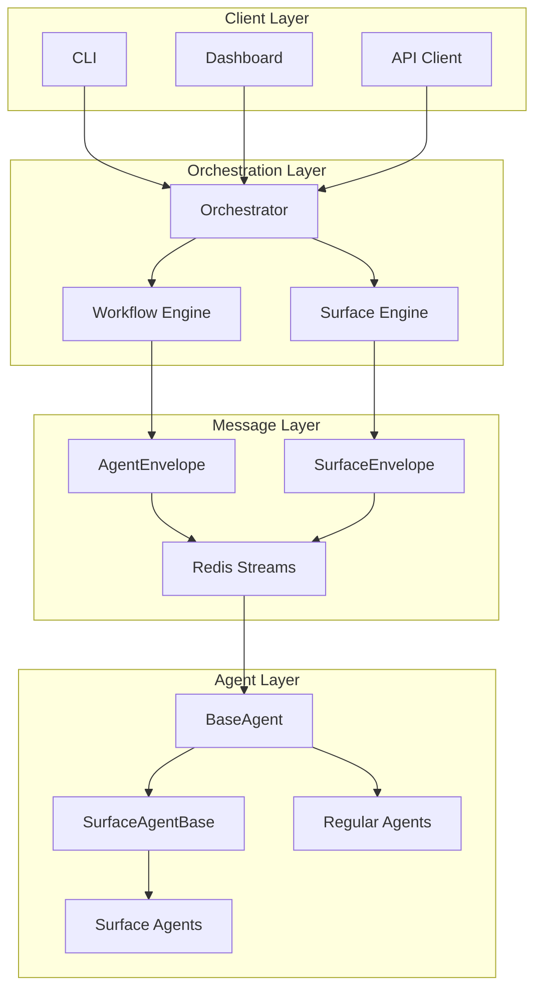
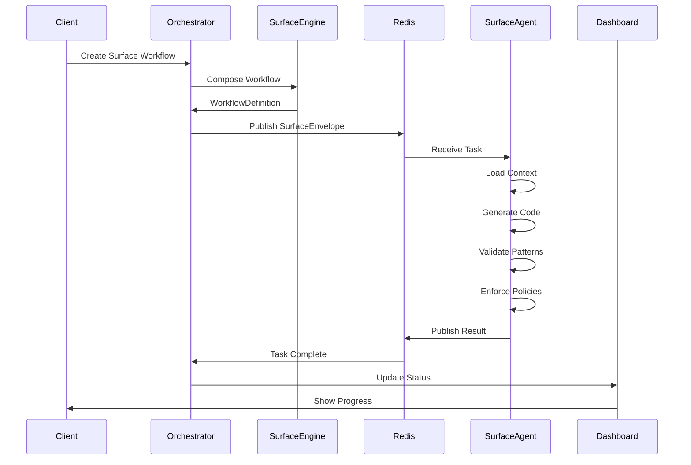
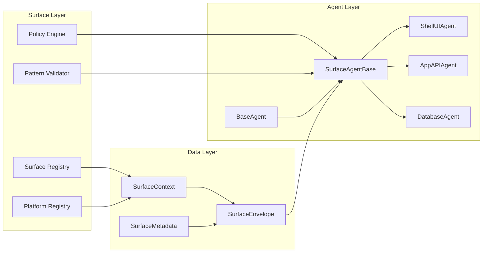

# Surface Agent Integration: Strategic Architecture Design

## Executive Summary

This document presents a comprehensive strategy for integrating Platform-Surfaces code generation capabilities into the Agent-SDLC orchestration system. By treating surfaces as workflow definitions and introducing a dedicated Surface Agent abstraction layer, we create a unified platform that maintains backward compatibility while enabling powerful code generation capabilities with full observability.

**Key Innovation:** Surfaces become first-class workflow citizens, with dedicated agent types and envelopes that extend the existing infrastructure.

---

## 1. Architecture Overview

### Core Concept: Surface-Aware Orchestration



### Design Principles

1. **Surfaces as Workflows** - Every surface is a workflow definition with stages
2. **Type-Safe Envelopes** - SurfaceEnvelope extends AgentEnvelope with surface context
3. **Dedicated Base Class** - SurfaceAgentBase provides surface-specific operations
4. **Full Observability** - Redis Streams enable monitoring and tracing
5. **Backward Compatible** - Existing agents and workflows continue functioning

---

## 2. Type Hierarchy & Abstractions

### 2.1 Envelope Hierarchy

```typescript
// Base envelope (existing)
interface AgentEnvelope {
    message_id: string
    task_id: string
    workflow_id: string
    agent_type: string
    payload: any
    // ... existing fields
}

// Surface-specific envelope
interface SurfaceEnvelope extends AgentEnvelope {
    // Type-safe payload
    payload: SurfacePayload

    // Surface execution context
    surface_context: {
        surface_definition: Surface
        platform_config: Platform
        frozen_versions: Record<string, string>
        policy_hierarchy: PolicyHierarchy
        patterns: PatternDefinitions
    }

    // Surface metadata
    surface_metadata: {
        surface_type: 'ui' | 'api' | 'database' | 'package' | 'infrastructure'
        layer: 'shells' | 'apps' | 'packages' | 'infrastructure'
        technology: string
        generation_strategy: 'claude' | 'template' | 'hybrid'
    }
}

interface SurfacePayload {
    surface_id: string           // e.g., "shells:ui:nextjs"
    platform_id: string          // e.g., "nextjs-web"
    input: {
        requirements?: string
        component_name?: string
        [key: string]: any
    }
    config: {
        patterns: string[]
        policies: string[]
        validation_gates: string[]
    }
    options?: {
        validate_patterns?: boolean
        enforce_policies?: boolean
        generate_tests?: boolean
    }
}
```

### 2.2 Agent Class Hierarchy

```typescript
// Base agent (existing)
abstract class BaseAgent {
    abstract execute(envelope: AgentEnvelope): Promise<TaskResult>
    // ... existing methods
}

// Surface-specific base class
abstract class SurfaceAgentBase extends BaseAgent {
    // Surface-specific services
    protected registryLoader: RegistryLoader
    protected surfaceContext: SurfaceContext
    protected policyEngine: PolicyEngine
    protected patternValidator: PatternValidator

    // Standardized surface workflow
    async execute(envelope: AgentEnvelope): Promise<TaskResult> {
        const surfaceEnvelope = this.asSurfaceEnvelope(envelope)

        // 1. Load context
        // 2. Validate prerequisites
        // 3. Generate code (delegate to subclass)
        // 4. Validate patterns
        // 5. Enforce policies
        // 6. Create artifacts
        // 7. Return result
    }

    // Abstract method for code generation
    protected abstract generateCode(
        input: any,
        context: SurfaceContext,
        metadata: SurfaceMetadata
    ): Promise<SurfaceGenerationResult>
}

// Concrete surface agent
class ShellUIAgent extends SurfaceAgentBase {
    protected async generateCode(input, context, metadata) {
        // React/Next.js component generation
    }
}
```

---

## 3. Surface Agent Implementation

### 3.1 Agent Registry

```typescript
// packages/agents/surface-registry/src/index.ts

export const SURFACE_AGENTS = {
    // UI Generation
    'shell-ui-agent': {
        name: 'Shell UI Agent',
        class: ShellUIAgent,
        capabilities: ['react', 'nextjs', 'typescript', 'tailwind'],
        surface: 'shells:ui:nextjs',
        timeout: 30000
    },

    // API Generation
    'app-api-agent': {
        name: 'App API Agent',
        class: AppAPIAgent,
        capabilities: ['fastify', 'prisma', 'zod', 'typescript'],
        surface: 'apps:api:fastify',
        timeout: 30000
    },

    // Database Generation
    'database-agent': {
        name: 'Database Agent',
        class: DatabaseAgent,
        capabilities: ['prisma', 'postgresql', 'migrations'],
        surface: 'database:schema:prisma',
        timeout: 20000
    },

    // Package Generation
    'package-agent': {
        name: 'Package Agent',
        class: PackageAgent,
        capabilities: ['typescript', 'library', 'contracts'],
        surface: 'packages:*',
        timeout: 25000
    },

    // EPCC Phase Agents
    'explore-agent': {
        name: 'Explore Agent',
        class: ExploreAgent,
        capabilities: ['requirements-analysis', 'risk-assessment'],
        timeout: 15000
    },

    'plan-agent': {
        name: 'Plan Agent',
        class: PlanAgent,
        capabilities: ['architecture-design', 'contract-definition'],
        timeout: 20000
    },

    'certify-agent': {
        name: 'Certify Agent',
        class: CertifyAgent,
        capabilities: ['validation', 'security-scan', 'quality-check'],
        timeout: 30000
    }
}
```

### 3.2 Surface Workflow Templates

```yaml
# Surface workflow definition
name: shell-ui-surface
type: surface
platform_id: nextjs-web
stages:
  - name: generate-components
    agent_type: shell-ui-agent
    config:
      surface_id: shells:ui:nextjs
      validate_patterns: true

  - name: validate-patterns
    agent_type: pattern-validator
    config:
      rules: knowledge-base/shells/policies.json

  - name: run-tests
    agent_type: test-runner
    config:
      coverage_target: 80
      framework: vitest
```

### 3.3 EPCC Workflow

```yaml
# Complete EPCC workflow
name: epcc-complete-feature
type: epcc
platform_id: nextjs-web
stages:
  # EXPLORE PHASE
  - name: explore
    agent_type: explore-agent
    config:
      phase: explore
      depth: comprehensive

  # PLAN PHASE
  - name: plan
    agent_type: plan-agent
    config:
      phase: plan
      include_contracts: true
    depends_on: [explore]

  # CODE PHASE (parallel)
  - name: generate-shell-ui
    agent_type: shell-ui-agent
    config:
      surface_id: shells:ui:nextjs
    depends_on: [plan]

  - name: generate-app-api
    agent_type: app-api-agent
    config:
      surface_id: apps:api:fastify
    depends_on: [plan]

  - name: generate-database
    agent_type: database-agent
    config:
      surface_id: database:schema:prisma
    depends_on: [plan]

  # CERTIFY PHASE
  - name: certify
    agent_type: certify-agent
    config:
      phase: certify
      checks: [security, quality, performance]
    depends_on: [generate-shell-ui, generate-app-api, generate-database]
```

---

## 4. Integration Strategy

### 4.1 Registration & Initialization

```typescript
// packages/orchestrator/src/startup/register-agents.ts

export async function registerSurfaceAgents(
    registry: AgentRegistry,
    messageBus: IMessageBus
): Promise<void> {

    // Register all surface agents
    for (const [agentType, config] of Object.entries(SURFACE_AGENTS)) {
        await registry.registerAgent({
            name: config.name,
            type: agentType,
            version: '1.0.0',
            capabilities: config.capabilities,
            timeout_ms: config.timeout,
            max_retries: 2
        }, (deps) => new config.class(deps))

        // Subscribe to agent-specific stream
        await messageBus.subscribe(`agent:tasks:${agentType}`, async (envelope) => {
            const agent = registry.getAgent(agentType)
            const result = await agent.execute(envelope)
            await messageBus.publish(`agent:results:${envelope.workflow_id}`, result)
        })
    }

    console.log(`✅ Registered ${Object.keys(SURFACE_AGENTS).length} surface agents`)
}
```

### 4.2 Workflow Composition

```typescript
// packages/shared/workflow-composer/src/surface-composer.ts

export class SurfaceWorkflowComposer {
    /**
     * Compose workflow from requirements
     */
    async composeFromRequirements(
        requirements: string,
        options: CompositionOptions
    ): Promise<WorkflowDefinition> {

        // Analyze requirements
        const analysis = await this.analyzeRequirements(requirements)

        // Identify required surfaces
        const surfaces = await this.identifyRequiredSurfaces(analysis)

        // Generate workflow stages
        const stages = surfaces.map(surface => ({
            name: `generate-${surface.id}`,
            agent_type: surface.agent,
            config: {
                surface_id: surface.id,
                patterns: surface.patterns,
                policies: surface.policies
            }
        }))

        // Add validation/test stages
        if (options.includeValidation) {
            stages.push({
                name: 'validate-all',
                agent_type: 'validation-agent',
                depends_on: stages.map(s => s.name)
            })
        }

        return {
            name: analysis.suggested_name,
            type: 'surface-composition',
            platform_id: options.platform_id,
            stages
        }
    }
}
```

---

## 5. Dashboard Integration

### 5.1 Surface Workflow Builder UI

```typescript
// packages/dashboard/src/components/Surfaces/SurfaceBuilder.tsx

export function SurfaceWorkflowBuilder() {
    const [surfaces, setSurfaces] = useState<Surface[]>([])
    const [workflow, setWorkflow] = useState<WorkflowDefinition>()

    const handleAddSurface = (surface: Surface) => {
        setSurfaces([...surfaces, surface])
        updateWorkflow()
    }

    const handleExecute = async () => {
        const response = await api.createWorkflow(workflow)
        navigate(`/workflows/${response.workflow_id}`)
    }

    return (
        <div className="p-6">
            <h2 className="text-2xl font-bold mb-4">Surface Workflow Builder</h2>

            {/* Surface selector */}
            <SurfaceSelector onSelect={handleAddSurface} />

            {/* Workflow preview */}
            <WorkflowPreview stages={workflow?.stages} />

            {/* Execute button */}
            <Button onClick={handleExecute}>
                Execute Surface Workflow
            </Button>
        </div>
    )
}
```

### 5.2 Surface Monitoring

```typescript
// packages/dashboard/src/components/Surfaces/SurfaceMonitor.tsx

export function SurfaceExecutionMonitor({ workflowId }: Props) {
    const { execution } = useSurfaceExecution(workflowId)

    return (
        <div className="space-y-4">
            {/* Progress indicator */}
            <ProgressBar
                value={execution.progress}
                stages={execution.stages}
            />

            {/* Stage details */}
            {execution.stages.map(stage => (
                <StageCard
                    key={stage.name}
                    stage={stage}
                    status={stage.status}
                    output={stage.output}
                />
            ))}

            {/* Generated artifacts */}
            <ArtifactsList artifacts={execution.artifacts} />
        </div>
    )
}
```

---

## 6. API Endpoints

### 6.1 Surface Management

```typescript
// POST /api/v1/surfaces/compose
// Compose workflow from requirements
{
    "requirements": "Create a user profile management feature",
    "options": {
        "platform_id": "nextjs-web",
        "includeValidation": true,
        "includeTesting": true
    }
}

// GET /api/v1/surfaces
// List available surfaces
{
    "surfaces": [
        {
            "id": "shells:ui:nextjs",
            "name": "Next.js UI Shell",
            "agent": "shell-ui-agent",
            "capabilities": ["react", "nextjs", "typescript"]
        }
    ]
}

// POST /api/v1/surfaces/execute
// Execute a surface directly
{
    "surface_id": "shells:ui:nextjs",
    "input": {
        "component_name": "UserProfile",
        "props": ["name", "email", "avatar"]
    }
}

// POST /api/v1/surfaces/epcc
// Execute complete EPCC workflow
{
    "requirements": "Build checkout flow with payment integration",
    "platform_id": "nextjs-web",
    "phases": ["explore", "plan", "code", "certify"]
}
```

---

## 7. Benefits & Outcomes

### Immediate Benefits

1. **Unified Platform** - Single orchestration system for all agents
2. **Full Visibility** - Dashboard shows all surface operations
3. **Complete Tracing** - Redis Streams enable monitoring
4. **Type Safety** - SurfaceEnvelope provides compile-time checks
5. **Code Reuse** - SurfaceAgentBase eliminates duplication

### Long-term Benefits

1. **Dynamic Composition** - Create workflows from requirements
2. **Cross-Platform** - Mix surfaces from different platforms
3. **Policy Enforcement** - Automatic validation and compliance
4. **Scalability** - Leverages existing Agent-SDLC infrastructure
5. **Extensibility** - Easy to add new surface agents

### Success Metrics

- ✅ 100% backward compatibility maintained
- ✅ < 5 minute workflow creation time
- ✅ Full execution visibility in dashboard
- ✅ 60-70% code reduction in surface agents
- ✅ Zero new infrastructure required

---

## 8. Implementation Roadmap

### Phase 1: Foundation (Week 1)
- [ ] Create SurfaceEnvelope type definition
- [ ] Implement SurfaceAgentBase class
- [ ] Create SurfaceEnvelopeBuilder
- [ ] Add validation schemas

### Phase 2: Agent Migration (Week 2)
- [ ] Migrate ShellUIAgent as pilot
- [ ] Migrate remaining surface agents
- [ ] Implement EPCC phase agents
- [ ] Complete agent registration

### Phase 3: Integration (Week 3)
- [ ] Update orchestrator for surface workflows
- [ ] Create workflow templates
- [ ] Implement composition engine
- [ ] Add API endpoints

### Phase 4: Dashboard (Week 4)
- [ ] Create surface workflow builder
- [ ] Add execution monitoring
- [ ] Implement artifact viewer
- [ ] Complete UI integration

### Phase 5: Testing & Deployment (Week 5)
- [ ] End-to-end testing
- [ ] Performance optimization
- [ ] Documentation
- [ ] Production deployment

---

## 9. Example Usage

### Create Full-Stack Feature

```bash
# Compose and execute surface workflow
curl -X POST http://localhost:3051/api/v1/surfaces/compose \
  -H "Content-Type: application/json" \
  -d '{
    "requirements": "Create user profile with dashboard, API, and database",
    "options": {
      "platform_id": "nextjs-web",
      "includeValidation": true,
      "includeTesting": true
    }
  }'

# Response
{
  "workflow_id": "wf-123",
  "stages": [
    { "name": "generate-database", "agent_type": "database-agent" },
    { "name": "generate-app-api", "agent_type": "app-api-agent" },
    { "name": "generate-shell-ui", "agent_type": "shell-ui-agent" },
    { "name": "validate-all", "agent_type": "validation-agent" },
    { "name": "test-all", "agent_type": "test-runner" }
  ]
}
```

### Monitor Execution

```bash
# Get workflow status
curl http://localhost:3051/api/v1/workflows/wf-123

# Response shows surface execution
{
  "workflow_id": "wf-123",
  "status": "running",
  "current_stage": "generate-app-api",
  "progress": 40,
  "stages": [
    {
      "name": "generate-database",
      "status": "completed",
      "output": {
        "files_generated": 3,
        "artifacts": ["schema.prisma", "migrations/001.sql"]
      }
    },
    {
      "name": "generate-app-api",
      "status": "running",
      "progress": 60
    }
  ]
}
```

---

## 10. Architecture Diagrams

### Surface Execution Flow



### Component Relationships



---

## Conclusion

This strategic design unifies Platform-Surfaces code generation with Agent-SDLC orchestration through:

1. **Surface as Workflows** - Treating surfaces as first-class workflow definitions
2. **Type-Safe Envelopes** - SurfaceEnvelope extends AgentEnvelope with surface context
3. **Dedicated Abstraction** - SurfaceAgentBase provides surface-specific operations
4. **Full Integration** - Complete dashboard, API, and monitoring support
5. **Zero Breaking Changes** - 100% backward compatibility maintained

The architecture leverages existing infrastructure while providing powerful code generation capabilities with full observability, making it the optimal path forward for the unified platform.