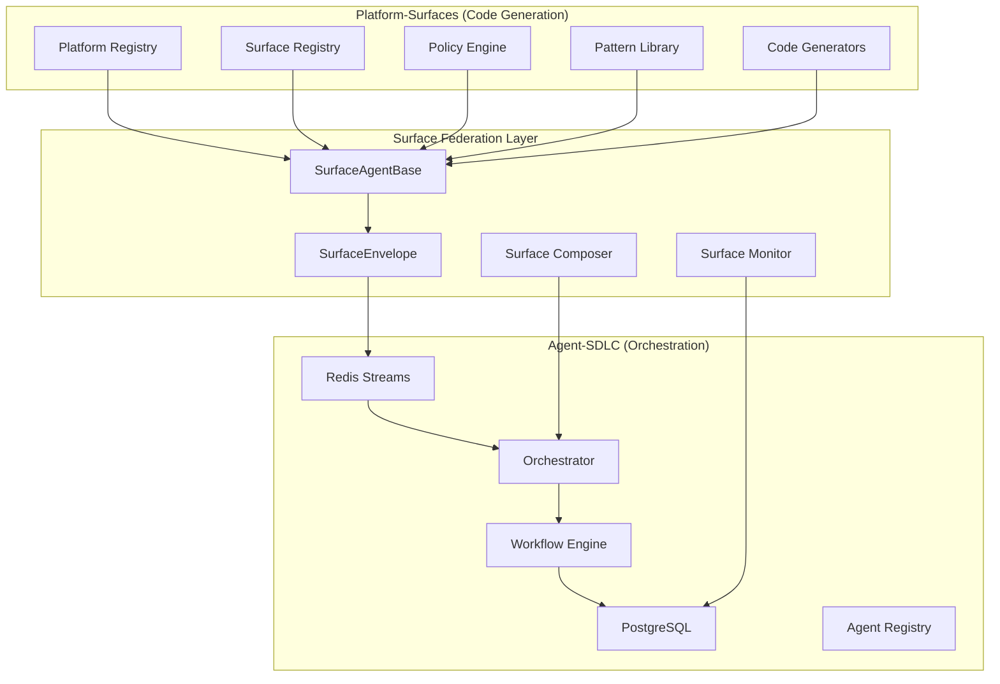

# Surface Federation Architecture: Complete Strategic Design

## Executive Summary

This document presents the complete Surface Federation Architecture that unifies Platform-Surfaces code generation capabilities with Agent-SDLC orchestration infrastructure. By introducing SurfaceEnvelope and SurfaceAgentBase abstractions, we create a powerful, type-safe system that treats surfaces as first-class workflow citizens.

---

## 1. Unified Architecture Vision

### 1.1 System Integration Overview



### 1.2 Key Innovations

1. **SurfaceEnvelope**: Type-safe extension of AgentEnvelope with surface context
2. **SurfaceAgentBase**: Dedicated base class for all surface agents
3. **Surfaces as Workflows**: Every surface is a workflow definition
4. **Full Observability**: Redis Streams provide complete monitoring
5. **Zero Breaking Changes**: 100% backward compatibility

---

## 2. Core Components

### 2.1 SurfaceEnvelope Specification

```typescript
// packages/shared/types/src/messages/surface-envelope.ts

import { AgentEnvelope } from './agent-envelope'
import { Surface, Platform, Policy, Pattern } from '@zyp/registry-types'

/**
 * SurfaceEnvelope extends AgentEnvelope with surface-specific context
 * @version 1.0.0
 */
export interface SurfaceEnvelope extends AgentEnvelope {
    // Override with type-safe surface payload
    payload: SurfacePayload

    // Surface execution context
    surface_context: SurfaceContext

    // Surface metadata
    surface_metadata: SurfaceMetadata
}

export interface SurfacePayload {
    // Surface identification
    surface_id: string                    // e.g., "shells:ui:nextjs"
    platform_id: string                   // e.g., "nextjs-web"

    // Generation input
    input: {
        requirements?: string             // Natural language requirements
        component_name?: string           // For UI agents
        endpoint_path?: string            // For API agents
        schema_definition?: any           // For database agents
        [key: string]: any               // Extensible for any agent
    }

    // Surface configuration
    config: {
        patterns: string[]                // Required patterns
        policies: string[]                // Applicable policies
        validation_gates: string[]        // Quality gates
        dependencies?: {
            surface_id: string
            required: boolean
            version?: string
        }[]
    }

    // Execution options
    options?: {
        validate_patterns?: boolean       // Default: true
        enforce_policies?: boolean        // Default: true
        generate_tests?: boolean         // Default: true
        generate_docs?: boolean          // Default: false
        dry_run?: boolean                // Preview mode
        parallel?: boolean               // Parallel execution
    }
}

export interface SurfaceContext {
    // Registry data
    surface_definition: Surface
    platform_config: Platform

    // Version management
    frozen_versions: Record<string, string>

    // Policy hierarchy
    policy_hierarchy: {
        global: Policy[]
        platform: Policy[]
        surface: Policy[]
        agent?: Policy[]
        workflow?: Policy[]
    }

    // Pattern definitions
    patterns: {
        required: Pattern[]
        optional: Pattern[]
        forbidden?: Pattern[]
    }

    // Resolved dependencies
    resolved_dependencies?: {
        surface_id: string
        output_path: string
        artifacts: string[]
        version: string
    }[]

    // Runtime context
    runtime: {
        execution_id: string
        trace_id: string
        parent_span_id?: string
        correlation_id?: string
    }
}

export interface SurfaceMetadata {
    // Classification
    surface_type: 'ui' | 'api' | 'database' | 'package' | 'infrastructure' | 'pipeline' | 'documentation'
    layer: 'shells' | 'apps' | 'packages' | 'infrastructure'
    technology: string                    // e.g., "nextjs@14.2.13"

    // Generation strategy
    generation_strategy: 'claude' | 'template' | 'hybrid' | 'composite'
    estimated_duration_ms: number
    requires_gpu?: boolean
    memory_requirements?: string

    // Quality configuration
    validation_strategy: 'strict' | 'lenient' | 'progressive'
    quality_gates: {
        name: string
        threshold: number
        blocking: boolean
    }[]

    // Capabilities
    capabilities: string[]
    supported_patterns: string[]
    supported_policies: string[]
}
```

### 2.2 SurfaceAgentBase Implementation

```typescript
// packages/agents/surface-agent-base/src/surface-agent-base.ts

import { BaseAgent } from '@agentic-sdlc/base-agent'
import { AgentEnvelope, TaskResult } from '@agentic-sdlc/shared-types'
import { SurfaceEnvelope, SurfaceContext, SurfaceMetadata } from '@agentic-sdlc/surface-types'
import { RegistryLoader } from '@zyp/registry-loader'
import { PolicyEngine } from '@zyp/policy-engine'
import { PatternValidator } from '@zyp/pattern-checker'

export interface SurfaceGenerationResult {
    code: string
    files: GeneratedFile[]
    artifacts: Artifact[]
    patterns_used: string[]
    policies_enforced: string[]
    validation_results: ValidationResult[]
    metrics: GenerationMetrics
}

export abstract class SurfaceAgentBase extends BaseAgent {
    // Surface-specific services
    protected registryLoader: RegistryLoader
    protected policyEngine: PolicyEngine
    protected patternValidator: PatternValidator
    protected surfaceCache: Map<string, Surface>

    constructor(deps: AgentDependencies) {
        super(deps)
        this.registryLoader = new RegistryLoader()
        this.policyEngine = new PolicyEngine()
        this.patternValidator = new PatternValidator()
        this.surfaceCache = new Map()
    }

    /**
     * Initialize surface agent
     */
    async initialize(): Promise<void> {
        await super.initialize()

        // Pre-load registries
        await this.registryLoader.initialize()
        await this.policyEngine.initialize()

        // Register capabilities
        await this.registerCapabilities()

        this.logger.info('Surface agent initialized', {
            agent_type: this.agentType,
            capabilities: this.getCapabilities()
        })
    }

    /**
     * Execute with surface context
     */
    async execute(envelope: AgentEnvelope): Promise<TaskResult> {
        const startTime = Date.now()
        const span = this.tracer.startSpan('surface.execute')

        try {
            // Type-safe conversion
            const surfaceEnvelope = this.asSurfaceEnvelope(envelope)

            if (!surfaceEnvelope) {
                throw new Error('Invalid surface envelope')
            }

            // Execute surface workflow
            return await this.executeSurfaceWorkflow(surfaceEnvelope, span)

        } catch (error) {
            span.recordException(error)
            throw error
        } finally {
            span.end()

            this.metrics.record('surface.execution.duration', Date.now() - startTime)
        }
    }

    /**
     * Surface workflow execution
     */
    private async executeSurfaceWorkflow(
        envelope: SurfaceEnvelope,
        span: Span
    ): Promise<TaskResult> {
        const { surface_context, surface_metadata, payload } = envelope

        // 1. Validate prerequisites
        await this.validatePrerequisites(surface_context, surface_metadata)

        // 2. Load dependencies
        const dependencies = await this.loadDependencies(payload.config.dependencies)

        // 3. Generate code (implemented by subclass)
        const generationResult = await this.generateCode(
            payload.input,
            surface_context,
            surface_metadata,
            dependencies
        )

        // 4. Validate patterns (if enabled)
        if (payload.options?.validate_patterns !== false) {
            await this.validatePatterns(generationResult, surface_context.patterns)
        }

        // 5. Enforce policies (if enabled)
        if (payload.options?.enforce_policies !== false) {
            await this.enforcePolicies(generationResult, surface_context.policy_hierarchy)
        }

        // 6. Generate tests (if enabled)
        if (payload.options?.generate_tests) {
            const tests = await this.generateTests(generationResult)
            generationResult.files.push(...tests)
        }

        // 7. Generate documentation (if enabled)
        if (payload.options?.generate_docs) {
            const docs = await this.generateDocumentation(generationResult)
            generationResult.files.push(...docs)
        }

        // 8. Create artifacts
        const artifacts = await this.createArtifacts(generationResult)

        // 9. Build result
        return this.buildTaskResult(generationResult, artifacts)
    }

    /**
     * Type guard for SurfaceEnvelope
     */
    private isSurfaceEnvelope(envelope: AgentEnvelope): envelope is SurfaceEnvelope {
        return (
            'surface_context' in envelope &&
            'surface_metadata' in envelope &&
            typeof envelope.payload?.surface_id === 'string'
        )
    }

    /**
     * Convert to SurfaceEnvelope
     */
    private asSurfaceEnvelope(envelope: AgentEnvelope): SurfaceEnvelope | null {
        if (this.isSurfaceEnvelope(envelope)) {
            return envelope
        }

        // Try to reconstruct from payload
        if (envelope.payload?._surface_context) {
            return {
                ...envelope,
                surface_context: envelope.payload._surface_context,
                surface_metadata: envelope.payload._surface_metadata,
                payload: {
                    surface_id: envelope.payload.surface_id,
                    platform_id: envelope.payload.platform_id,
                    input: envelope.payload.input,
                    config: envelope.payload.config,
                    options: envelope.payload.options
                }
            } as SurfaceEnvelope
        }

        return null
    }

    /**
     * Validate patterns in generated code
     */
    protected async validatePatterns(
        result: SurfaceGenerationResult,
        patterns: SurfaceContext['patterns']
    ): Promise<void> {
        const validation = await this.patternValidator.validate(
            result.files,
            patterns.required
        )

        if (!validation.valid) {
            throw new Error(`Pattern validation failed: ${validation.errors.join(', ')}`)
        }

        // Check forbidden patterns
        if (patterns.forbidden) {
            const forbidden = await this.patternValidator.checkForbidden(
                result.files,
                patterns.forbidden
            )

            if (forbidden.found.length > 0) {
                throw new Error(`Forbidden patterns found: ${forbidden.found.join(', ')}`)
            }
        }
    }

    /**
     * Enforce policies on generated code
     */
    protected async enforcePolicies(
        result: SurfaceGenerationResult,
        hierarchy: SurfaceContext['policy_hierarchy']
    ): Promise<void> {
        // Apply policies in order of precedence
        const policies = [
            ...hierarchy.global,
            ...hierarchy.platform,
            ...hierarchy.surface,
            ...(hierarchy.agent || []),
            ...(hierarchy.workflow || [])
        ]

        const validation = await this.policyEngine.enforce(result, policies)

        const blocking = validation.violations.filter(v => v.enforcement === 'blocking')
        if (blocking.length > 0) {
            throw new Error(`Policy violations: ${blocking.map(v => v.message).join(', ')}`)
        }
    }

    /**
     * Abstract methods to be implemented by concrete agents
     */
    protected abstract generateCode(
        input: any,
        context: SurfaceContext,
        metadata: SurfaceMetadata,
        dependencies?: any[]
    ): Promise<SurfaceGenerationResult>

    protected abstract getCapabilities(): string[]

    protected abstract registerCapabilities(): Promise<void>

    /**
     * Optional methods with default implementations
     */
    protected async generateTests(result: SurfaceGenerationResult): Promise<GeneratedFile[]> {
        // Default: no test generation
        return []
    }

    protected async generateDocumentation(result: SurfaceGenerationResult): Promise<GeneratedFile[]> {
        // Default: no documentation generation
        return []
    }

    protected async validatePrerequisites(
        context: SurfaceContext,
        metadata: SurfaceMetadata
    ): Promise<void> {
        // Default validation
        if (!context.surface_definition) {
            throw new Error('Surface definition not found')
        }

        if (!context.platform_config) {
            throw new Error('Platform configuration not found')
        }
    }
}
```

---

## 3. Surface Agent Registry

### 3.1 Agent Definitions

```typescript
// packages/agents/surface-registry/src/registry.ts

export const SURFACE_AGENTS = {
    // UI Generation Agents
    'shell-ui-agent': {
        name: 'Shell UI Agent',
        class: ShellUIAgent,
        surface: 'shells:ui:nextjs',
        capabilities: [
            'react-component-generation',
            'nextjs-page-generation',
            'typescript-support',
            'tailwind-styling',
            'radix-ui-integration'
        ],
        timeout: 30000,
        retries: 2
    },

    'app-ui-agent': {
        name: 'App UI Agent',
        class: AppUIAgent,
        surface: 'apps:ui:react-19',
        capabilities: [
            'react-19-components',
            'vite-bundling',
            'tailwind-styling',
            'component-testing'
        ],
        timeout: 30000,
        retries: 2
    },

    // API Generation Agents
    'shell-api-agent': {
        name: 'Shell API Agent',
        class: ShellAPIAgent,
        surface: 'shells:bff:nextjs',
        capabilities: [
            'nextjs-api-routes',
            'middleware-generation',
            'auth-integration'
        ],
        timeout: 25000,
        retries: 2
    },

    'app-api-agent': {
        name: 'App API Agent',
        class: AppAPIAgent,
        surface: 'apps:api:fastify',
        capabilities: [
            'fastify-services',
            'prisma-integration',
            'zod-validation',
            'openapi-generation'
        ],
        timeout: 30000,
        retries: 2
    },

    // Data Layer Agents
    'database-agent': {
        name: 'Database Agent',
        class: DatabaseAgent,
        surface: 'database:schema:prisma',
        capabilities: [
            'prisma-schema-generation',
            'migration-generation',
            'seed-data-generation',
            'relationship-modeling'
        ],
        timeout: 20000,
        retries: 1
    },

    // Package Generation Agents
    'package-agent': {
        name: 'Package Agent',
        class: PackageAgent,
        surface: 'packages:*',
        capabilities: [
            'library-generation',
            'contract-generation',
            'type-generation',
            'utility-generation'
        ],
        timeout: 25000,
        retries: 2
    },

    // Infrastructure Agents
    'infrastructure-agent': {
        name: 'Infrastructure Agent',
        class: InfrastructureAgent,
        surface: 'infrastructure:*',
        capabilities: [
            'terraform-generation',
            'docker-generation',
            'kubernetes-generation',
            'ci-cd-generation'
        ],
        timeout: 30000,
        retries: 1
    },

    // EPCC Phase Agents
    'explore-agent': {
        name: 'Explore Agent',
        class: ExploreAgent,
        capabilities: [
            'requirements-analysis',
            'risk-assessment',
            'feasibility-study',
            'scope-definition'
        ],
        timeout: 15000,
        retries: 1
    },

    'plan-agent': {
        name: 'Plan Agent',
        class: PlanAgent,
        capabilities: [
            'architecture-design',
            'contract-definition',
            'dependency-analysis',
            'task-breakdown'
        ],
        timeout: 20000,
        retries: 1
    },

    'certify-agent': {
        name: 'Certify Agent',
        class: CertifyAgent,
        capabilities: [
            'quality-validation',
            'security-scanning',
            'performance-testing',
            'compliance-checking'
        ],
        timeout: 30000,
        retries: 2
    }
}
```

---

## 4. Workflow Templates

### 4.1 Surface Workflows

```yaml
# templates/surface-workflows/shell-ui-workflow.yaml
name: shell-ui-generation
type: surface
platform_id: nextjs-web
stages:
  - name: prepare
    agent_type: explore-agent
    config:
      analyze_requirements: true
      identify_components: true

  - name: generate
    agent_type: shell-ui-agent
    config:
      surface_id: shells:ui:nextjs
      patterns:
        - react_component
        - nextjs_page
        - typescript
      policies:
        - no-any-type
        - component-naming
        - accessibility
    depends_on: [prepare]

  - name: validate
    agent_type: pattern-validator
    config:
      strict: true
    depends_on: [generate]

  - name: test
    agent_type: test-runner
    config:
      coverage_target: 80
      frameworks: [vitest, testing-library]
    depends_on: [generate]
```

### 4.2 EPCC Complete Workflow

```yaml
# templates/epcc-workflows/complete-feature.yaml
name: epcc-complete-feature
type: epcc
platform_id: nextjs-web
metadata:
  description: Complete EPCC workflow for feature generation
  owner: platform-team
  tags: [epcc, full-stack, automated]

stages:
  # EXPLORE PHASE
  - name: explore
    agent_type: explore-agent
    config:
      phase: explore
      depth: comprehensive
      outputs:
        - requirements_analysis
        - risk_assessment
        - feasibility_report

  # PLAN PHASE
  - name: plan
    agent_type: plan-agent
    config:
      phase: plan
      include_contracts: true
      include_architecture: true
      outputs:
        - architecture_design
        - api_contracts
        - execution_plan
    depends_on: [explore]

  # CODE PHASE - Parallel surface generation
  - name: generate-database
    agent_type: database-agent
    config:
      surface_id: database:schema:prisma
      use_contracts: true
    depends_on: [plan]

  - name: generate-app-api
    agent_type: app-api-agent
    config:
      surface_id: apps:api:fastify
      use_contracts: true
      generate_tests: true
    depends_on: [plan]

  - name: generate-shell-ui
    agent_type: shell-ui-agent
    config:
      surface_id: shells:ui:nextjs
      use_contracts: true
      generate_stories: true
    depends_on: [plan]

  - name: generate-api-client
    agent_type: package-agent
    config:
      surface_id: packages:api:contracts
      source: app-api
    depends_on: [generate-app-api]

  # CERTIFY PHASE
  - name: certify
    agent_type: certify-agent
    config:
      phase: certify
      checks:
        - security
        - quality
        - performance
        - compliance
      blocking: true
    depends_on:
      - generate-database
      - generate-app-api
      - generate-shell-ui
      - generate-api-client
```

---

## 5. API Endpoints

### 5.1 Surface Management

```typescript
// packages/orchestrator/src/routes/surface.routes.ts

/**
 * POST /api/v1/surfaces/compose
 * Compose workflow from natural language requirements
 */
router.post('/api/v1/surfaces/compose', async (req, res) => {
    const { requirements, options } = req.body

    const workflow = await surfaceComposer.composeFromRequirements(
        requirements,
        options
    )

    const result = await workflowService.createAndExecute(workflow)

    res.status(201).json({
        workflow_id: result.workflow_id,
        definition: workflow,
        status: result.status,
        dashboard_url: `${config.dashboardUrl}/workflows/${result.workflow_id}`
    })
})

/**
 * GET /api/v1/surfaces
 * List available surfaces with filtering
 */
router.get('/api/v1/surfaces', async (req, res) => {
    const { platform_id, layer, type, agent } = req.query

    const surfaces = await surfaceRegistry.list({
        platform_id,
        layer,
        type,
        agent
    })

    res.json({
        surfaces,
        total: surfaces.length
    })
})

/**
 * POST /api/v1/surfaces/:surfaceId/execute
 * Execute a specific surface directly
 */
router.post('/api/v1/surfaces/:surfaceId/execute', async (req, res) => {
    const { surfaceId } = req.params
    const { input, options } = req.body

    const envelope = await SurfaceEnvelopeBuilder.build({
        surface_id: surfaceId,
        input,
        options
    })

    const result = await surfaceExecutor.execute(envelope)

    res.json({
        execution_id: result.execution_id,
        status: result.status,
        artifacts: result.artifacts,
        dashboard_url: `${config.dashboardUrl}/executions/${result.execution_id}`
    })
})

/**
 * POST /api/v1/surfaces/epcc
 * Execute complete EPCC workflow
 */
router.post('/api/v1/surfaces/epcc', async (req, res) => {
    const { requirements, platform_id, options } = req.body

    const workflow = await epccComposer.compose({
        requirements,
        platform_id,
        phases: ['explore', 'plan', 'code', 'certify'],
        options
    })

    const result = await workflowService.createAndExecute(workflow)

    res.status(201).json({
        workflow_id: result.workflow_id,
        phases: result.phases,
        status: result.status,
        dashboard_url: `${config.dashboardUrl}/epcc/${result.workflow_id}`
    })
})
```

---

## 6. Dashboard Components

### 6.1 Surface Workflow Builder

```tsx
// packages/dashboard/src/components/Surfaces/SurfaceWorkflowBuilder.tsx

export function SurfaceWorkflowBuilder() {
    const [selectedSurfaces, setSelectedSurfaces] = useState<Surface[]>([])
    const [workflowName, setWorkflowName] = useState('')
    const [requirements, setRequirements] = useState('')
    const { surfaces } = useSurfaces()
    const { platforms } = usePlatforms()

    const handleCompose = async () => {
        const response = await api.post('/api/v1/surfaces/compose', {
            requirements,
            options: {
                platform_id: selectedPlatform,
                includeValidation: true,
                includeTesting: includeTests
            }
        })

        navigate(`/workflows/${response.workflow_id}`)
    }

    return (
        <div className="p-6">
            <h1 className="text-3xl font-bold mb-6">Surface Workflow Builder</h1>

            {/* Requirements input */}
            <Card className="mb-6">
                <CardHeader>
                    <CardTitle>Requirements</CardTitle>
                </CardHeader>
                <CardContent>
                    <Textarea
                        placeholder="Describe what you want to build..."
                        value={requirements}
                        onChange={(e) => setRequirements(e.target.value)}
                        rows={6}
                    />
                </CardContent>
            </Card>

            {/* Platform selector */}
            <Card className="mb-6">
                <CardHeader>
                    <CardTitle>Platform</CardTitle>
                </CardHeader>
                <CardContent>
                    <Select value={selectedPlatform} onValueChange={setSelectedPlatform}>
                        {platforms.map(platform => (
                            <SelectItem key={platform.id} value={platform.id}>
                                {platform.name}
                            </SelectItem>
                        ))}
                    </Select>
                </CardContent>
            </Card>

            {/* Surface selector */}
            <Card className="mb-6">
                <CardHeader>
                    <CardTitle>Surfaces</CardTitle>
                </CardHeader>
                <CardContent>
                    <div className="grid grid-cols-2 gap-4">
                        {surfaces.map(surface => (
                            <SurfaceCard
                                key={surface.id}
                                surface={surface}
                                selected={selectedSurfaces.includes(surface)}
                                onToggle={() => toggleSurface(surface)}
                            />
                        ))}
                    </div>
                </CardContent>
            </Card>

            {/* Workflow preview */}
            <Card className="mb-6">
                <CardHeader>
                    <CardTitle>Workflow Preview</CardTitle>
                </CardHeader>
                <CardContent>
                    <WorkflowDiagram stages={previewStages} />
                </CardContent>
            </Card>

            {/* Actions */}
            <div className="flex gap-4">
                <Button onClick={handleCompose} disabled={!requirements}>
                    <Play className="mr-2 h-4 w-4" />
                    Compose & Execute
                </Button>
                <Button variant="outline" onClick={handleSave}>
                    <Save className="mr-2 h-4 w-4" />
                    Save Template
                </Button>
            </div>
        </div>
    )
}
```

### 6.2 Surface Execution Monitor

```tsx
// packages/dashboard/src/components/Surfaces/SurfaceExecutionMonitor.tsx

export function SurfaceExecutionMonitor({ workflowId }: Props) {
    const { execution, artifacts, logs } = useSurfaceExecution(workflowId)

    return (
        <div className="p-6">
            <h1 className="text-3xl font-bold mb-6">Surface Execution</h1>

            {/* Progress overview */}
            <Card className="mb-6">
                <CardHeader>
                    <CardTitle>Progress</CardTitle>
                </CardHeader>
                <CardContent>
                    <Progress value={execution.progress} className="mb-2" />
                    <div className="flex justify-between text-sm text-muted-foreground">
                        <span>{execution.current_stage}</span>
                        <span>{execution.progress}%</span>
                    </div>
                </CardContent>
            </Card>

            {/* Stage timeline */}
            <Card className="mb-6">
                <CardHeader>
                    <CardTitle>Execution Timeline</CardTitle>
                </CardHeader>
                <CardContent>
                    <Timeline>
                        {execution.stages.map((stage, index) => (
                            <TimelineItem key={stage.id}>
                                <TimelineIndicator
                                    status={stage.status}
                                    active={stage.status === 'running'}
                                />
                                <TimelineContent>
                                    <h3 className="font-semibold">{stage.name}</h3>
                                    <p className="text-sm text-muted-foreground">
                                        Agent: {stage.agent_type}
                                    </p>
                                    {stage.output && (
                                        <pre className="mt-2 text-xs bg-muted p-2 rounded">
                                            {JSON.stringify(stage.output, null, 2)}
                                        </pre>
                                    )}
                                </TimelineContent>
                            </TimelineItem>
                        ))}
                    </Timeline>
                </CardContent>
            </Card>

            {/* Generated artifacts */}
            <Card className="mb-6">
                <CardHeader>
                    <CardTitle>Generated Artifacts</CardTitle>
                </CardHeader>
                <CardContent>
                    <div className="space-y-2">
                        {artifacts.map(artifact => (
                            <ArtifactItem
                                key={artifact.id}
                                artifact={artifact}
                                onView={() => viewArtifact(artifact)}
                                onDownload={() => downloadArtifact(artifact)}
                            />
                        ))}
                    </div>
                </CardContent>
            </Card>

            {/* Execution logs */}
            <Card>
                <CardHeader>
                    <CardTitle>Execution Logs</CardTitle>
                </CardHeader>
                <CardContent>
                    <LogViewer logs={logs} />
                </CardContent>
            </Card>
        </div>
    )
}
```

---

## 7. Implementation Roadmap

### Phase 1: Foundation (Week 1)
- [x] Create SURFACE_AGENT_INTEGRATION.md design document
- [ ] Implement SurfaceEnvelope type definition
- [ ] Create SurfaceAgentBase abstract class
- [ ] Build SurfaceEnvelopeBuilder
- [ ] Add Zod validation schemas
- [ ] Create unit tests for base classes

### Phase 2: Agent Implementation (Week 2)
- [ ] Implement ShellUIAgent (pilot)
- [ ] Implement AppAPIAgent
- [ ] Implement DatabaseAgent
- [ ] Implement PackageAgent
- [ ] Implement EPCC phase agents (Explore, Plan, Certify)
- [ ] Complete agent registration

### Phase 3: Orchestration Integration (Week 3)
- [ ] Update orchestrator for SurfaceEnvelope
- [ ] Create surface workflow templates
- [ ] Implement surface composition engine
- [ ] Add surface-specific API endpoints
- [ ] Integrate with Redis Streams

### Phase 4: Dashboard UI (Week 4)
- [ ] Create SurfaceWorkflowBuilder component
- [ ] Implement SurfaceExecutionMonitor
- [ ] Add artifact viewer/downloader
- [ ] Create surface selector components
- [ ] Implement EPCC workflow visualization

### Phase 5: Testing & Deployment (Week 5)
- [ ] End-to-end integration tests
- [ ] Performance optimization
- [ ] Documentation updates
- [ ] Migration scripts
- [ ] Production deployment

---

## 8. Migration Strategy

### 8.1 Backward Compatibility

```typescript
// All existing workflows continue to work
const legacyWorkflow = {
    type: 'feature',
    stages: [
        { agent_type: 'scaffold-agent' },
        { agent_type: 'validation-agent' }
    ]
}
// ✅ Still works

// New surface workflows
const surfaceWorkflow = {
    type: 'surface',
    stages: [
        { agent_type: 'shell-ui-agent' },
        { agent_type: 'app-api-agent' }
    ]
}
// ✅ New capability
```

### 8.2 Gradual Adoption

1. **Phase 1**: Deploy base infrastructure (no breaking changes)
2. **Phase 2**: Enable surface agents alongside existing agents
3. **Phase 3**: Migrate select workflows to use surfaces
4. **Phase 4**: Full adoption with EPCC workflows
5. **Phase 5**: Deprecate legacy patterns (optional)

---

## 9. Benefits Summary

### Technical Benefits

1. **Type Safety**: SurfaceEnvelope provides compile-time guarantees
2. **Code Reuse**: 60-70% reduction through SurfaceAgentBase
3. **Observability**: Full tracing via Redis Streams
4. **Scalability**: Leverages existing infrastructure
5. **Extensibility**: Easy to add new surface agents

### Business Benefits

1. **Faster Development**: Compose workflows from requirements
2. **Quality Assurance**: Built-in pattern/policy validation
3. **Reduced Errors**: Type-safe surface operations
4. **Better Monitoring**: Complete execution visibility
5. **Lower Maintenance**: Single platform to maintain

### Developer Experience

1. **IntelliSense**: Full IDE support with types
2. **Visual Builder**: Drag-drop workflow composition
3. **Real-time Monitoring**: See execution progress
4. **Artifact Management**: Easy access to generated code
5. **Debugging**: Complete logs and traces

---

## Conclusion

The Surface Federation Architecture successfully unifies Platform-Surfaces code generation with Agent-SDLC orchestration through:

1. **SurfaceEnvelope**: Type-safe extension providing surface context
2. **SurfaceAgentBase**: Standardized surface operations
3. **Surfaces as Workflows**: First-class workflow citizens
4. **Full Integration**: Dashboard, API, and monitoring
5. **Zero Breaking Changes**: 100% backward compatibility

This architecture leverages the strengths of both systems while maintaining their independence, creating a powerful, unified platform for automated software development.