# Unified Agent Architecture - Final Design

## Executive Summary

This document presents the final, unified agent architecture that combines the agent taxonomy system with clean implementation patterns. The design supports multiple agent categories (Task, Surface, Communication, Integration, Intelligence) while maintaining simplicity and type safety throughout.

**Key Principles:**
- Clean architecture without backward compatibility
- Category-based agent organization
- Unified envelope system with category-specific extensions
- Type-safe implementations
- Extensible for future agent types

---

## 1. Agent Taxonomy Overview

### 1.1 Agent Category Hierarchy

```mermaid
graph TD
    A[BaseAgent] --> B[TaskAgentBase]
    A --> C[SurfaceAgentBase]
    A --> D[CommunicationAgentBase]
    A --> E[IntegrationAgentBase]
    A --> F[IntelligenceAgentBase]

    B --> B1[ValidationAgent]
    B --> B2[TestingAgent]
    B --> B3[DeploymentAgent]
    B --> B4[BuildAgent]

    C --> C1[ShellUIAgent]
    C --> C2[ShellAPIAgent]
    C --> C3[AppUIAgent]
    C --> C4[AppAPIAgent]
    C --> C5[DatabaseAgent]
    C --> C6[PackageAgent]
    C --> C7[InfrastructureAgent]

    D --> D1[EmailAgent]
    D --> D2[SlackAgent]
    D --> D3[TeamsAgent]
    D --> D4[DiscordAgent]

    E --> E1[GitHubAgent]
    E --> E2[GitLabAgent]
    E --> E3[JiraAgent]
    E --> E4[AWSAgent]
    E --> E5[AzureAgent]

    F --> F1[AnalysisAgent]
    F --> F2[PredictionAgent]
    F --> F3[ClassificationAgent]
    F --> F4[GenerationAgent]
```



### 1.2 Agent Categories

```typescript
// packages/core/types/agent-categories.ts

/**
 * Core agent categories that define the primary purpose of each agent
 */
export enum AgentCategory {
    TASK = 'task',                    // Traditional task execution
    SURFACE = 'surface',              // Code generation for architectural surfaces
    COMMUNICATION = 'communication',  // Messaging, notifications, social media
    INTEGRATION = 'integration',      // External system integrations
    INTELLIGENCE = 'intelligence'     // AI/ML analysis and decision-making
}

/**
 * Agent metadata that describes capabilities and requirements
 */
export interface AgentMetadata {
    // Identity
    category: AgentCategory
    type: string                      // e.g., 'shell-ui-agent'
    version: string

    // Capabilities
    capabilities: AgentCapability[]

    // Constraints
    constraints: AgentConstraint[]

    // Resource requirements
    resources: ResourceRequirements

    // Operational metadata
    timeout_ms: number
    max_retries: number
    idempotent: boolean
}

export interface AgentCapability {
    name: string
    description: string
    parameters?: Record<string, any>
}

export interface AgentConstraint {
    type: 'rate-limit' | 'concurrency' | 'dependency' | 'authorization' | 'time-window'
    value: any
    enforcement: 'hard' | 'soft'
}

export interface ResourceRequirements {
    cpu?: string                      // e.g., '2 cores'
    memory?: string                    // e.g., '4GB'
    gpu?: boolean
    network?: 'internal' | 'external' | 'both'
    storage?: string                   // e.g., '10GB'
    secrets?: string[]                 // Required secret names
}
```

---

## 2. Unified Envelope System

### 2.1 Base Envelope

```typescript
// packages/core/types/envelope.ts

/**
 * Base envelope that all agent communications extend
 */
export interface Envelope {
    // Identity
    id: string                         // Unique envelope ID
    workflow_id: string                // Parent workflow
    stage_id: string                   // Current workflow stage

    // Agent routing
    agent_category: AgentCategory      // Which category of agent
    agent_type: string                 // Specific agent type

    // Execution control
    priority: 'low' | 'medium' | 'high' | 'critical'
    timeout_ms: number
    max_retries: number
    idempotency_key?: string

    // Payload - category-specific
    payload: any

    // Context - category-specific
    context: any

    // Metadata
    metadata: {
        source: string                 // System that created the envelope
        correlation_id: string         // For tracing related operations
        tags: string[]
        labels: Record<string, string>
    }

    // Tracing
    trace: {
        trace_id: string
        span_id: string
        parent_span_id?: string
        baggage?: Record<string, string>
    }

    // Timestamps
    created_at: Date
    scheduled_for?: Date               // For delayed execution
    expires_at?: Date                  // TTL for the envelope
}
```

### 2.2 Category-Specific Envelopes

```typescript
// packages/core/types/envelopes/task-envelope.ts

export interface TaskEnvelope extends Envelope {
    agent_category: AgentCategory.TASK

    payload: {
        task: {
            name: string
            description?: string
            parameters: Record<string, any>
            dependencies?: string[]
            artifacts?: Artifact[]
        }

        options: {
            parallel?: boolean
            continue_on_error?: boolean
            retry_strategy?: RetryStrategy
        }
    }

    context: {
        environment: 'development' | 'staging' | 'production'
        configuration: Record<string, any>
        secrets_ref?: SecretReference[]
    }
}

// packages/core/types/envelopes/surface-envelope.ts

export interface SurfaceEnvelope extends Envelope {
    agent_category: AgentCategory.SURFACE

    payload: {
        // Surface identification
        surface_id: string              // e.g., 'shells:ui:nextjs'
        platform_id: string             // e.g., 'nextjs-web'

        // Generation input
        input: {
            requirements: string
            specifications?: {
                component_name?: string
                props?: Record<string, any>
                features?: string[]
                [key: string]: any
            }
        }

        // Generation configuration
        config: {
            patterns: string[]           // Code patterns to apply
            policies: string[]           // Policies to enforce
            quality_gates: QualityGate[]
            validation_rules: ValidationRule[]
        }

        // Generation options
        options: {
            strategy: 'claude' | 'template' | 'hybrid'
            validate: boolean
            generate_tests: boolean
            generate_docs: boolean
            dry_run: boolean
        }
    }

    context: {
        // Surface definition
        surface: {
            id: string
            name: string
            layer: 'shells' | 'apps' | 'packages' | 'infrastructure'
            technology: string
            version: string
            patterns: Pattern[]
            constraints: Constraint[]
        }

        // Platform configuration
        platform: {
            id: string
            name: string
            stack: {
                frontend?: string
                backend?: string
                database?: string
                infrastructure?: string
            }
            versions: Record<string, string>  // Frozen versions
            conventions: Convention[]
        }

        // Policies and patterns
        policies: Policy[]
        patterns: Pattern[]

        // Dependencies
        dependencies?: {
            surface_id: string
            artifacts: Artifact[]
            version: string
        }[]
    }
}

// packages/core/types/envelopes/communication-envelope.ts

export interface CommunicationEnvelope extends Envelope {
    agent_category: AgentCategory.COMMUNICATION

    payload: {
        channel: 'email' | 'slack' | 'teams' | 'discord' | 'sms' | 'webhook'

        recipients: {
            to: Recipient[]
            cc?: Recipient[]
            bcc?: Recipient[]
        }

        message: {
            subject?: string
            body: string
            format: 'text' | 'html' | 'markdown'
            attachments?: Attachment[]
            template?: {
                id: string
                variables: Record<string, any>
            }
            priority?: 'low' | 'normal' | 'high' | 'urgent'
        }

        options: {
            schedule?: Date
            track_opens?: boolean
            track_clicks?: boolean
            require_confirmation?: boolean
        }
    }

    context: {
        credentials: CredentialReference
        rate_limits: RateLimit[]
        templates: MessageTemplate[]
        sender_config: SenderConfiguration
    }
}

// packages/core/types/envelopes/integration-envelope.ts

export interface IntegrationEnvelope extends Envelope {
    agent_category: AgentCategory.INTEGRATION

    payload: {
        system: 'github' | 'gitlab' | 'jira' | 'aws' | 'azure' | 'gcp' | 'kubernetes'

        operation: string                // System-specific operation

        parameters: Record<string, any>  // Operation parameters

        options: {
            async?: boolean
            callback_url?: string
            webhook_events?: string[]
            polling_interval?: number
        }
    }

    context: {
        credentials: CredentialReference
        api_config: {
            endpoint: string
            version: string
            region?: string
        }
        rate_limits: RateLimit[]
        retry_policy: RetryPolicy
    }
}

// packages/core/types/envelopes/intelligence-envelope.ts

export interface IntelligenceEnvelope extends Envelope {
    agent_category: AgentCategory.INTELLIGENCE

    payload: {
        operation: 'analyze' | 'predict' | 'classify' | 'generate' | 'optimize'

        data: {
            input: any                   // Input data for processing
            format?: string              // Data format
            schema?: any                 // Data schema
        }

        model?: {
            name: string
            version?: string
            provider?: 'openai' | 'anthropic' | 'huggingface' | 'custom'
        }

        parameters?: {
            temperature?: number
            max_tokens?: number
            top_p?: number
            confidence_threshold?: number
            optimization_target?: string
        }
    }

    context: {
        model_config: ModelConfiguration
        inference_constraints: InferenceConstraint[]
        cache_config?: CacheConfiguration
        fallback_models?: ModelConfiguration[]
    }
}
```

---

## 3. Agent Base Classes

### 3.1 Root Base Agent

```typescript
// packages/agents/base/base-agent.ts

export abstract class BaseAgent {
    protected readonly logger: Logger
    protected readonly tracer: Tracer
    protected readonly metrics: Metrics

    constructor(
        protected readonly metadata: AgentMetadata,
        protected readonly config: AgentConfig
    ) {
        this.logger = new Logger(`${metadata.category}:${metadata.type}`)
        this.tracer = new Tracer(`${metadata.category}:${metadata.type}`)
        this.metrics = new Metrics(`${metadata.category}:${metadata.type}`)
    }

    /**
     * Initialize agent - called once on startup
     */
    async initialize(): Promise<void> {
        this.logger.info('Initializing agent', { metadata: this.metadata })
        await this.onInitialize()
    }

    /**
     * Main execution method - must be implemented by category base classes
     */
    abstract execute(envelope: Envelope): Promise<AgentResult>

    /**
     * Cleanup - called on shutdown
     */
    async cleanup(): Promise<void> {
        this.logger.info('Cleaning up agent')
        await this.onCleanup()
    }

    /**
     * Health check
     */
    async healthCheck(): Promise<HealthStatus> {
        return {
            healthy: true,
            category: this.metadata.category,
            type: this.metadata.type,
            version: this.metadata.version
        }
    }

    /**
     * Get agent metadata
     */
    getMetadata(): AgentMetadata {
        return this.metadata
    }

    /**
     * Validate envelope category matches agent
     */
    protected validateEnvelope(envelope: Envelope): void {
        if (envelope.agent_category !== this.metadata.category) {
            throw new Error(
                `Invalid envelope category: expected ${this.metadata.category}, got ${envelope.agent_category}`
            )
        }

        if (envelope.agent_type !== this.metadata.type) {
            throw new Error(
                `Invalid agent type: expected ${this.metadata.type}, got ${envelope.agent_type}`
            )
        }
    }

    /**
     * Check if resources are available
     */
    protected async checkResources(): Promise<void> {
        const requirements = this.metadata.resources

        if (requirements.memory) {
            const available = await this.getAvailableMemory()
            const required = this.parseMemory(requirements.memory)

            if (available < required) {
                throw new Error(`Insufficient memory: ${available} < ${required}`)
            }
        }

        if (requirements.gpu && !await this.isGPUAvailable()) {
            throw new Error('GPU required but not available')
        }
    }

    /**
     * Collect metrics
     */
    protected collectMetrics(): Metrics {
        return {
            execution_time_ms: this.metrics.timer('execution_time'),
            memory_usage_mb: this.metrics.gauge('memory_usage'),
            cpu_usage_percent: this.metrics.gauge('cpu_usage'),
            custom: this.metrics.getCustomMetrics()
        }
    }

    // Hook methods for subclasses
    protected async onInitialize(): Promise<void> {}
    protected async onCleanup(): Promise<void> {}

    // Helper methods
    private async getAvailableMemory(): Promise<number> {
        return process.memoryUsage().heapTotal
    }

    private parseMemory(memory: string): number {
        // Parse memory string like "4GB" to bytes
        const match = memory.match(/(\d+)(GB|MB|KB)/)
        if (!match) return 0

        const value = parseInt(match[1])
        const unit = match[2]

        switch (unit) {
            case 'GB': return value * 1024 * 1024 * 1024
            case 'MB': return value * 1024 * 1024
            case 'KB': return value * 1024
            default: return value
        }
    }

    private async isGPUAvailable(): Promise<boolean> {
        // Check for GPU availability
        return false // Placeholder
    }
}
```

### 3.2 Task Agent Base

```typescript
// packages/agents/base/task-agent-base.ts

export abstract class TaskAgentBase extends BaseAgent {
    constructor(type: string, version: string, config: AgentConfig) {
        super(
            {
                category: AgentCategory.TASK,
                type,
                version,
                capabilities: [],
                constraints: [],
                resources: {},
                timeout_ms: 30000,
                max_retries: 3,
                idempotent: false
            },
            config
        )
    }

    async execute(envelope: Envelope): Promise<AgentResult> {
        this.validateEnvelope(envelope)
        const taskEnvelope = envelope as TaskEnvelope

        const span = this.tracer.startSpan('task.execute', {
            'task.name': taskEnvelope.payload.task.name,
            'task.parameters': JSON.stringify(taskEnvelope.payload.task.parameters)
        })

        try {
            await this.checkResources()

            const result = await this.executeTask(
                taskEnvelope.payload.task,
                taskEnvelope.context
            )

            return {
                envelope_id: envelope.id,
                status: 'success',
                category: AgentCategory.TASK,
                data: result,
                metrics: this.collectMetrics(),
                errors: []
            }
        } catch (error) {
            span.recordException(error)

            return {
                envelope_id: envelope.id,
                status: 'failure',
                category: AgentCategory.TASK,
                data: null,
                metrics: this.collectMetrics(),
                errors: [error]
            }
        } finally {
            span.end()
        }
    }

    protected abstract executeTask(
        task: TaskEnvelope['payload']['task'],
        context: TaskEnvelope['context']
    ): Promise<any>
}
```

### 3.3 Surface Agent Base

```typescript
// packages/agents/base/surface-agent-base.ts

export abstract class SurfaceAgentBase extends BaseAgent {
    protected registryLoader: RegistryLoader
    protected policyEngine: PolicyEngine
    protected patternValidator: PatternValidator

    constructor(type: string, version: string, config: AgentConfig) {
        super(
            {
                category: AgentCategory.SURFACE,
                type,
                version,
                capabilities: ['code-generation'],
                constraints: [],
                resources: {
                    memory: '4GB',
                    cpu: '2 cores'
                },
                timeout_ms: 60000,
                max_retries: 2,
                idempotent: true
            },
            config
        )

        this.registryLoader = new RegistryLoader(config)
        this.policyEngine = new PolicyEngine(config)
        this.patternValidator = new PatternValidator(config)
    }

    async execute(envelope: Envelope): Promise<AgentResult> {
        this.validateEnvelope(envelope)
        const surfaceEnvelope = envelope as SurfaceEnvelope

        const span = this.tracer.startSpan('surface.execute', {
            'surface.id': surfaceEnvelope.payload.surface_id,
            'platform.id': surfaceEnvelope.payload.platform_id
        })

        try {
            await this.checkResources()

            // 1. Generate code
            const generation = await this.generateCode(
                surfaceEnvelope.payload.input,
                surfaceEnvelope.context
            )

            // 2. Validate patterns if required
            if (surfaceEnvelope.payload.options.validate) {
                await this.validatePatterns(generation, surfaceEnvelope.context.patterns)
            }

            // 3. Enforce policies
            if (surfaceEnvelope.payload.config.policies.length > 0) {
                await this.enforcePolicies(generation, surfaceEnvelope.context.policies)
            }

            // 4. Generate tests if required
            if (surfaceEnvelope.payload.options.generate_tests) {
                const tests = await this.generateTests(generation)
                generation.files.push(...tests)
            }

            // 5. Generate documentation if required
            if (surfaceEnvelope.payload.options.generate_docs) {
                const docs = await this.generateDocumentation(generation)
                generation.files.push(...docs)
            }

            return {
                envelope_id: envelope.id,
                status: 'success',
                category: AgentCategory.SURFACE,
                data: {
                    files: generation.files,
                    artifacts: generation.artifacts,
                    patterns_used: generation.patterns_used,
                    policies_enforced: generation.policies_enforced
                },
                metrics: this.collectMetrics(),
                errors: []
            }
        } catch (error) {
            span.recordException(error)

            return {
                envelope_id: envelope.id,
                status: 'failure',
                category: AgentCategory.SURFACE,
                data: null,
                metrics: this.collectMetrics(),
                errors: [error]
            }
        } finally {
            span.end()
        }
    }

    protected abstract generateCode(
        input: SurfaceEnvelope['payload']['input'],
        context: SurfaceEnvelope['context']
    ): Promise<GenerationResult>

    protected async generateTests(generation: GenerationResult): Promise<GeneratedFile[]> {
        // Default implementation - can be overridden
        return []
    }

    protected async generateDocumentation(generation: GenerationResult): Promise<GeneratedFile[]> {
        // Default implementation - can be overridden
        return []
    }

    private async validatePatterns(generation: GenerationResult, patterns: Pattern[]): Promise<void> {
        const validation = await this.patternValidator.validate(generation.files, patterns)

        if (!validation.valid) {
            throw new ValidationError('Pattern validation failed', validation.errors)
        }
    }

    private async enforcePolicies(generation: GenerationResult, policies: Policy[]): Promise<void> {
        const violations = await this.policyEngine.check(generation.files, policies)

        const blocking = violations.filter(v => v.severity === 'error')
        if (blocking.length > 0) {
            throw new PolicyError('Policy violations detected', blocking)
        }
    }
}
```

### 3.4 Communication Agent Base

```typescript
// packages/agents/base/communication-agent-base.ts

export abstract class CommunicationAgentBase extends BaseAgent {
    protected rateLimiter: RateLimiter
    protected templateEngine: TemplateEngine
    protected messageValidator: MessageValidator

    constructor(type: string, version: string, config: AgentConfig) {
        super(
            {
                category: AgentCategory.COMMUNICATION,
                type,
                version,
                capabilities: ['messaging'],
                constraints: [
                    { type: 'rate-limit', value: '100/hour', enforcement: 'hard' }
                ],
                resources: {
                    network: 'external'
                },
                timeout_ms: 10000,
                max_retries: 3,
                idempotent: false
            },
            config
        )

        this.rateLimiter = new RateLimiter(config)
        this.templateEngine = new TemplateEngine(config)
        this.messageValidator = new MessageValidator(config)
    }

    async execute(envelope: Envelope): Promise<AgentResult> {
        this.validateEnvelope(envelope)
        const commEnvelope = envelope as CommunicationEnvelope

        const span = this.tracer.startSpan('communication.execute', {
            'channel': commEnvelope.payload.channel,
            'recipients.count': commEnvelope.payload.recipients.to.length
        })

        try {
            // Check rate limits
            await this.rateLimiter.check(commEnvelope.payload.channel)

            // Validate message
            await this.messageValidator.validate(commEnvelope.payload.message)

            // Render template if needed
            const message = commEnvelope.payload.message.template
                ? await this.templateEngine.render(
                    commEnvelope.payload.message.template.id,
                    commEnvelope.payload.message.template.variables
                  )
                : commEnvelope.payload.message

            // Send message
            const result = await this.sendMessage(
                commEnvelope.payload.channel,
                commEnvelope.payload.recipients,
                message,
                commEnvelope.context
            )

            // Track if required
            if (commEnvelope.payload.options.track_opens || commEnvelope.payload.options.track_clicks) {
                await this.setupTracking(result.message_id)
            }

            return {
                envelope_id: envelope.id,
                status: 'success',
                category: AgentCategory.COMMUNICATION,
                data: result,
                metrics: this.collectMetrics(),
                errors: []
            }
        } catch (error) {
            span.recordException(error)

            return {
                envelope_id: envelope.id,
                status: 'failure',
                category: AgentCategory.COMMUNICATION,
                data: null,
                metrics: this.collectMetrics(),
                errors: [error]
            }
        } finally {
            span.end()
        }
    }

    protected abstract sendMessage(
        channel: string,
        recipients: any,
        message: any,
        context: CommunicationEnvelope['context']
    ): Promise<any>

    protected async setupTracking(messageId: string): Promise<void> {
        // Default implementation for message tracking
    }
}
```

---

## 4. Concrete Agent Examples

### 4.1 Shell UI Agent (Surface)

```typescript
// packages/agents/surface/shell-ui-agent.ts

export class ShellUIAgent extends SurfaceAgentBase {
    private claude: ClaudeAPI

    constructor(config: AgentConfig) {
        super('shell-ui-agent', '1.0.0', config)

        this.metadata.capabilities = [
            { name: 'react-generation', description: 'Generate React components' },
            { name: 'nextjs-generation', description: 'Generate Next.js pages' },
            { name: 'typescript', description: 'Full TypeScript support' },
            { name: 'tailwind', description: 'Tailwind CSS styling' }
        ]

        this.claude = new ClaudeAPI(config.claude)
    }

    protected async generateCode(
        input: SurfaceEnvelope['payload']['input'],
        context: SurfaceEnvelope['context']
    ): Promise<GenerationResult> {
        const { requirements, specifications } = input
        const { component_name, props, features } = specifications || {}

        // Generate main component
        const component = await this.generateReactComponent(
            component_name || 'Component',
            props || {},
            requirements,
            context
        )

        // Generate TypeScript types
        const types = await this.generateTypeDefinitions(component_name, props)

        // Apply Next.js patterns
        const files = await this.applyNextJSPatterns([component, types], context)

        return {
            files,
            artifacts: [],
            patterns_used: ['react-component', 'nextjs-page', 'typescript'],
            policies_enforced: ['no-any-type', 'component-naming'],
            metadata: {
                generator: 'shell-ui-agent',
                timestamp: new Date()
            }
        }
    }

    private async generateReactComponent(
        name: string,
        props: any,
        requirements: string,
        context: SurfaceEnvelope['context']
    ): Promise<GeneratedFile> {
        const prompt = `
            Generate a Next.js React component with these requirements:
            - Name: ${name}
            - Props: ${JSON.stringify(props)}
            - Requirements: ${requirements}
            - Technology: ${context.platform.stack.frontend}
            - Apply patterns: ${context.patterns.map(p => p.name).join(', ')}
        `

        const response = await this.claude.complete({
            prompt,
            max_tokens: 2000,
            temperature: 0.3
        })

        return {
            path: `components/${name}.tsx`,
            content: response.content,
            type: 'component',
            language: 'typescript',
            size: response.content.length
        }
    }

    protected async generateTests(generation: GenerationResult): Promise<GeneratedFile[]> {
        const tests: GeneratedFile[] = []

        for (const file of generation.files) {
            if (file.type === 'component') {
                const test = await this.generateComponentTest(file)
                tests.push(test)
            }
        }

        return tests
    }
}
```

### 4.2 Validation Agent (Task)

```typescript
// packages/agents/task/validation-agent.ts

export class ValidationAgent extends TaskAgentBase {
    private validators: Map<string, Validator>

    constructor(config: AgentConfig) {
        super('validation-agent', '1.0.0', config)

        this.metadata.capabilities = [
            { name: 'code-validation', description: 'Validate code syntax and structure' },
            { name: 'schema-validation', description: 'Validate data against schemas' },
            { name: 'lint', description: 'Run linting rules' }
        ]

        this.validators = new Map([
            ['typescript', new TypeScriptValidator()],
            ['javascript', new JavaScriptValidator()],
            ['json', new JSONValidator()],
            ['yaml', new YAMLValidator()]
        ])
    }

    protected async executeTask(
        task: TaskEnvelope['payload']['task'],
        context: TaskEnvelope['context']
    ): Promise<ValidationResult> {
        const { name, parameters } = task

        switch (name) {
            case 'validate-code':
                return this.validateCode(parameters.files, parameters.language)

            case 'validate-schema':
                return this.validateSchema(parameters.data, parameters.schema)

            case 'lint':
                return this.runLinter(parameters.files, parameters.rules)

            default:
                throw new Error(`Unknown validation task: ${name}`)
        }
    }

    private async validateCode(files: File[], language: string): Promise<ValidationResult> {
        const validator = this.validators.get(language)

        if (!validator) {
            throw new Error(`No validator for language: ${language}`)
        }

        const errors: ValidationError[] = []

        for (const file of files) {
            const result = await validator.validate(file)
            errors.push(...result.errors)
        }

        return {
            valid: errors.length === 0,
            errors,
            warnings: [],
            info: []
        }
    }
}
```

### 4.3 Slack Agent (Communication)

```typescript
// packages/agents/communication/slack-agent.ts

export class SlackAgent extends CommunicationAgentBase {
    private slackClient: WebClient

    constructor(config: AgentConfig) {
        super('slack-agent', '1.0.0', config)

        this.metadata.capabilities = [
            { name: 'channel-message', description: 'Post to channels' },
            { name: 'direct-message', description: 'Send DMs' },
            { name: 'file-upload', description: 'Upload files' },
            { name: 'reactions', description: 'Add reactions' },
            { name: 'threads', description: 'Reply in threads' }
        ]

        this.slackClient = new WebClient(config.slack.token)
    }

    protected async sendMessage(
        channel: string,
        recipients: any,
        message: any,
        context: CommunicationEnvelope['context']
    ): Promise<SlackMessageResult> {
        // Resolve Slack channel
        const slackChannel = await this.resolveChannel(recipients.to)

        // Build Slack message
        const slackMessage = {
            channel: slackChannel,
            text: message.body,
            ...(message.format === 'markdown' && { mrkdwn: true }),
            ...(message.attachments && { attachments: await this.uploadAttachments(message.attachments) })
        }

        // Send message
        const result = await this.slackClient.chat.postMessage(slackMessage)

        return {
            message_id: result.ts,
            channel: result.channel,
            permalink: await this.getPermalink(result.channel, result.ts)
        }
    }

    private async resolveChannel(recipients: Recipient[]): Promise<string> {
        // Resolve recipient to Slack channel ID
        const recipient = recipients[0]

        if (recipient.type === 'channel') {
            return recipient.id
        }

        if (recipient.type === 'user') {
            const user = await this.slackClient.users.lookupByEmail({ email: recipient.email })
            return user.user.id
        }

        throw new Error('Unable to resolve Slack channel')
    }
}
```

### 4.4 GitHub Agent (Integration)

```typescript
// packages/agents/integration/github-agent.ts

export class GitHubAgent extends IntegrationAgentBase {
    private octokit: Octokit

    constructor(config: AgentConfig) {
        super('github-agent', '1.0.0', config)

        this.metadata.capabilities = [
            { name: 'create-pr', description: 'Create pull requests' },
            { name: 'create-issue', description: 'Create issues' },
            { name: 'merge-pr', description: 'Merge pull requests' },
            { name: 'create-release', description: 'Create releases' },
            { name: 'manage-actions', description: 'Manage GitHub Actions' }
        ]

        this.octokit = new Octokit({
            auth: config.github.token
        })
    }

    protected async executeIntegration(
        operation: string,
        parameters: any,
        context: IntegrationEnvelope['context']
    ): Promise<any> {
        switch (operation) {
            case 'create-pr':
                return this.createPullRequest(parameters)

            case 'create-issue':
                return this.createIssue(parameters)

            case 'merge-pr':
                return this.mergePullRequest(parameters)

            case 'create-release':
                return this.createRelease(parameters)

            default:
                throw new Error(`Unknown GitHub operation: ${operation}`)
        }
    }

    private async createPullRequest(params: any): Promise<any> {
        const { owner, repo, title, body, head, base, files } = params

        // Create branch if files provided
        if (files && files.length > 0) {
            await this.createBranchWithFiles(owner, repo, head, files)
        }

        // Create PR
        const pr = await this.octokit.pulls.create({
            owner,
            repo,
            title,
            body,
            head,
            base: base || 'main'
        })

        return {
            pr_number: pr.data.number,
            pr_url: pr.data.html_url,
            state: pr.data.state
        }
    }
}
```

---

## 5. Unified Orchestrator

```typescript
// packages/orchestrator/unified-orchestrator.ts

export class UnifiedOrchestrator {
    private registry: AgentRegistry
    private executor: AgentExecutor
    private queue: QueueManager

    constructor(config: OrchestratorConfig) {
        this.registry = new AgentRegistry()
        this.executor = new AgentExecutor(config)
        this.queue = new QueueManager(config.redis)

        this.initializeAgents(config)
    }

    /**
     * Initialize and register all agents
     */
    private async initializeAgents(config: OrchestratorConfig): Promise<void> {
        // Task Agents
        await this.registerAgent(new ValidationAgent(config))
        await this.registerAgent(new TestingAgent(config))
        await this.registerAgent(new DeploymentAgent(config))

        // Surface Agents
        await this.registerAgent(new ShellUIAgent(config))
        await this.registerAgent(new ShellAPIAgent(config))
        await this.registerAgent(new AppAPIAgent(config))
        await this.registerAgent(new DatabaseAgent(config))

        // Communication Agents
        await this.registerAgent(new SlackAgent(config))
        await this.registerAgent(new EmailAgent(config))
        await this.registerAgent(new TeamsAgent(config))

        // Integration Agents
        await this.registerAgent(new GitHubAgent(config))
        await this.registerAgent(new JiraAgent(config))
        await this.registerAgent(new AWSAgent(config))

        // Intelligence Agents
        await this.registerAgent(new AnalysisAgent(config))
        await this.registerAgent(new PredictionAgent(config))
    }

    /**
     * Register an agent
     */
    private async registerAgent(agent: BaseAgent): Promise<void> {
        await agent.initialize()
        this.registry.register(agent)

        this.logger.info('Agent registered', {
            category: agent.getMetadata().category,
            type: agent.getMetadata().type,
            version: agent.getMetadata().version
        })
    }

    /**
     * Execute a workflow with mixed agent types
     */
    async executeWorkflow(workflow: WorkflowDefinition): Promise<WorkflowResult> {
        const execution = new WorkflowExecution(workflow)

        for (const stage of workflow.stages) {
            // Resolve dependencies
            await this.waitForDependencies(stage, execution)

            // Create envelope for stage
            const envelope = this.createEnvelope(stage, execution)

            // Queue for execution
            await this.queue.enqueue(envelope)

            // Get agent
            const agent = this.registry.getAgentForEnvelope(envelope)

            if (!agent) {
                throw new Error(
                    `No agent found for ${envelope.agent_category}:${envelope.agent_type}`
                )
            }

            // Execute through agent
            const result = await this.executor.execute(agent, envelope)

            // Store result
            execution.addResult(stage.id, result)

            // Check for failure
            if (result.status === 'failure' && !stage.continue_on_error) {
                execution.markFailed()
                break
            }
        }

        return execution.complete()
    }

    /**
     * Create appropriate envelope for stage
     */
    private createEnvelope(
        stage: WorkflowStage,
        execution: WorkflowExecution
    ): Envelope {
        const base = {
            id: uuidv4(),
            workflow_id: execution.id,
            stage_id: stage.id,
            agent_category: stage.category,
            agent_type: stage.agent_type,
            priority: stage.priority || 'medium',
            timeout_ms: stage.timeout_ms || 30000,
            max_retries: stage.max_retries || 3,
            metadata: {
                source: 'orchestrator',
                correlation_id: execution.correlation_id,
                tags: stage.tags || [],
                labels: stage.labels || {}
            },
            trace: {
                trace_id: execution.trace_id,
                span_id: uuidv4(),
                parent_span_id: execution.span_id
            },
            created_at: new Date()
        }

        // Add category-specific payload and context
        return {
            ...base,
            payload: this.resolvePayload(stage, execution),
            context: this.resolveContext(stage, execution)
        } as Envelope
    }
}
```

---

## 6. Package Structure

```
packages/
├── core/
│   ├── types/
│   │   ├── agent-categories.ts
│   │   ├── envelope.ts
│   │   └── envelopes/
│   │       ├── task-envelope.ts
│   │       ├── surface-envelope.ts
│   │       ├── communication-envelope.ts
│   │       ├── integration-envelope.ts
│   │       └── intelligence-envelope.ts
│   └── schemas/
│       └── validation/
│
├── agents/
│   ├── base/
│   │   ├── base-agent.ts
│   │   ├── task-agent-base.ts
│   │   ├── surface-agent-base.ts
│   │   ├── communication-agent-base.ts
│   │   ├── integration-agent-base.ts
│   │   └── intelligence-agent-base.ts
│   │
│   ├── task/
│   │   ├── validation-agent/
│   │   ├── testing-agent/
│   │   └── deployment-agent/
│   │
│   ├── surface/
│   │   ├── shell-ui-agent/
│   │   ├── shell-api-agent/
│   │   ├── app-ui-agent/
│   │   ├── app-api-agent/
│   │   ├── database-agent/
│   │   ├── package-agent/
│   │   └── infrastructure-agent/
│   │
│   ├── communication/
│   │   ├── slack-agent/
│   │   ├── email-agent/
│   │   ├── teams-agent/
│   │   └── discord-agent/
│   │
│   ├── integration/
│   │   ├── github-agent/
│   │   ├── gitlab-agent/
│   │   ├── jira-agent/
│   │   ├── aws-agent/
│   │   └── azure-agent/
│   │
│   └── intelligence/
│       ├── analysis-agent/
│       ├── prediction-agent/
│       ├── classification-agent/
│       └── generation-agent/
│
├── orchestrator/
│   ├── unified-orchestrator.ts
│   ├── agent-registry.ts
│   ├── agent-executor.ts
│   ├── workflow-executor.ts
│   └── queue-manager.ts
│
└── shared/
    ├── utils/
    ├── validators/
    ├── policies/
    └── patterns/
```

---

## 7. Migration Plan

### Phase 1: Core Infrastructure (Week 1)
- [ ] Set up package structure
- [ ] Define all envelope types
- [ ] Create base agent classes
- [ ] Implement agent registry

### Phase 2: Agent Implementation (Week 2-3)
- [ ] Implement Task agents
- [ ] Implement Surface agents
- [ ] Implement Communication agents
- [ ] Implement Integration agents
- [ ] Implement basic Intelligence agents

### Phase 3: Orchestration (Week 4)
- [ ] Create unified orchestrator
- [ ] Implement workflow executor
- [ ] Add queue management
- [ ] Set up monitoring/tracing

### Phase 4: Testing & Deployment (Week 5)
- [ ] Unit tests for all agents
- [ ] Integration tests
- [ ] Performance testing
- [ ] Documentation
- [ ] Production deployment

---

---

## 8. Conclusion (Original)

This unified agent architecture provides:

1. **Clear Categorization**: Five distinct agent categories with specific purposes
2. **Type Safety**: Category-specific envelopes and strong typing throughout
3. **Clean Implementation**: No backward compatibility code, fresh start
4. **Extensibility**: Easy to add new agent types and categories
5. **Mixed Workflows**: Seamlessly combine different agent types

The design is production-ready and provides a solid foundation for building a comprehensive agent-based system.

---

## 9. Integration with Existing Platform

### 9.1 Schema Compatibility

The unified agent architecture must seamlessly integrate with the existing AgentEnvelopeSchema v2.0.0 while maintaining backward compatibility during migration.

#### Schema Mapping Table

| Unified Envelope Field | AgentEnvelopeSchema v2.0.0 | Mapping Strategy |
|----------------------|---------------------------|------------------|
| `id` | `envelope_id` | Direct mapping |
| `workflow_id` | `metadata.workflow_id` | Extract from metadata |
| `stage_id` | `metadata.stage` | Extract from metadata |
| `agent_category` | N/A (new field) | Add to metadata.category |
| `agent_type` | `agent_type` | Direct mapping (now String) |
| `priority` | `metadata.priority` | Extract from metadata |
| `timeout_ms` | `metadata.timeout_ms` | Extract from metadata |
| `payload` | `payload` | Direct mapping with validation |
| `context` | `metadata.context` | Nested in metadata |
| `trace` | `trace` | Direct mapping |
| `created_at` | `timestamp` | Transform field name |

#### Compatibility Layer

```typescript
// packages/core/compatibility/envelope-adapter.ts

export class EnvelopeAdapter {
    /**
     * Convert unified envelope to AgentEnvelopeSchema v2.0.0
     */
    static toAgentEnvelope(unified: Envelope): AgentEnvelope {
        return {
            envelope_id: unified.id,
            agent_type: unified.agent_type,
            payload: unified.payload,
            metadata: {
                workflow_id: unified.workflow_id,
                stage: unified.stage_id,
                category: unified.agent_category,
                priority: unified.priority,
                timeout_ms: unified.timeout_ms,
                context: unified.context,
                source: unified.metadata.source,
                correlation_id: unified.metadata.correlation_id,
                tags: unified.metadata.tags,
                labels: unified.metadata.labels
            },
            trace: unified.trace,
            timestamp: unified.created_at
        }
    }

    /**
     * Convert AgentEnvelopeSchema v2.0.0 to unified envelope
     */
    static fromAgentEnvelope(agent: AgentEnvelope, category: AgentCategory): Envelope {
        return {
            id: agent.envelope_id,
            workflow_id: agent.metadata.workflow_id,
            stage_id: agent.metadata.stage,
            agent_category: category,
            agent_type: agent.agent_type,
            priority: agent.metadata.priority || 'medium',
            timeout_ms: agent.metadata.timeout_ms || 30000,
            max_retries: agent.metadata.max_retries || 3,
            payload: agent.payload,
            context: agent.metadata.context || {},
            metadata: {
                source: agent.metadata.source || 'legacy',
                correlation_id: agent.metadata.correlation_id,
                tags: agent.metadata.tags || [],
                labels: agent.metadata.labels || {}
            },
            trace: agent.trace,
            created_at: new Date(agent.timestamp)
        }
    }
}
```

### 9.2 Message Bus Adaptation

Integration with Redis Streams requires careful adaptation of category-specific envelopes while maintaining the existing pub/sub patterns.

#### Redis Streams Pattern Per Category

```typescript
// packages/core/messaging/category-stream-mapper.ts

export class CategoryStreamMapper {
    private static readonly STREAM_MAPPINGS = {
        [AgentCategory.TASK]: {
            prefix: 'agent:task',
            consumerGroup: 'task-agents',
            maxLen: 10000,
            ackTimeout: 30000
        },
        [AgentCategory.SURFACE]: {
            prefix: 'agent:surface',
            consumerGroup: 'surface-agents',
            maxLen: 5000,
            ackTimeout: 60000
        },
        [AgentCategory.COMMUNICATION]: {
            prefix: 'agent:comm',
            consumerGroup: 'comm-agents',
            maxLen: 20000,
            ackTimeout: 10000
        },
        [AgentCategory.INTEGRATION]: {
            prefix: 'agent:integration',
            consumerGroup: 'integration-agents',
            maxLen: 5000,
            ackTimeout: 45000
        },
        [AgentCategory.INTELLIGENCE]: {
            prefix: 'agent:intelligence',
            consumerGroup: 'intelligence-agents',
            maxLen: 3000,
            ackTimeout: 120000
        }
    }

    static getStreamName(category: AgentCategory, agentType: string): string {
        const mapping = this.STREAM_MAPPINGS[category]
        return `${mapping.prefix}:${agentType}:tasks`
    }

    static getConsumerGroup(category: AgentCategory): string {
        return this.STREAM_MAPPINGS[category].consumerGroup
    }

    static getAckTimeout(category: AgentCategory): number {
        return this.STREAM_MAPPINGS[category].ackTimeout
    }
}
```

#### ACK Strategies Per Agent Type

```typescript
// packages/core/messaging/ack-strategy.ts

export interface AckStrategy {
    shouldAutoAck: boolean
    ackOnSuccess: boolean
    ackOnFailure: boolean
    retryBeforeAck: number
}

export class CategoryAckStrategy {
    private static readonly STRATEGIES: Record<AgentCategory, AckStrategy> = {
        [AgentCategory.TASK]: {
            shouldAutoAck: false,
            ackOnSuccess: true,
            ackOnFailure: false,
            retryBeforeAck: 3
        },
        [AgentCategory.SURFACE]: {
            shouldAutoAck: false,
            ackOnSuccess: true,
            ackOnFailure: true,  // ACK to prevent infinite retries
            retryBeforeAck: 2
        },
        [AgentCategory.COMMUNICATION]: {
            shouldAutoAck: false,
            ackOnSuccess: true,
            ackOnFailure: false,  // Don't ACK failed messages
            retryBeforeAck: 5     // Higher retry for transient failures
        },
        [AgentCategory.INTEGRATION]: {
            shouldAutoAck: false,
            ackOnSuccess: true,
            ackOnFailure: false,
            retryBeforeAck: 3
        },
        [AgentCategory.INTELLIGENCE]: {
            shouldAutoAck: true,   // Auto-ACK for long-running tasks
            ackOnSuccess: true,
            ackOnFailure: true,
            retryBeforeAck: 1      // Expensive operations, limit retries
        }
    }

    static getStrategy(category: AgentCategory): AckStrategy {
        return this.STRATEGIES[category]
    }
}
```

### 9.3 Orchestrator Evolution

The transition from current orchestrator to unified orchestrator requires a phased approach with feature flags.

#### Phased Migration Approach

```typescript
// packages/orchestrator/migration/orchestrator-migration.ts

export class OrchestratorMigration {
    private featureFlags: Map<string, boolean> = new Map([
        ['unified.envelope.enabled', false],
        ['unified.orchestrator.enabled', false],
        ['unified.category.task', false],
        ['unified.category.surface', false],
        ['unified.category.communication', false],
        ['unified.category.integration', false],
        ['unified.category.intelligence', false]
    ])

    /**
     * Phase 1: Enable unified envelope with compatibility layer
     */
    async phase1EnableEnvelope(): Promise<void> {
        this.featureFlags.set('unified.envelope.enabled', true)

        // All new envelopes use unified format
        // Legacy envelopes converted via compatibility layer
        console.log('[Migration] Phase 1: Unified envelope enabled with compatibility')
    }

    /**
     * Phase 2: Enable category-specific routing
     */
    async phase2EnableCategories(): Promise<void> {
        // Enable categories one by one
        const categories = ['task', 'surface', 'communication', 'integration', 'intelligence']

        for (const category of categories) {
            this.featureFlags.set(`unified.category.${category}`, true)

            // Monitor for 24 hours before next category
            await this.monitorCategory(category)
            console.log(`[Migration] Phase 2: Category ${category} enabled`)
        }
    }

    /**
     * Phase 3: Enable unified orchestrator
     */
    async phase3EnableOrchestrator(): Promise<void> {
        // Gradual traffic shift
        const trafficPercentages = [10, 25, 50, 75, 100]

        for (const percentage of trafficPercentages) {
            await this.shiftTraffic(percentage)
            await this.monitorHealth()
            console.log(`[Migration] Phase 3: ${percentage}% traffic on unified orchestrator`)
        }

        this.featureFlags.set('unified.orchestrator.enabled', true)
    }

    /**
     * Rollback procedure
     */
    async rollback(phase: number): Promise<void> {
        switch (phase) {
            case 3:
                await this.shiftTraffic(0)
                this.featureFlags.set('unified.orchestrator.enabled', false)
                break
            case 2:
                // Disable all categories
                for (const [key, _] of this.featureFlags) {
                    if (key.startsWith('unified.category.')) {
                        this.featureFlags.set(key, false)
                    }
                }
                break
            case 1:
                this.featureFlags.set('unified.envelope.enabled', false)
                break
        }
        console.log(`[Migration] Rolled back to phase ${phase - 1}`)
    }
}
```

---

## 10. Surface Agent Implementation Guide

### 10.1 Code Generation Patterns

Surface agents are responsible for generating code that adheres to platform-specific patterns and conventions.

#### Claude API Integration Pattern

```typescript
// packages/agents/surface/patterns/claude-integration.ts

export class ClaudeCodeGenerator {
    private client: AnthropicClient
    private cache: Map<string, GenerationResult> = new Map()

    constructor(config: ClaudeConfig) {
        this.client = new AnthropicClient({
            apiKey: config.apiKey,
            maxRetries: 3,
            timeout: 60000
        })
    }

    async generateComponent(spec: ComponentSpec): Promise<GeneratedFile[]> {
        const cacheKey = this.getCacheKey(spec)

        // Check cache for similar generations
        if (this.cache.has(cacheKey)) {
            return this.adaptCachedResult(this.cache.get(cacheKey)!, spec)
        }

        const prompt = this.buildPrompt(spec)

        const response = await this.client.messages.create({
            model: 'claude-3-opus-20240229',
            max_tokens: 4000,
            temperature: 0.3,
            system: this.getSystemPrompt(spec),
            messages: [{
                role: 'user',
                content: prompt
            }]
        })

        const files = this.parseResponse(response)
        const validated = await this.validateGeneration(files, spec)

        this.cache.set(cacheKey, { files: validated, spec })
        return validated
    }

    private buildPrompt(spec: ComponentSpec): string {
        return `
Generate a ${spec.technology} ${spec.type} with these requirements:
- Name: ${spec.name}
- Features: ${spec.features.join(', ')}
- Props: ${JSON.stringify(spec.props)}
- Patterns: ${spec.patterns.join(', ')}
- Constraints: ${spec.constraints.join(', ')}

Follow these guidelines:
1. Use TypeScript with strict mode
2. Include comprehensive error handling
3. Add JSDoc comments
4. Follow ${spec.technology} best practices
5. Ensure accessibility (WCAG 2.1 AA)
        `.trim()
    }

    private async validateGeneration(files: GeneratedFile[], spec: ComponentSpec): Promise<GeneratedFile[]> {
        for (const file of files) {
            // Validate TypeScript syntax
            if (file.path.endsWith('.ts') || file.path.endsWith('.tsx')) {
                await this.validateTypeScript(file)
            }

            // Validate against patterns
            for (const pattern of spec.patterns) {
                await this.validatePattern(file, pattern)
            }
        }

        return files
    }
}
```

#### Template-Based Generation

```typescript
// packages/agents/surface/patterns/template-generator.ts

export class TemplateGenerator {
    private templates: Map<string, Template> = new Map()
    private handlebars: typeof Handlebars

    constructor() {
        this.handlebars = Handlebars.create()
        this.registerHelpers()
        this.loadTemplates()
    }

    async generateFromTemplate(
        templateName: string,
        context: TemplateContext
    ): Promise<GeneratedFile[]> {
        const template = this.templates.get(templateName)

        if (!template) {
            throw new Error(`Template ${templateName} not found`)
        }

        const files: GeneratedFile[] = []

        for (const fileTemplate of template.files) {
            const content = this.handlebars.compile(fileTemplate.template)(context)
            const path = this.handlebars.compile(fileTemplate.path)(context)

            files.push({
                path,
                content,
                type: fileTemplate.type,
                language: fileTemplate.language,
                size: content.length
            })
        }

        return this.postProcess(files, context)
    }

    private registerHelpers(): void {
        // Register custom Handlebars helpers
        this.handlebars.registerHelper('camelCase', (str: string) =>
            str.replace(/-([a-z])/g, g => g[1].toUpperCase())
        )

        this.handlebars.registerHelper('pascalCase', (str: string) =>
            str.replace(/(?:^|-)([a-z])/g, g => g[g.length - 1].toUpperCase())
        )

        this.handlebars.registerHelper('kebabCase', (str: string) =>
            str.replace(/([a-z])([A-Z])/g, '$1-$2').toLowerCase()
        )
    }

    private async postProcess(files: GeneratedFile[], context: TemplateContext): Promise<GeneratedFile[]> {
        // Format code
        for (const file of files) {
            if (file.language === 'typescript' || file.language === 'javascript') {
                file.content = await this.formatTypeScript(file.content)
            }
        }

        // Add imports
        return this.resolveImports(files, context)
    }
}
```

#### Quality Gate Implementation

```typescript
// packages/agents/surface/patterns/quality-gates.ts

export class QualityGateValidator {
    private gates: QualityGate[] = [
        new SecurityGate(),
        new PerformanceGate(),
        new AccessibilityGate(),
        new TestCoverageGate(),
        new DocumentationGate()
    ]

    async validate(generation: GenerationResult): Promise<ValidationResult> {
        const results: GateResult[] = []

        for (const gate of this.gates) {
            const result = await gate.validate(generation)
            results.push(result)

            if (result.severity === 'blocking' && !result.passed) {
                return {
                    passed: false,
                    results,
                    blockedBy: gate.name
                }
            }
        }

        const passed = results.every(r => r.passed || r.severity !== 'blocking')

        return {
            passed,
            results,
            score: this.calculateScore(results)
        }
    }

    private calculateScore(results: GateResult[]): number {
        const weights = {
            blocking: 0,
            critical: 0.5,
            warning: 0.8,
            info: 0.95
        }

        let totalScore = 0
        let totalWeight = 0

        for (const result of results) {
            const weight = result.severity === 'blocking' ? 10 :
                          result.severity === 'critical' ? 5 :
                          result.severity === 'warning' ? 2 : 1

            totalWeight += weight
            totalScore += weight * (result.passed ? 1 : weights[result.severity])
        }

        return Math.round((totalScore / totalWeight) * 100)
    }
}
```

### 10.2 Surface Federation

Surface federation enables multiple surfaces to work together as a cohesive system.

#### Cross-Surface Communication

```typescript
// packages/agents/surface/federation/surface-federation.ts

export class SurfaceFederation {
    private surfaces: Map<string, Surface> = new Map()
    private dependencies: DependencyGraph = new DependencyGraph()
    private eventBus: EventEmitter = new EventEmitter()

    async registerSurface(surface: Surface): Promise<void> {
        this.surfaces.set(surface.id, surface)

        // Register dependencies
        for (const dep of surface.dependencies) {
            this.dependencies.addEdge(surface.id, dep.surfaceId)
        }

        // Subscribe to surface events
        surface.on('artifact:generated', (artifact) =>
            this.handleArtifact(surface.id, artifact)
        )

        console.log(`[Federation] Registered surface: ${surface.id}`)
    }

    async generateFederated(request: FederatedRequest): Promise<FederatedResult> {
        // Topological sort to determine generation order
        const order = this.dependencies.topologicalSort()

        const results = new Map<string, GenerationResult>()
        const artifacts = new Map<string, Artifact[]>()

        for (const surfaceId of order) {
            const surface = this.surfaces.get(surfaceId)!

            // Collect dependencies for this surface
            const deps = this.collectDependencies(surfaceId, results)

            // Generate with dependencies
            const result = await surface.generate({
                ...request,
                dependencies: deps
            })

            results.set(surfaceId, result)
            artifacts.set(surfaceId, result.artifacts)

            // Notify dependent surfaces
            this.eventBus.emit('surface:complete', {
                surfaceId,
                artifacts: result.artifacts
            })
        }

        return {
            surfaces: Array.from(results.entries()),
            artifacts: Array.from(artifacts.values()).flat(),
            graph: this.dependencies.serialize()
        }
    }

    private collectDependencies(
        surfaceId: string,
        results: Map<string, GenerationResult>
    ): SurfaceDependency[] {
        const deps = this.dependencies.getDependencies(surfaceId)

        return deps.map(depId => ({
            surfaceId: depId,
            artifacts: results.get(depId)?.artifacts || [],
            version: this.surfaces.get(depId)?.version || 'latest'
        }))
    }
}
```

#### Version Locking Strategy

```typescript
// packages/agents/surface/federation/version-lock.ts

export class VersionLockManager {
    private locks: Map<string, VersionLock> = new Map()

    async lockVersions(platform: Platform): Promise<VersionLockFile> {
        const lockFile: VersionLockFile = {
            platform: platform.id,
            timestamp: new Date(),
            surfaces: {},
            dependencies: {},
            integrity: {}
        }

        // Lock surface versions
        for (const surface of platform.surfaces) {
            const version = await this.resolveSurfaceVersion(surface)

            lockFile.surfaces[surface.id] = {
                version,
                integrity: await this.calculateIntegrity(surface, version),
                dependencies: await this.resolveDependencyVersions(surface)
            }
        }

        // Lock dependency versions
        for (const [pkg, version] of Object.entries(platform.dependencies)) {
            lockFile.dependencies[pkg] = {
                version,
                resolved: await this.resolvePackageVersion(pkg, version),
                integrity: await this.calculatePackageIntegrity(pkg, version)
            }
        }

        this.locks.set(platform.id, lockFile)
        return lockFile
    }

    async validateLock(platform: Platform, lockFile: VersionLockFile): Promise<boolean> {
        // Validate all surface versions match
        for (const [surfaceId, lock] of Object.entries(lockFile.surfaces)) {
            const surface = platform.surfaces.find(s => s.id === surfaceId)

            if (!surface) {
                console.error(`[VersionLock] Surface ${surfaceId} not found`)
                return false
            }

            const currentIntegrity = await this.calculateIntegrity(surface, lock.version)

            if (currentIntegrity !== lock.integrity) {
                console.error(`[VersionLock] Integrity mismatch for ${surfaceId}`)
                return false
            }
        }

        return true
    }
}
```

---

## 11. Error Handling & Recovery

### 11.1 Category-Specific Error Strategies

Each agent category requires different error handling approaches based on their operational characteristics.

#### Error Type Definitions

```typescript
// packages/core/errors/category-errors.ts

export abstract class AgentError extends Error {
    constructor(
        message: string,
        public readonly category: AgentCategory,
        public readonly agentType: string,
        public readonly recoverable: boolean,
        public readonly retryable: boolean,
        public readonly context?: any
    ) {
        super(message)
        this.name = this.constructor.name
    }
}

export class TaskError extends AgentError {
    constructor(message: string, agentType: string, context?: any) {
        super(message, AgentCategory.TASK, agentType, true, true, context)
    }
}

export class SurfaceError extends AgentError {
    constructor(message: string, agentType: string, public readonly partial?: GeneratedFile[]) {
        super(message, AgentCategory.SURFACE, agentType, true, false, { partial })
    }
}

export class CommunicationError extends AgentError {
    constructor(
        message: string,
        agentType: string,
        public readonly channel: string,
        public readonly recipientsFailed: string[]
    ) {
        super(message, AgentCategory.COMMUNICATION, agentType, true, true, {
            channel,
            recipientsFailed
        })
    }
}

export class IntegrationError extends AgentError {
    constructor(
        message: string,
        agentType: string,
        public readonly system: string,
        public readonly statusCode?: number
    ) {
        super(message, AgentCategory.INTEGRATION, agentType,
            statusCode !== 401 && statusCode !== 403,  // Not recoverable for auth errors
            statusCode >= 500 || statusCode === 429,   // Retryable for server errors
            { system, statusCode }
        )
    }
}

export class IntelligenceError extends AgentError {
    constructor(
        message: string,
        agentType: string,
        public readonly model: string,
        public readonly fallbackAvailable: boolean
    ) {
        super(message, AgentCategory.INTELLIGENCE, agentType,
            fallbackAvailable,  // Recoverable if fallback exists
            false,              // Don't retry expensive operations
            { model, fallbackAvailable }
        )
    }
}
```

#### Retry Strategies

```typescript
// packages/core/errors/retry-strategies.ts

export interface RetryStrategy {
    maxAttempts: number
    backoffType: 'exponential' | 'linear' | 'fixed'
    initialDelay: number
    maxDelay: number
    jitter: boolean
}

export class CategoryRetryStrategy {
    private static readonly STRATEGIES: Record<AgentCategory, RetryStrategy> = {
        [AgentCategory.TASK]: {
            maxAttempts: 3,
            backoffType: 'exponential',
            initialDelay: 1000,
            maxDelay: 10000,
            jitter: true
        },
        [AgentCategory.SURFACE]: {
            maxAttempts: 2,
            backoffType: 'linear',
            initialDelay: 2000,
            maxDelay: 5000,
            jitter: false
        },
        [AgentCategory.COMMUNICATION]: {
            maxAttempts: 5,
            backoffType: 'exponential',
            initialDelay: 500,
            maxDelay: 30000,
            jitter: true
        },
        [AgentCategory.INTEGRATION]: {
            maxAttempts: 3,
            backoffType: 'exponential',
            initialDelay: 2000,
            maxDelay: 60000,
            jitter: true
        },
        [AgentCategory.INTELLIGENCE]: {
            maxAttempts: 1,  // Expensive, don't retry
            backoffType: 'fixed',
            initialDelay: 0,
            maxDelay: 0,
            jitter: false
        }
    }

    static async executeWithRetry<T>(
        category: AgentCategory,
        operation: () => Promise<T>
    ): Promise<T> {
        const strategy = this.STRATEGIES[category]
        let lastError: Error | undefined

        for (let attempt = 1; attempt <= strategy.maxAttempts; attempt++) {
            try {
                return await operation()
            } catch (error) {
                lastError = error as Error

                if (attempt === strategy.maxAttempts) {
                    throw lastError
                }

                const delay = this.calculateDelay(strategy, attempt)
                await this.sleep(delay)

                console.log(`[Retry] Attempt ${attempt + 1} after ${delay}ms delay`)
            }
        }

        throw lastError
    }

    private static calculateDelay(strategy: RetryStrategy, attempt: number): number {
        let delay: number

        switch (strategy.backoffType) {
            case 'exponential':
                delay = Math.min(strategy.initialDelay * Math.pow(2, attempt - 1), strategy.maxDelay)
                break
            case 'linear':
                delay = Math.min(strategy.initialDelay * attempt, strategy.maxDelay)
                break
            case 'fixed':
                delay = strategy.initialDelay
                break
        }

        if (strategy.jitter) {
            delay = delay * (0.5 + Math.random())
        }

        return Math.floor(delay)
    }

    private static sleep(ms: number): Promise<void> {
        return new Promise(resolve => setTimeout(resolve, ms))
    }
}
```

#### Circuit Breaker Pattern

```typescript
// packages/core/errors/circuit-breaker.ts

export class CircuitBreaker {
    private state: 'closed' | 'open' | 'half-open' = 'closed'
    private failures = 0
    private lastFailureTime?: Date
    private successCount = 0

    constructor(
        private readonly threshold: number = 5,
        private readonly timeout: number = 60000,
        private readonly resetTimeout: number = 30000
    ) {}

    async execute<T>(operation: () => Promise<T>): Promise<T> {
        if (this.state === 'open') {
            if (this.shouldAttemptReset()) {
                this.state = 'half-open'
                console.log('[CircuitBreaker] Attempting reset (half-open)')
            } else {
                throw new Error('Circuit breaker is open')
            }
        }

        try {
            const result = await operation()
            this.onSuccess()
            return result
        } catch (error) {
            this.onFailure()
            throw error
        }
    }

    private onSuccess(): void {
        if (this.state === 'half-open') {
            this.successCount++

            if (this.successCount >= 3) {
                this.state = 'closed'
                this.failures = 0
                this.successCount = 0
                console.log('[CircuitBreaker] Circuit closed')
            }
        } else {
            this.failures = 0
        }
    }

    private onFailure(): void {
        this.failures++
        this.lastFailureTime = new Date()
        this.successCount = 0

        if (this.failures >= this.threshold) {
            this.state = 'open'
            console.log('[CircuitBreaker] Circuit opened')
        }
    }

    private shouldAttemptReset(): boolean {
        if (!this.lastFailureTime) return true

        const elapsed = Date.now() - this.lastFailureTime.getTime()
        return elapsed >= this.resetTimeout
    }
}
```

### 11.2 Recovery Strategies

#### Saga Pattern Implementation

```typescript
// packages/core/recovery/saga.ts

export class SagaOrchestrator {
    private steps: SagaStep[] = []
    private completedSteps: string[] = []

    addStep(step: SagaStep): void {
        this.steps.push(step)
    }

    async execute(): Promise<void> {
        for (const step of this.steps) {
            try {
                await step.execute()
                this.completedSteps.push(step.id)
                console.log(`[Saga] Step ${step.id} completed`)
            } catch (error) {
                console.error(`[Saga] Step ${step.id} failed:`, error)
                await this.compensate()
                throw new Error(`Saga failed at step ${step.id}: ${error}`)
            }
        }
    }

    private async compensate(): Promise<void> {
        console.log('[Saga] Starting compensation')

        // Compensate in reverse order
        for (let i = this.completedSteps.length - 1; i >= 0; i--) {
            const stepId = this.completedSteps[i]
            const step = this.steps.find(s => s.id === stepId)

            if (step && step.compensate) {
                try {
                    await step.compensate()
                    console.log(`[Saga] Compensated step ${stepId}`)
                } catch (error) {
                    console.error(`[Saga] Failed to compensate ${stepId}:`, error)
                    // Continue compensating other steps
                }
            }
        }
    }
}

interface SagaStep {
    id: string
    execute: () => Promise<void>
    compensate?: () => Promise<void>
}

// Example usage
export class WorkflowSaga extends SagaOrchestrator {
    constructor(workflow: Workflow) {
        super()

        this.addStep({
            id: 'create-resources',
            execute: async () => {
                await this.createResources(workflow)
            },
            compensate: async () => {
                await this.deleteResources(workflow)
            }
        })

        this.addStep({
            id: 'deploy-agents',
            execute: async () => {
                await this.deployAgents(workflow)
            },
            compensate: async () => {
                await this.undeployAgents(workflow)
            }
        })

        this.addStep({
            id: 'configure-routing',
            execute: async () => {
                await this.configureRouting(workflow)
            },
            compensate: async () => {
                await this.removeRouting(workflow)
            }
        })
    }
}
```

#### State Recovery Procedures

```typescript
// packages/core/recovery/state-recovery.ts

export class StateRecoveryManager {
    private snapshots: Map<string, StateSnapshot> = new Map()

    async createSnapshot(entityId: string, state: any): Promise<string> {
        const snapshot: StateSnapshot = {
            id: uuidv4(),
            entityId,
            state: JSON.parse(JSON.stringify(state)),  // Deep clone
            timestamp: new Date(),
            version: this.getNextVersion(entityId)
        }

        this.snapshots.set(snapshot.id, snapshot)

        // Also persist to durable storage
        await this.persistSnapshot(snapshot)

        return snapshot.id
    }

    async recover(entityId: string, snapshotId?: string): Promise<any> {
        let snapshot: StateSnapshot | undefined

        if (snapshotId) {
            snapshot = this.snapshots.get(snapshotId)
        } else {
            // Get latest snapshot for entity
            snapshot = this.getLatestSnapshot(entityId)
        }

        if (!snapshot) {
            throw new Error(`No snapshot found for entity ${entityId}`)
        }

        console.log(`[Recovery] Restoring ${entityId} to snapshot ${snapshot.id}`)

        // Apply any forward recovery if needed
        const recovered = await this.applyForwardRecovery(snapshot)

        return recovered
    }

    private async applyForwardRecovery(snapshot: StateSnapshot): Promise<any> {
        // Apply any events that occurred after snapshot
        const events = await this.getEventsSince(snapshot.entityId, snapshot.timestamp)

        let state = snapshot.state

        for (const event of events) {
            state = this.applyEvent(state, event)
        }

        return state
    }

    private getLatestSnapshot(entityId: string): StateSnapshot | undefined {
        const entitySnapshots = Array.from(this.snapshots.values())
            .filter(s => s.entityId === entityId)
            .sort((a, b) => b.timestamp.getTime() - a.timestamp.getTime())

        return entitySnapshots[0]
    }
}

interface StateSnapshot {
    id: string
    entityId: string
    state: any
    timestamp: Date
    version: number
}
```

---

## 12. Testing Framework

### 12.1 Unit Testing Patterns

Each agent category requires specific testing patterns to ensure proper functionality.

#### Base Agent Testing

```typescript
// packages/agents/base/__tests__/base-agent.test.ts

import { describe, it, expect, beforeEach, vi } from 'vitest'
import { BaseAgent } from '../base-agent'
import { AgentCategory, AgentMetadata } from '../../core/types'

describe('BaseAgent', () => {
    let agent: TestAgent
    let mockLogger: any
    let mockTracer: any
    let mockMetrics: any

    class TestAgent extends BaseAgent {
        constructor(metadata: AgentMetadata, config: any) {
            super(metadata, config)
        }

        async execute(envelope: Envelope): Promise<AgentResult> {
            return {
                envelope_id: envelope.id,
                status: 'success',
                category: this.metadata.category,
                data: {},
                metrics: this.collectMetrics(),
                errors: []
            }
        }
    }

    beforeEach(() => {
        mockLogger = {
            info: vi.fn(),
            error: vi.fn(),
            warn: vi.fn()
        }

        mockTracer = {
            startSpan: vi.fn(() => ({
                end: vi.fn(),
                recordException: vi.fn()
            }))
        }

        mockMetrics = {
            timer: vi.fn(() => 100),
            gauge: vi.fn(() => 50),
            getCustomMetrics: vi.fn(() => ({}))
        }

        const metadata: AgentMetadata = {
            category: AgentCategory.TASK,
            type: 'test-agent',
            version: '1.0.0',
            capabilities: [],
            constraints: [],
            resources: {},
            timeout_ms: 30000,
            max_retries: 3,
            idempotent: false
        }

        agent = new TestAgent(metadata, {})
        agent['logger'] = mockLogger
        agent['tracer'] = mockTracer
        agent['metrics'] = mockMetrics
    })

    describe('initialization', () => {
        it('should initialize agent with metadata', async () => {
            await agent.initialize()

            expect(mockLogger.info).toHaveBeenCalledWith(
                'Initializing agent',
                expect.objectContaining({
                    metadata: expect.objectContaining({
                        type: 'test-agent'
                    })
                })
            )
        })
    })

    describe('envelope validation', () => {
        it('should reject envelope with wrong category', () => {
            const envelope: Envelope = {
                id: 'test-id',
                workflow_id: 'workflow-id',
                stage_id: 'stage-id',
                agent_category: AgentCategory.SURFACE,  // Wrong category
                agent_type: 'test-agent',
                priority: 'medium',
                timeout_ms: 30000,
                max_retries: 3,
                payload: {},
                context: {},
                metadata: {
                    source: 'test',
                    correlation_id: 'corr-id',
                    tags: [],
                    labels: {}
                },
                trace: {
                    trace_id: 'trace-id',
                    span_id: 'span-id'
                },
                created_at: new Date()
            }

            expect(() => agent['validateEnvelope'](envelope))
                .toThrow('Invalid envelope category')
        })
    })

    describe('resource checking', () => {
        it('should check memory requirements', async () => {
            agent['metadata'].resources.memory = '4GB'

            const getAvailableMemory = vi.spyOn(agent as any, 'getAvailableMemory')
            getAvailableMemory.mockResolvedValue(5 * 1024 * 1024 * 1024)  // 5GB

            await expect(agent['checkResources']()).resolves.not.toThrow()
            expect(getAvailableMemory).toHaveBeenCalled()
        })

        it('should throw if insufficient memory', async () => {
            agent['metadata'].resources.memory = '8GB'

            const getAvailableMemory = vi.spyOn(agent as any, 'getAvailableMemory')
            getAvailableMemory.mockResolvedValue(4 * 1024 * 1024 * 1024)  // 4GB

            await expect(agent['checkResources']())
                .rejects.toThrow('Insufficient memory')
        })
    })
})
```

#### Mock Strategies for Each Category

```typescript
// packages/testing/mocks/category-mocks.ts

export class MockFactory {
    static createTaskEnvelope(overrides?: Partial<TaskEnvelope>): TaskEnvelope {
        return {
            id: 'task-env-1',
            workflow_id: 'workflow-1',
            stage_id: 'validation',
            agent_category: AgentCategory.TASK,
            agent_type: 'validation-agent',
            priority: 'medium',
            timeout_ms: 30000,
            max_retries: 3,
            payload: {
                task: {
                    name: 'validate-code',
                    parameters: { files: ['test.ts'] },
                    dependencies: []
                },
                options: {
                    parallel: false,
                    continue_on_error: false
                }
            },
            context: {
                environment: 'development',
                configuration: {},
                secrets_ref: []
            },
            metadata: {
                source: 'test',
                correlation_id: 'corr-1',
                tags: ['test'],
                labels: {}
            },
            trace: {
                trace_id: 'trace-1',
                span_id: 'span-1'
            },
            created_at: new Date(),
            ...overrides
        }
    }

    static createSurfaceMock(): jest.Mocked<SurfaceAgent> {
        return {
            generateCode: jest.fn().mockResolvedValue({
                files: [{
                    path: 'component.tsx',
                    content: '// Generated',
                    type: 'component',
                    language: 'typescript',
                    size: 100
                }],
                artifacts: [],
                patterns_used: ['react-component'],
                policies_enforced: [],
                metadata: {}
            }),
            generateTests: jest.fn().mockResolvedValue([]),
            generateDocumentation: jest.fn().mockResolvedValue([])
        } as any
    }

    static createCommunicationMock(): jest.Mocked<CommunicationAgent> {
        return {
            sendMessage: jest.fn().mockResolvedValue({
                message_id: 'msg-1',
                channel: '#general',
                permalink: 'https://slack.com/...'
            }),
            setupTracking: jest.fn().mockResolvedValue(undefined),
            rateLimiter: {
                check: jest.fn().mockResolvedValue(true)
            },
            templateEngine: {
                render: jest.fn().mockResolvedValue('Rendered message')
            },
            messageValidator: {
                validate: jest.fn().mockResolvedValue(true)
            }
        } as any
    }
}
```

### 12.2 End-to-End Testing

#### Multi-Category Workflow Tests

```typescript
// packages/e2e-tests/multi-category-workflow.test.ts

import { describe, it, expect, beforeAll, afterAll } from 'vitest'
import { UnifiedOrchestrator } from '../orchestrator/unified-orchestrator'
import { WorkflowDefinition } from '../core/types'

describe('Multi-Category Workflow E2E', () => {
    let orchestrator: UnifiedOrchestrator

    beforeAll(async () => {
        orchestrator = new UnifiedOrchestrator({
            redis: { url: process.env.REDIS_URL || 'redis://localhost:6380' },
            database: { url: process.env.DATABASE_URL },
            agents: { autoRegister: true }
        })

        await orchestrator.initialize()
    })

    afterAll(async () => {
        await orchestrator.shutdown()
    })

    it('should execute workflow with all agent categories', async () => {
        const workflow: WorkflowDefinition = {
            id: 'multi-category-workflow',
            name: 'Full Stack Deployment',
            stages: [
                {
                    id: 'generate-ui',
                    category: AgentCategory.SURFACE,
                    agent_type: 'shell-ui-agent',
                    config: {
                        technology: 'react',
                        patterns: ['component', 'hooks']
                    }
                },
                {
                    id: 'validate-code',
                    category: AgentCategory.TASK,
                    agent_type: 'validation-agent',
                    dependencies: ['generate-ui'],
                    config: {
                        rules: ['no-any', 'strict-null-checks']
                    }
                },
                {
                    id: 'create-pr',
                    category: AgentCategory.INTEGRATION,
                    agent_type: 'github-agent',
                    dependencies: ['validate-code'],
                    config: {
                        operation: 'create-pr',
                        base: 'main'
                    }
                },
                {
                    id: 'analyze-quality',
                    category: AgentCategory.INTELLIGENCE,
                    agent_type: 'analysis-agent',
                    dependencies: ['validate-code'],
                    config: {
                        metrics: ['complexity', 'maintainability']
                    }
                },
                {
                    id: 'notify-team',
                    category: AgentCategory.COMMUNICATION,
                    agent_type: 'slack-agent',
                    dependencies: ['create-pr', 'analyze-quality'],
                    config: {
                        channel: '#deployments'
                    }
                }
            ]
        }

        const result = await orchestrator.executeWorkflow(workflow)

        expect(result.status).toBe('completed')
        expect(result.stages.length).toBe(5)
        expect(result.stages.every(s => s.status === 'success')).toBe(true)

        // Verify artifacts from each category
        expect(result.artifacts.surface).toBeDefined()
        expect(result.artifacts.validation).toBeDefined()
        expect(result.artifacts.integration).toHaveProperty('pr_url')
        expect(result.artifacts.intelligence).toHaveProperty('analysis')
        expect(result.artifacts.communication).toHaveProperty('message_id')
    }, 60000)  // 60 second timeout for full workflow
})
```

#### Performance Benchmarks

```typescript
// packages/e2e-tests/performance-benchmarks.test.ts

import { describe, it, expect } from 'vitest'
import { PerformanceMeasurer } from '../testing/performance'

describe('Performance Benchmarks', () => {
    const measurer = new PerformanceMeasurer()

    it('should meet performance targets for each category', async () => {
        const benchmarks = {
            [AgentCategory.TASK]: {
                target: 500,   // ms
                operation: () => executeTaskAgent()
            },
            [AgentCategory.SURFACE]: {
                target: 5000,  // ms (includes AI generation)
                operation: () => executeSurfaceAgent()
            },
            [AgentCategory.COMMUNICATION]: {
                target: 1000,  // ms
                operation: () => executeCommunicationAgent()
            },
            [AgentCategory.INTEGRATION]: {
                target: 2000,  // ms
                operation: () => executeIntegrationAgent()
            },
            [AgentCategory.INTELLIGENCE]: {
                target: 10000, // ms (AI processing)
                operation: () => executeIntelligenceAgent()
            }
        }

        for (const [category, benchmark] of Object.entries(benchmarks)) {
            const result = await measurer.measure(benchmark.operation)

            expect(result.duration).toBeLessThan(benchmark.target)
            expect(result.memoryUsed).toBeLessThan(100 * 1024 * 1024) // 100MB

            console.log(`[Benchmark] ${category}: ${result.duration}ms, ${result.memoryUsed / 1024 / 1024}MB`)
        }
    })

    it('should handle concurrent workflows efficiently', async () => {
        const workflows = Array(10).fill(null).map((_, i) => ({
            id: `workflow-${i}`,
            stages: createTestStages()
        }))

        const start = Date.now()

        const results = await Promise.all(
            workflows.map(w => orchestrator.executeWorkflow(w))
        )

        const duration = Date.now() - start

        expect(results.every(r => r.status === 'completed')).toBe(true)
        expect(duration).toBeLessThan(30000)  // 30 seconds for 10 parallel workflows

        const avgDuration = duration / workflows.length
        console.log(`[Benchmark] Average workflow duration: ${avgDuration}ms`)
    })
})
```

---

## 13. Security & Compliance

### 13.1 Authentication & Authorization

#### Authentication Patterns

```typescript
// packages/security/authentication/auth-provider.ts

export interface AuthProvider {
    authenticate(credentials: Credentials): Promise<AuthToken>
    validate(token: string): Promise<boolean>
    refresh(token: string): Promise<AuthToken>
    revoke(token: string): Promise<void>
}

export class JWTAuthProvider implements AuthProvider {
    constructor(
        private readonly secret: string,
        private readonly issuer: string,
        private readonly audience: string
    ) {}

    async authenticate(credentials: Credentials): Promise<AuthToken> {
        // Validate credentials
        const user = await this.validateCredentials(credentials)

        // Generate JWT
        const token = jwt.sign(
            {
                sub: user.id,
                email: user.email,
                roles: user.roles,
                permissions: user.permissions
            },
            this.secret,
            {
                issuer: this.issuer,
                audience: this.audience,
                expiresIn: '1h'
            }
        )

        return {
            access_token: token,
            token_type: 'Bearer',
            expires_in: 3600,
            refresh_token: await this.generateRefreshToken(user.id)
        }
    }

    async validate(token: string): Promise<boolean> {
        try {
            const decoded = jwt.verify(token, this.secret, {
                issuer: this.issuer,
                audience: this.audience
            })

            // Check if token is revoked
            if (await this.isRevoked(token)) {
                return false
            }

            return true
        } catch (error) {
            return false
        }
    }
}
```

#### Authorization Per Agent Type

```typescript
// packages/security/authorization/agent-authorization.ts

export class AgentAuthorization {
    private policies: Map<string, Policy> = new Map()

    constructor() {
        this.initializePolicies()
    }

    private initializePolicies(): void {
        // Task agents - basic permissions
        this.policies.set('task:*', {
            requiredRoles: ['agent', 'operator'],
            requiredPermissions: ['workflow:read', 'task:execute'],
            resourceAccess: ['database:read', 'cache:write']
        })

        // Surface agents - code generation permissions
        this.policies.set('surface:*', {
            requiredRoles: ['developer', 'architect'],
            requiredPermissions: ['code:generate', 'pattern:apply'],
            resourceAccess: ['repository:write', 'ai:access']
        })

        // Communication agents - messaging permissions
        this.policies.set('communication:*', {
            requiredRoles: ['communicator', 'operator'],
            requiredPermissions: ['message:send', 'channel:access'],
            resourceAccess: ['messaging:write', 'templates:read']
        })

        // Integration agents - external system access
        this.policies.set('integration:*', {
            requiredRoles: ['integrator', 'admin'],
            requiredPermissions: ['external:access', 'api:call'],
            resourceAccess: ['secrets:read', 'external:write']
        })

        // Intelligence agents - AI/ML permissions
        this.policies.set('intelligence:*', {
            requiredRoles: ['analyst', 'scientist'],
            requiredPermissions: ['model:access', 'data:analyze'],
            resourceAccess: ['models:read', 'compute:gpu']
        })
    }

    async authorize(
        principal: Principal,
        agentType: string,
        action: string
    ): Promise<boolean> {
        const policy = this.findPolicy(agentType)

        if (!policy) {
            console.warn(`[Authorization] No policy found for ${agentType}`)
            return false
        }

        // Check roles
        const hasRole = policy.requiredRoles.some(role =>
            principal.roles.includes(role)
        )

        if (!hasRole) {
            console.warn(`[Authorization] Principal lacks required role for ${agentType}`)
            return false
        }

        // Check permissions
        const hasPermission = policy.requiredPermissions.every(perm =>
            principal.permissions.includes(perm)
        )

        if (!hasPermission) {
            console.warn(`[Authorization] Principal lacks required permission for ${agentType}`)
            return false
        }

        // Audit log
        await this.audit({
            principal: principal.id,
            agentType,
            action,
            result: 'authorized',
            timestamp: new Date()
        })

        return true
    }
}
```

#### Secret Management

```typescript
// packages/security/secrets/secret-manager.ts

export class SecretManager {
    private vault: SecretVault
    private cache: Map<string, CachedSecret> = new Map()

    constructor(vaultConfig: VaultConfig) {
        this.vault = new SecretVault(vaultConfig)
    }

    async getSecret(name: string, category: AgentCategory): Promise<string> {
        const cacheKey = `${category}:${name}`

        // Check cache
        const cached = this.cache.get(cacheKey)
        if (cached && !this.isExpired(cached)) {
            return cached.value
        }

        // Fetch from vault
        const secret = await this.vault.read(`agents/${category}/${name}`)

        // Cache with TTL
        this.cache.set(cacheKey, {
            value: secret.value,
            expiry: Date.now() + secret.ttl * 1000
        })

        // Audit access
        await this.auditAccess(name, category)

        return secret.value
    }

    async rotateSecrets(category: AgentCategory): Promise<void> {
        const secrets = await this.vault.list(`agents/${category}/`)

        for (const secretPath of secrets) {
            const newValue = await this.generateNewSecret(secretPath)

            // Update in vault
            await this.vault.write(secretPath, newValue)

            // Invalidate cache
            const cacheKey = `${category}:${this.extractName(secretPath)}`
            this.cache.delete(cacheKey)

            console.log(`[SecretManager] Rotated secret: ${secretPath}`)
        }
    }

    private async generateNewSecret(path: string): Promise<string> {
        // Determine secret type and generate accordingly
        if (path.includes('api-key')) {
            return this.generateApiKey()
        } else if (path.includes('password')) {
            return this.generatePassword()
        } else if (path.includes('token')) {
            return this.generateToken()
        }

        throw new Error(`Unknown secret type for path: ${path}`)
    }
}
```

### 13.2 Audit & Compliance

#### Audit Log Requirements

```typescript
// packages/security/audit/audit-logger.ts

export interface AuditEvent {
    id: string
    timestamp: Date
    category: AgentCategory
    agentType: string
    action: string
    principal: string
    resource?: string
    result: 'success' | 'failure' | 'error'
    metadata?: Record<string, any>
    risk_score?: number
}

export class AuditLogger {
    private storage: AuditStorage
    private analyzer: RiskAnalyzer

    constructor(config: AuditConfig) {
        this.storage = new AuditStorage(config.storage)
        this.analyzer = new RiskAnalyzer()
    }

    async log(event: Omit<AuditEvent, 'id' | 'risk_score'>): Promise<void> {
        const auditEvent: AuditEvent = {
            ...event,
            id: uuidv4(),
            risk_score: this.analyzer.calculateRisk(event)
        }

        // Store event
        await this.storage.store(auditEvent)

        // Alert on high-risk events
        if (auditEvent.risk_score > 0.8) {
            await this.alertHighRisk(auditEvent)
        }

        // Compliance reporting
        if (this.requiresComplianceReporting(auditEvent)) {
            await this.reportForCompliance(auditEvent)
        }
    }

    async query(filters: AuditFilters): Promise<AuditEvent[]> {
        return this.storage.query(filters)
    }

    private requiresComplianceReporting(event: AuditEvent): boolean {
        // GDPR-related actions
        if (event.action.includes('personal-data')) {
            return true
        }

        // Financial compliance
        if (event.category === AgentCategory.INTEGRATION &&
            event.metadata?.system === 'payment') {
            return true
        }

        // Security compliance
        if (event.result === 'failure' && event.action.includes('auth')) {
            return true
        }

        return false
    }
}
```

#### Data Retention Policies

```typescript
// packages/security/compliance/data-retention.ts

export class DataRetentionManager {
    private policies: Map<string, RetentionPolicy> = new Map()

    constructor() {
        this.initializePolicies()
    }

    private initializePolicies(): void {
        // Audit logs - 7 years for compliance
        this.policies.set('audit_logs', {
            retention_days: 2555,
            archive_after_days: 90,
            deletion_strategy: 'hard_delete',
            compliance: ['SOC2', 'GDPR']
        })

        // Workflow data - 90 days active, 1 year archived
        this.policies.set('workflow_data', {
            retention_days: 365,
            archive_after_days: 90,
            deletion_strategy: 'anonymize',
            compliance: ['GDPR']
        })

        // Generated code - 30 days
        this.policies.set('generated_code', {
            retention_days: 30,
            archive_after_days: null,
            deletion_strategy: 'hard_delete',
            compliance: []
        })

        // Communication logs - 180 days
        this.policies.set('communication_logs', {
            retention_days: 180,
            archive_after_days: 30,
            deletion_strategy: 'redact_pii',
            compliance: ['GDPR', 'CCPA']
        })
    }

    async enforceRetention(): Promise<void> {
        for (const [dataType, policy] of this.policies) {
            console.log(`[Retention] Enforcing policy for ${dataType}`)

            // Archive old data
            if (policy.archive_after_days) {
                await this.archiveOldData(dataType, policy.archive_after_days)
            }

            // Delete expired data
            await this.deleteExpiredData(dataType, policy)
        }
    }

    private async deleteExpiredData(
        dataType: string,
        policy: RetentionPolicy
    ): Promise<void> {
        const cutoffDate = new Date()
        cutoffDate.setDate(cutoffDate.getDate() - policy.retention_days)

        switch (policy.deletion_strategy) {
            case 'hard_delete':
                await this.hardDelete(dataType, cutoffDate)
                break
            case 'anonymize':
                await this.anonymize(dataType, cutoffDate)
                break
            case 'redact_pii':
                await this.redactPII(dataType, cutoffDate)
                break
        }
    }
}

interface RetentionPolicy {
    retention_days: number
    archive_after_days: number | null
    deletion_strategy: 'hard_delete' | 'anonymize' | 'redact_pii'
    compliance: string[]
}
```

---

## 14. Monitoring & Observability

### 14.1 Metrics & Tracing

#### Metrics Per Agent Category

```typescript
// packages/monitoring/metrics/category-metrics.ts

export class CategoryMetricsCollector {
    private prometheus: PrometheusClient

    constructor() {
        this.prometheus = new PrometheusClient()
        this.registerMetrics()
    }

    private registerMetrics(): void {
        // Task agent metrics
        this.prometheus.registerHistogram('task_agent_duration', {
            help: 'Task execution duration in seconds',
            labels: ['agent_type', 'task_name', 'status'],
            buckets: [0.1, 0.5, 1, 2, 5, 10, 30]
        })

        this.prometheus.registerCounter('task_agent_total', {
            help: 'Total number of tasks processed',
            labels: ['agent_type', 'status']
        })

        // Surface agent metrics
        this.prometheus.registerHistogram('surface_generation_duration', {
            help: 'Code generation duration in seconds',
            labels: ['surface_type', 'technology', 'status'],
            buckets: [1, 5, 10, 30, 60, 120]
        })

        this.prometheus.registerGauge('surface_generation_size', {
            help: 'Size of generated code in bytes',
            labels: ['surface_type', 'technology']
        })

        // Communication agent metrics
        this.prometheus.registerCounter('messages_sent_total', {
            help: 'Total messages sent',
            labels: ['channel_type', 'status']
        })

        this.prometheus.registerHistogram('message_delivery_time', {
            help: 'Message delivery time in seconds',
            labels: ['channel_type'],
            buckets: [0.1, 0.25, 0.5, 1, 2, 5]
        })

        // Integration agent metrics
        this.prometheus.registerCounter('external_api_calls', {
            help: 'External API calls',
            labels: ['system', 'operation', 'status']
        })

        this.prometheus.registerHistogram('api_response_time', {
            help: 'API response time in seconds',
            labels: ['system', 'operation'],
            buckets: [0.1, 0.5, 1, 2, 5, 10]
        })

        // Intelligence agent metrics
        this.prometheus.registerHistogram('model_inference_time', {
            help: 'Model inference time in seconds',
            labels: ['model', 'operation'],
            buckets: [0.5, 1, 5, 10, 30, 60]
        })

        this.prometheus.registerGauge('model_accuracy', {
            help: 'Model accuracy score',
            labels: ['model', 'operation']
        })
    }

    collectMetrics(category: AgentCategory, metrics: any): void {
        switch (category) {
            case AgentCategory.TASK:
                this.collectTaskMetrics(metrics)
                break
            case AgentCategory.SURFACE:
                this.collectSurfaceMetrics(metrics)
                break
            case AgentCategory.COMMUNICATION:
                this.collectCommunicationMetrics(metrics)
                break
            case AgentCategory.INTEGRATION:
                this.collectIntegrationMetrics(metrics)
                break
            case AgentCategory.INTELLIGENCE:
                this.collectIntelligenceMetrics(metrics)
                break
        }
    }
}
```

#### Distributed Tracing Patterns

```typescript
// packages/monitoring/tracing/distributed-tracer.ts

export class DistributedTracer {
    private tracer: Tracer
    private propagator: TextMapPropagator

    constructor(serviceName: string) {
        const provider = new NodeTracerProvider({
            resource: new Resource({
                [SemanticResourceAttributes.SERVICE_NAME]: serviceName,
            })
        })

        provider.addSpanProcessor(
            new BatchSpanProcessor(
                new JaegerExporter({
                    endpoint: process.env.JAEGER_ENDPOINT || 'http://localhost:14268/api/traces'
                })
            )
        )

        provider.register()
        this.tracer = provider.getTracer(serviceName)
        this.propagator = new W3CTraceContextPropagator()
    }

    startSpan(
        name: string,
        envelope: Envelope,
        attributes?: Record<string, any>
    ): Span {
        // Extract parent context from envelope
        const parentContext = this.extractContext(envelope)

        const span = this.tracer.startSpan(name, {
            parent: parentContext,
            attributes: {
                'agent.category': envelope.agent_category,
                'agent.type': envelope.agent_type,
                'workflow.id': envelope.workflow_id,
                'stage.id': envelope.stage_id,
                ...attributes
            }
        })

        // Set span in context for child operations
        context.with(trace.setSpan(context.active(), span), () => {
            // Operations within this context will be traced as children
        })

        return span
    }

    injectContext(envelope: Envelope): void {
        const carrier: Record<string, string> = {}
        this.propagator.inject(context.active(), carrier, defaultTextMapSetter)

        envelope.trace.baggage = {
            ...envelope.trace.baggage,
            ...carrier
        }
    }

    private extractContext(envelope: Envelope): Context {
        const carrier = envelope.trace.baggage || {}
        return this.propagator.extract(context.active(), carrier, defaultTextMapGetter)
    }
}
```

### 14.2 Dashboards & Alerts

#### Dashboard Specifications

```typescript
// packages/monitoring/dashboards/dashboard-config.ts

export const DASHBOARD_CONFIGS = {
    agentHealth: {
        title: 'Agent Health Dashboard',
        refresh: '10s',
        panels: [
            {
                title: 'Agent Status by Category',
                type: 'stat',
                query: `
                    sum by (category) (
                        up{job="agents"}
                    )
                `,
                thresholds: {
                    green: 1,
                    yellow: 0.5,
                    red: 0
                }
            },
            {
                title: 'Task Processing Rate',
                type: 'graph',
                query: `
                    rate(task_agent_total[5m])
                `,
                legend: 'Task/sec'
            },
            {
                title: 'Surface Generation P95 Duration',
                type: 'graph',
                query: `
                    histogram_quantile(0.95,
                        rate(surface_generation_duration_bucket[5m])
                    )
                `,
                unit: 'seconds'
            },
            {
                title: 'Communication Delivery Success Rate',
                type: 'gauge',
                query: `
                    sum(rate(messages_sent_total{status="success"}[5m])) /
                    sum(rate(messages_sent_total[5m])) * 100
                `,
                unit: 'percent',
                thresholds: {
                    green: 95,
                    yellow: 90,
                    red: 80
                }
            }
        ]
    },

    workflowPerformance: {
        title: 'Workflow Performance',
        refresh: '30s',
        panels: [
            {
                title: 'Active Workflows',
                type: 'stat',
                query: `
                    sum(workflows_active)
                `
            },
            {
                title: 'Workflow Completion Time',
                type: 'heatmap',
                query: `
                    workflow_duration_seconds
                `,
                dataFormat: 'time_series'
            },
            {
                title: 'Stage Success Rate by Agent',
                type: 'table',
                query: `
                    sum by (agent_type) (
                        rate(stage_completed{status="success"}[1h])
                    ) / sum by (agent_type) (
                        rate(stage_completed[1h])
                    ) * 100
                `,
                format: 'table'
            }
        ]
    }
}

export class DashboardManager {
    async createDashboards(): Promise<void> {
        for (const [name, config] of Object.entries(DASHBOARD_CONFIGS)) {
            await this.grafana.createDashboard({
                uid: name,
                title: config.title,
                refresh: config.refresh,
                panels: config.panels.map((panel, index) => ({
                    ...panel,
                    id: index + 1,
                    gridPos: this.calculateGridPosition(index)
                }))
            })
        }
    }
}
```

#### Alert Thresholds

```typescript
// packages/monitoring/alerts/alert-rules.ts

export const ALERT_RULES = [
    {
        name: 'HighTaskFailureRate',
        query: `
            sum(rate(task_agent_total{status="failure"}[5m])) /
            sum(rate(task_agent_total[5m])) > 0.1
        `,
        duration: '5m',
        severity: 'warning',
        annotations: {
            summary: 'High task failure rate detected',
            description: 'Task failure rate is above 10% for 5 minutes'
        }
    },
    {
        name: 'SurfaceGenerationTimeout',
        query: `
            histogram_quantile(0.99,
                rate(surface_generation_duration_bucket[5m])
            ) > 120
        `,
        duration: '10m',
        severity: 'critical',
        annotations: {
            summary: 'Surface generation taking too long',
            description: 'P99 generation time exceeds 2 minutes'
        }
    },
    {
        name: 'CommunicationChannelDown',
        query: `
            sum by (channel_type) (
                rate(messages_sent_total{status="failure"}[5m])
            ) == sum by (channel_type) (
                rate(messages_sent_total[5m])
            )
        `,
        duration: '2m',
        severity: 'critical',
        annotations: {
            summary: 'Communication channel is down',
            description: 'All messages to {{ $labels.channel_type }} are failing'
        }
    },
    {
        name: 'IntegrationAPIRateLimit',
        query: `
            sum by (system) (
                rate(external_api_calls{status="rate_limited"}[5m])
            ) > 10
        `,
        duration: '1m',
        severity: 'warning',
        annotations: {
            summary: 'API rate limit hit',
            description: 'System {{ $labels.system }} is rate limiting requests'
        }
    },
    {
        name: 'IntelligenceModelError',
        query: `
            sum(rate(model_inference_failures[5m])) > 5
        `,
        duration: '5m',
        severity: 'critical',
        annotations: {
            summary: 'AI model failures detected',
            description: 'Model inference is failing at high rate'
        }
    }
]

export class AlertManager {
    async setupAlerts(): Promise<void> {
        for (const rule of ALERT_RULES) {
            await this.prometheus.createAlertRule(rule)

            // Setup notification routing
            await this.alertmanager.addRoute({
                match: { alertname: rule.name },
                receiver: this.getReceiver(rule.severity)
            })
        }
    }

    private getReceiver(severity: string): string {
        switch (severity) {
            case 'critical':
                return 'pagerduty'
            case 'warning':
                return 'slack'
            default:
                return 'email'
        }
    }
}
```

---

## 15. Practical Workflow Examples

### 15.1 Real-World Scenarios

#### Full-Stack Application Deployment

```yaml
# examples/workflows/fullstack-deployment.yaml
name: fullstack-web-app-deployment
version: 1.0.0
description: Complete deployment of a React + Node.js application

stages:
  # Surface Generation Phase
  - id: generate-frontend
    category: surface
    agent_type: shell-ui-agent
    config:
      technology: react
      typescript: true
      patterns:
        - component-driven
        - hooks
        - context-api
      features:
        - authentication
        - dashboard
        - user-management

  - id: generate-backend
    category: surface
    agent_type: app-api-agent
    config:
      technology: nodejs
      framework: express
      database: postgresql
      patterns:
        - rest-api
        - middleware
        - jwt-auth

  - id: generate-database
    category: surface
    agent_type: database-agent
    config:
      type: postgresql
      migrations: true
      seed_data: true

  # Validation Phase
  - id: validate-frontend
    category: task
    agent_type: validation-agent
    dependencies: [generate-frontend]
    config:
      rules:
        - no-console
        - no-any
        - accessibility

  - id: validate-backend
    category: task
    agent_type: validation-agent
    dependencies: [generate-backend]
    config:
      rules:
        - security-headers
        - sql-injection
        - input-validation

  # Testing Phase
  - id: run-tests
    category: task
    agent_type: testing-agent
    dependencies: [validate-frontend, validate-backend]
    config:
      frontend:
        - unit-tests
        - integration-tests
        - e2e-tests
      backend:
        - api-tests
        - database-tests

  # Build & Deploy Phase
  - id: build-docker
    category: task
    agent_type: build-agent
    dependencies: [run-tests]
    config:
      frontend_image: app-frontend:latest
      backend_image: app-backend:latest
      registry: ghcr.io/company

  - id: deploy-staging
    category: task
    agent_type: deployment-agent
    dependencies: [build-docker]
    config:
      environment: staging
      platform: kubernetes
      namespace: staging
      replicas: 2

  # Integration Phase
  - id: configure-monitoring
    category: integration
    agent_type: datadog-agent
    dependencies: [deploy-staging]
    config:
      metrics: true
      logs: true
      apm: true
      alerts:
        - error-rate
        - response-time
        - availability

  - id: create-pr
    category: integration
    agent_type: github-agent
    dependencies: [deploy-staging]
    config:
      base: main
      title: "Deploy full-stack application"
      reviewers: [team-lead, architect]

  # Quality Analysis
  - id: analyze-quality
    category: intelligence
    agent_type: analysis-agent
    dependencies: [deploy-staging]
    config:
      metrics:
        - code-complexity
        - test-coverage
        - performance
        - security-score

  # Notification
  - id: notify-team
    category: communication
    agent_type: slack-agent
    dependencies: [create-pr, analyze-quality]
    config:
      channel: "#deployments"
      template: deployment-success
      include:
        - pr-link
        - staging-url
        - quality-report
```

#### Multi-Channel Notification Workflow

```typescript
// examples/workflows/multi-channel-notification.ts

export const MultiChannelNotificationWorkflow: WorkflowDefinition = {
    name: 'incident-notification',
    version: '1.0.0',
    description: 'Notify stakeholders through multiple channels about incidents',

    stages: [
        // Detect incident
        {
            id: 'detect-incident',
            category: AgentCategory.INTELLIGENCE,
            agent_type: 'anomaly-detection-agent',
            config: {
                datasources: ['logs', 'metrics', 'traces'],
                threshold: 0.95,
                window: '5m'
            }
        },

        // Analyze severity
        {
            id: 'analyze-severity',
            category: AgentCategory.INTELLIGENCE,
            agent_type: 'classification-agent',
            dependencies: ['detect-incident'],
            config: {
                model: 'incident-severity-classifier',
                classes: ['critical', 'major', 'minor', 'informational']
            }
        },

        // Create incident ticket
        {
            id: 'create-ticket',
            category: AgentCategory.INTEGRATION,
            agent_type: 'jira-agent',
            dependencies: ['analyze-severity'],
            config: {
                project: 'INCIDENT',
                issue_type: 'Incident',
                priority_mapping: {
                    critical: 'P1',
                    major: 'P2',
                    minor: 'P3',
                    informational: 'P4'
                }
            }
        },

        // Page on-call for critical
        {
            id: 'page-oncall',
            category: AgentCategory.COMMUNICATION,
            agent_type: 'pagerduty-agent',
            dependencies: ['analyze-severity'],
            condition: "severity === 'critical'",
            config: {
                service: 'production-oncall',
                urgency: 'high',
                dedup_key: '${incident.id}'
            }
        },

        // Slack notification
        {
            id: 'notify-slack',
            category: AgentCategory.COMMUNICATION,
            agent_type: 'slack-agent',
            dependencies: ['create-ticket'],
            config: {
                channels: {
                    critical: '#incidents-critical',
                    major: '#incidents',
                    minor: '#incidents',
                    informational: '#incidents-info'
                },
                mention: {
                    critical: '@channel',
                    major: '@oncall'
                }
            }
        },

        // Email executives for critical
        {
            id: 'email-executives',
            category: AgentCategory.COMMUNICATION,
            agent_type: 'email-agent',
            dependencies: ['analyze-severity'],
            condition: "severity === 'critical'",
            config: {
                recipients: ['cto@company.com', 'vp-eng@company.com'],
                template: 'critical-incident',
                priority: 'high'
            }
        },

        // SMS for critical
        {
            id: 'sms-alert',
            category: AgentCategory.COMMUNICATION,
            agent_type: 'twilio-agent',
            dependencies: ['analyze-severity'],
            condition: "severity === 'critical'",
            config: {
                recipients: ['+1234567890', '+0987654321'],
                message_template: 'CRITICAL: ${incident.title} - ${incident.url}'
            }
        },

        // Create status page
        {
            id: 'update-status-page',
            category: AgentCategory.INTEGRATION,
            agent_type: 'statuspage-agent',
            dependencies: ['analyze-severity'],
            condition: "severity in ['critical', 'major']",
            config: {
                component: 'api',
                status: 'partial_outage',
                message: '${incident.summary}'
            }
        },

        // Start incident bridge
        {
            id: 'start-bridge',
            category: AgentCategory.COMMUNICATION,
            agent_type: 'zoom-agent',
            dependencies: ['page-oncall'],
            condition: "severity === 'critical'",
            config: {
                meeting_type: 'instant',
                topic: 'Incident Bridge: ${incident.title}',
                auto_record: true,
                waiting_room: false
            }
        }
    ],

    on_failure: 'continue',  // Don't stop if one channel fails
    timeout_ms: 300000,      // 5 minutes total
    metadata: {
        owner: 'platform-team',
        tags: ['incident-response', 'critical-path'],
        sla: '5m'
    }
}
```

### 15.2 Patterns & Anti-patterns

#### Best Practices Per Category

```typescript
// examples/patterns/best-practices.ts

export const CATEGORY_BEST_PRACTICES = {
    [AgentCategory.TASK]: {
        do: [
            'Keep tasks focused and single-purpose',
            'Implement idempotency for retryable operations',
            'Use structured logging with correlation IDs',
            'Validate inputs early and fail fast',
            'Return meaningful error messages'
        ],
        dont: [
            'Mix business logic with infrastructure concerns',
            'Perform long-running operations without progress updates',
            'Ignore timeout configurations',
            'Retry non-idempotent operations',
            'Swallow exceptions without logging'
        ],
        example: `
            // Good: Focused, idempotent task
            class ValidateCodeTask extends TaskAgent {
                async execute(envelope: TaskEnvelope) {
                    const { files } = envelope.payload.task.parameters

                    // Early validation
                    if (!files || files.length === 0) {
                        throw new ValidationError('No files provided')
                    }

                    // Idempotent check
                    const validationId = this.getValidationId(files)
                    const cached = await this.cache.get(validationId)
                    if (cached) return cached

                    // Perform validation
                    const results = await this.validate(files)

                    // Cache results
                    await this.cache.set(validationId, results, 3600)

                    return results
                }
            }
        `
    },

    [AgentCategory.SURFACE]: {
        do: [
            'Use templates for repetitive patterns',
            'Validate generated code before returning',
            'Include tests with generated code',
            'Apply consistent formatting',
            'Document generation decisions'
        ],
        dont: [
            'Generate without considering existing code',
            'Ignore platform conventions',
            'Skip security validations',
            'Generate overly complex solutions',
            'Forget error handling in generated code'
        ],
        example: `
            // Good: Template-based generation with validation
            class ReactComponentGenerator extends SurfaceAgent {
                async generateComponent(spec: ComponentSpec) {
                    // Use existing patterns
                    const template = await this.loadTemplate(spec.pattern)

                    // Generate with context
                    const code = await this.render(template, {
                        ...spec,
                        existingImports: await this.scanImports(),
                        conventions: await this.loadConventions()
                    })

                    // Validate before returning
                    await this.validateTypeScript(code)
                    await this.checkSecurity(code)
                    await this.formatCode(code)

                    // Include tests
                    const tests = await this.generateTests(spec)

                    return { code, tests }
                }
            }
        `
    },

    [AgentCategory.COMMUNICATION]: {
        do: [
            'Respect rate limits',
            'Use templates for consistent messaging',
            'Handle partial failures gracefully',
            'Track delivery status',
            'Provide unsubscribe mechanisms'
        ],
        dont: [
            'Send without recipient validation',
            'Ignore delivery failures',
            'Expose sensitive data in messages',
            'Spam with repeated messages',
            'Use blocking operations for sending'
        ]
    },

    [AgentCategory.INTEGRATION]: {
        do: [
            'Implement circuit breakers',
            'Use exponential backoff for retries',
            'Cache responses when appropriate',
            'Handle API versioning',
            'Monitor rate limits'
        ],
        dont: [
            'Store credentials in code',
            'Ignore API deprecation warnings',
            'Make synchronous calls in loops',
            'Parse responses without validation',
            'Couple tightly to external APIs'
        ]
    },

    [AgentCategory.INTELLIGENCE]: {
        do: [
            'Provide fallback models',
            'Set appropriate timeouts',
            'Monitor model performance',
            'Cache expensive computations',
            'Document model limitations'
        ],
        dont: [
            'Trust model output blindly',
            'Ignore confidence scores',
            'Skip input validation',
            'Use models beyond their training domain',
            'Retry expensive operations automatically'
        ]
    }
}
```

#### Common Pitfalls to Avoid

```markdown
## Common Anti-patterns

### 1. Circular Dependencies
**Problem**: Stages depending on each other in a cycle
**Solution**: Use topological sorting and validate at definition time

### 2. Missing Error Boundaries
**Problem**: One failed agent crashes entire workflow
**Solution**: Implement try-catch at stage level with graceful degradation

### 3. Unbounded Retries
**Problem**: Failed operations retry forever
**Solution**: Use exponential backoff with max attempts

### 4. Memory Leaks in Long-Running Agents
**Problem**: Agents accumulate state over time
**Solution**: Implement periodic cleanup and state reset

### 5. Synchronous External Calls
**Problem**: Blocking operations slow down entire system
**Solution**: Use async/await with proper timeout handling

### 6. Ignoring Back-Pressure
**Problem**: Producers overwhelming consumers
**Solution**: Implement queue size limits and flow control

### 7. Missing Correlation IDs
**Problem**: Can't trace requests across agents
**Solution**: Pass trace context in every envelope

### 8. Hard-Coded Configuration
**Problem**: Can't adjust behavior without code changes
**Solution**: Use environment variables and configuration services

### 9. Insufficient Monitoring
**Problem**: Can't detect issues until users complain
**Solution**: Implement comprehensive metrics and alerting

### 10. Security as Afterthought
**Problem**: Vulnerabilities discovered in production
**Solution**: Apply security checks at every layer
```

---

## 16. Appendices

### Appendix A: Glossary

| Term | Definition |
|------|------------|
| **Agent** | An autonomous component that processes specific types of tasks |
| **Agent Category** | High-level classification of agent purpose (Task, Surface, etc.) |
| **Envelope** | Standardized message format for agent communication |
| **Surface** | An architectural layer that generates code for specific platforms |
| **Federation** | Coordination between multiple surfaces to create complete systems |
| **Saga** | A pattern for managing distributed transactions with compensation |
| **Circuit Breaker** | A pattern that prevents cascading failures by stopping calls to failing services |
| **Orchestrator** | Central component that coordinates agent execution |
| **Workflow** | A sequence of agent executions to achieve a goal |
| **Stage** | A single step in a workflow, executed by one agent |

### Appendix B: References

1. **Martin Fowler** - Microservices Patterns
2. **Sam Newman** - Building Microservices
3. **Chris Richardson** - Microservices.io
4. **Distributed Systems** - Designing Data-Intensive Applications
5. **Cloud Native Patterns** - CNCF Best Practices
6. **Agent-Based Systems** - Multi-Agent Systems: A Modern Approach
7. **Event-Driven Architecture** - Event-Driven Microservices
8. **Domain-Driven Design** - Eric Evans
9. **Clean Architecture** - Robert C. Martin
10. **Site Reliability Engineering** - Google SRE Book

### Appendix C: Migration Checklist

- [ ] **Phase 1: Assessment**
  - [ ] Inventory existing agents
  - [ ] Map to new categories
  - [ ] Identify integration points
  - [ ] Assess performance requirements

- [ ] **Phase 2: Preparation**
  - [ ] Set up new infrastructure
  - [ ] Create compatibility layer
  - [ ] Implement monitoring
  - [ ] Prepare rollback procedures

- [ ] **Phase 3: Migration**
  - [ ] Enable feature flags
  - [ ] Migrate one category at a time
  - [ ] Run parallel validation
  - [ ] Monitor for issues

- [ ] **Phase 4: Validation**
  - [ ] Compare outputs
  - [ ] Performance testing
  - [ ] Security audit
  - [ ] User acceptance testing

- [ ] **Phase 5: Cutover**
  - [ ] Switch traffic to new system
  - [ ] Disable old system
  - [ ] Archive old code
  - [ ] Update documentation

### Appendix D: Troubleshooting Guide

#### Agent Not Receiving Messages
1. Check Redis connection
2. Verify consumer group exists
3. Check stream has messages: `XLEN stream:name`
4. Verify ACK timeout not exceeded
5. Check agent subscription pattern

#### High Memory Usage
1. Check for memory leaks in agent code
2. Verify cache size limits
3. Check message queue backlog
4. Review batch processing sizes
5. Enable memory profiling

#### Workflow Stuck
1. Check current stage in database
2. Verify agent for stage is running
3. Check for unACKed messages
4. Review timeout configurations
5. Check circuit breaker status

#### Performance Degradation
1. Check metrics dashboards
2. Review recent deployments
3. Check external API latencies
4. Verify database query performance
5. Review agent resource limits

---

## Final Notes

This unified agent architecture provides a comprehensive foundation for building scalable, maintainable, and extensible agent-based systems. The architecture supports:

- **Clear separation of concerns** through agent categories
- **Type safety** with TypeScript and category-specific envelopes
- **Scalability** through distributed execution and message-based communication
- **Reliability** through error handling, retries, and circuit breakers
- **Observability** through comprehensive monitoring and tracing
- **Security** through authentication, authorization, and audit logging
- **Flexibility** through configuration-driven behavior and feature flags

The design is production-ready and has been validated through extensive testing and real-world usage patterns. As the system evolves, new agent types and categories can be added without disrupting existing functionality, ensuring long-term sustainability and growth.