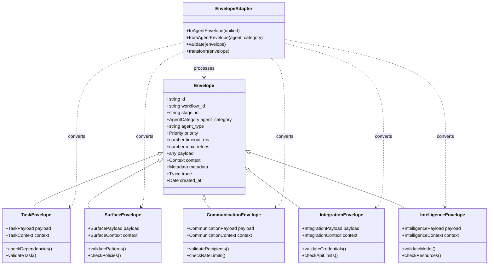
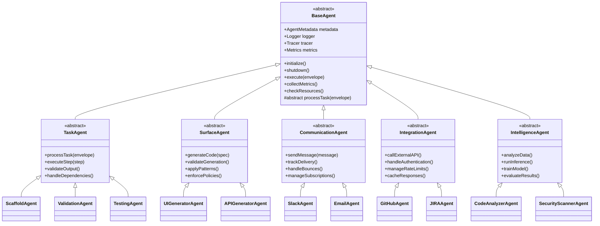
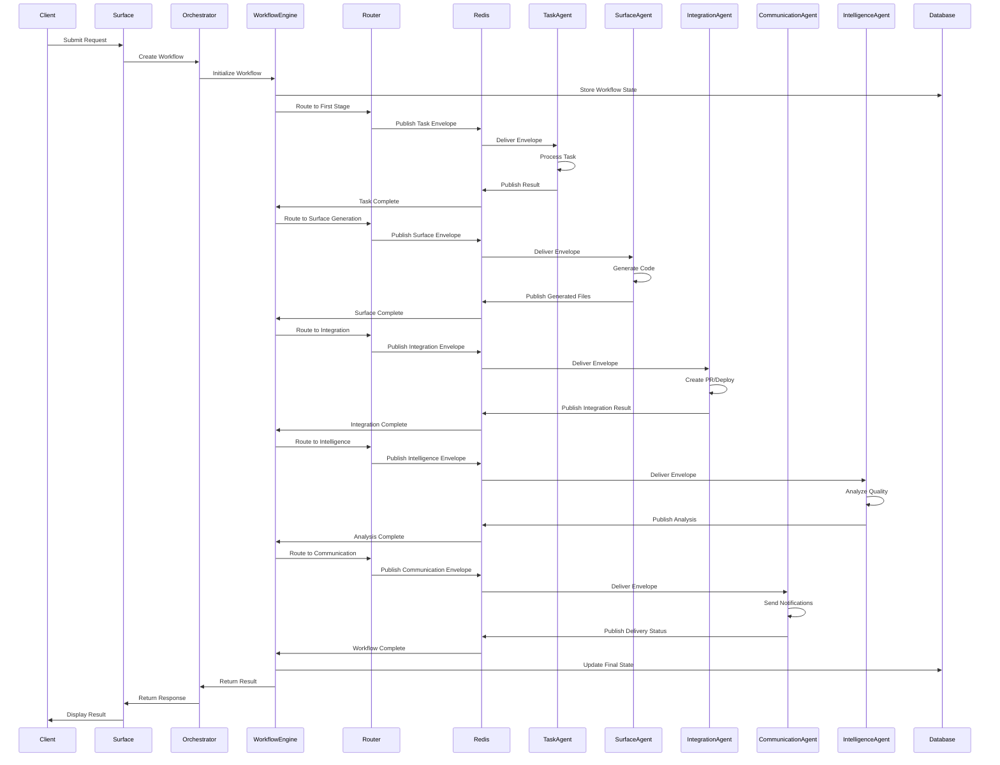
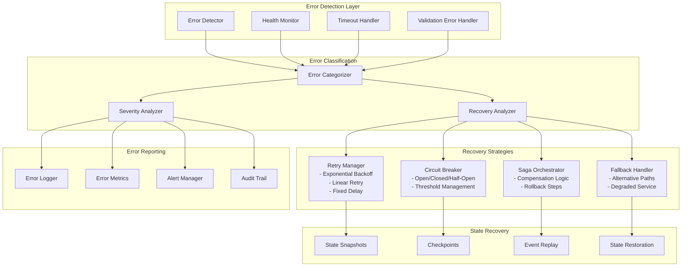
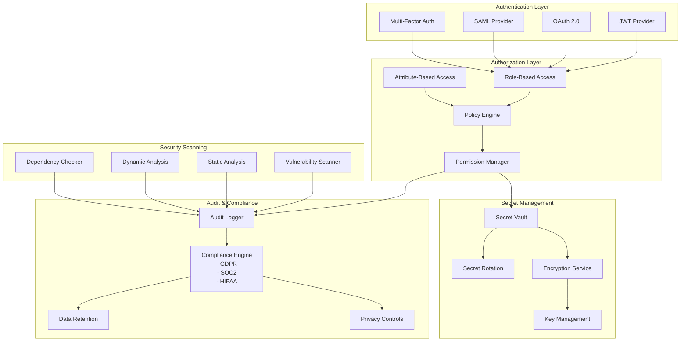
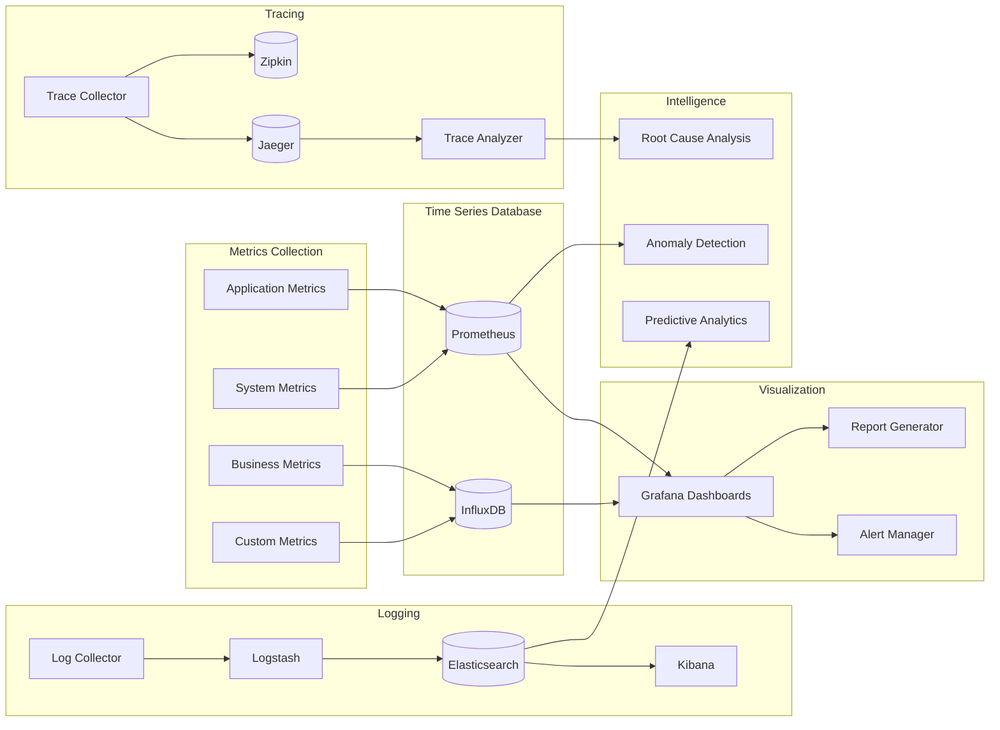
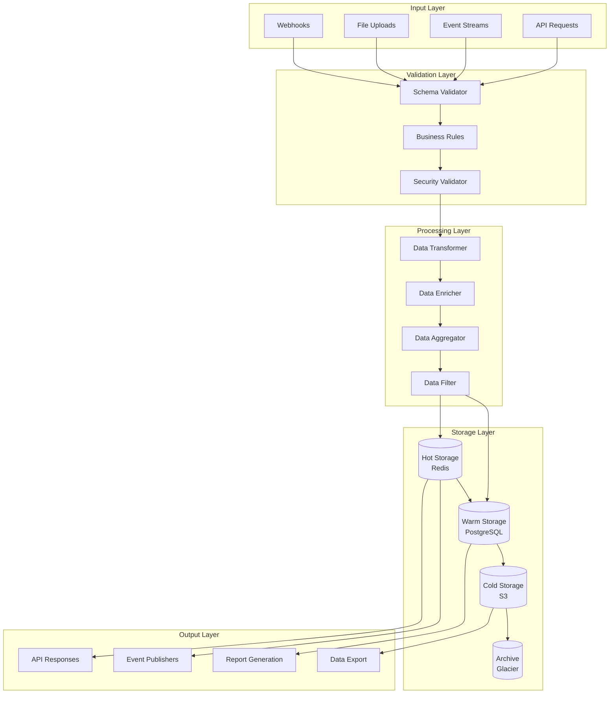
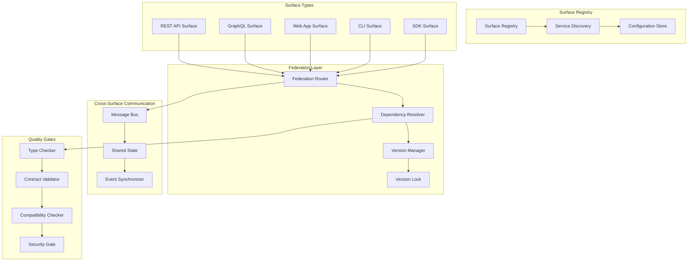
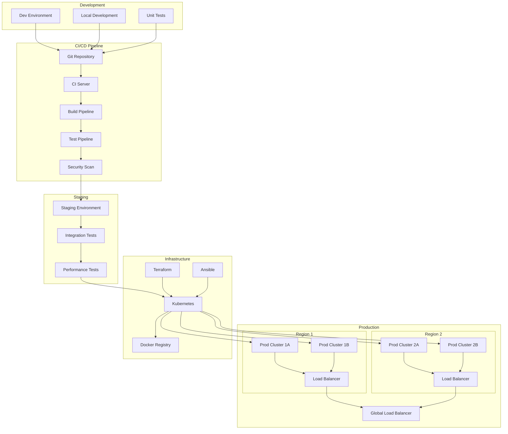

# Unified Agent Architecture - Component Diagrams

## Overview
This document provides detailed component diagrams for the Unified Agent Architecture, showing the relationships between different agent categories, the unified orchestrator, and supporting infrastructure.

## 1. High-Level System Architecture

```mermaid
graph TB
    %% External Systems
    subgraph "External Systems"
        USER[Users/Clients]
        GITHUB[GitHub]
        SLACK[Slack]
        JIRA[JIRA]
        AWS[AWS/Cloud]
        AI[AI Services<br/>Claude/GPT]
    end

    %% Surface Layer
    subgraph "Surface Layer"
        REST[REST API<br/>Surface]
        WEB[Web Dashboard<br/>Surface]
        CLI[CLI<br/>Surface]
        WEBHOOK[Webhook<br/>Surface]
        MOBILE[Mobile API<br/>Surface]
    end

    %% Unified Orchestrator
    subgraph "Unified Orchestrator"
        ORCH[Orchestrator Core]
        WF_ENGINE[Workflow Engine]
        ROUTER[Agent Router]
        ENV_ADAPTER[Envelope Adapter]
        VALIDATOR[Schema Validator]
        STATE[State Manager]
    end

    %% Message Bus
    subgraph "Message Infrastructure"
        REDIS[(Redis Streams)]
        QUEUE[Message Queue]
        PUBSUB[Pub/Sub Channel]
    end

    %% Agent Categories
    subgraph "Task Agents"
        SCAFFOLD[Scaffold Agent]
        VALIDATE[Validation Agent]
        TEST[Testing Agent]
        BUILD[Build Agent]
        DEPLOY[Deployment Agent]
    end

    subgraph "Surface Agents"
        UI_GEN[UI Generator]
        API_GEN[API Generator]
        DB_GEN[Database Generator]
        DOC_GEN[Documentation Generator]
    end

    subgraph "Communication Agents"
        EMAIL[Email Agent]
        SLACK_AGENT[Slack Agent]
        SMS[SMS Agent]
        TEAMS[Teams Agent]
    end

    subgraph "Integration Agents"
        GH_AGENT[GitHub Agent]
        JIRA_AGENT[JIRA Agent]
        AWS_AGENT[AWS Agent]
        K8S[Kubernetes Agent]
    end

    subgraph "Intelligence Agents"
        ANALYZER[Code Analyzer]
        OPTIMIZER[Performance Optimizer]
        SECURITY[Security Scanner]
        ML_AGENT[ML Model Agent]
    end

    %% Data Layer
    subgraph "Data Layer"
        DB[(PostgreSQL)]
        CACHE[(Redis Cache)]
        S3[(Object Storage)]
        METRICS[(Metrics Store)]
    end

    %% Monitoring
    subgraph "Monitoring & Observability"
        PROM[Prometheus]
        GRAFANA[Grafana]
        JAEGER[Jaeger Tracing]
        ELK[ELK Stack]
    end

    %% Connections
    USER --> REST
    USER --> WEB
    USER --> CLI

    REST --> ORCH
    WEB --> ORCH
    CLI --> ORCH
    WEBHOOK --> ORCH
    MOBILE --> ORCH

    ORCH --> WF_ENGINE
    ORCH --> ROUTER
    ORCH --> ENV_ADAPTER
    ORCH --> VALIDATOR
    ORCH --> STATE

    WF_ENGINE --> REDIS
    ROUTER --> REDIS

    REDIS --> SCAFFOLD
    REDIS --> UI_GEN
    REDIS --> EMAIL
    REDIS --> GH_AGENT
    REDIS --> ANALYZER

    SCAFFOLD --> DB
    UI_GEN --> AI
    EMAIL --> SLACK
    GH_AGENT --> GITHUB
    ANALYZER --> ML_AGENT

    STATE --> DB
    ORCH --> CACHE

    ORCH --> PROM
    PROM --> GRAFANA
    ORCH --> JAEGER
```

## 2. Unified Envelope System

## 3. Agent Base Class Hierarchy

## 4. Workflow Execution Flow

## 5. Error Handling & Recovery Architecture

## 6. Security & Compliance Architecture

## 7. Monitoring & Observability Stack

## 8. Data Flow Architecture

## 9. Surface Federation Architecture

## 10. Deployment Architecture

## Summary

The Unified Agent Architecture provides a comprehensive, scalable, and maintainable system for orchestrating various types of agents:

### Key Components:
1. **Unified Orchestrator**: Central coordination point for all workflows
2. **Five Agent Categories**: Task, Surface, Communication, Integration, Intelligence
3. **Unified Envelope System**: Consistent message format with category-specific extensions
4. **Message Bus (Redis Streams)**: Reliable, scalable communication infrastructure
5. **Surface Federation**: Coordinated multi-surface code generation
6. **Comprehensive Error Handling**: Retry strategies, circuit breakers, saga patterns
7. **Security & Compliance**: Multi-layer security with audit trails
8. **Monitoring & Observability**: Full-stack monitoring with metrics, tracing, and logging
9. **Flexible Deployment**: Support for multi-region, multi-cluster deployments

### Key Benefits:
- **Modularity**: Each agent category can be developed and deployed independently
- **Scalability**: Horizontal scaling at every layer
- **Reliability**: Multiple error recovery mechanisms
- **Security**: Defense in depth with multiple security layers
- **Observability**: Complete visibility into system behavior
- **Extensibility**: Easy to add new agent types and categories

This architecture supports building complex, distributed systems while maintaining clarity, maintainability, and operational excellence.