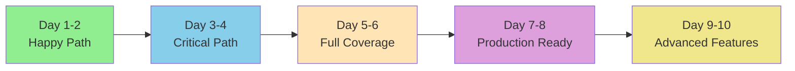

# Visual Roadmap - Happy Path to Production

## 📍 Journey Overview



## 🎯 Milestone 1: Happy Path Foundation (Day 1-2)

### System State After Milestone 1

```
┌─────────────────────────────────────────────────────────┐
│                     WORKING SYSTEM                        │
├─────────────────────────────────────────────────────────┤
│                                                           │
│   API Request  ──►  Orchestrator  ──►  Scaffold Agent    │
│                           │                    │          │
│                           ▼                    ▼          │
│                      Schema Registry      Shared Types    │
│                           │                    │          │
│                           ▼                    ▼          │
│                      Redis PubSub  ◄────  Agent Result    │
│                                                           │
│   ✅ One Complete Flow Working End-to-End                │
│   ✅ Type Safety Throughout                              │
│   ✅ Schema Validation Active                            │
│   ✅ E2E Test Passing                                    │
│                                                           │
└─────────────────────────────────────────────────────────┘
```

### Key Deliverables
- ✅ `packages/shared/types` - Core type system
- ✅ `packages/shared/test-utils` - Testing infrastructure
- ✅ Scaffold agent migrated
- ✅ Orchestrator happy path
- ✅ First E2E test

---

## 🔄 Milestone 2: Critical Path Expansion (Day 3-4)

### System State After Milestone 2

```
┌─────────────────────────────────────────────────────────┐
│                   EXPANDED SYSTEM                         │
├─────────────────────────────────────────────────────────┤
│                                                           │
│   Workflow Request  ──►  Pipeline Executor               │
│                               │                           │
│                               ▼                           │
│                      ┌─────────────────┐                 │
│                      │ Scaffold Agent  │                 │
│                      └────────┬────────┘                 │
│                               ▼                           │
│                      ┌─────────────────┐                 │
│                      │Validation Agent │                 │
│                      └────────┬────────┘                 │
│                               ▼                           │
│                      ┌─────────────────┐                 │
│                      │   E2E Agent     │                 │
│                      └─────────────────┘                 │
│                                                           │
│   ✅ 3 Agents in Pipeline                                │
│   ✅ Contract Testing Active                             │
│   ✅ Multi-Stage Workflow                                │
│                                                           │
└─────────────────────────────────────────────────────────┘
```

### New Capabilities
- 📋 Contract validation for all agents
- 🔄 Multi-stage pipeline execution
- 🧪 Validation and E2E test generation

---

## 🌐 Milestone 3: Complete Coverage (Day 5-6)

### System State After Milestone 3

```
┌─────────────────────────────────────────────────────────┐
│                    FULL SYSTEM                            │
├─────────────────────────────────────────────────────────┤
│                                                           │
│                     Orchestrator                          │
│                          │                                │
│         ┌────────────────┼────────────────┐              │
│         ▼                ▼                ▼              │
│   ┌──────────┐    ┌──────────┐    ┌──────────┐         │
│   │ Scaffold │    │Validation│    │   E2E    │         │
│   │  Agent   │    │  Agent   │    │  Agent   │         │
│   └──────────┘    └──────────┘    └──────────┘         │
│                                                           │
│         ▼                ▼                ▼              │
│   ┌──────────┐    ┌──────────┐    ┌──────────┐         │
│   │Integration│   │Deployment│    │  Base    │         │
│   │  Agent   │    │  Agent   │    │  Agent   │         │
│   └──────────┘    └──────────┘    └──────────┘         │
│                                                           │
│   ✅ All 6 Agents Operational                            │
│   ✅ 0 Type Errors                                       │
│   ✅ 90%+ Test Coverage                                  │
│                                                           │
└─────────────────────────────────────────────────────────┘
```

### Complete Features
- 🚀 All agents migrated
- 🔧 Full orchestrator refactored
- ✅ Complete type safety

---

## 🛡️ Milestone 4: Production Hardening (Day 7-8)

### System State After Milestone 4

```
┌─────────────────────────────────────────────────────────┐
│               PRODUCTION-READY SYSTEM                     │
├─────────────────────────────────────────────────────────┤
│                                                           │
│   ┌──────────────────────────────────────────┐          │
│   │         Observability Layer              │          │
│   │  • Metrics  • Tracing  • Logging        │          │
│   └─────────────────┬────────────────────────┘          │
│                     ▼                                    │
│   ┌──────────────────────────────────────────┐          │
│   │          Error Handling Layer            │          │
│   │  • Standardized Errors  • Retry Logic   │          │
│   └─────────────────┬────────────────────────┘          │
│                     ▼                                    │
│   ┌──────────────────────────────────────────┐          │
│   │         Security & Config Layer          │          │
│   │  • Input Validation  • Rate Limiting    │          │
│   └──────────────────────────────────────────┘          │
│                                                           │
│   ✅ Production Observability                            │
│   ✅ Standardized Error Handling                         │
│   ✅ Security Hardened                                   │
│   ✅ Configuration Management                             │
│                                                           │
└─────────────────────────────────────────────────────────┘
```

### Production Features
- 📊 Full observability stack
- 🛡️ Security hardening complete
- ⚙️ Configuration management
- 🚨 Error standardization

---

## 🚀 Milestone 5: Advanced Capabilities (Day 9-10)

### System State After Milestone 5

```
┌─────────────────────────────────────────────────────────┐
│              ADVANCED PRODUCTION SYSTEM                   │
├─────────────────────────────────────────────────────────┤
│                                                           │
│   ┌──────────────────────────────────────────┐          │
│   │        Schema Evolution Engine           │          │
│   │  • Version Migration  • Compatibility   │          │
│   └──────────────────────────────────────────┘          │
│                                                           │
│   ┌──────────────────────────────────────────┐          │
│   │      Performance Optimization            │          │
│   │  • Caching  • Pooling  • Batching      │          │
│   └──────────────────────────────────────────┘          │
│                                                           │
│   ┌──────────────────────────────────────────┐          │
│   │         Advanced Testing Suite           │          │
│   │  • Load Tests  • Chaos  • Contracts    │          │
│   └──────────────────────────────────────────┘          │
│                                                           │
│   ✅ Schema Evolution                                    │
│   ✅ Performance Optimized                               │
│   ✅ Advanced Testing                                    │
│   ✅ Complete Documentation                               │
│   ✅ 9.8/10 Production Readiness                        │
│                                                           │
└─────────────────────────────────────────────────────────┘
```

---

## 📈 Progress Tracking

### Error Reduction Journey

```
Day 1-2:  ████████████████████ 67 errors → 48 errors (Happy Path)
Day 3-4:  ██████████ 48 errors → 10 errors (Critical Path)
Day 5-6:  ██ 10 errors → 0 errors (Full Coverage)
Day 7-8:  ✅ 0 errors maintained (Hardening)
Day 9-10: ✅ 0 errors maintained (Advanced)
```

### Test Coverage Growth

```
Day 1-2:  ████████████████ 78% (Happy Path Working)
Day 3-4:  █████████████████ 85% (Critical Agents)
Day 5-6:  ██████████████████ 90% (All Agents)
Day 7-8:  ███████████████████ 95% (Production Ready)
Day 9-10: ████████████████████ 98% (Advanced Testing)
```

### Production Readiness Score

```
Current:  ██████████████ 6.5/10
Day 2:    ███████████████ 7.0/10 (Happy Path)
Day 4:    ████████████████ 7.5/10 (Critical Path)
Day 6:    █████████████████ 8.5/10 (Full Coverage)
Day 8:    ███████████████████ 9.5/10 (Hardened)
Day 10:   ████████████████████ 9.8/10 (Advanced)
```

---

## 🎯 Success Criteria by Milestone

### Quick Reference Checklist

```
┌────────────┬──────────────┬──────────────┬─────────────┐
│ Milestone  │ Working?     │ Type Safe?   │ Tested?     │
├────────────┼──────────────┼──────────────┼─────────────┤
│ M1 (Day 2) │ ✅ Happy Path│ ✅ Scaffold  │ ✅ E2E Test │
│ M2 (Day 4) │ ✅ 3 Agents  │ ✅ Contracts │ ✅ Pipeline │
│ M3 (Day 6) │ ✅ 6 Agents  │ ✅ All Types │ ✅ 90% Cov  │
│ M4 (Day 8) │ ✅ Production│ ✅ Secure    │ ✅ Monitored│
│ M5 (Day 10)│ ✅ Optimized │ ✅ Versioned │ ✅ Advanced │
└────────────┴──────────────┴──────────────┴─────────────┘
```

---

## 🚦 Go/No-Go Decision Points

### After Each Milestone

```
Milestone 1 Complete?
├─ YES → Continue to Milestone 2
└─ NO → Debug happy path until working

Milestone 2 Complete?
├─ YES → Continue to Milestone 3
└─ NO → Happy path stable, can deploy limited feature

Milestone 3 Complete?
├─ YES → Continue to Milestone 4
└─ NO → System functional, review priorities

Milestone 4 Complete?
├─ YES → Continue to Milestone 5
└─ NO → Production ready at 9.5/10, consider deploying

Milestone 5 Complete?
└─ YES → 9.8/10 Production Excellence Achieved
```

---

## 🎬 Next Actions

### Immediate (Hour 1)
1. Create `packages/shared/types` directory
2. Initialize package.json with TypeScript
3. Implement core schemas (WorkflowSchema, AgentTaskSchema)
4. Setup Schema Registry class
5. Verify builds successfully

### Today (Day 1)
- Morning: Complete shared types package
- Afternoon: Create test utilities
- Evening: Begin scaffold agent migration

### Tomorrow (Day 2)
- Morning: Complete scaffold agent
- Afternoon: Update orchestrator
- Evening: Run first E2E test
- **MILESTONE 1 COMPLETE ✅**

---

*Visual Roadmap Version 2.0 | Happy Path First Strategy | 10-Day Sprint to Production*