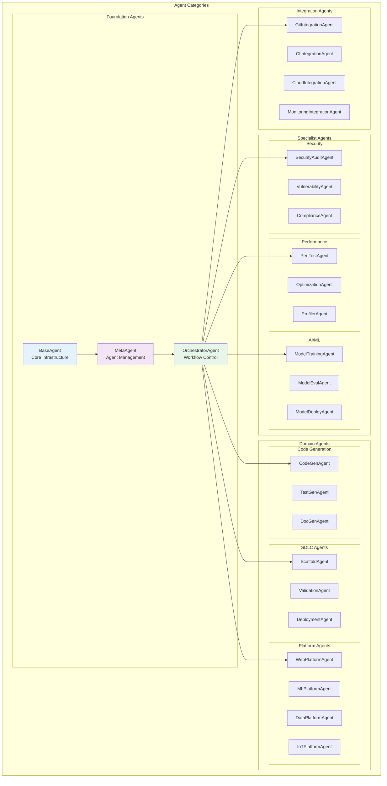
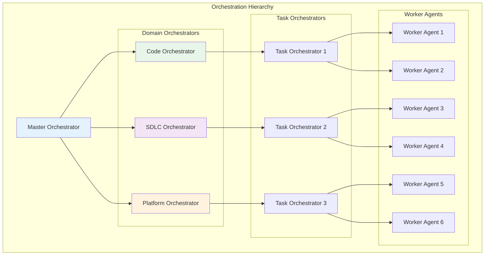
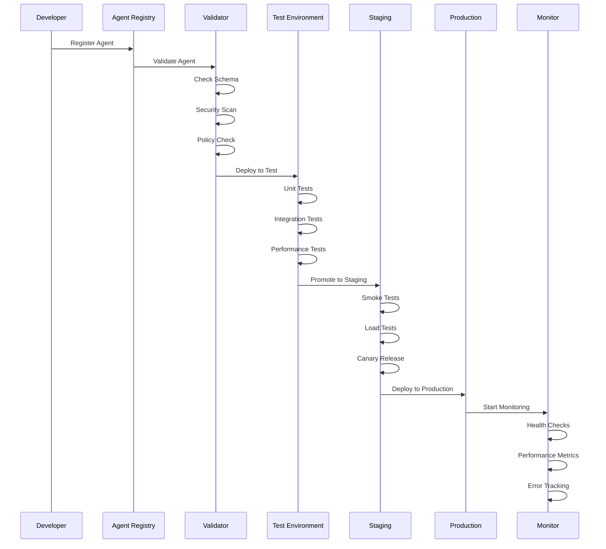

# Strategic Agent Architecture Design

## Executive Summary

This document presents the comprehensive agent architecture that unifies and extends the capabilities of both Agent-SDLC and Platform-Surfaces systems through a strategic, multi-tier agent hierarchy with advanced orchestration capabilities.

---

## 1. AGENT TAXONOMY & HIERARCHY

### 1.1 Agent Classification Framework



### 1.2 Agent Capability Matrix

| Agent Type | Category | Capabilities | Dependencies | Platform Support |
|-----------|----------|--------------|--------------|------------------|
| **BaseAgent** | Foundation | Lifecycle management, Message handling, Tracing | None | All |
| **MetaAgent** | Foundation | Agent discovery, Registration, Health monitoring | BaseAgent | All |
| **OrchestratorAgent** | Foundation | Workflow composition, Phase management, Coordination | MetaAgent | All |
| **CodeGenAgent** | Code Generation | Generate code from specs, Template application | BaseAgent, Claude API | All |
| **TestGenAgent** | Code Generation | Generate tests, Coverage analysis | CodeGenAgent | All |
| **ScaffoldAgent** | SDLC | Project setup, Boilerplate generation | BaseAgent | All |
| **ValidationAgent** | SDLC | Linting, Type checking, Policy validation | BaseAgent | All |
| **DeploymentAgent** | SDLC | Infrastructure provisioning, Deployment | BaseAgent, Cloud APIs | All |
| **WebPlatformAgent** | Platform | React/Next.js specialization | CodeGenAgent | Web |
| **MLPlatformAgent** | Platform | PyTorch/TensorFlow specialization | CodeGenAgent | ML |
| **DataPlatformAgent** | Platform | Spark/SQL specialization | CodeGenAgent | Data |
| **SecurityAuditAgent** | Security | Vulnerability scanning, SAST/DAST | BaseAgent, Security tools | All |
| **PerfTestAgent** | Performance | Load testing, Benchmarking | BaseAgent | All |
| **ModelTrainingAgent** | AI/ML | Model training, Hyperparameter tuning | BaseAgent, ML frameworks | ML |

---

## 2. ADVANCED AGENT ARCHITECTURE

### 2.1 Enhanced BaseAgent Design

```typescript
abstract class EnhancedBaseAgent implements AgentLifecycle {
  // Core Properties
  protected readonly id: string
  protected readonly type: string
  protected readonly version: string
  protected readonly platform?: string

  // Dependency Injection
  protected readonly messageBus: IMessageBus
  protected readonly stateManager: IStateManager
  protected readonly policyEngine: IPolicyEngine
  protected readonly traceContext: ITraceContext
  protected readonly metricsCollector: IMetricsCollector

  // Advanced Capabilities
  protected readonly capabilities: AgentCapabilities
  protected readonly constraints: ExecutionConstraints
  protected readonly resilience: ResilienceConfig

  // Lifecycle Methods
  async initialize(): Promise<void> {
    await this.validateDependencies()
    await this.registerWithOrchestrator()
    await this.subscribeToChannels()
    await this.loadPolicies()
    await this.initializeTracing()
  }

  // Task Processing Pipeline
  async processTask(envelope: AgentEnvelope): Promise<TaskResult> {
    // 1. Pre-processing
    const context = await this.createExecutionContext(envelope)
    await this.validateTask(envelope, context)
    await this.checkPolicies(envelope, context)

    // 2. Execution with resilience
    const result = await this.withResilience(async () => {
      return await this.execute(envelope, context)
    })

    // 3. Post-processing
    await this.validateResult(result)
    await this.collectMetrics(result)
    await this.reportResult(result)

    return result
  }

  // Abstract methods for implementation
  protected abstract execute(
    envelope: AgentEnvelope,
    context: ExecutionContext
  ): Promise<TaskResult>

  // Advanced Features
  protected async withResilience<T>(
    operation: () => Promise<T>
  ): Promise<T> {
    return await this.resilience.circuitBreaker.execute(
      async () => {
        return await this.resilience.retryPolicy.execute(
          operation,
          this.resilience.retryConfig
        )
      }
    )
  }

  // Collaboration Methods
  async collaborate(
    agentId: string,
    request: CollaborationRequest
  ): Promise<CollaborationResponse> {
    const agent = await this.discoveryService.findAgent(agentId)
    return await this.messageBus.request(
      agent.channel,
      request,
      { timeout: this.constraints.collaborationTimeout }
    )
  }

  // Learning & Adaptation
  async learn(feedback: AgentFeedback): Promise<void> {
    await this.knowledgeBase.update(feedback)
    await this.optimizeParameters(feedback)
  }
}
```

### 2.2 MetaAgent - Agent Orchestration

```typescript
class MetaAgent extends EnhancedBaseAgent {
  private agentRegistry: Map<string, AgentMetadata>
  private agentHealth: Map<string, HealthStatus>
  private agentMetrics: Map<string, AgentMetrics>

  async execute(
    envelope: AgentEnvelope,
    context: ExecutionContext
  ): Promise<TaskResult> {
    const command = envelope.payload as MetaCommand

    switch (command.type) {
      case 'DISCOVER_AGENTS':
        return await this.discoverAgents(command.filters)

      case 'COMPOSE_WORKFLOW':
        return await this.composeWorkflow(command.requirements)

      case 'OPTIMIZE_ALLOCATION':
        return await this.optimizeAgentAllocation(command.workload)

      case 'HEALTH_CHECK':
        return await this.performHealthCheck(command.targets)

      case 'SCALE_AGENTS':
        return await this.scaleAgents(command.scaling)
    }
  }

  private async composeWorkflow(
    requirements: Requirements
  ): Promise<ComposedWorkflow> {
    // Analyze requirements
    const analysis = await this.analyzeRequirements(requirements)

    // Select optimal agents
    const agents = await this.selectOptimalAgents(analysis)

    // Generate workflow
    const workflow = await this.generateWorkflow(agents, analysis)

    // Optimize execution plan
    return await this.optimizeWorkflow(workflow)
  }

  private async selectOptimalAgents(
    analysis: RequirementAnalysis
  ): Promise<AgentSelection[]> {
    const candidates = await this.findCandidateAgents(analysis)

    // Score agents based on multiple factors
    const scored = candidates.map(agent => ({
      agent,
      score: this.scoreAgent(agent, analysis)
    }))

    // Select best agents for each task
    return this.selectBestAgents(scored, analysis.tasks)
  }

  private scoreAgent(
    agent: AgentMetadata,
    analysis: RequirementAnalysis
  ): number {
    let score = 0

    // Capability match
    score += this.scoreCapabilityMatch(agent.capabilities, analysis.required)

    // Performance history
    score += this.scorePerformance(agent.id, analysis.performanceRequirements)

    // Current load
    score -= this.scoreCurrentLoad(agent.id)

    // Platform compatibility
    score += this.scorePlatformCompatibility(agent.platform, analysis.platform)

    return score
  }
}
```

### 2.3 Collaborative Agent Network

```typescript
interface CollaborativeAgent extends EnhancedBaseAgent {
  // Peer Discovery
  discoverPeers(capability: string): Promise<AgentPeer[]>

  // Task Delegation
  delegateTask(task: Task, peerId: string): Promise<DelegationResult>

  // Knowledge Sharing
  shareKnowledge(knowledge: Knowledge, peers: string[]): Promise<void>
  requestKnowledge(topic: string, peerId: string): Promise<Knowledge>

  // Consensus Mechanisms
  proposeDecision(decision: Decision): Promise<ConsensusResult>
  voteOnDecision(proposalId: string, vote: Vote): Promise<void>

  // Resource Sharing
  requestResource(resource: ResourceRequest): Promise<ResourceGrant>
  shareResource(resource: Resource, peerId: string): Promise<void>
}

class CollaborativeWorkflowAgent implements CollaborativeAgent {
  private peers: Map<string, AgentPeer>
  private consensusProtocol: ConsensusProtocol
  private resourceManager: ResourceManager

  async executeCollaboratively(
    task: ComplexTask
  ): Promise<CollaborativeResult> {
    // 1. Decompose task
    const subtasks = await this.decomposeTask(task)

    // 2. Find suitable peers
    const assignments = await this.assignToPeers(subtasks)

    // 3. Execute in parallel with coordination
    const results = await Promise.all(
      assignments.map(async assignment => {
        return await this.coordinatedExecution(assignment)
      })
    )

    // 4. Aggregate results
    return await this.aggregateResults(results, task)
  }

  private async coordinatedExecution(
    assignment: TaskAssignment
  ): Promise<SubtaskResult> {
    // Create coordination context
    const context = await this.createCoordinationContext(assignment)

    // Execute with monitoring
    const monitor = this.createMonitor(assignment.peerId)

    try {
      const result = await this.delegateTask(
        assignment.subtask,
        assignment.peerId
      )

      // Validate result
      await this.validatePeerResult(result, assignment)

      return result
    } catch (error) {
      // Handle failure with fallback
      return await this.handlePeerFailure(assignment, error)
    } finally {
      monitor.stop()
    }
  }
}
```

---

## 3. AGENT ORCHESTRATION PATTERNS

### 3.1 Hierarchical Orchestration



### 3.2 Swarm Intelligence Pattern

```typescript
class SwarmOrchestrator {
  private swarm: Set<SwarmAgent>
  private pheromoneMap: PheromoneMap

  async executeSwarmTask(task: SwarmTask): Promise<SwarmResult> {
    // Initialize pheromone trails
    await this.initializePheromones(task)

    // Release agents
    const agents = await this.deploySwarm(task.size)

    // Swarm execution
    const results = await this.swarmExecution(agents, task)

    // Emergent solution
    return await this.extractSolution(results, this.pheromoneMap)
  }

  private async swarmExecution(
    agents: SwarmAgent[],
    task: SwarmTask
  ): Promise<SwarmData[]> {
    const iterations = task.maxIterations || 100
    const results: SwarmData[] = []

    for (let i = 0; i < iterations; i++) {
      // Parallel agent actions
      const actions = await Promise.all(
        agents.map(agent => agent.act(this.pheromoneMap))
      )

      // Update pheromones based on actions
      await this.updatePheromones(actions)

      // Check convergence
      if (await this.hasConverged(actions)) {
        break
      }

      results.push(...actions)
    }

    return results
  }
}
```

### 3.3 Adaptive Agent Selection

```typescript
class AdaptiveAgentSelector {
  private performanceHistory: PerformanceDatabase
  private costModel: CostModel
  private qosRequirements: QoSRequirements

  async selectAgents(
    task: Task,
    constraints: Constraints
  ): Promise<AgentAllocation> {
    // Get candidate agents
    const candidates = await this.getCandidates(task.capabilities)

    // Multi-objective optimization
    const pareto = await this.paretoOptimization(
      candidates,
      {
        objectives: [
          this.minimizeCost,
          this.maximizePerformance,
          this.minimizeLatency,
          this.maximizeReliability
        ],
        constraints: constraints
      }
    )

    // Select from Pareto front based on priorities
    return await this.selectFromPareto(pareto, task.priorities)
  }

  private async paretoOptimization(
    candidates: Agent[],
    config: OptimizationConfig
  ): Promise<ParetoFront> {
    const evaluated = await Promise.all(
      candidates.map(async agent => ({
        agent,
        scores: await this.evaluateObjectives(agent, config.objectives)
      }))
    )

    // Find non-dominated solutions
    return this.findParetoFront(evaluated)
  }
}
```

---

## 4. AGENT COMMUNICATION PROTOCOLS

### 4.1 Inter-Agent Communication

```typescript
interface AgentCommunicationProtocol {
  // Direct Communication
  send(to: AgentId, message: Message): Promise<void>
  request(to: AgentId, request: Request): Promise<Response>

  // Broadcast Communication
  broadcast(message: Message, scope?: Scope): Promise<void>
  multicast(message: Message, group: AgentGroup): Promise<void>

  // Pub/Sub Communication
  publish(topic: Topic, event: Event): Promise<void>
  subscribe(topic: Topic, handler: EventHandler): Subscription

  // Stream Communication
  createStream(to: AgentId): Stream
  acceptStream(from: AgentId): Stream
}

class AgentCommunicationLayer implements AgentCommunicationProtocol {
  private transport: MessageTransport
  private serializer: MessageSerializer
  private security: SecurityLayer

  async request(to: AgentId, request: Request): Promise<Response> {
    // Create correlation ID
    const correlationId = this.generateCorrelationId()

    // Serialize and encrypt
    const message = await this.prepareMessage(request, correlationId)

    // Send with timeout
    const response = await this.transport.sendAndWait(
      to,
      message,
      { timeout: request.timeout || 30000 }
    )

    // Decrypt and deserialize
    return await this.processResponse(response)
  }

  async negotiateProtocol(
    peer: AgentId
  ): Promise<NegotiatedProtocol> {
    const capabilities = await this.exchangeCapabilities(peer)
    return this.selectOptimalProtocol(capabilities)
  }
}
```

### 4.2 Contract-Based Communication

```typescript
interface AgentContract {
  id: string
  version: string
  provider: AgentId
  consumer: AgentId

  interface: {
    inputs: Schema
    outputs: Schema
    errors: ErrorSchema[]
  }

  sla: {
    responseTime: Duration
    availability: Percentage
    throughput: Rate
  }

  policies: Policy[]
}

class ContractManager {
  private contracts: Map<string, AgentContract>
  private validator: ContractValidator

  async establishContract(
    provider: AgentId,
    consumer: AgentId,
    terms: ContractTerms
  ): Promise<AgentContract> {
    // Negotiate terms
    const negotiated = await this.negotiate(provider, consumer, terms)

    // Validate contract
    await this.validator.validate(negotiated)

    // Sign contract
    const signed = await this.sign(negotiated, provider, consumer)

    // Register contract
    await this.register(signed)

    return signed
  }

  async enforceContract(
    contractId: string,
    interaction: Interaction
  ): Promise<EnforcementResult> {
    const contract = this.contracts.get(contractId)

    // Validate inputs
    await this.validateInputs(interaction.inputs, contract.interface.inputs)

    // Monitor execution
    const monitor = this.createMonitor(contract.sla)

    try {
      const result = await interaction.execute()

      // Validate outputs
      await this.validateOutputs(result, contract.interface.outputs)

      // Check SLA compliance
      const compliance = await monitor.checkCompliance()

      return { result, compliance }
    } finally {
      monitor.stop()
    }
  }
}
```

---

## 5. AGENT LIFECYCLE MANAGEMENT

### 5.1 Agent Deployment Pipeline



### 5.2 Agent Versioning & Migration

```typescript
class AgentVersionManager {
  private versions: Map<string, AgentVersion[]>
  private migrationStrategies: Map<string, MigrationStrategy>

  async deployNewVersion(
    agentId: string,
    newVersion: AgentVersion,
    strategy: DeploymentStrategy
  ): Promise<DeploymentResult> {
    switch (strategy.type) {
      case 'BLUE_GREEN':
        return await this.blueGreenDeployment(agentId, newVersion)

      case 'CANARY':
        return await this.canaryDeployment(
          agentId,
          newVersion,
          strategy.canaryConfig
        )

      case 'ROLLING':
        return await this.rollingDeployment(
          agentId,
          newVersion,
          strategy.rollingConfig
        )

      case 'IMMEDIATE':
        return await this.immediateDeployment(agentId, newVersion)
    }
  }

  private async canaryDeployment(
    agentId: string,
    newVersion: AgentVersion,
    config: CanaryConfig
  ): Promise<DeploymentResult> {
    // Deploy canary instance
    const canary = await this.deployCanary(agentId, newVersion)

    // Route percentage of traffic
    await this.updateRouting(agentId, {
      stable: 1 - config.initialPercentage,
      canary: config.initialPercentage
    })

    // Monitor and gradually increase
    for (const step of config.steps) {
      await this.wait(step.duration)

      const metrics = await this.collectMetrics(canary)
      if (!this.meetsThresholds(metrics, step.thresholds)) {
        return await this.rollback(agentId, canary)
      }

      await this.updateRouting(agentId, {
        stable: 1 - step.percentage,
        canary: step.percentage
      })
    }

    // Complete deployment
    return await this.promoteCanary(agentId, canary)
  }
}
```

---

## 6. AGENT INTELLIGENCE & LEARNING

### 6.1 Learning Agent Architecture

```typescript
abstract class LearningAgent extends EnhancedBaseAgent {
  protected knowledgeBase: KnowledgeBase
  protected learningEngine: LearningEngine
  protected feedbackProcessor: FeedbackProcessor

  async execute(
    envelope: AgentEnvelope,
    context: ExecutionContext
  ): Promise<TaskResult> {
    // Retrieve relevant knowledge
    const knowledge = await this.knowledgeBase.query(envelope.payload)

    // Make prediction/decision
    const prediction = await this.learningEngine.predict(
      envelope.payload,
      knowledge
    )

    // Execute with prediction
    const result = await this.executeWithPrediction(envelope, prediction)

    // Collect feedback
    const feedback = await this.collectFeedback(result, prediction)

    // Update model
    await this.learn(feedback)

    return result
  }

  protected async learn(feedback: Feedback): Promise<void> {
    // Process feedback
    const processed = await this.feedbackProcessor.process(feedback)

    // Update knowledge base
    await this.knowledgeBase.update(processed.knowledge)

    // Retrain if necessary
    if (this.shouldRetrain(processed.performance)) {
      await this.learningEngine.retrain(
        await this.knowledgeBase.getTrainingData()
      )
    }

    // Adjust parameters
    await this.adjustParameters(processed.performance)
  }

  protected async adjustParameters(
    performance: PerformanceMetrics
  ): Promise<void> {
    // Use reinforcement learning to adjust
    const adjustment = await this.calculateAdjustment(performance)

    this.constraints.timeout *= adjustment.timeoutFactor
    this.resilience.retryConfig.maxAttempts *= adjustment.retryFactor
    this.capabilities.confidence *= adjustment.confidenceFactor
  }
}
```

### 6.2 Knowledge Sharing Network

```typescript
class KnowledgeSharingNetwork {
  private agents: Map<string, LearningAgent>
  private sharedKnowledge: DistributedKnowledgeBase
  private consensusProtocol: ConsensusProtocol

  async shareDiscovery(
    agentId: string,
    discovery: Discovery
  ): Promise<void> {
    // Validate discovery
    const validation = await this.validateDiscovery(discovery)

    if (validation.isValid) {
      // Propose to network
      const proposal = await this.proposeKnowledge(discovery)

      // Achieve consensus
      const consensus = await this.consensusProtocol.vote(proposal)

      if (consensus.accepted) {
        // Add to shared knowledge
        await this.sharedKnowledge.add(discovery)

        // Notify all agents
        await this.broadcast({
          type: 'NEW_KNOWLEDGE',
          knowledge: discovery
        })
      }
    }
  }

  async collaborativeLearning(
    task: LearningTask
  ): Promise<CollectiveKnowledge> {
    // Distribute learning task
    const subtasks = await this.distributeTask(task)

    // Parallel learning
    const results = await Promise.all(
      subtasks.map(async subtask => {
        const agent = this.selectAgent(subtask)
        return await agent.learn(subtask)
      })
    )

    // Federated aggregation
    return await this.federatedAggregation(results)
  }
}
```

---

## 7. AGENT MONITORING & OBSERVABILITY

### 7.1 Comprehensive Monitoring Stack

```typescript
interface AgentMonitoring {
  // Health Monitoring
  health: {
    status: HealthStatus
    uptime: Duration
    lastHealthCheck: Timestamp
    issues: HealthIssue[]
  }

  // Performance Metrics
  performance: {
    throughput: Rate
    latency: {
      p50: Duration
      p95: Duration
      p99: Duration
    }
    errorRate: Percentage
    successRate: Percentage
  }

  // Resource Usage
  resources: {
    cpu: Percentage
    memory: Bytes
    network: NetworkStats
    storage: StorageStats
  }

  // Business Metrics
  business: {
    tasksCompleted: number
    tasksInProgress: number
    tasksFailed: number
    valueDelivered: number
  }
}

class AgentMonitor {
  private metrics: MetricsCollector
  private tracer: DistributedTracer
  private logger: StructuredLogger
  private alertManager: AlertManager

  async monitorExecution(
    agentId: string,
    execution: () => Promise<any>
  ): Promise<MonitoredResult> {
    const span = this.tracer.startSpan('agent.execution', {
      'agent.id': agentId,
      'agent.type': this.getAgentType(agentId)
    })

    const timer = this.metrics.startTimer('agent.execution.duration')

    try {
      const result = await execution()

      this.metrics.increment('agent.execution.success')
      span.setStatus({ code: SpanStatusCode.OK })

      return { success: true, result }
    } catch (error) {
      this.metrics.increment('agent.execution.failure')
      span.setStatus({
        code: SpanStatusCode.ERROR,
        message: error.message
      })

      await this.handleError(agentId, error)

      return { success: false, error }
    } finally {
      timer.end()
      span.end()
    }
  }

  private async handleError(
    agentId: string,
    error: Error
  ): Promise<void> {
    // Log error
    this.logger.error('Agent execution failed', {
      agentId,
      error: error.message,
      stack: error.stack
    })

    // Check if alert needed
    if (this.shouldAlert(agentId, error)) {
      await this.alertManager.send({
        severity: 'HIGH',
        agent: agentId,
        error: error.message,
        timestamp: Date.now()
      })
    }

    // Update error metrics
    this.metrics.increment(`agent.errors.${error.constructor.name}`)
  }
}
```

---

## 8. AGENT SECURITY ARCHITECTURE

### 8.1 Security Layers

```typescript
class AgentSecurityManager {
  private authManager: AuthenticationManager
  private authzManager: AuthorizationManager
  private encryptionService: EncryptionService
  private auditLogger: AuditLogger

  async secureExecution(
    agent: Agent,
    envelope: AgentEnvelope
  ): Promise<SecuredResult> {
    // 1. Authentication
    const identity = await this.authManager.authenticate(envelope.credentials)

    // 2. Authorization
    const authorized = await this.authzManager.authorize(
      identity,
      agent.id,
      envelope.payload.action
    )

    if (!authorized) {
      await this.auditLogger.logUnauthorized(identity, agent.id)
      throw new UnauthorizedError()
    }

    // 3. Decrypt payload if needed
    const decrypted = await this.encryptionService.decrypt(
      envelope.payload,
      identity.keyring
    )

    // 4. Execute with security context
    const result = await agent.execute(decrypted, {
      identity,
      permissions: authorized.permissions
    })

    // 5. Encrypt result
    const encrypted = await this.encryptionService.encrypt(
      result,
      identity.keyring
    )

    // 6. Audit log
    await this.auditLogger.logExecution(identity, agent.id, {
      action: envelope.payload.action,
      result: 'SUCCESS'
    })

    return encrypted
  }
}
```

---

## 9. IMPLEMENTATION ROADMAP

### Phase 1: Foundation (Weeks 1-2)
- Implement EnhancedBaseAgent with full lifecycle support
- Create MetaAgent for agent orchestration
- Set up agent registry with versioning
- Implement basic monitoring and tracing

### Phase 2: Core Agents (Weeks 3-4)
- Develop domain-specific agents (Code, SDLC, Platform)
- Implement collaborative agent framework
- Create agent communication protocols
- Add contract-based interactions

### Phase 3: Intelligence Layer (Weeks 5-6)
- Implement learning agent capabilities
- Create knowledge sharing network
- Add federated learning support
- Develop adaptive agent selection

### Phase 4: Advanced Features (Weeks 7-8)
- Implement swarm orchestration
- Add hierarchical orchestration patterns
- Create security layers
- Develop comprehensive monitoring

### Phase 5: Integration (Weeks 9-10)
- Integrate with existing Agent-SDLC system
- Connect to Platform-Surfaces agents
- Implement federation layer connections
- Add backward compatibility

### Phase 6: Testing & Optimization (Weeks 11-12)
- Comprehensive testing suite
- Performance optimization
- Security audit
- Documentation completion

---

## 10. SUCCESS METRICS

### Technical Metrics
- Agent response time < 500ms p95
- Agent availability > 99.9%
- Successful task completion rate > 95%
- Error recovery rate > 90%
- Knowledge sharing effectiveness > 80%

### Business Metrics
- Development velocity increase > 40%
- Code quality improvement > 30%
- Deployment frequency increase > 50%
- Mean time to recovery decrease > 60%
- Developer satisfaction increase > 35%

### Operational Metrics
- Agent scaling time < 30 seconds
- Resource utilization < 70%
- Alert noise reduction > 50%
- Monitoring coverage > 95%
- Security compliance > 99%

---

## CONCLUSION

This strategic agent architecture provides:

1. **Unified Agent Framework**: Single base for all agent types
2. **Intelligent Orchestration**: Multiple orchestration patterns for different scenarios
3. **Collaborative Networks**: Agents working together efficiently
4. **Learning Capabilities**: Continuous improvement through feedback
5. **Comprehensive Security**: Multi-layer security architecture
6. **Full Observability**: Complete monitoring and tracing
7. **Scalable Design**: Horizontal and vertical scaling support
8. **Platform Agnostic**: Works across all platforms and surfaces

The architecture is designed to be implemented incrementally while maintaining backward compatibility with existing systems.